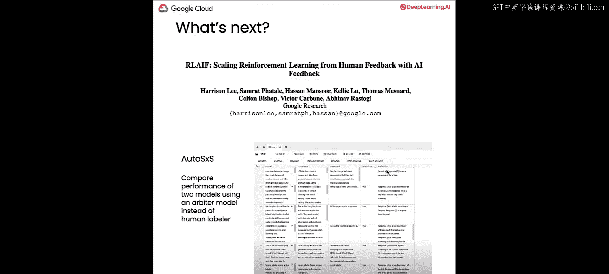

# 005：评估微调后的模型 🧐

在本节课中，我们将学习如何评估经过RLHF流程微调后的大型语言模型。RLHF包含多个步骤，但我们的最终目标不仅是训练一个模型，而是创建一个比原始模型性能更优的新模型。因此，我们将讨论几种不同的评估策略，并查看新微调模型的结果。

## 评估大型语言模型的方法 📊

评估大型语言模型时，我们可以关注几个不同的方面。需要说明的是，LLM评估仍然是一个快速发展的研究领域，本课内容只是冰山一角。但概括来说，我们主要关注以下几点。

以下是几种主要的评估方法：

1.  **训练曲线**：观察训练过程中产生的损失等曲线，以判断模型是否在学习。这与训练神经网络或其他机器学习模型时类似。
2.  **自动化指标**：这些是可以通过算法或数学公式计算的性能指标，通常需要真实标签。包括常见的指标如准确率或F1分数，以及更常用于生成任务的指标，如Rouge系列指标，用于衡量生成文本与人类参考文本的相似度。
3.  **并列评估**：使用同一组输入提示，比较两个模型的性能。这可以计算出胜率，即特定模型产生更优响应的百分比。

对于RLHF，研究人员发现训练曲线和并列评估最为有用。如果你熟悉Rouge指标并好奇为何它在RLHF中价值有限，尽管它常用于摘要任务，原因是Rouge分数可能不适合作为RLHF的衡量标准。Rouge分数并不很好地描述与人类偏好的一致性，它只告诉你生成文本与参考文本的接近程度。甚至有研究表明，在RLHF中，对Rouge的优化越严重，模型性能反而可能越差。

## 分析训练曲线 📉

我们将首先查看一些训练曲线。上一课中创建的Vertex AI RLHF流水线将一些训练曲线输出到了TensorBoard。TensorBoard是一个用于机器学习实验可视化的开源项目，你可以通过 `pip install tensorboard` 安装。在本环境中，它已经预先安装好了。

加载TensorBoard扩展后，我们可以启动它。我们将使用命令 `%tensorboard --logdir`，并提供一个包含TensorBoard日志文件的文件夹路径。例如，奖励模型训练的日志文件位于名为 `reward_logs` 的目录中。

执行相应单元格后，我们将看到TensorBoard启动。我们可以滚动查看我们关心的指标——排名损失。这是用于训练奖励模型的损失函数。与其他损失函数一样，我们希望看到这条曲线随时间下降并最终收敛。从图中可以看到，曲线确实在下降并趋于平缓，这表明训练效果良好。

接下来，让我们查看强化学习阶段的曲线。我们再次调用TensorBoard命令，并传入包含强化学习步骤日志文件的另一个目录。

在TensorBoard中，我们主要关注两个指标。第一个是**KL散度损失**，它告诉我们模型与原始基础模型的偏离程度。理想情况下，我们希望看到这条曲线上升并最终趋于平缓。第二个是**奖励值**，理想情况下，它应该随时间增加并最终稳定下来。

然而，在我们查看的日志中（基于1%数据子集训练），KL损失和奖励曲线都波动很大，没有明显的收敛趋势，这表明模型没有很好地学习。

现在，让我们查看在完整数据集上训练产生的日志。再次启动TensorBoard并传入相应的目录。这次，我们可以看到曲线更接近我们的预期：KL损失持续上升后趋于平缓，奖励值也持续增加后稳定下来。这正是我们希望看到的行为。

这些曲线是我的同事Bethany使用Reddit数据集和Llama2模型进行大规模调优实验时生成的。她使用了完整的偏好数据集、提示数据集和评估数据集，并设置了以下关键参数：奖励模型和强化学习的训练步数均为10,000步，奖励模型学习率乘数为1.0，强化学习率乘数为0.2，KL系数为默认值0.1，指令与之前相同：“summarize in less than 50 words”。

## 如何访问你自己的TensorBoard日志 🔍

目前，我们通过Python SDK在Notebook中与Google Cloud交互。如果你想在控制台中访问，可以前往 `console.cloud.google.com`，进入你的Google Cloud项目，在Vertex AI部分选择“Pipelines”。

在“Pipelines”页面，你可以看到在特定区域运行的所有流水线。在“Runs”下，选择你的流水线（名称应与之前设置的相同，如“RLHF_train_template”）。点击流水线后，会打开之前展示过的组件可视化图。

要找到奖励模型训练的TensorBoard日志，可以放大右上角标有“reward model trainer”的组件。该组件会产生一个名为“tensorboard_metrics”的工件。点击这个方框，右侧会弹出一个UI，显示Google Cloud存储中的路径。点击该路径，即可打开TensorBoard日志。在该目录中，你可以找到一个以 `events.out.tfevents` 开头、以 `.v2` 结尾的文件。

类似地，要找到强化学习循环的日志，点击“reinforcer”组件，然后打开其产生的“tensorboard_metrics”工件，按照相同步骤即可访问日志文件。

## 进行并列评估 🔄

训练曲线可以帮助我们了解模型是否在学习，但评估大型语言模型有时最好的方法就是直接查看它们对一组输入提示生成的补全内容。

在上一课创建流水线作业时，我们传入了一个评估数据集。这组数据只包含提示（没有补全内容），我们称之为评估数据，但它可能与你过去在机器学习中使用的评估数据集有所不同。这些数据会被传递给微调后的模型进行批量推理作业。这意味着一旦模型完成微调，我们就会为这个评估数据集中的所有提示生成补全内容，我们并不计算任何指标，只是调用模型并产生文本输出。

为了让这一点更具体，让我们查看一些评估结果。这里加载了一个评估结果的小子集供你检查，它也是一个JSONL文件。

首先，我们导入JSON库，并定义结果文件的路径。然后，我们创建一个空列表，循环读取JSONL文件并将数据追加到列表中。接下来，使用第二课定义的 `print_d` 函数来可视化字典的键值对。查看列表中的第一个元素，它是一个字典，其中 `inputs` 键的值是另一个字典，包含 `inputs_pretokenized` 键，其值就是我们的提示。这个提示包含了我们在启动流水线时设置的指令“summarize in less than 50 words”，它被预置到了评估数据中的Reddit帖子前。模型为这个输入提示生成的预测结果（即摘要）显示在 `prediction` 字段中。

接下来，我们进行并列评估。这意味着我们将查看同一组提示在Llama2模型微调前和微调后生成的补全内容。

首先，加载包含基础模型（即微调前的Llama2模型）推理结果的文件。这个数据集包含的输入提示与我们的评估数据集完全相同。我们同样创建一个空列表，循环读取文件并将数据追加到列表中。

现在，我们有两个列表：一个包含微调后Llama2模型的结果，另一个包含未微调Llama2模型的结果。查看未微调数据集中的第一个例子，你会发现提示相同，但补全内容不同，因为它来自运行RLHF微调之前的模型。例如，对于同一个关于情人节和玫瑰的提示，未微调模型生成的摘要以第三人称提及“作者”，而微调后的模型生成的摘要则使用了第一人称，与原始发帖人的口吻一致。

为了更方便地比较所有结果，避免反复打印和滚动，我们将所有内容放入一个DataFrame中进行真正的并列评估。

首先，我们从微调模型的结果数据集中提取所有提示，创建一个提示列表。然后，我们分别从未微调模型和微调模型的结果中提取补全内容，创建两个补全列表。

最后，我们导入pandas库，创建一个名为 `results` 的DataFrame。它包含三列：`prompt`（提示）、`base_model`（RLHF微调前模型生成的补全）和 `tuned_model`（RLHF微调后模型生成的补全）。我们可以设置pandas的显示选项以便更好地可视化，然后查看这个DataFrame，对每一行进行并列评估，尝试判断你更喜欢哪个补全结果。

## 如何访问批量评估结果 📁

对于你自己的RLHF调优工作，要访问批量评估结果，同样需要进入云控制台并打开你的流水线。

这次，你需要放大标有“perform inference”的组件。在该组件下，你会看到一个名为“bulk infer”的子组件，它负责执行批量推理作业，即接收我们评估数据集中的JSONL提示文件，并调用模型为每个提示生成补全。点击该组件，右侧会弹出一个方框，显示“output parameters”。其中，“output_prediction_gcs_path”参数指向Google Cloud存储中的一个位置，该位置存有包含结果的JSONL文件。你可以点击该链接，下载JSONL文件并查看结果。

## RLHF领域的新兴技术 🚀

课程最后，我想介绍两种RLHF领域有趣的新技术。

第一种是**RLIF**，即“利用AI反馈扩展人类反馈强化学习”。这是一种非常有趣的技术，我们实际上使用一个现成的大型语言模型来创建带有偏好标签的数据集。之前我们看到的偏好数据是由人类标注员标注的，但现在研究领域正在探索使用大型语言模型来创建偏好数据的不同方法。如果你好奇如何使用AI模型帮助生成偏好数据，我推荐你阅读相关论文。

第二种相关技术是**自动并列评估**。这与我们在Notebook中进行的并列评估类似，但不是由人类查看微调前后的结果，而是使用第三个任意的大型语言模型（而非人类标注员）来进行评估。这意味着这个大型语言模型会查看未微调模型和微调模型的响应，并决定它更喜欢哪一个，通常还会提供解释。你可以在幻灯片中看到Google Cloud自动并列评估服务的截图，其中包含提示、未微调模型的响应、微调模型的响应，以及第三个人工智能模型偏好的选择和解释。

这些新兴的研究领域希望能让你了解这个领域是如何不断演进的。

## 总结 📝

本节课中，我们一起学习了如何评估经过RLHF微调后的大型语言模型。我们介绍了三种主要的评估方法：分析训练曲线、计算自动化指标以及进行并列评估，并重点探讨了训练曲线和并列评估在RLHF中的实用性。我们通过TensorBoard查看了奖励模型和强化学习阶段的训练曲线，学习了如何解读KL损失和奖励值的变化趋势。接着，我们实践了并列评估，通过对比同一提示在模型微调前后生成的文本来直观判断模型性能的提升。最后，我们了解了RLHF领域的两项新兴技术：RLIF和自动并列评估，它们代表了该领域未来的发展方向。希望本课内容能帮助你有效地评估自己的RLHF模型。