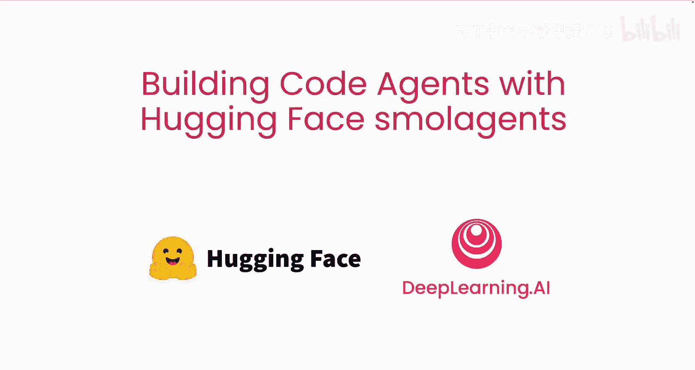
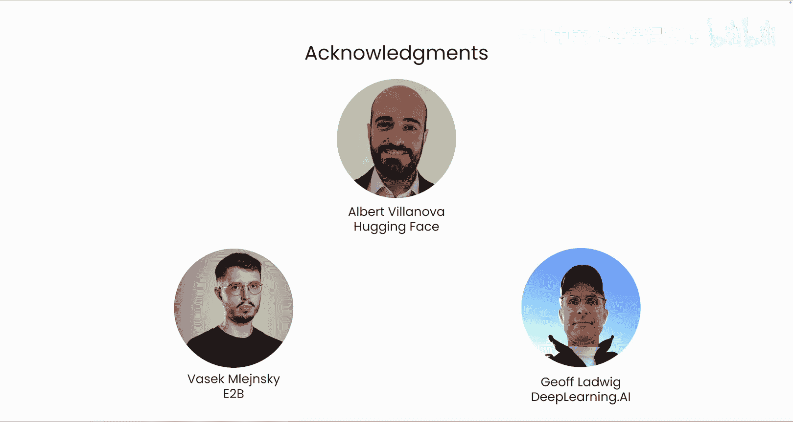

# 001：课程介绍 🚀



在本节课中，我们将学习如何利用Hugging Face的smolagents库来构建代码智能体。代码智能体是一种能够编写代码来执行一系列动作的智能系统。我们将了解其核心概念、优势以及整个课程的学习路径。

## 什么是代码智能体？🤖

上一段我们提到了本课程的主题。本节中，我们来看看代码智能体的具体定义。

代码智能体是一种能够编写代码来执行动作序列的智能体。这与编码智能体不同。编码智能体（例如在Winsurf或Cruser中的那些）为你编写代码，然后由你来执行。而代码智能体的核心思想是：**让你的大语言模型（LM）为你的智能体编写代码**。

其核心优势在于，它允许你利用大语言模型的编码能力来编写执行动作的代码。相比于让大语言模型一个接一个地生成函数调用来完成复杂任务，代码智能体可以将所有这些调用整合到**一段单一的代码**中。

```python
# 代码智能体的核心思想：整合多个步骤
# 传统方式：LM -> 生成步骤1 -> 执行 -> LM -> 生成步骤2 -> 执行 ...
# 代码智能体：LM -> 生成完整代码计划 -> 一次性高效执行
```

这意味着，你可以让大语言模型一次性规划出完整的行动方案，然后高效地执行，而不是强迫大语言模型一次只向你透露计划的一小步。这种方法被证明更高效，并能产生更可靠的结果。


## 课程内容概览 📚

了解了代码智能体的基本概念后，接下来我们预览一下本课程将涵盖的核心内容。

以下是本课程的五个主要章节：

1.  **第一课**：托马斯·沃尔夫将简要介绍智能体的发展历史，带你了解当前的技术背景。
2.  **第二课**：你将学习Hugging Face smolagents，并有机会亲自探索代码智能体的优势。我们还将回顾一些学术成果，展示这种方法带来的效率提升。
3.  **第三课**：使用大语言模型生成的代码时，保护系统免受潜在不良影响至关重要。例如，代码可能存在语法错误，或执行可能损害系统的操作。在本课中，你将学习如何使用smolagents的**受约束的Python解释器**，以及如何在安全的**沙箱**中执行代码以确保安全。
4.  **第四课**：你将看到如何追踪你的智能体，以便调试更复杂的场景。
5.  **第五课**：你将学习并构建一个**多智能体系统**。

## 致谢与支持 👏

最后，我们要感谢为此课程做出贡献的团队。许多人为创建这门课程付出了努力，特别感谢来自Hugging Face的Ike Ha和Albert V Lenova，以及来自DeepLearning.AI的Jeff Ladwig。此外，我们还获得了E2B公司的联合创始人兼CEO Basiklensky的帮助支持，该公司提供了本课程中使用的基于云的安全沙箱。

---



本节课中，我们一起学习了代码智能体的基本概念，它通过整合大语言模型的编码能力，将复杂任务规划为一段可执行的代码，从而提升效率和可靠性。我们还预览了整个课程的结构，从历史背景、工具使用、安全实践到调试和高级系统构建。在接下来的课程中，我们将深入这些主题，开始动手构建你自己的代码智能体。