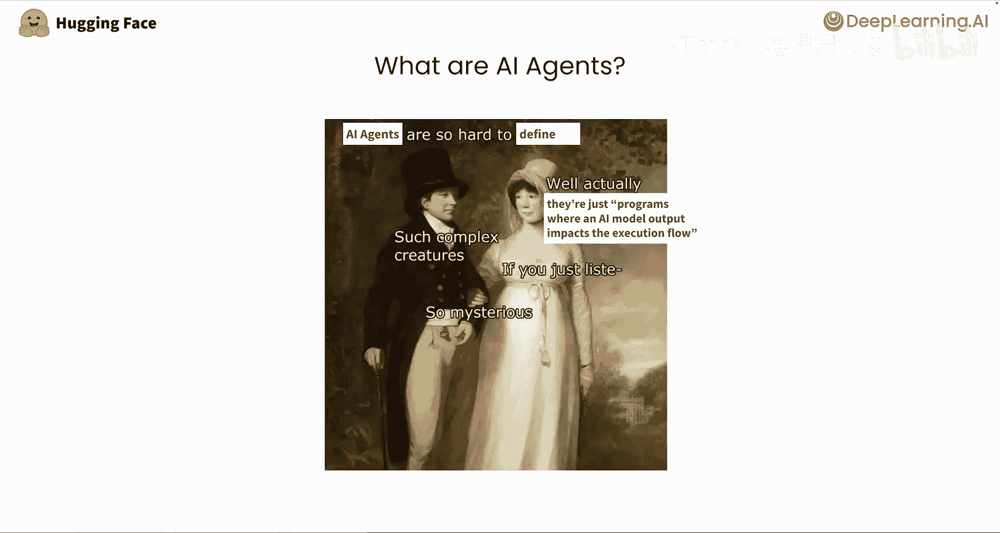
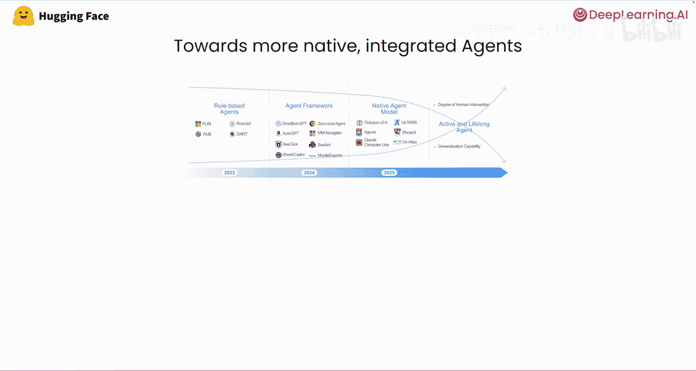
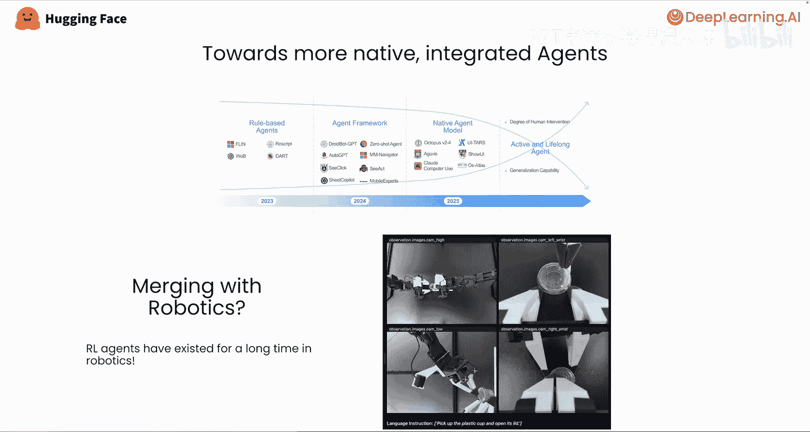
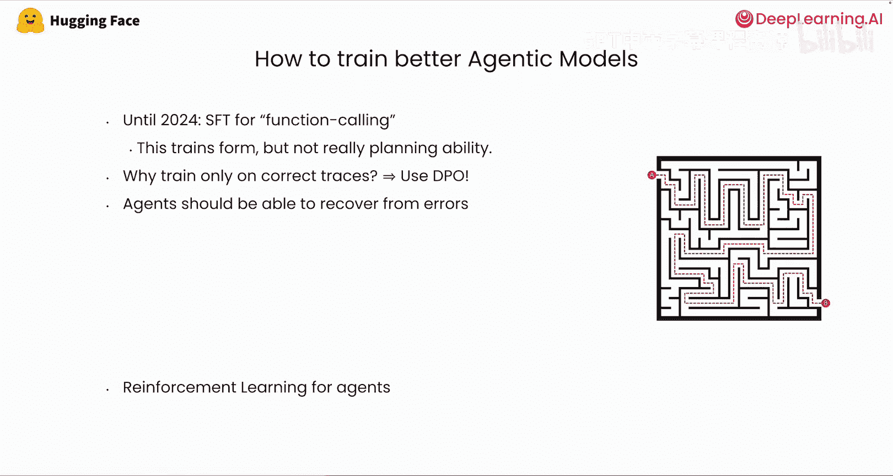

# 002：智能体简史 🧠

在本节课中，我们将学习智能体的基本概念、其能力层级的演变历史，以及推动其发展的关键因素。这为后续深入探讨代码智能体奠定了重要基础。

## 什么是智能体？

首先，我们来探讨一个核心问题：什么是智能体？这个问题已被讨论数月甚至数年，虽然没有完美的定义，但我们找到的最严谨定义是：**AI智能体是一种AI模型的输出会影响程序执行流程的程序**。

换句话说，大语言模型（LLM）被嵌入到计算机程序中，充当其“大脑”。LLM的决策会驱动这个“载体”朝着用户期望的目标前进。

然而，AI模型对执行流程的影响程度各不相同，“智能体化”并非一个非黑即白的概念。

## 智能体的能力层级 📊

智能体的能力可以分为多个层级。理解这些层级有助于我们把握其发展脉络。

以下是智能体从低到高的四个能力层级：

*   **第一级（最低层级）**：LLM的输出仅控制程序工作流中的一个决策点。
*   **第二级（更高层级）**：LLM可以调用外部工具。
*   **第三级（更高层级）**：智能体能够决定下一步行动、下一次迭代，甚至程序的停止条件。这被称为**多步工作流**。
*   **第四级（最高层级）**：一个智能体工作流可以在元级别上创建或启动另一个智能体工作流。

这种能力层级的划分，也反映了自首批LLM发布以来，智能体能力的演进历程。智能体从简单的路由决策（决定程序走向哪个分支），发展到工具调用和多步智能体。

退一步看，我们能赋予LLM的最高层级能力，就是让它**编写并执行代码**。这正是我们所说的**代码智能体**，也是本短课程下一课将详细介绍的 `smolagents` 库的核心功能。

## 智能体性能的演进趋势 📈

智能体系统的性能与其底层LLM能力的提升浪潮紧密相连。随着通用LLM性能的增长，其规划能力也在增强，使其越来越适合驱动具有更长规划视野的多步智能体。

我们展示的图表是顶尖模型在Gaia基准测试上的得分演变。Gaia是由Hugging Face和Meta推出的基准测试，用于衡量智能体在广泛任务（使用计算机和互联网）上的性能。Gaia中的大多数任务，人类使用标准软件大约需要10分钟来解决。

预测AI系统的未来能力始终具有挑战性，但当我们根据Gaia的过往数据进行推断时，发现我们可能在**2026年**达到人类水平的表现。这意味着在未来12到18个月内，我们可能会拥有在大量任务上效率与人类相当的智能体系统，这些任务目前人类在计算机上完成大约需要10分钟。当然，前提是我们为它们提供了解决这些任务所需的所有工具。

## 智能体的发展趋势与协同效应 🤖

另一个值得关注的趋势是，随着LLM能力的增强，智能体越来越不依赖于特定的框架。它们能够越来越多地自主决定下一步该做什么，而无需特定的脚手架帮助或手工设计的框架。

例如，现在在许多情况下，你可以加载一个视觉语言模型，给它看一张屏幕截图，让它决定点击哪里或在键盘上输入什么，而无需过多指导。结果是，你获得了一个可以在许多用户界面上无缝操作，并能集成到广泛系统和智能体库中的智能体。

另一个有趣的协同效应出现在机器人领域。由于计算机工具和物理电子设备命令之间的API差异不大，多模态LLM的广泛能力意味着，就像我们的智能体能够根据截图决定做什么一样，控制机器人的LLM也可以越来越多地仅基于其摄像头获取的视频图像来决定下一步行动。越来越多的模型驱动AI智能体实际上是在计算机界面数据和物理世界数据的混合体上进行训练的。

## 如何训练智能体？🎯

最后，让我们简要谈谈如何训练智能体。直到最近，许多团队和公司还在推动对LLM进行特定的微调，即所谓的“函数调用微调”。这通常包括训练LLM调用一组在训练时给定的预定义工具。

虽然这种方法训练出的LLM能够以预期的格式和正确的参数编写工具调用，但像DeepSeek或Qwen这样的LLM现在已经足够强大，即使没有经过特定训练，仅通过提示词中的几个示例，也能编写工具调用。

在2025年初，智能体LLM面临的主要挑战仍然是**在多步骤上进行规划和推理的能力**。这正是强化学习和最近一波推理模型有望介入并改变游戏规则的地方。

我们预计，LLM的持续改进和针对智能体的特定训练方法的发展，将把智能体系统推向性能和可靠性的新高度，以至于我们将看到智能体系统在现实生活中的应用越来越多。因此，学习本课程是一个明智的决定。