# 003：代码智能体入门 🚀

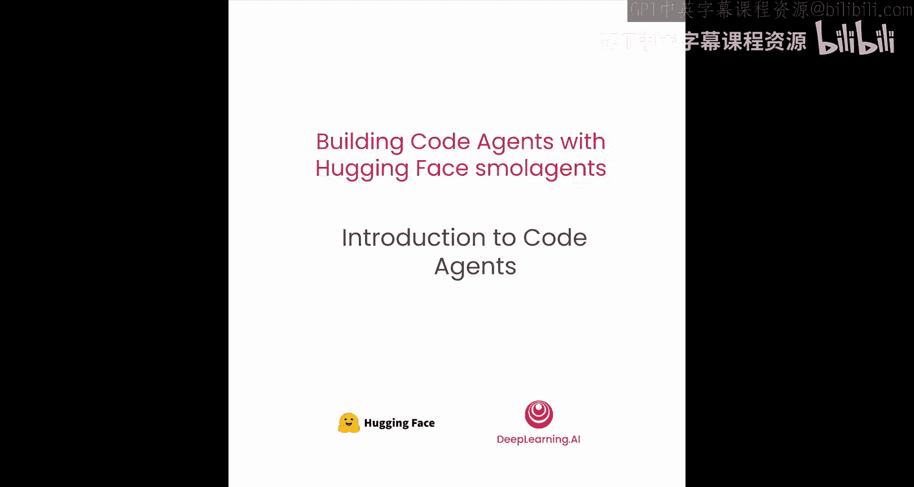

在本节课中，我们将学习代码智能体的核心概念，了解它们与传统工具调用智能体的区别，并通过一个冰淇淋卡车采购的实战案例，演示如何使用Hugging Face的smolagents框架构建一个高效的代码智能体。

---

## 概述

Hugging Face开发了一个名为smolagents的智能体框架。smolagents是一个轻量级框架，抽象层级有限，易于使用。重要的是，在smolagents中，代码智能体被设计为一等公民。


## 代码智能体的核心思想

现在，我们来学习smolagents的核心思想。这种智能体用代码来编写它们的行动。为了理解原因，让我们先看看标准的ReAct循环。

这是目前大多数智能体的工作方式。它们遵循一个名为“ReAct”（思考与行动）的原则。因此，它们的行动遵循一个循环：**思考 -> 行动 -> 观察**行动对环境产生的结果，这个循环不断重复，直到完成用户给定的任务。

让我们举个例子。如果我让一个智能体告诉我斯坦福的天气。
1.  智能体会先**思考**：它需要调用天气API。
2.  然后**行动**：调用天气工具。
3.  **观察**工具调用的结果：目前天气晴朗。
4.  在第二步中，它会再次**思考**：现在需要返回答案了。它将**行动**，使用最终答案工具，返回天气晴朗。

但行动是如何发生的呢？这就是代码智能体与其他智能体的真正区别所在。

## 代码行动 vs. JSON/文本行动

如果我们放大第一步中采取的行动，以下是JSON或文本智能体的做法：
*   它会先思考：我需要调用天气API。
*   然后将其行动写成一个JSON字典，`name`键是工具名称，`arguments`是参数（例如“Stanford”）。

相比之下，代码智能体会将其行动写成如下代码片段：
```python
weather_api(“Stanford”)
```
工具会被写成像是在调用一个Python函数。

在这个简单例子中，区别似乎不大。但现在你将看到它能带来多大的不同。

如果任务更复杂，比如从一系列国家中确定购买智能手机成本最低的国家，并且你需要为每个国家按顺序应用多个工具来获取最终价格。在代码中，这很简单：你只需编写一个Python代码片段，循环遍历所有国家，并为每个国家执行一系列链接在一起的操作，最后在同一个Python代码片段中返回最终答案。

相比之下，JSON或文本智能体将需要连续执行许多步骤（例如12步）才能达到相同的结果。但这是相同的结果吗？每一个新步骤都意味着更多的延迟、更高的成本和更多的出错机会。

## 为何选择代码？

将行动写成JSON或文本已成为事实上的标准，可能是因为这是实现智能体行为的最初尝试，毕竟写出JSON、解析它并执行字典中找到的工具非常简单。

但我们相信，现在需要用代码来执行智能体行动，不仅是因为我们刚刚说明的原因（在代码中链接或并行化操作更容易），还因为许多其他原因。例如，在代码中，你可以：
*   为变量赋值以便后续重用。
*   操作非文本元素。
*   通过定义函数来构建自己的工具。

简而言之，代码是一种更强大的方式来描述计算机执行的操作，因为它就是为此而生的。如果JSON是更好的方式，你每天都会用JSON编码。但显然，没有人这样做。

上一张幻灯片的例子取自一篇优秀的论文，你应该阅读它。这篇论文还比较了代码行动和JSON行动的成功率以及所需的大语言模型调用次数，结果表明代码行动不仅更成功，而且更精简。这也是我们在smolagents中比较代码和JSON智能体时的经验。

## 实战案例：冰淇淋卡车采购

在接下来的课程中，我们将使用一个冰淇淋卡车的例子。假设你决定追求真正的热情，开始经营冰淇淋卡车生意。恭喜！这是一个很好的起点。你已经买了卡车和所有必需的设备，并估计每天能卖出30升冰淇淋。

现在，你每天早晨都需要获取生冰淇淋原料。你想比较不同批发供应商的每日送货选项。这就是我需要帮助你的地方。我将向你展示如何构建一个能够计算和比较所有选项总价格的智能体。

### 环境设置与数据导入

首先，我将设置环境，然后导入必要的数据。以下是不同的供应商。让我们计算哪个供应商实际上最便宜。我已经为你做好了计算作为参考。从这些计算来看，你能找到的最便宜的供应商是“Brainfreeze Brothers”。

### 构建代码智能体

现在，让我向你展示这些智能体。我首先定义它可以使用的工具。我使用smolagents中的`@tool`装饰器，它可以将任何配备了适当类型提示和文档字符串的函数转换为智能体可以使用的工具。要在一个函数上使用这个装饰器，你需要确保类型提示设置正确，并且函数文档字符串包含每个输入参数的描述。

每个新工具现在都拥有所有必需的属性，如名称和描述。这些将被智能体用来正确使用工具。

接着，我们初始化将用作智能体引擎的模型。这里，我使用通过Hugging Face Hub由Together AI提供的Qwen模型。我必须声明，我是Qwen模型的忠实粉丝，我认为它们在这方面做得非常出色。为了让这个模型工作，我们需要使用从Hub账户设置页面创建的、启用了推理提供商访问权限的令牌登录。

### 初始化智能体

现在让我们设置我们的智能体。`CodeAgent`是smolagents中主要的智能体类。它是一个多功能的智能体，在其代码中生成并执行Python代码片段。它也可以调用你提供给它的工具，在这里，它会像调用常规Python函数一样调用它们。

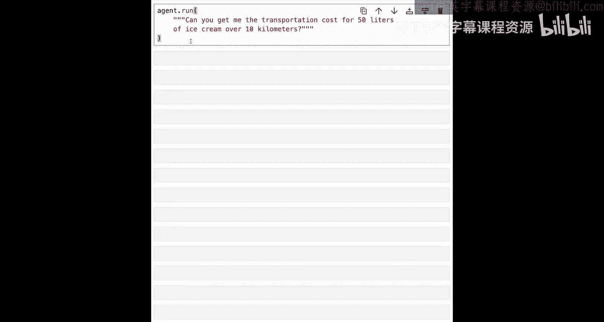

初始化你的智能体需要两个参数：`model`和`tools`。这里我还给了它额外的授权导入，让它能高效地运行计算和Pandas DataFrame。

### 单次工具调用示例

让我展示一下在代码中，一次简单的工具调用是什么样子。我给智能体一个只需要一次调用的简单任务。

你可以看到，原始模型输出包含一个代码片段，然后被我们的智能体提取并运行。在这个片段中，工具`calculate_transport_costs`就像调用一个标准的Python函数一样被调用。在打印第一步的输出进行检查后，智能体可以在第二步中直接返回答案。

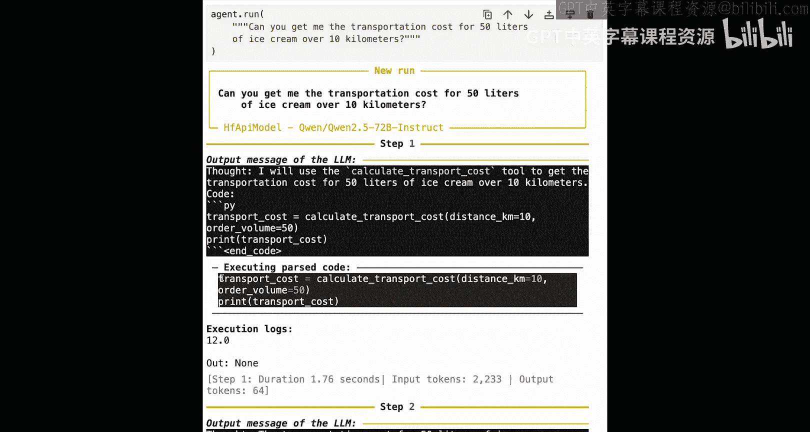

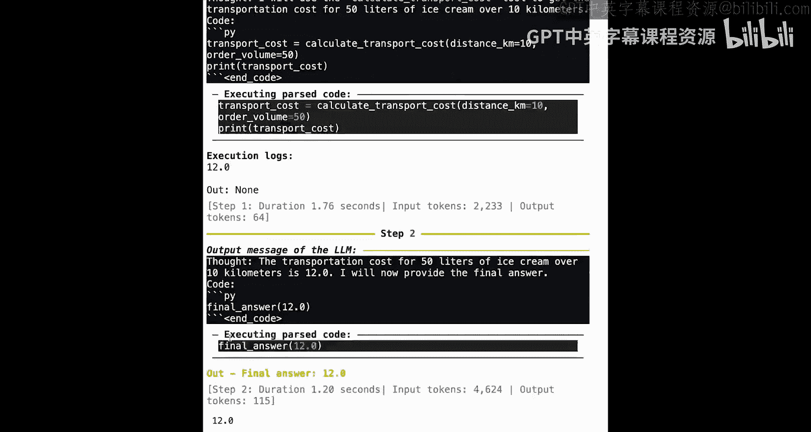

### 执行核心任务

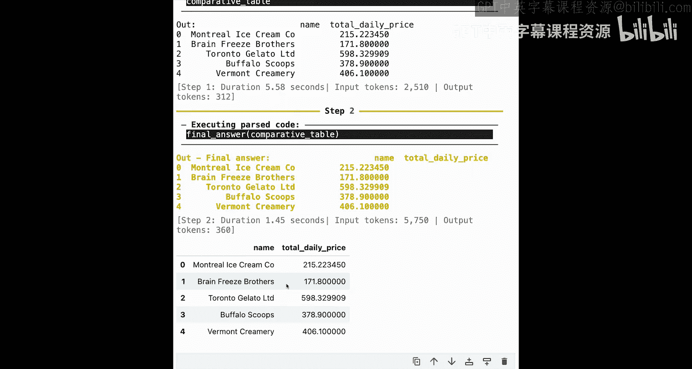

现在，我将给智能体它真正的任务：为你比较供应商成本。注意，给智能体详细的指令很重要，就像你对队友所做的那样。在这里，我给了它所有必要的信息，以及关于包含运输成本和可能关税的额外细节。

看起来代码智能体成功地解决了手头的任务，给出了正确的结果：Brainfreeze Brothers是最便宜的供应商，价格正确。

### 智能体如何工作？

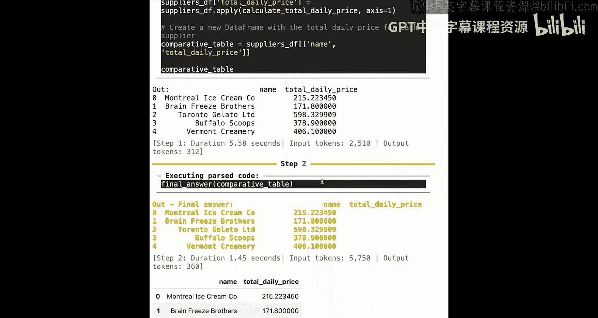

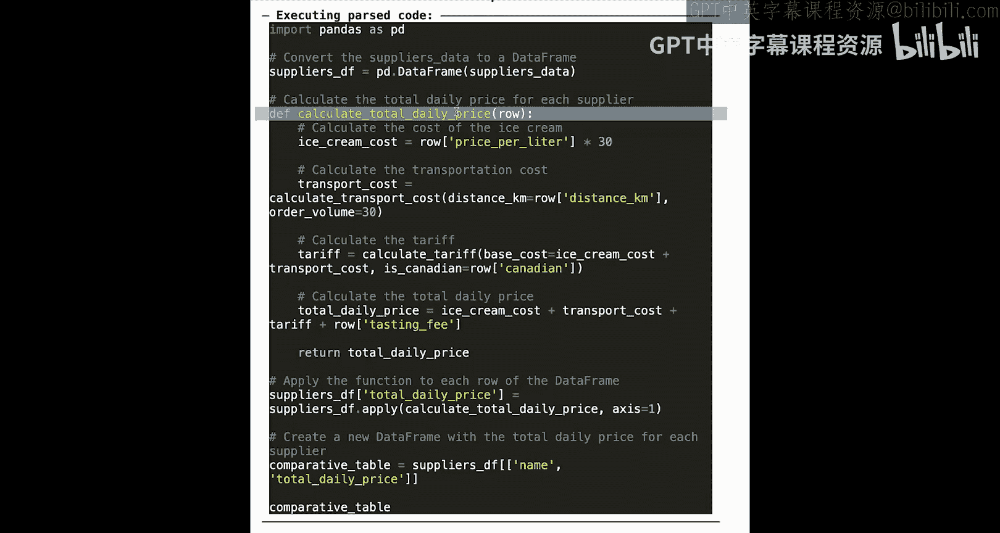

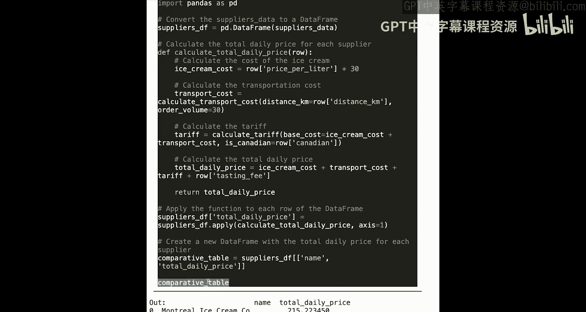

智能体是如何做到这一点的？它只需要两步。
1.  在第一步中，它生成了自己的Python函数来计算价格。这非常有趣，意味着这个函数将来可以随时被再次调用。基本上，智能体为自己创建了一个新工具，这是节省未来工作的好方法。然后它为自己显示结果以便检查。
2.  在第二步中，检查结果后，它直接返回了它们。

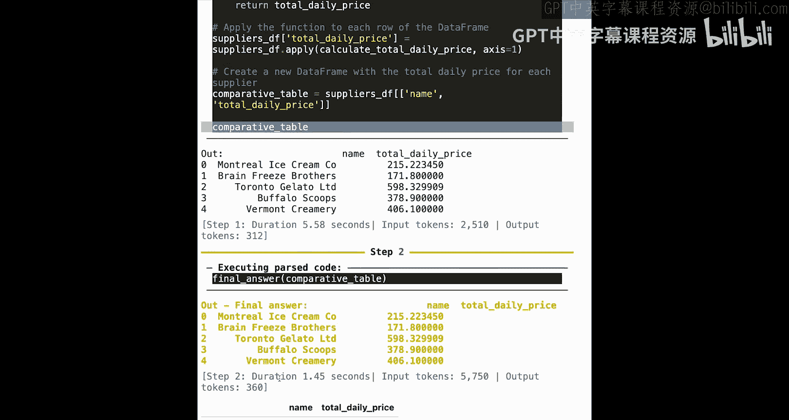

## 代码智能体 vs. 传统工具调用智能体

这是一个代码智能体，但它与传统的工具调用格式相比如何？让我先展示它们的不同之处。

以下是一个代码智能体如何编写其输出来回答一个关于如何计算运输成本的简单问题。如你所见，是和上面相同类型的Python代码片段。

相反，一个传统的工具调用智能体会将其行动写成JSON块。思考过程可以完全相同，但行动的表述方式不同。在这个单次工具调用的例子中，没有哪种表述方式比另一种更自然。

但对于更复杂的任务，它会如何工作呢？smolagents也在名为`ToolCallingAgent`的类中实现了传统的工具调用。所以我现在将向你展示如何创建这样一个智能体。我给它和上面相同的模型以及相同的工具集。

现在，让我们让这个新智能体运行与上面完全相同的任务。

如你所见，这个智能体链接了许多单独的工具调用，因为它不能像我们的代码智能体那样使用for循环或使用不同变量来链接顺序操作。代码智能体用两步解决了任务，而这里，智能体运行了更多步骤，从而累积了令牌数、延迟和成本。每一个新步骤也是增加出错风险的额外机会。

智能体只能将其答案作为Markdown文本返回，因为它没有像我们的代码智能体那样返回DataFrame的能力。最后，由于每次计算都需要在文本中重新输入所有变量，而不是在代码中自然地处理它们，大语言模型必须正确记住它们并准确计算。结果，看起来大语言模型犯了一个错误，因为Brainfreeze Brothers的最终价格与我们上面建立的基准不符。

请注意，结果可能因人而异。例如，你可能有一个工具调用智能体第一次尝试就完美完成了任务。但我们经常看到这种失败模式发生。无论如何，运行时间要长得多，因为智能体总是必须进行这些多次单独的工具调用。

## 总结

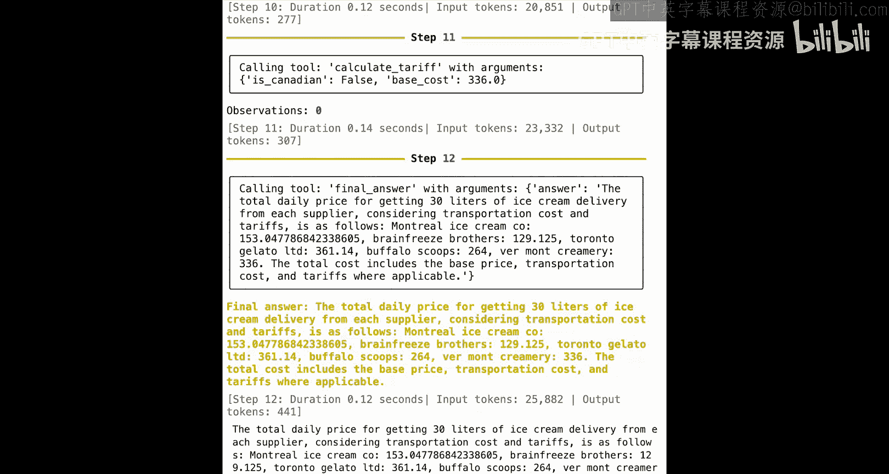

在本节课中，我们一起学习了代码智能体的核心优势。我们通过一个冰淇淋卡车采购的案例，实战演示了如何使用smolagents框架构建`CodeAgent`。我们看到，与传统的`ToolCallingAgent`相比，`CodeAgent`能够通过编写和运行Python代码，用更少的步骤、更低的延迟和错误率完成复杂任务（如循环计算和数据处理）。代码提供了更强大、更自然的行动描述方式。

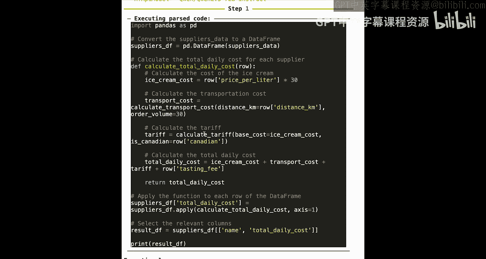

但你可能想知道这个代码智能体如何以安全的方式运行大语言模型生成的代码。这将是下一节课的内容。