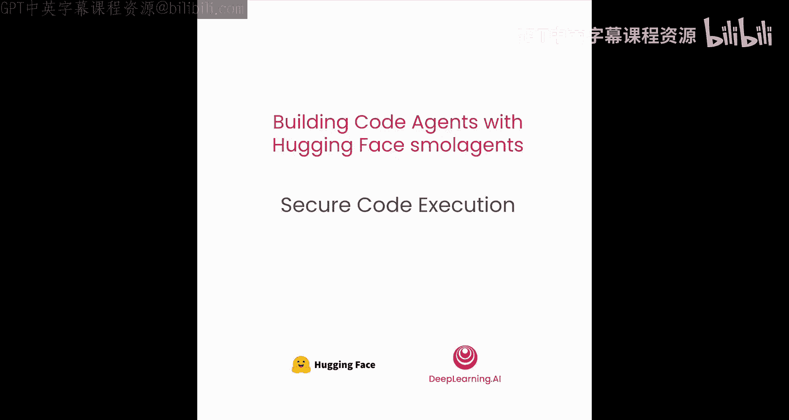
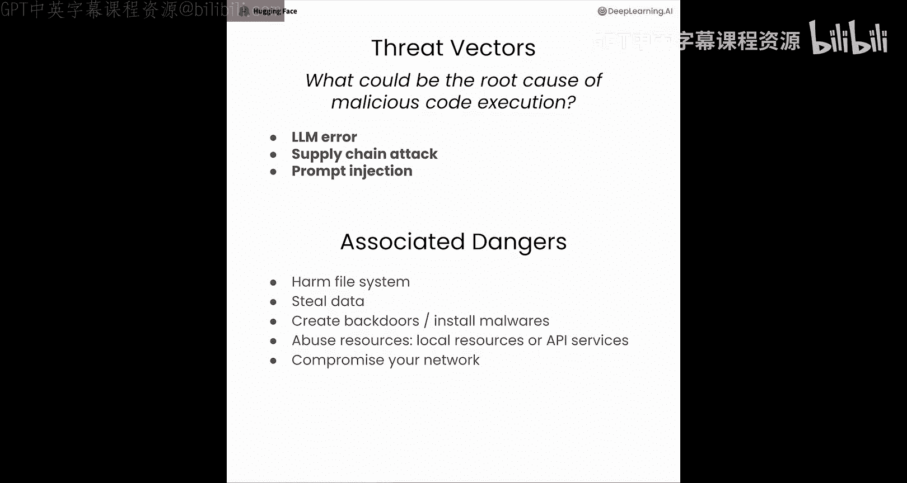
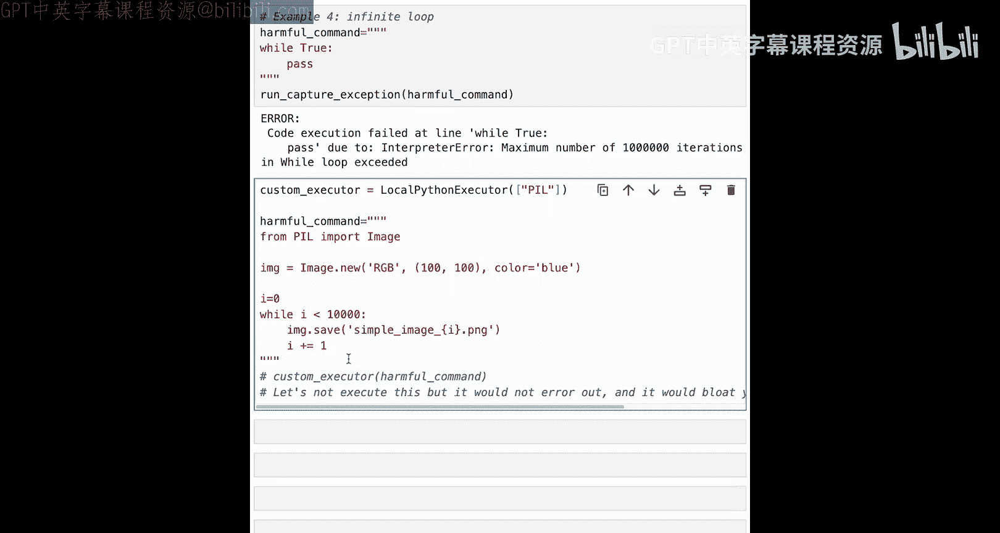
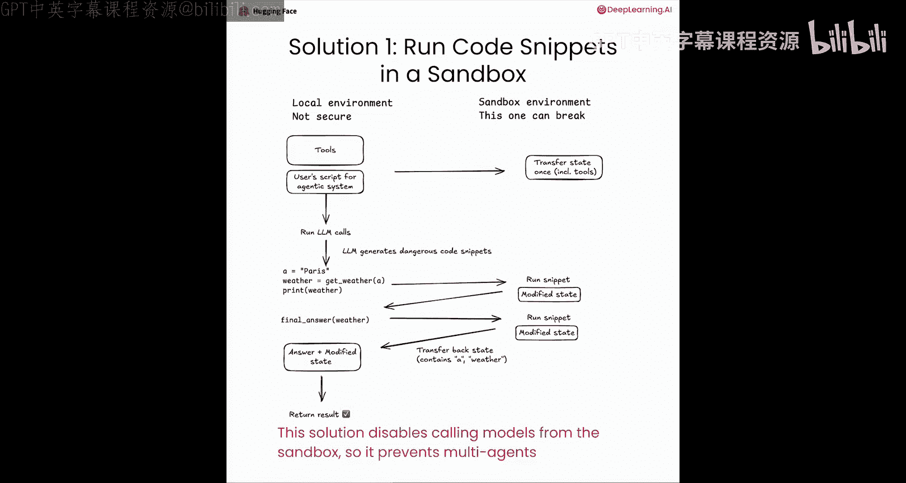
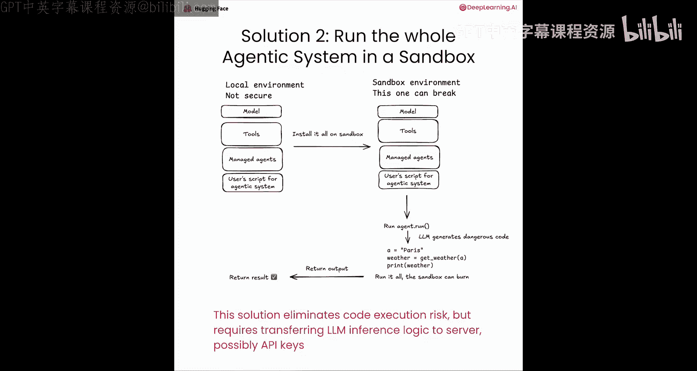
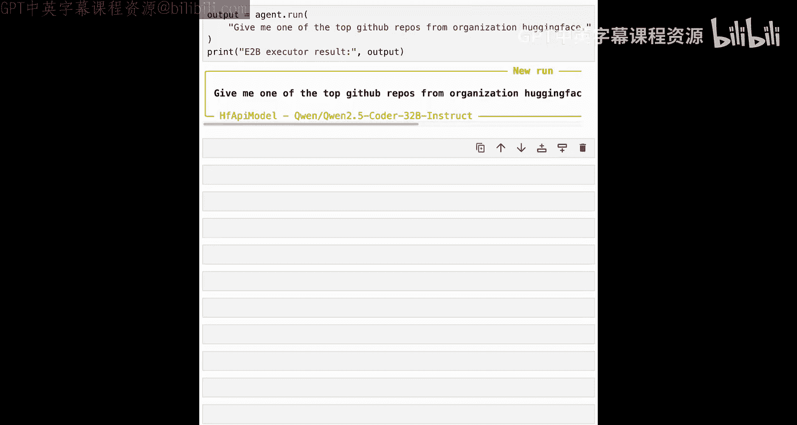
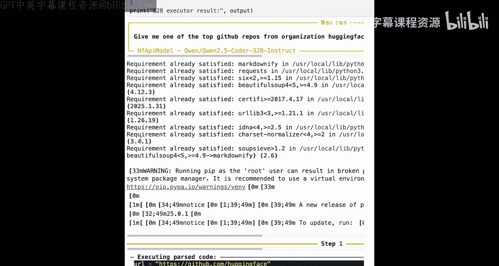
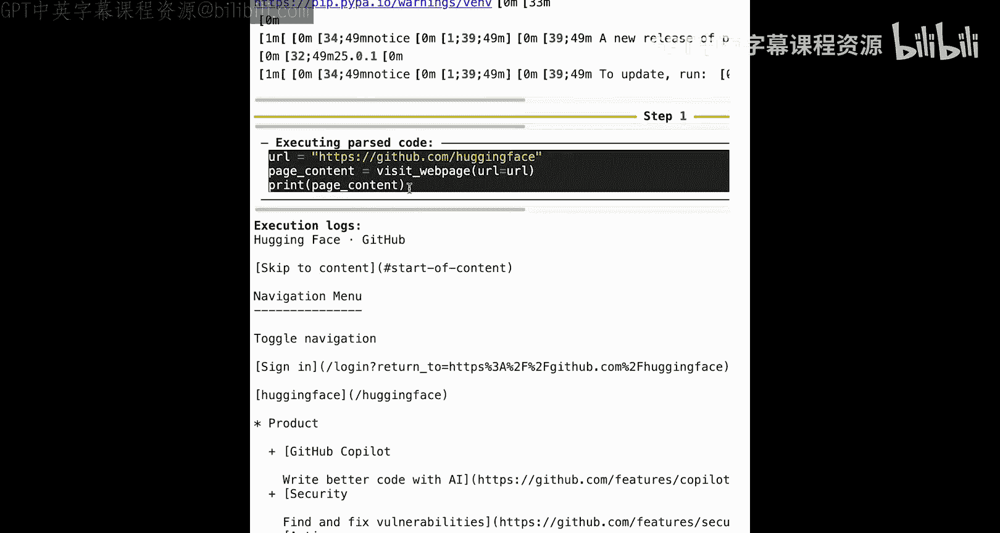
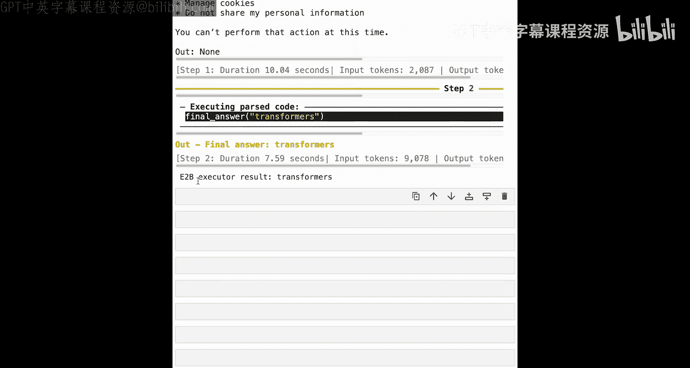

# 004：安全代码执行 🔒

在本节课中，我们将探讨运行由大语言模型生成的代码时可能面临的安全风险，并学习如何使用smolagents框架内置的安全机制以及远程沙箱来保护你的系统。

## 概述

代码智能体执行LLM生成的Python代码会带来任意代码执行的风险，从而可能导致恶意攻击。这种风险源于多种途径，例如LLM的失误、供应链攻击或提示注入。恶意代码可能损害文件系统、窃取数据、滥用资源或安装后门。因此，确保代码执行环境的安全至关重要。本节将介绍smolagents提供的多层安全防护措施。

## 代码执行的风险来源

上一节我们介绍了代码智能体的基本概念，本节中我们来看看其潜在的安全风险。恶意代码可能通过以下几种方式在你的系统上执行：

*   **LLM失误**：大语言模型仍可能犯错，在尝试帮助你的过程中无意生成有害代码。虽然风险较低，但在大量运行中仍可能观察到此类尝试。
*   **供应链攻击**：如果你运行一个恶意的LLM模型，它生成的代码会主动试图损害你的系统。在使用安全推理的知名模型时，此风险极低，但仍有可能发生。
*   **提示注入**：一个浏览网页的智能体可能访问恶意网站，该网站包含有害指令，从而将攻击注入到智能体的记忆中。

一旦恶意代码得以执行，无论是意外还是故意，它都可能造成多种危害。以下是其主要攻击目标：

*   损害你的文件系统。
*   窃取数据。
*   滥用资源，包括本地资源或API服务。
*   危害你的网络。
*   安装恶意软件或后门，用于后续攻击。

鉴于以上风险，我们必须尽可能确保代码执行环境的安全。

## smolagents的内置安全层

现在，我们将了解如何利用smolagents提供的多种保护层来安全运行代码智能体。让我们从自定义的Python解释器开始，这是第一层安全防护。

在smolagents中，代码执行并非由标准的Python解释器完成。我们从头构建了一个更安全的本地Python执行器。具体来说，这个解释器通过加载代码的抽象语法树（AST）并按操作执行，同时确保始终遵循特定规则。

以下是其内置的安全规则：

*   任何未定义的命令将被忽略。
*   导入操作受到限制。
*   无限循环被阻止。

让我们在实践中看看这些规则如何生效。首先，我们设置执行器，并创建一个包装器来优雅地只显示最终错误，而非整个堆栈跟踪。

以下是Python解释器中内置的安全防护措施：

**1. 处理未定义命令**
在Jupyter环境中，某些命令可以运行。然而，在这个自定义解释器中，由于我们是从头重写的，任何未实现的行为都会失败。你会看到系统抛出一个错误。

**2. 限制导入操作**
任何不在白名单内的导入都必须被明确授权才能执行。例如，尝试导入`os`模块并使用`os.system`来运行任意命令将会失败，因为默认情况下该导入不被允许。除非被显式添加到授权列表，否则导入操作是被禁止的。此外，即使某些看似无害的包（如`random`）可能提供访问危险包的途径，匹配一系列危险模式的包也不会被导入。例如，尝试从`random`模块访问`os`命令同样会引发错误。

**3. 防止无限循环和资源膨胀**
我们设置了基本操作处理总数的上限，以防止无限循环和资源滥用。当你运行一个无限循环时，命令开始执行，但一段时间后会因超出循环迭代次数的硬限制而抛出错误。

由于这些安全措施，该解释器相对更安全。在实际使用中，它已在多种用例中应用，且未观察到对环境造成损害。

然而，这个解决方案并非万无一失，因为没有任何本地沙箱是绝对安全的。可以想象，LLM仍可能找到执行恶意行为的方法来损害你的环境。例如，如果你允许导入像`Pillow`这样用于处理图像的无害包，LLM可能会生成数千张图像来塞满你的硬盘。代码逻辑可能是先导入被授权的`Pillow`包，然后设置一个不会触发迭代计数器的循环，每次循环都在你的系统中保存一张图像。

## 使用远程沙箱增强安全性

刚才的演示表明，即使有内置防护，自定义Python解释器也并非100%安全。实际上，任何在本地系统上运行的Python沙箱都仍存在风险。那么，如何进一步提高安全性呢？

保护LLM生成代码执行的最佳方式是使用安全的沙箱环境，更好的是使用不在你本地环境中的远程沙箱。你可以通过两种方式实现：

**第一种方式**是保留大部分代码在本地，仅在智能体生成代码片段后，将它们发送到远程沙箱执行。这种方式相当安全，我们将在notebook中演示。然而，如果你想运行多智能体系统，第一种方案会有限制。因为你的代码并未完全移植到沙箱中，远程代码执行器将无法调用管理型智能体，除非它拥有运行该智能体所需的所有代码和调用其底层LLM的API密钥。

**第二种方式**是将所有内容（代码、API密钥、工具）都导出到沙箱中。这将解锁多智能体系统，但迫使你导出可能敏感的API密钥以调用模型。

smolagents允许你使用本地Docker容器或E2B沙箱。在notebook中，我将展示如何实现第一种方案，即使用E2B。

## 实践：使用E2B沙箱运行代码智能体

现在，让我们使用E2B沙箱来运行一个代码智能体。我们首先传入E2B的API密钥。

然后，我们定义我们的智能体。这里我们将定义一个自定义的“访问网页”工具。我们没有使用smolagents提供的默认工具，目的是展示你可以轻松定义自定义工具并将其发送到E2B沙箱。你只需要定义工具，然后将其传递给智能体，并设置`executor_type=E2B`以及包含你E2B API密钥的`executor_kwargs`。

运行时，智能体会自动在沙箱中初始化，并且工具已传输到服务器。这可能需要一些时间，因为沙箱需要启动。你可以看到所有必要的导入和安装都在服务器上执行。然后我们会收到一条消息，表明我们的智能体已准备就绪。

接着我们运行它。我们给智能体一个请求，该请求将利用我们刚刚定义的“访问网页”工具。经过一些确保工具正常工作的安装后，我们的智能体正常运行，但代码是在沙箱内部执行的。这展示了Hugging Face的GitHub页面，并显示了顶部的代码仓库。我们的智能体正确地返回了其中一个顶级仓库，即`transformers`。

当然，你可以使用E2B构建更复杂的智能体。但请记住，正如我们在幻灯片中看到的，这是一种无法构建多智能体系统的解决方案。不过，单智能体系统通常足够强大，可以运行你所需的所有工作负载。如果你想切换到多智能体系统，可以将整个系统设置在沙箱上，但这需要一些自定义设置。

## 总结

本节课中，我们一起学习了代码智能体执行环境的安全风险与防护措施。我们首先分析了恶意代码执行的三种主要途径：LLM失误、供应链攻击和提示注入，及其可能造成的危害。接着，我们深入探讨了smolagents框架内置的安全层，包括其自定义Python解释器如何通过忽略未定义命令、限制导入和防止无限循环来提供基础保护。最后，我们认识到本地沙箱的局限性，并学习了如何使用E2B远程沙箱来显著提升安全性，包括其配置方法和适用场景。现在，你拥有了一个更安全的环境来运行你的智能体。在下一课中，我将向你展示如何在生产环境中监控你的智能体。