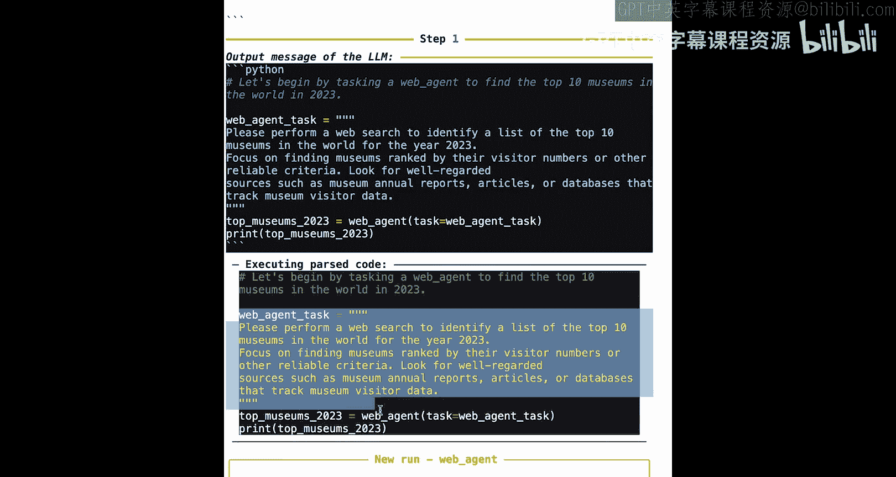
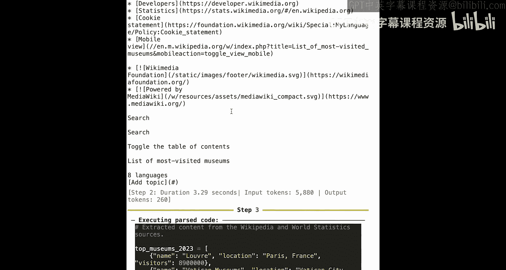
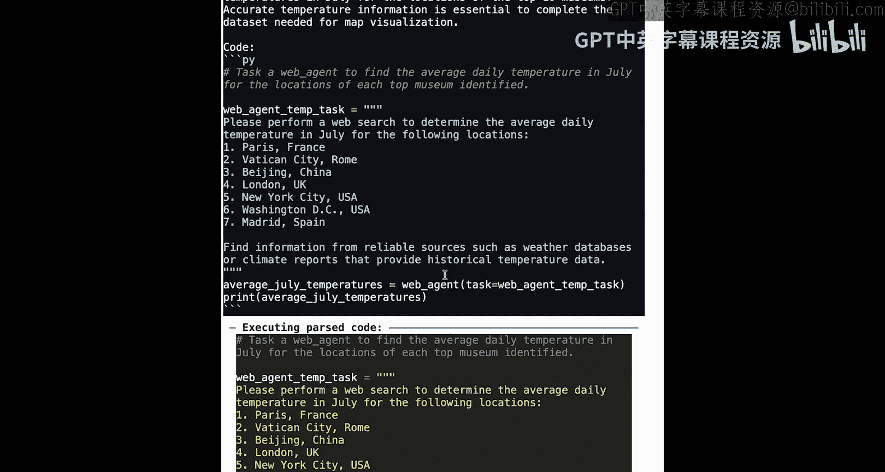
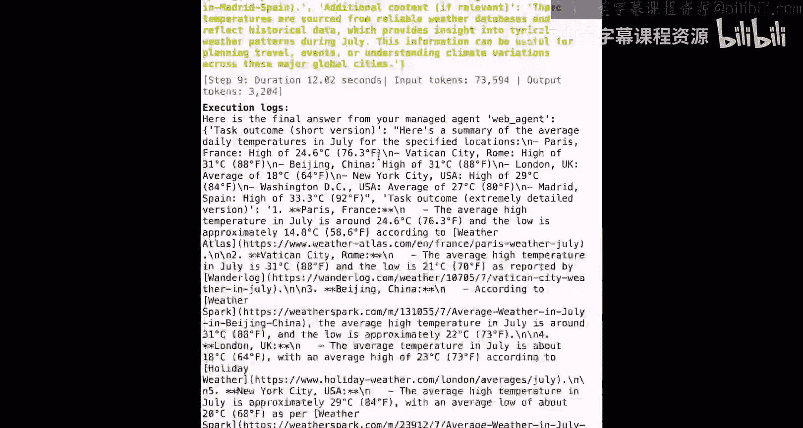
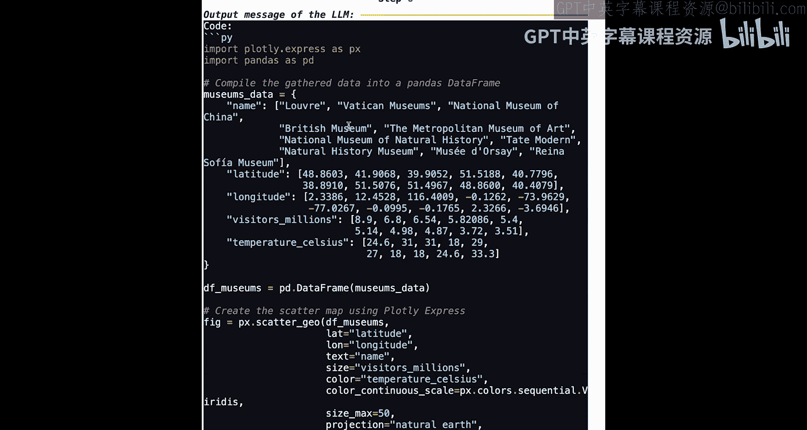
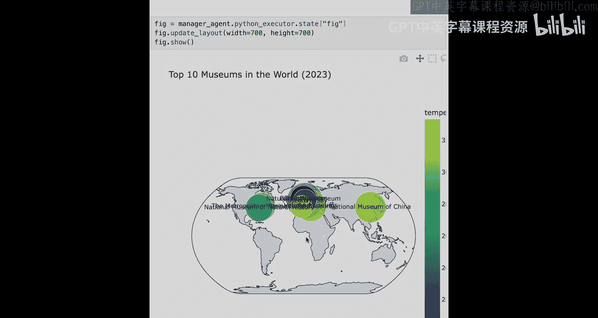

# 006：构建深度研究智能体 🧠

在本节课中，我们将学习如何构建一个深度研究智能体。这个智能体需要完成一个复杂的任务：找出世界上参观人数最多的前10个博物馆，并获取它们所在地在七月的平均气温，最终生成一份交互式报告。我们将从创建一个简单的智能体开始，逐步引入规划、多智能体协作和质量检查等高级概念，以构建一个更强大、更可靠的系统。

## 概述

上一节我们介绍了智能体的基本工作原理。本节中，我们将面对一个更复杂的现实任务。我们将构建一个能够进行深度网络研究、整合信息并生成可视化报告的智能体。这个过程将涉及创建专用工具、设置多智能体团队以及实施结果验证。

## 创建基础工具

首先，我们需要为智能体配备执行任务所需的工具。主要是搜索工具和网页访问工具。

以下是使用 `smolagents` 库创建这两种工具的示例代码。我们使用了两种不同的工具构造方式：函数装饰器和类定义。

```python
from smolagents import tool
import duckduckgo_search

# 使用装饰器创建搜索工具
@tool
def search_web(query: str) -> str:
    """使用DuckDuckGo搜索网络并返回摘要。"""
    results = duckduckgo_search.ddg(query, max_results=5)
    return "\n".join([f"{r['title']}: {r['body']}" for r in results])

# 使用类定义创建网页访问工具
from smolagents import Tool

class VisitWebPage(Tool):
    name = "visit_webpage"
    description = "访问一个特定的URL并返回其文本内容。"
    inputs = {"url": {"type": "string", "description": "要访问的网页URL。"}}
    output_type = "string"

    def __call__(self, url: str):
        import requests
        from bs4 import BeautifulSoup
        response = requests.get(url)
        soup = BeautifulSoup(response.content, 'html.parser')
        return soup.get_text()
```

创建工具后，我们可以进行简单测试，例如搜索“冰淇淋的融化温度”，以确保工具工作正常。

## 设置基础智能体

有了工具，接下来我们设置一个基础的单智能体。首先需要指定使用的模型，例如 OpenAI 的 GPT-4。

```python
from smolagents import CodeAgent
import os

os.environ['OPENAI_API_KEY'] = 'your-api-key-here'
model = "gpt-4"

# 创建基础智能体
simple_agent = CodeAgent(
    tools=[search_web, VisitWebPage()],
    model=model
)
```

然后，我们可以向这个智能体提出我们的核心请求：

> “请给我一份2023年世界前10大博物馆的列表，包含它们的参观人数和七月的大致日平均气温。”

运行智能体后，我们可能会观察到一些典型问题。例如，智能体可能在执行操作时产生错误，或者返回的结果不完整（如只找到4个博物馆而非10个），数据也可能不精确（如气温被报告为整数）。这表明我们需要为智能体搭建更多“脚手架”来提升其表现。

## 构建多智能体团队

为了改进结果，我们将采用两个关键策略：设置规划间隔和使用多智能体结构。

*   **规划间隔**：让智能体定期规划后续步骤，而不是盲目执行。
*   **多智能体结构**：为不同的子任务分配专门的智能体。这有两个主要好处：
    1.  可以专门化每个智能体（通过工具或模型选择），使其在其核心任务上表现更好。
    2.  分离记忆可以减少每一步的输入令牌数量，从而降低延迟和成本。

对于我们的任务，我们将创建一个团队，包含一个专门负责网络搜索的智能体，并由一个经理智能体进行管理。

以下是创建专用网络搜索智能体的代码：

```python
web_search_agent = CodeAgent(
    name="WebResearcher",
    description="一个专门负责从互联网搜索和提取信息的智能体。",
    tools=[search_web, VisitWebPage()],
    model=model
)
```

接下来，创建经理智能体。它需要更强的推理能力，因此我们为其配备规划能力和额外的绘图库导入权限，以便生成最终的可视化报告。

```python
manager_agent = CodeAgent(
    name="Manager",
    description="管理研究任务并整合报告，能调用WebResearcher。",
    tools=[],  # 经理自身不直接使用搜索工具
    model=model,
    planning_interval=5,  # 每5步进行一次规划
    additional_imports=["pandas", "plotly.express", "geopy"]  # 授予绘图权限
)
# 注意：需要配置经理智能体能够调用 web_search_agent，这通常通过特定的多智能体协调类实现。
```

## 实施质量检查





为了确保最终结果的质量，我们引入一个验证步骤。使用一个多模态模型（例如，能分析图像的模型）来检查生成的报告地图是否满足了用户任务的所有要求。

```python
def quality_check(final_map_image_path, original_query):
    """
    使用多模态模型检查生成的地图是否回答了原始问题。
    如果检查失败，则抛出异常，让智能体继续改进。
    """
    # 此处为伪代码，表示调用多模态模型API的过程
    # evaluation = multimodal_model.ask(f"Does this map show {original_query}?")
    if evaluation == "FAIL":
        raise Exception("质量检查未通过。报告需要包含前10个博物馆及其气温信息。")
    else:
        return "PASS"
```

## 运行与结果分析





当一切设置就绪，我们向经理智能体发出任务指令。运行过程会呈现清晰的步骤：

1.  **规划阶段**：经理智能体首先制定计划，将大任务分解为小任务（如：1. 查找博物馆列表；2. 查找气温；3. 查找坐标；4. 生成地图）。
2.  **执行与协作**：经理智能体将“查找博物馆列表”子任务委托给 `WebResearcher`。`WebResearcher` 执行详细的网络搜索，并返回一份清晰的报告。这个过程可能很冗长，但正是专门化智能体的价值所在——它处理了所有网络细节，防止经理智能体的上下文被无关信息填满。
3.  **迭代收集**：经理智能体收到博物馆列表后，继续委托 `WebResearcher` 查找这些地点的气温和地理坐标。
4.  **整合与可视化**：经理智能体收集所有数据后，使用 `plotly` 库生成一个交互式地图，将博物馆、参观人数和气温信息标注在地理位置上。
5.  **质量验证**：生成的地图被送入质量检查流程。多模态模型确认其符合要求后，最终报告才被返回给用户。

最终，我们获得了一份包含所需所有信息的交互式报告。通过访问智能体的内部状态，我们还可以提取并展示生成的地图。

```python
# 访问并显示最终生成的地图
final_map = manager_agent.latest_state.get('final_plot')
display(final_map)
```



现在，你就可以根据这份报告，在世界顶级博物馆旁规划你的冰淇淋车生意了！

## 总结



本节课中我们一起学习了如何构建一个深度研究智能体。我们从创建一个基础的单智能体开始，发现了其在复杂任务中的局限性。为了克服这些限制，我们引入了**规划间隔**和**多智能体团队协作**的结构，让专门的智能体处理专门的任务，并由一个经理智能体进行协调。最后，我们还加入了**多模态质量检查**步骤来确保输出结果的可靠性。通过这一完整的流程，我们构建了一个能够理解复杂指令、执行深度研究、整合多源信息并生成高质量可视化报告的强大智能体系统。