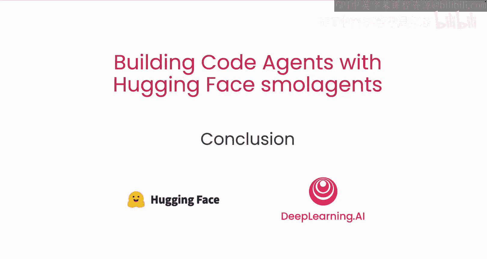

# 007：总结 🎉

在本节课中，我们将一起回顾整个课程的核心内容，总结使用Hugging Face smolagents库构建强大代码智能体的关键知识与技能。

---

恭喜你完成本课程。在本课程中，你学习了如何使用Hugging Face的smolagents库构建强大的代码智能体。

具体而言，你现在掌握了以下核心技能：

*   **安全运行LLM生成的代码**：你学会了如何在一个受控、隔离的环境中执行由大型语言模型生成的代码，从而避免潜在的安全风险。
*   **监控与评估智能体**：你了解了如何跟踪智能体的执行过程、分析其性能，并使用合适的指标对其进行评估。
*   **构建强大的多智能体系统**：你探索了如何将多个智能体组合起来，让它们协同工作以解决更复杂的任务。

smolagents是一个开源库。欢迎你加入我们，共同让它变得更好。

你可以在GitHub上找到我们。😊

---

**总结**

本节课中，我们一起回顾了使用Hugging Face smolagents构建代码智能体的核心要点。我们总结了安全执行代码、监控评估智能体以及构建多智能体系统这三个关键模块。smolagents作为一个开源项目，期待你的参与和贡献。