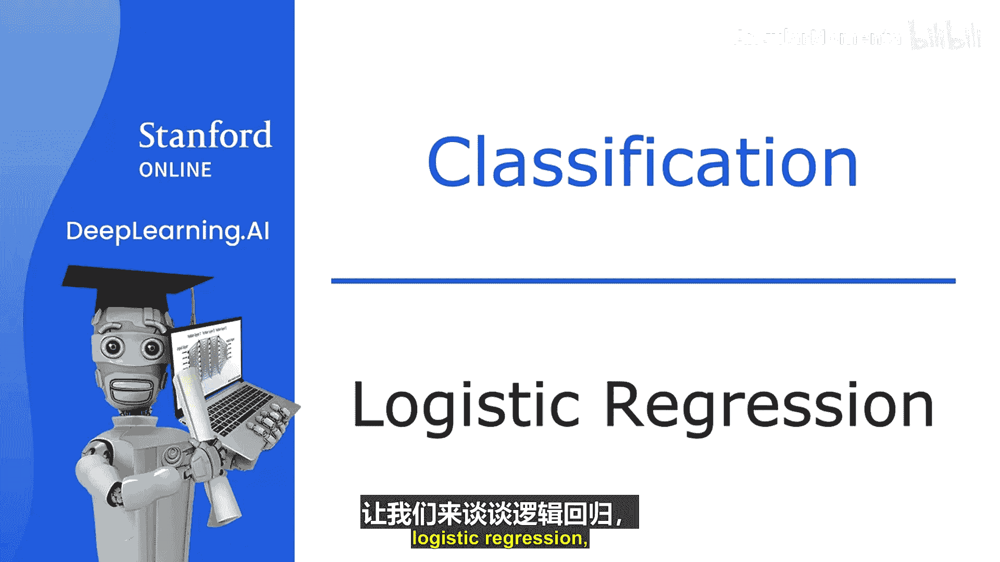
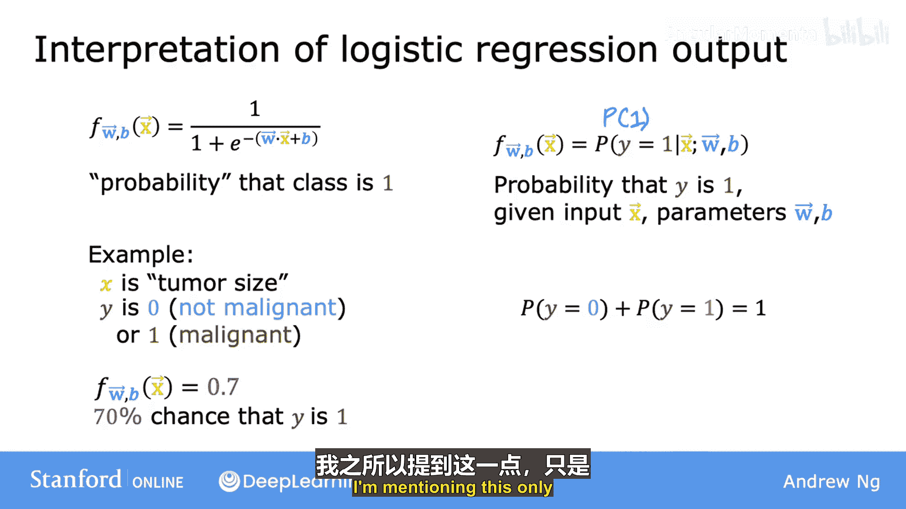
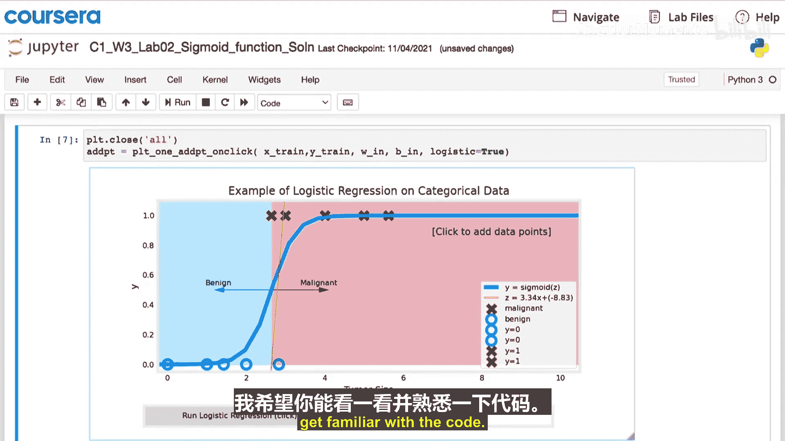
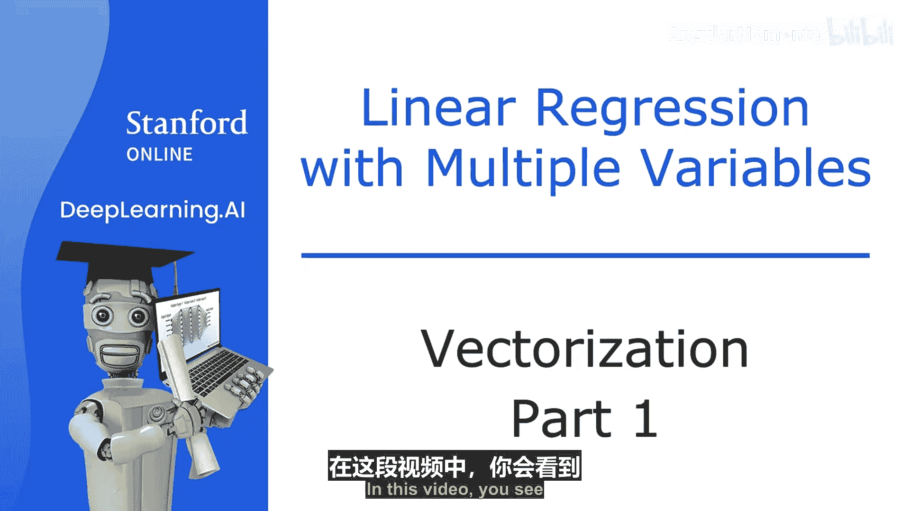
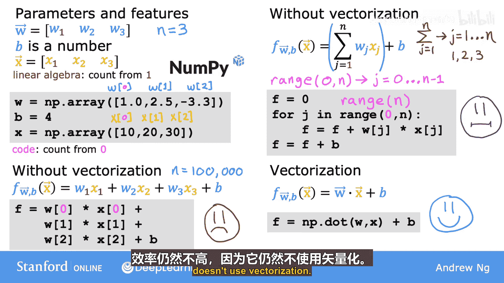

# 002：机器学习的应用 🚀

在本节课中，我们将学习机器学习的当前发展状况，并亲自实践如何实现机器学习算法。我们将了解最重要的机器学习算法，其中一些正是当今大型AI或科技公司正在使用的技术，从而对AI的前沿领域有一个认识。除了学习算法本身，我们还将掌握所有重要的实用技巧，以确保算法表现良好，并有机会亲自实现它们，观察其工作原理。

## 概述

机器学习为何在今天如此广泛应用？它最初是人工智能（AI）的一个子领域。我们希望构建智能机器，但事实证明，我们只能为机器编程完成一些基本任务，例如在GPS中找到从A点到B点的最短路径。然而，对于大多数更有趣的任务，如执行网络搜索、识别人声、从X光片诊断疾病或构建自动驾驶汽车，我们并不知道如何编写明确的程序。实现这些任务的唯一方法是让机器自行学习。

在我创立并领导谷歌大脑团队时，我致力于解决诸如语音识别、谷歌地图街景图像的计算机视觉和广告等问题。在Landing AI和斯坦福大学，我帮助将AI应用于制造业、大规模农业、医疗保健、电子商务等领域。如今，成千上万甚至数百万的人正在从事机器学习应用，他们可以分享关于机器学习工作的精彩故事。

当你掌握了这些技能后，我希望你也能发现涉足不同激动人心的应用领域，甚至不同行业，会带来极大的乐趣。事实上，我很难想象在不久的将来，有哪个行业不会受到机器学习的显著影响。

展望更远的未来，包括我在内的许多人都对AI的梦想感到兴奋，即有一天能构建出像你我一样智能的机器。这有时被称为人工通用智能（AGI）。我认为AGI被过度炒作，我们距离实现它还有很长的路要走。我不知道需要50年、500年还是更长时间才能达到，但大多数AI研究者认为，实现这一目标的最佳途径是使用学习算法，或许这些算法会从人脑的工作方式中获得一些灵感。在本课程后面，你还会听到更多关于追求AGI的内容。

根据麦肯锡的一项研究，预计到2030年，AI和机器学习每年将创造额外的13万亿美元价值。尽管机器学习已经在软件行业创造了巨大的价值，但我认为在零售、旅游、交通、汽车、材料、制造等软件行业之外的领域，还有更大的价值有待创造。由于众多不同领域存在大量未开发的机会，目前对这种技能的需求巨大且未得到满足。这就是为什么现在是学习机器学习的绝佳时机。

如果你对机器学习应用感到兴奋，我希望你能坚持完成本课程。我几乎可以保证，你会发现掌握这些技能是值得的。在下一个视频中，我们将探讨机器学习的更正式定义，并开始讨论机器学习问题和算法的主要类型。你将学习一些主要的机器学习术语，并开始了解不同算法的适用场景。

## 逻辑回归：核心分类算法 🔍

上一节我们介绍了机器学习应用的广阔前景，本节中我们来看看逻辑回归，它可能是世界上使用最广泛的单一分类算法，也是我工作中经常使用的工具。

让我们继续使用肿瘤是否为恶性的分类示例。之前，我们使用标签1（或“是”，正类）代表恶性肿瘤，0（或“否”，负例）代表良性肿瘤。下图是数据图，横轴是肿瘤大小，纵轴只取0和1值，因为这是一个分类问题。

你在上一个视频中看到，线性回归不适合解决这个问题。相比之下，逻辑回归最终会拟合一条类似S形的曲线到这个数据集。因此，对于这个例子，如果一个病人带着横轴上所示大小的肿瘤前来，那么算法将输出0.7，表明它更接近或更可能是恶性的，而不是良性的。我们稍后会详细解释0.7在此背景下的具体含义。但输出标签Y永远不会是0.7，它只能是0或1。

为了构建逻辑回归算法，我需要描述一个重要的数学函数，称为Sigmoid函数，有时也称为逻辑函数。Sigmoid函数看起来像这样：注意左右两图的横轴不同。左图的横轴是肿瘤大小，因此全是正数。而右图的横轴标记为Z，取值范围包括负值和正值，这里显示的是-3到+3的范围。

Sigmoid函数的输出值在0和1之间。如果我用g(z)表示这个函数，那么其公式为：**g(z) = 1 / (1 + e^{-z})**，其中e是一个数学常数，约等于2.7，所以e^{-z}就是这个常数的负z次方。

注意，如果z非常大，比如100，那么e^{-100}是一个非常小的数。因此，分母将非常接近1，这就是为什么当z很大时，g(z)非常接近1。相反，你可以自己验证，当z是一个非常小的负数时，g(z)会变成1除以一个巨大的数，因此g(z)非常接近0。这就是为什么Sigmoid函数具有从接近0开始，缓慢增长到1的形状。

此外，在Sigmoid函数中，当z等于0时，e^{-z}等于e^{0}，即1。所以，g(z)等于1/(1+1)=0.5，这就是为什么它在纵轴0.5处穿过。

现在，让我们用这个函数来构建逻辑回归算法。我们将分两步进行。

第一步，希望你记得线性回归的直线函数可以定义为**W·X + b**。让我们将这个值存储在一个变量中，我称之为z，这将是上一张幻灯片中提到的同一个z，我们稍后会详细说明。

第二步，取这个z值并将其传递给Sigmoid函数（也称为逻辑函数g）。所以现在g(z)根据公式**1/(1+e^{-z})**计算出一个介于0和1之间的值。

将这两个方程结合起来，就得到了逻辑回归模型**f(x) = g(W·X + b)**，或者等价地**g(z)**，即上面的公式。

所以，这就是逻辑回归模型，它输入一个或多个特征X，输出一个介于0和1之间的数字。

接下来，让我们看看如何解释逻辑回归的输出。我们回到肿瘤分类的例子。我鼓励你将逻辑回归的输出视为：在给定特定输入X的情况下，类别或标签Y等于1的概率。

例如，在这个应用中，X是肿瘤大小，Y是0或1。如果一个病人前来，她的肿瘤大小为某个值x，并且基于这个输入X，模型输出0.7。那么这意味着模型预测或认为，对于这个病人，真实标签Y等于1的概率是70%。换句话说，模型告诉我们，它认为该病人的肿瘤有70%的可能是恶性的。

现在，我问你一个问题，看看你是否能答对。我们知道Y必须是0或1，所以如果Y有70%的概率是1，那么它是0的概率是多少？Y必须是0或1，因此它是0或1的概率之和必须为1或100%。所以，如果Y是1的概率是0.7或70%，那么它是0的概率必须是0.3或30%。

如果你将来阅读关于逻辑回归的研究论文或博客文章，有时会看到这样的符号：**f(x) = P(y=1 | x; w, b)**。这里的竖线和分号只是用来表示w和b是影响给定输入特征x下y等于1的概率计算的参数。对于本课程，不必过于担心竖线和分号的含义，你不需要记住或遵循任何这些数学符号，我提到这些只是因为你可能在其他地方看到它们。

在接下来的可选实验中，你还将看到如何在代码中实现Sigmoid函数。你可以看到一个使用Sigmoid函数的图，以便在之前的可选实验中看到的分类任务上表现得更好。请记住，代码将提供给你，你只需要运行它。我希望你能看一看并熟悉代码。

恭喜你学到这里，你现在知道了什么是逻辑回归模型，以及定义逻辑回归的数学公式。在很长一段时间里，许多互联网广告实际上主要是由逻辑回归的一个轻微变体驱动的，这对一些大公司来说非常有利，这个算法基本上决定了在大型网站上向你和其他许多人展示什么广告。

关于这个算法还有更多需要学习的内容。在下一个视频中，我们将详细探讨逻辑回归，查看一些可视化效果，并研究所谓的决策边界。这将为你提供几种不同的方法，将模型输出的数字（如0.3、0.7或0.65）映射到Y实际上是0还是1的预测。让我们进入下一个视频，了解更多关于逻辑回归的内容。

## 向量化：提升代码效率的关键 ⚡

上一节我们深入了解了逻辑回归模型，本节中我们来看看一个非常有用的概念——向量化。在实现学习算法时，使用向量化不仅能使代码更短，还能使其运行效率大大提高。

学习如何编写向量化代码将使你能够利用现代数值线性代数库，甚至可能是GPU硬件（图形处理器单元）。这种硬件最初设计用于加速计算机中的计算机图形，但事实证明，当你编写向量化代码时，它也可以帮助你更快地执行代码。让我们看一个向量化含义的具体例子。

以下是参数w和b的例子，其中w是一个包含三个数字的向量，你还有一个特征向量x，也包含三个数字，所以这里n等于3。注意，在线性代数中，索引或计数从1开始，所以第一个值下标为w1和x1。

在Python代码中，你可以使用数组定义这些变量w、b和x，就像这样。这里我实际上使用了Python中一个名为NumPy的数值线性代数库，它是Python和机器学习领域使用最广泛的数值线性代数库。因为在Python中，数组的索引或计数从0开始，所以你会使用`w[0]`访问w的第一个值，使用`w[1]`访问第二个值，使用`w[2]`访问第三个值，所以这里的索引是0、1、2，而不是1、2、3。类似地，要访问x的各个特征，你会使用`x[0]`、`x[1]`和`x[2]`。包括Python在内的许多编程语言都从0开始计数，而不是1。

现在，让我们看一个不使用向量化来计算模型预测的代码实现，它看起来像这样：你取每个参数w乘以它相关的特征。你可以这样写代码，但如果n不是3，而是100或100,000呢？这对你编码和计算机计算来说都是低效的。

所以这里有另一种方法，仍然不使用向量化，但使用完整的循环。在数学中，你可以使用求和运算符将w_j和x_j的乘积从j=1加到n，然后在求和之外最后加上b。所以求和从j=1到n（包括n），对于n=3，j因此从1、2到3。在代码中，你可以将f初始化为0，然后对于j在从0到n的范围内（实际上这使j从0到n-1，所以从0、1到2），你可以将w_j乘以x_j的乘积加到f上。最后，在for循环外加上b。注意，在Python中，范围0到n意味着j从0一直到n-1，不包括n。更常见的是，这在Python中写作`range(n)`，但在这个视频中，我加了一个0只是为了强调它从0开始。

虽然这个实现比第一个好一点，但它仍然没有使用向量化，效率不高。

现在，让我们看看如何使用向量化来实现。这是函数f的数学表达式，即w和x的点积加上b。现在，你可以用一行代码实现它：计算`f = np.dot(w, x)`，然后最后加上b。`np.dot`函数是两个向量之间点积运算的向量化实现，特别是当n很大时，这将比前两个代码示例运行得快得多。

我想强调，向量化实际上有两个明显的好处。首先，它使代码更短，现在只是一行代码，这很酷。其次，它还使你的代码运行速度比前两个未使用向量化的实现快得多。向量化实现速度更快的原因是，`np.dot`函数能够在幕后利用计算机中的并行硬件。无论你是在普通计算机CPU上运行，还是在使用GPU（通常用于加速机器学习任务）上运行，都是如此。`np.dot`函数利用并行硬件的能力使其比我们之前看到的for循环或顺序计算高效得多。

现在，当n很大时，这个版本更实用，因为你不需要像之前版本那样输入`w0*x0 + w1*x1 + ...`等许多项。虽然这节省了大量输入，但它在计算上仍然不够高效，因为它仍然没有使用向量化。

总而言之，向量化使你的代码更短，希望更容易编写，也更容易让你或他人阅读，并且它还使其运行速度更快。但向量化背后有什么魔法使其运行如此之快？让我们看看计算机在幕后实际做了什么，使向量化代码运行得如此之快。

## 总结

本节课中，我们一起学习了机器学习的广泛应用前景，深入探讨了逻辑回归这一核心分类算法的原理与数学表达，并介绍了向量化技术如何显著提升代码的简洁性和运行效率。掌握这些基础概念和实用技巧，是构建高效机器学习应用的重要第一步。