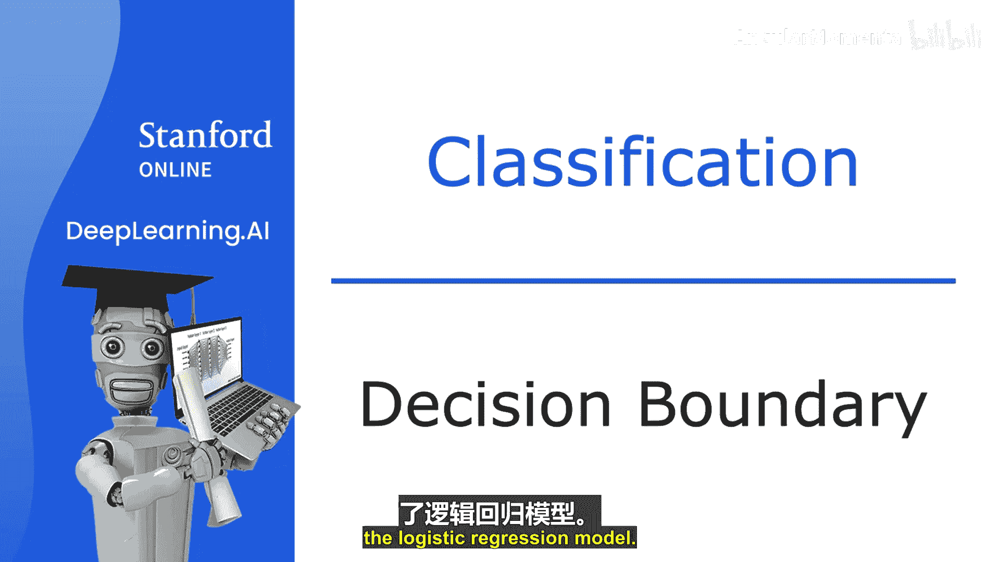
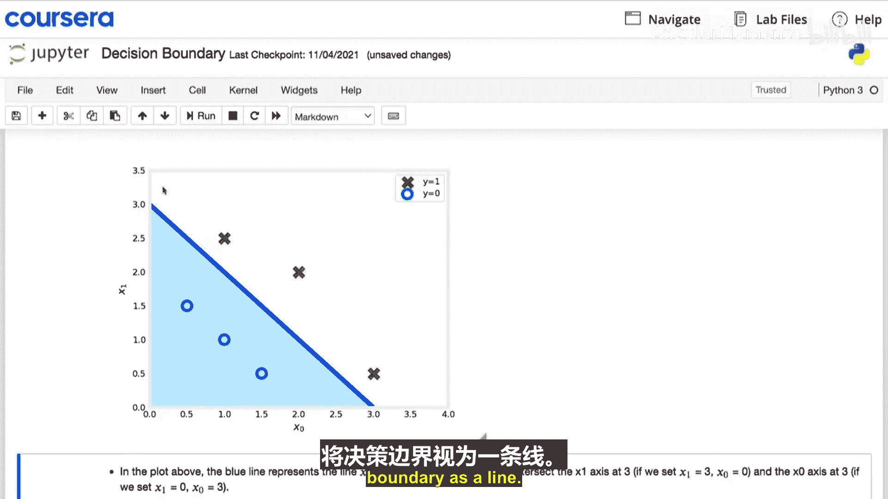
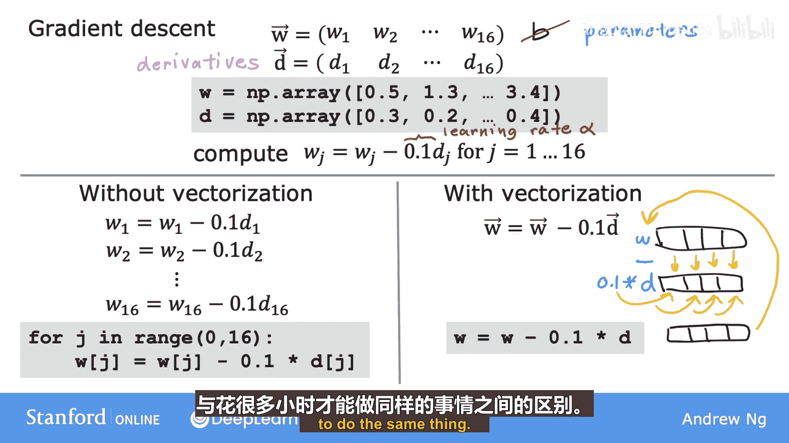
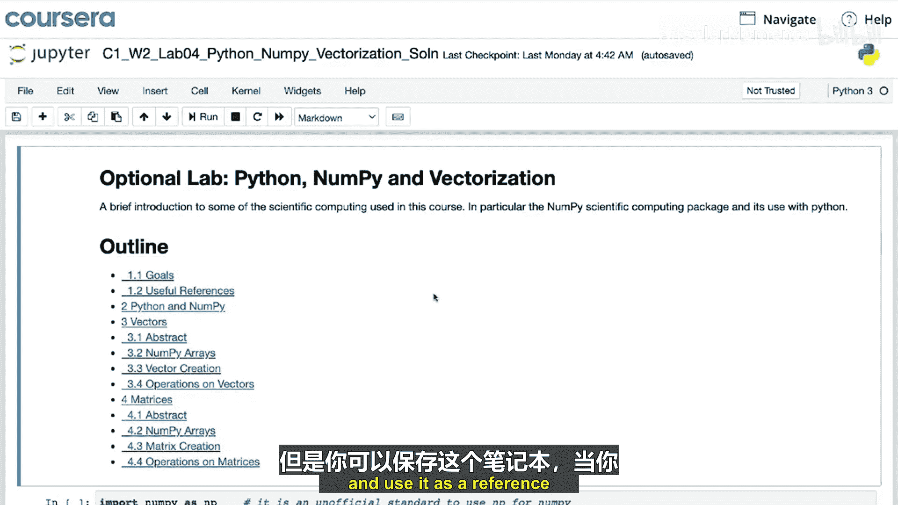

# 003：决策边界 🧠

在本节课中，我们将要学习逻辑回归模型中的**决策边界**概念。决策边界是理解模型如何进行分类预测的关键。通过它，我们可以直观地看到模型如何根据输入特征将数据划分为不同的类别。

---

## 逻辑回归模型回顾

上一节我们介绍了逻辑回归模型。现在，我们来看看决策边界，以便更好地理解逻辑回归是如何计算其预测的。

逻辑回归模型的输出计算分为两步：
1.  首先计算 **z**，公式为：
    **z = w · x + b**
2.  然后将 **sigmoid函数**（或称逻辑函数）**g** 应用于这个 **z** 值。

sigmoid函数的公式是：
**g(z) = 1 / (1 + e^{-z})**

因此，模型的最终输出 **f(x)** 可以表示为：
**f(x) = g(z) = g(w · x + b) = 1 / (1 + e^{-(w · x + b)})**

我们将其解释为在给定输入 **x** 和参数 **w, b** 的条件下，**y=1** 的概率。这个值可能像 0.7 或 0.3。

---

## 从概率到预测

那么，如何让学习算法预测 **y** 是 0 还是 1 呢？

一个常见的做法是设置一个阈值。通常选择 0.5 作为阈值：
*   如果 **f(x) ≥ 0.5**，则预测 **ŷ = 1**。
*   如果 **f(x) < 0.5**，则预测 **ŷ = 0**。

现在，让我们深入探讨模型何时会预测 1，即 **f(x) ≥ 0.5** 的条件。

由于 **f(x) = g(z)**，所以 **f(x) ≥ 0.5** 等价于 **g(z) ≥ 0.5**。

观察 sigmoid 函数的图像，**g(z) ≥ 0.5** 的条件是 **z ≥ 0**。

而 **z = w · x + b**，因此 **z ≥ 0** 的条件是 **w · x + b ≥ 0**。

**总结一下：**
*   当 **w · x + b ≥ 0** 时，模型预测 **ŷ = 1**。
*   当 **w · x + b < 0** 时，模型预测 **ŷ = 0**。

---

## 可视化决策边界

为了更好地理解模型如何进行预测，我们来看一个可视化例子。

假设有一个分类问题，包含两个特征 **x₁** 和 **x₂**。训练集中，红色十字（`+`）代表正例（y=1），蓝色圆圈（`o`）代表负例（y=0）。

逻辑回归模型使用函数 **f(x) = g(z)** 进行预测，其中 **z = w₁x₁ + w₂x₂ + b**。

假设本例中参数值为：**w₁ = 1, w₂ = 1, b = -3**。

我们关心的是 **w · x + b** 何时大于等于 0，何时小于 0。一个关键的分界线是 **w · x + b = 0** 的情况，这条线被称为**决策边界**。

对于上述参数值，决策边界方程为：
**x₁ + x₂ - 3 = 0**，即 **x₁ + x₂ = 3**。

这条线如下图所示（想象一条斜线）。如果特征点 **x** 落在这条线的右侧，逻辑回归预测为 1；落在左侧，则预测为 0。

我们刚刚可视化的是当参数为 (1, 1, -3) 时逻辑回归的决策边界。当然，如果选择不同的参数，决策边界将是另一条不同的直线。

---

## 更复杂的决策边界

现在，让我们看一个更复杂的例子，其中决策边界不再是直线。

和之前一样，十字代表 y=1，圆圈代表 y=0。

上周我们学习了在线性回归中使用多项式特征，在逻辑回归中同样可以这样做。

假设我们设置 **z = w₁x₁² + w₂x₂² + b**。通过将多项式特征引入逻辑回归，**f(x) = g(z)** 现在变成了 **g(这个表达式)**。

假设我们最终选择参数：**w₁ = 1, w₂ = 1, b = -1**。
那么 **z = 1*x₁² + 1*x₂² - 1**。

决策边界对应于 **z = 0** 的情况，即 **x₁² + x₂² = 1**。

在图上画出 **x₁² + x₂² = 1** 的曲线，结果是一个**圆形**。
*   当 **x₁² + x₂² ≥ 1**（圆外区域）时，预测 **y=1**。
*   当 **x₁² + x₂² < 1**（圆内区域）时，预测 **y=0**。

---

## 使用更高阶多项式

我们能得到比这更复杂的决策边界吗？当然可以。

通过使用更高阶的多项式项，例如：
**z = w₁x₁ + w₂x₂ + w₃x₁² + w₄x₁x₂ + w₅x₂²**

通过选择不同的参数，你可以得到更复杂的决策边界，例如：
*   一个**椭圆**。
*   或者更复杂的形状，可能看起来像某种特殊函数。

这是一个比我们之前看到的更复杂的决策边界例子。在这种逻辑回归的实现中，模型会预测这个形状内部为 y=1，外部为 y=0。

**因此，通过使用这些多项式特征，逻辑回归可以学习拟合相当复杂的数据，得到非常复杂的决策边界。**

**但请注意：** 如果你不使用任何这些高阶多项式，只使用 **x₁, x₂, x₃** 等原始特征，那么决策边界将始终是线性的，即一条直线。

---

## 总结

本节课中，我们一起学习了逻辑回归的**决策边界**。我们了解到：

1.  决策边界是模型用来区分不同预测类别的分界线，由 **w · x + b = 0** 定义。
2.  在简单情况下，决策边界是一条直线。
3.  通过引入**多项式特征**（如 x², x₁x₂），逻辑回归可以学习并形成**非线性决策边界**（如圆形、椭圆或更复杂的形状），从而能够拟合更复杂的数据模式。
4.  决策边界的具体形状完全由模型参数 **w** 和 **b** 决定。

理解决策边界有助于我们直观地把握逻辑回归模型的工作原理，以及它如何根据输入特征做出分类决策。在接下来的学习中，我们将探讨如何训练逻辑回归模型，即如何找到最优的参数 **w** 和 **b**。