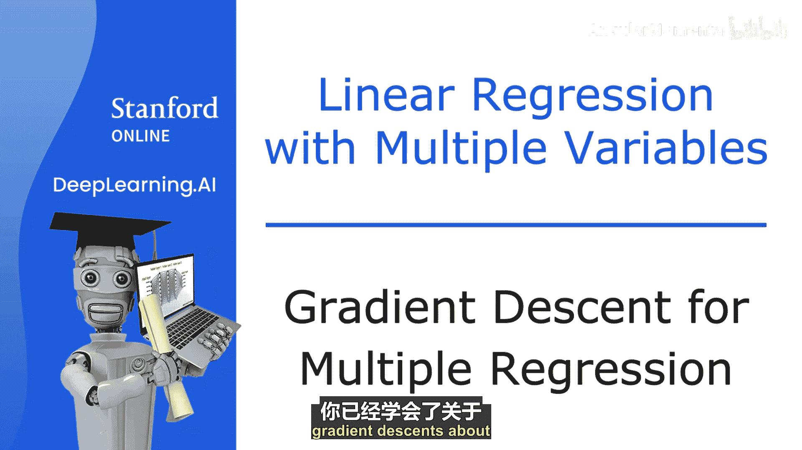
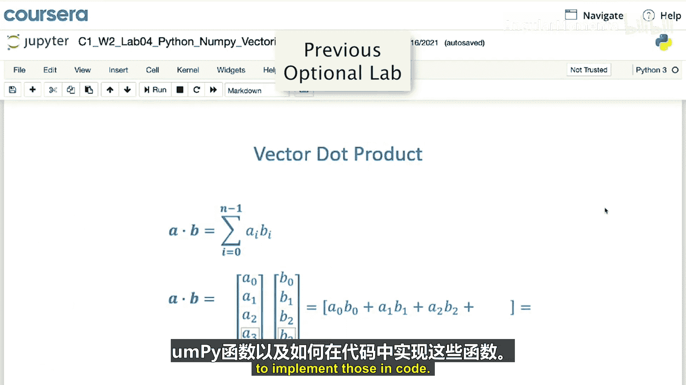

# 004：多元线性回归的梯度下降法

在本节课中，我们将学习如何将梯度下降法、多元线性回归和向量化的知识结合起来，实现多元线性回归的梯度下降法。

## 概述

上一节我们介绍了多元线性回归和向量化的概念。本节中，我们来看看如何利用向量化表示，高效地实现多元线性回归的梯度下降算法。

## 模型与参数的向量化表示

首先，我们快速回顾一下多元线性回归。使用之前的符号，我们有参数 W1 到 Wn 以及 B。与其将 W1 到 Wn 视为独立的参数，不如将它们收集到一个向量 **W** 中。这样，**W** 就是一个长度为 n 的向量。

因此，我们可以将模型的参数视为向量 **W** 和标量 B。之前定义的多元线性回归模型可以简洁地用向量符号表示为：

**公式**：`f_wb(x) = w · x + b`

这里的点号表示向量的点积运算。

## 代价函数的向量化表示

我们的代价函数原本定义为 J(W1, ..., Wn, B)。现在，我们可以将其视为以参数向量 **W** 和标量 B 为输入的函数，记作 J(**W**, B)。它接收一个向量和一个数字，并返回一个数字。

## 梯度下降的更新规则

梯度下降法需要反复更新每个参数。对于参数 Wj，更新规则为：

**公式**：`Wj := Wj - α * (∂J/∂Wj)`

其中，J 的参数是 W1 到 Wn 和 B，即 J(**W**, B)。

让我们看看在实现梯度下降时，特别是导数项，与单特征线性回归有何不同。

以下是单特征线性回归的梯度下降更新规则：

**公式**：
`w := w - α * (1/m) * Σ ( f_wb(x_i) - y_i ) * x_i`
`b := b - α * (1/m) * Σ ( f_wb(x_i) - y_i )`

对于具有 n 个特征（n ≥ 2）的多元线性回归，梯度下降的更新规则如下：

以下是更新参数 W1 到 Wn 的规则：

**公式**：
`W1 := W1 - α * (1/m) * Σ ( f_wb(x_i) - y_i ) * x_i1`
`W2 := W2 - α * (1/m) * Σ ( f_wb(x_i) - y_i ) * x_i2`
...
`Wn := Wn - α * (1/m) * Σ ( f_wb(x_i) - y_i ) * x_in`

以及更新参数 B 的规则：

**公式**：
`b := b - α * (1/m) * Σ ( f_wb(x_i) - y_i )`

这里，`x_ij` 表示第 i 个训练样本的第 j 个特征值。通过实现这些规则，你就得到了多元线性回归的梯度下降算法。

## 关于正规方程的补充说明

在结束本视频前，我们简要提一下求解线性回归参数 **W** 和 B 的另一种方法——正规方程。

梯度下降是用于最小化代价函数 J 以找到 **W** 和 B 的优秀方法。然而，存在另一种专门用于线性回归的算法，它不需要迭代过程，可以直接通过高级线性代数库一次性解出 **W** 和 B。

以下是正规方程法的一些特点：

*   **局限性**：与梯度下降不同，正规方程法不能推广到其他学习算法（如接下来要学的逻辑回归、神经网络等）。
*   **计算效率**：当特征数量 n 很大时，正规方程法可能非常慢。
*   **实践应用**：几乎不需要机器学习从业者自己实现正规方程。但一些成熟的机器学习库在背后可能会使用它来求解线性回归。

因此，如果你在面试中听到“正规方程”这个词，就知道它指的是这种方法。无需担心其具体细节，只需了解对于大多数学习算法（包括你自己实现线性回归），梯度下降通常是更优的选择。

## 代码实践

在紧随本视频的选修实验中，你将看到如何用代码定义多元回归模型、计算预测值 f(x) 和代价，并实现多元线性回归的梯度下降。实验将使用 Python 的 NumPy 库。如果代码看起来陌生，可以参考之前的选修实验，复习 NumPy 函数和向量化的代码实现。

## 总结

本节课中，我们一起学习了多元线性回归的梯度下降法。我们了解了如何用向量化形式表示模型和参数，推导了对应的梯度下降更新规则，并简要对比了梯度下降与正规方程法的异同。多元线性回归是当今世界上应用最广泛的学习算法之一。在接下来的视频中，我们将学习一些技巧（如特征选择和缩放、选择合适的学习率 α），以使算法工作得更好。