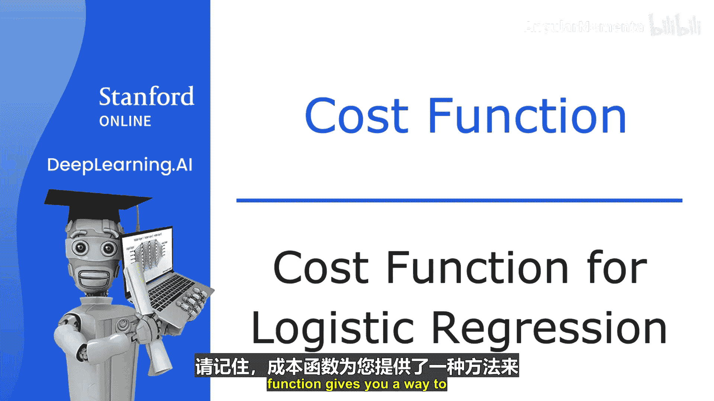
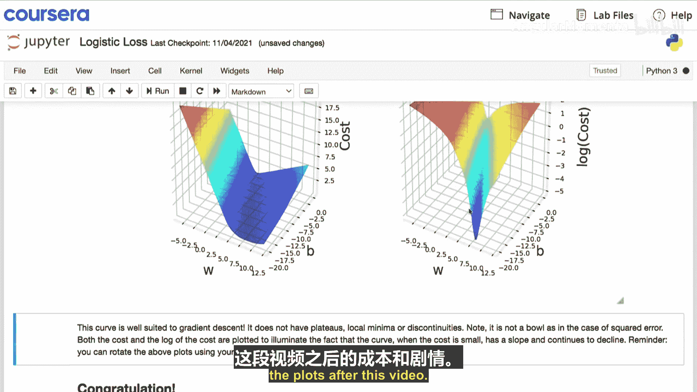
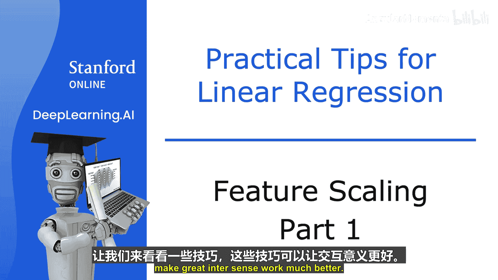
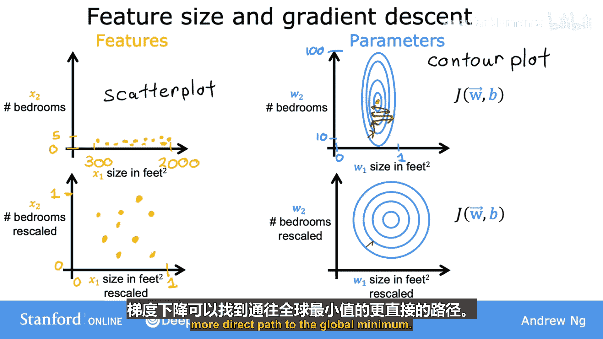
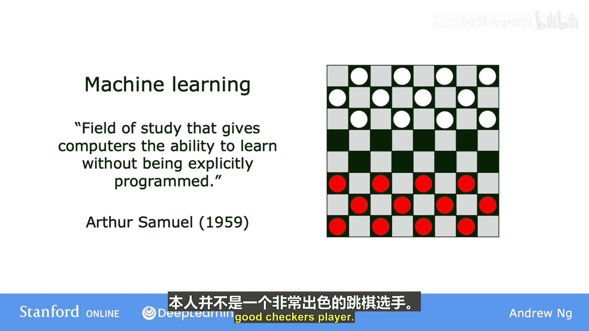
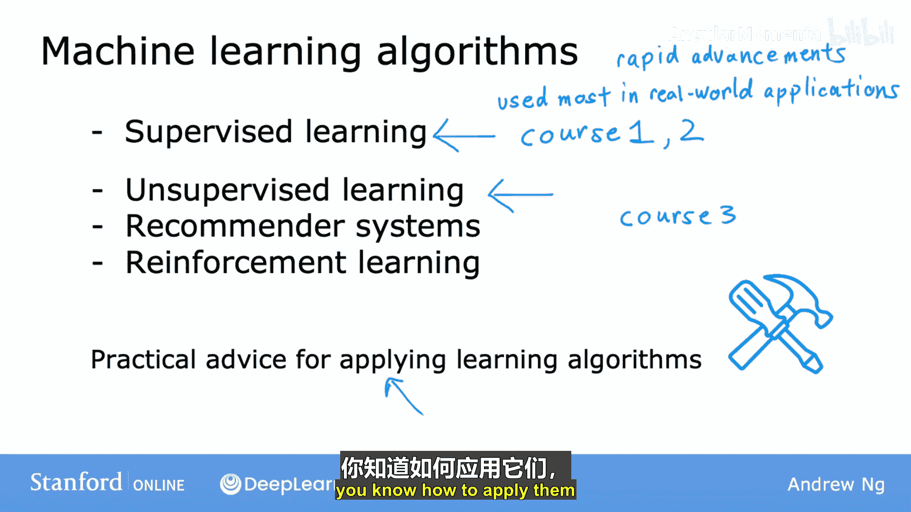

# 005：逻辑回归成本函数

在本节中，我们将探讨逻辑回归的成本函数。我们将了解为什么平方误差成本函数不适用于逻辑回归，并学习一个能确保梯度下降找到全局最优解的新成本函数。

## 概述

在之前的课程中，我们了解到成本函数是衡量模型参数与训练数据拟合程度的关键工具。对于线性回归，我们使用了平方误差成本函数，它具有良好的凸性，使得梯度下降能够可靠地收敛到全局最小值。然而，对于逻辑回归，平方误差成本函数会变成一个非凸函数，导致梯度下降可能陷入局部最小值。因此，我们需要为逻辑回归设计一个不同的成本函数。

## 平方误差成本函数的问题

线性回归的平方误差成本函数定义如下：

$$J(w,b) = \frac{1}{2m} \sum_{i=1}^{m} (f_{w,b}(x^{(i)}) - y^{(i)})^2$$

其中，$f_{w,b}(x) = wx + b$。这个函数的图像呈“碗状”，是一个凸函数。

然而，如果我们将其直接应用于逻辑回归，其中 $f_{w,b}(x) = \frac{1}{1 + e^{-(wx + b)}}$，成本函数的图像将变得“崎岖不平”，出现许多局部最小值。这种非凸性使得梯度下降算法难以找到全局最优解。

## 逻辑回归的损失函数

为了解决这个问题，我们为逻辑回归定义一个新的损失函数。损失函数衡量的是**单个训练样本**的误差。逻辑回归的损失函数定义如下：

- 如果真实标签 $y = 1$，则损失为：$L(f_{w,b}(x), y) = -\log(f_{w,b}(x))$
- 如果真实标签 $y = 0$，则损失为：$L(f_{w,b}(x), y) = -\log(1 - f_{w,b}(x))$

这个损失函数的设计具有直观的意义。让我们分别分析两种情况。

### 当 $y = 1$ 时

损失函数为 $-\log(f_{w,b}(x))$。由于逻辑回归的输出 $f$ 介于 0 和 1 之间，这个函数的图像如下：

- 当模型预测概率 $f$ 接近 1（即预测正确）时，损失值非常小，接近 0。
- 当模型预测概率 $f$ 较低（例如 0.1）而真实标签为 1 时，损失值会变得很大。

因此，这个损失函数鼓励模型在 $y=1$ 时做出接近 1 的预测。

### 当 $y = 0$ 时

损失函数为 $-\log(1 - f_{w,b}(x))$。其图像如下：

- 当模型预测概率 $f$ 接近 0（即预测正确）时，损失值非常小，接近 0。
- 当模型预测概率 $f$ 较高（例如 0.9）而真实标签为 0 时，损失值会变得非常大，甚至趋近于无穷大。

因此，这个损失函数鼓励模型在 $y=0$ 时做出接近 0 的预测。

## 逻辑回归的成本函数

基于上述损失函数，我们可以定义逻辑回归的**整体成本函数**。成本函数是数据集中所有训练样本损失的平均值：

$$J(w,b) = \frac{1}{m} \sum_{i=1}^{m} L(f_{w,b}(x^{(i)}), y^{(i)})$$

其中，$L$ 就是上面定义的逻辑回归损失函数。

这个新的成本函数 $J(w, b)$ 被证明是凸函数。这意味着它的图像像一个光滑的碗，没有局部最小值，只有唯一的全局最小值。因此，使用梯度下降算法可以保证收敛到这个全局最优解。

## 总结

在本节中，我们一起学习了逻辑回归的成本函数。我们首先看到了为什么线性回归的平方误差成本函数不适用于逻辑回归——因为它会导致非凸的成本曲面，使优化变得困难。接着，我们为逻辑回归引入了一个新的损失函数，它根据真实标签 $y$ 的值（0 或 1）分别给出了 $-\log(f)$ 和 $-\log(1-f)$ 的形式。这个设计使得模型在预测错误时受到严厉惩罚，从而被“推动”做出更准确的预测。最后，通过平均所有训练样本的损失，我们得到了逻辑回归的凸成本函数，这为使用梯度下降算法高效地找到最佳参数 $w$ 和 $b$ 奠定了基础。

在接下来的内容中，我们将看到如何简化这个成本函数的写法，并开始应用梯度下降来训练逻辑回归模型。