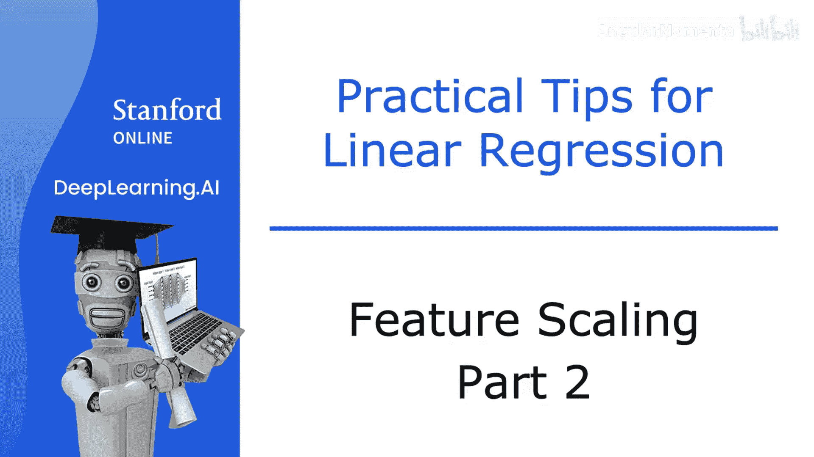
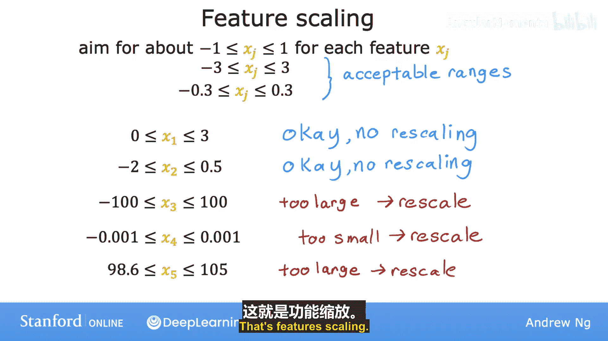
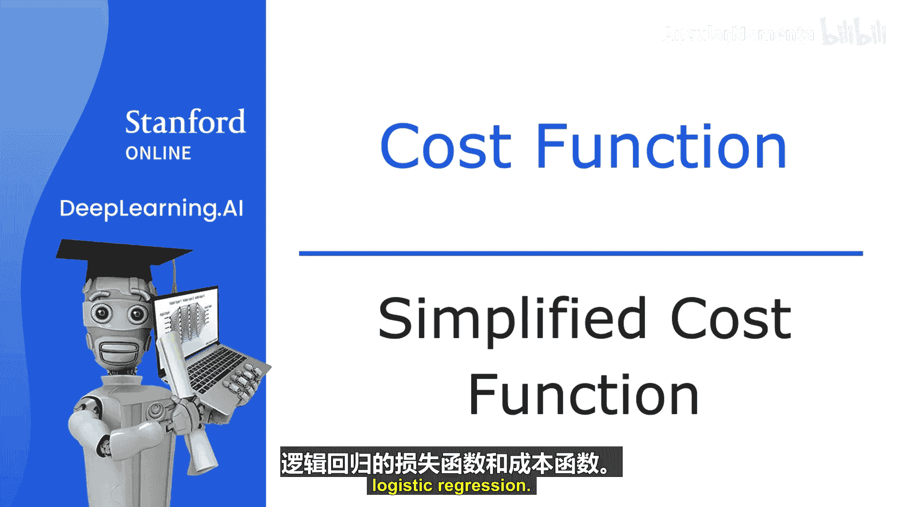
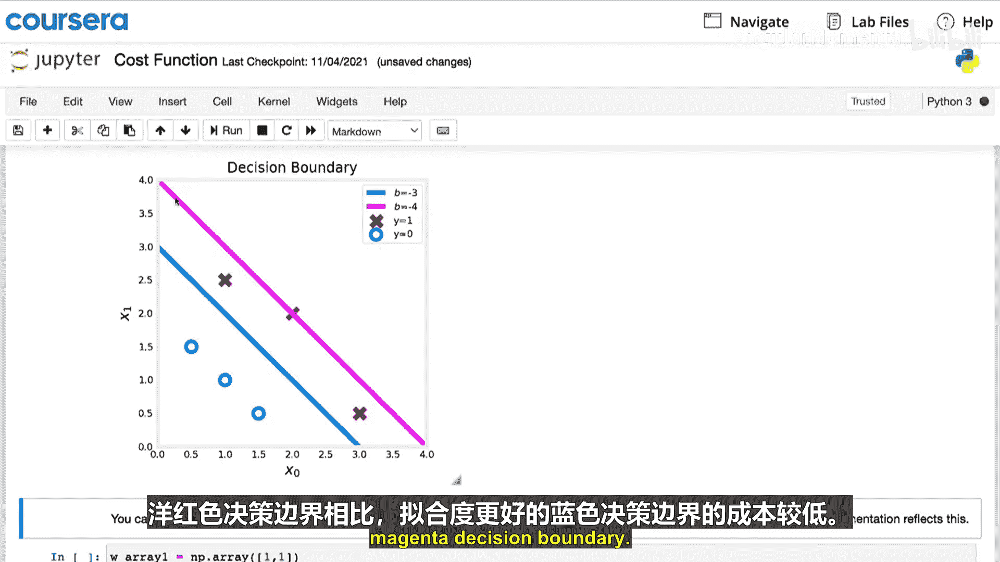
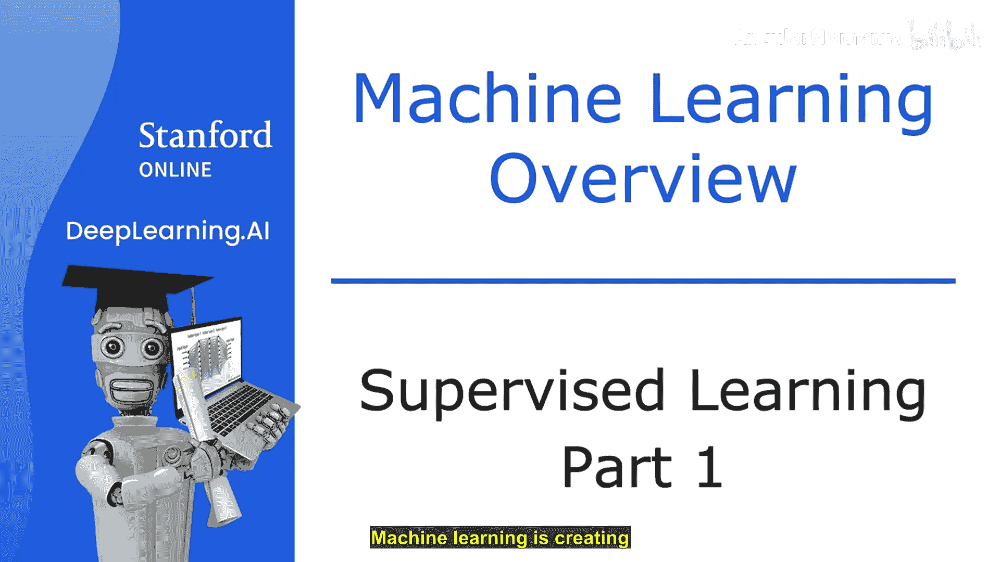
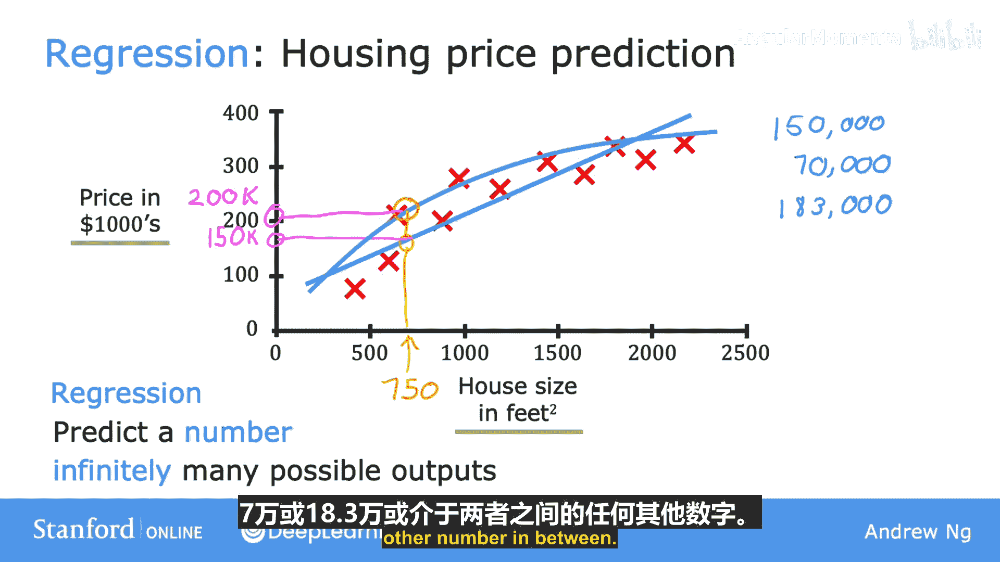

# 006：特征缩放 - 第二部分

## 📊 概述
在本节中，我们将学习如何通过特征缩放，将取值范围差异很大的特征调整到可比的范围，从而加速梯度下降算法的收敛。我们将介绍三种具体的缩放方法。

上一节我们介绍了特征缩放的必要性，本节中我们来看看如何具体实现特征缩放。

## 🔧 实现特征缩放的方法
特征缩放的目标是让所有特征值处于相近的数值范围。以下是三种常见的方法：

### 1. 除以最大值法
这是最简单的方法。对于每个特征，将其所有值除以该特征在数据集中的最大值。

**公式**：
- 缩放后的 x1 = 原始 x1 / max(x1)
- 缩放后的 x2 = 原始 x2 / max(x2)

例如，如果特征 x1 的范围是 3 到 2000，那么缩放后的 x1 范围将变为 0.0015 到 1。如果特征 x2 的范围是 0 到 5，缩放后的 x2 范围将变为 0 到 1。

### 2. 均值归一化法
这种方法不仅缩放特征，还将其中心调整到零附近。

**公式**：
- 归一化后的 x1 = (原始 x1 - μ1) / (max(x1) - min(x1))
- 归一化后的 x2 = (原始 x2 - μ2) / (max(x2) - min(x2))

其中，μ 代表该特征在训练集中的平均值（均值）。例如，如果 x1 的平均值 μ1 是 600，最大值是 2000，最小值是 300，那么归一化后的 x1 范围大约在 -0.18 到 0.82 之间。

### 3. Z-score 标准化法
这是最常用的方法之一，它根据特征的均值和标准差进行缩放。

**公式**：
- 标准化后的 x1 = (原始 x1 - μ1) / σ1
- 标准化后的 x2 = (原始 x2 - μ2) / σ2

其中，σ（西格玛）代表该特征的标准差。标准差衡量了数据分布的离散程度。使用此方法后，特征值通常会分布在 0 附近。

## 🎯 特征缩放的经验法则
在进行特征缩放时，可以遵循以下指导原则：

以下是判断特征是否需要缩放以及如何调整的参考：
*   理想情况下，让每个特征值大致落在 **-1 到 +1** 的范围内。
*   这个范围可以稍宽松。如果特征值在 **-3 到 +3** 或 **-0.3 到 +0.3** 之间，通常也是可以接受的。
*   如果某个特征的值范围非常大（例如 **-100 到 +100**）或非常小（例如 **-0.001 到 +0.001**），那么进行缩放很可能对梯度下降有帮助。
*   即使特征值看似“正常”（例如体温的 **98.6 到 105 华氏度**），但由于其绝对值（约100）远大于其他已缩放的特征，进行缩放通常也能提升性能。

几乎在任何情况下，进行特征缩放都没有坏处。当不确定时，建议实施特征缩放。这个小技巧通常能显著加快梯度下降的速度。

## 📝 总结
本节课中我们一起学习了三种特征缩放的具体方法：除以最大值法、均值归一化法和 Z-score 标准化法。我们还了解了判断特征是否需要缩放的实用经验法则。正确使用特征缩放是优化机器学习模型训练过程的重要一步。

---

# 监督式机器学习：回归与分类：p06-02_02：逻辑回归的简化损失函数

## 📊 概述
在本节中，我们将学习逻辑回归损失函数的一个更简洁的写法。这个简化形式在后续实现梯度下降算法拟合模型参数时，会让代码编写变得更加简单。

上一节我们介绍了逻辑回归的原始损失函数，本节中我们来看看如何将其合并为一个更简洁的表达式。

## ✍️ 简化损失函数
回顾一下，对于二分类问题（标签 y 只能是 0 或 1），我们之前的损失函数是根据 y 的值分情况定义的。

**原始损失函数**：
*   如果 y = 1，损失 = -log(f(x))
*   如果 y = 0，损失 = -log(1 - f(x))

我们可以将这两个公式合并为一个统一的表达式：

**简化损失函数**：
`损失 = -[y * log(f(x)) + (1 - y) * log(1 - f(x))]`

让我们验证这个公式的等价性：
*   当 **y = 1** 时，公式变为 `-[1 * log(f(x)) + 0 * log(1 - f(x))] = -log(f(x))`，与原始定义一致。
*   当 **y = 0** 时，公式变为 `-[0 * log(f(x)) + 1 * log(1 - f(x))] = -log(1 - f(x))`，也与原始定义一致。

因此，这个单行表达式完全等价于之前分情况写的两个公式。

## 📈 基于简化损失函数的成本函数
成本函数 J 是训练集上所有样本损失的平均值。

**简化成本函数公式**：
`J(w, b) = -(1/m) * Σ [y_i * log(f(x_i)) + (1 - y_i) * log(1 - f(x_i))]` （对 i 从 1 到 m 求和）

这个公式是用于训练逻辑回归模型最常用的成本函数。

## 💡 关于成本函数选择的说明
你可能会问，为什么选择这个特定的函数？是否存在其他可用的成本函数？
这个特定的成本函数源于统计学中的 **最大似然估计** 原理，它是一种为不同模型高效寻找参数的统计思想。
这个成本函数有一个很好的特性：它是 **凸函数**，这保证了梯度下降等优化算法能够找到全局最优解（或接近最优的解）。

接下来的可选实验将展示如何在代码中实现这个逻辑回归成本函数，并演示不同参数选择如何导致不同的成本计算结果。你可以看到，拟合得更好的决策边界（图中蓝色线）对应的成本值低于拟合较差的决策边界（图中洋红色线）。

## 📝 总结
本节课中我们一起学习了逻辑回归损失函数的一个简洁、统一的表达式，并由此推导出了标准的成本函数。理解这个简化形式将为后续实现梯度下降算法打下坚实的基础。准备好这个简化的成本函数后，我们就可以开始将其应用于梯度下降算法了。

---

# 监督式机器学习：回归与分类：p01-01_01：监督学习介绍

## 🤖 概述
在本节课中，我们将要学习什么是监督学习。它是目前创造绝大多数经济价值的机器学习类型，其核心思想是让算法从包含“正确答案”的示例中学习。

## 🔍 什么是监督学习？
监督式机器学习，通常简称为监督学习，指的是学习从输入 X 到输出 Y（或从输入到输出）映射关系的算法。

监督学习的关键特征是：你为学习算法提供用于学习的示例，这些示例包含了 **正确答案**。这里的“正确答案”指的是给定输入 X 所对应的正确标签 Y。

正是通过观察这些成对的输入 X 和期望的输出标签 Y，学习算法最终能够学会仅接收输入（而不需要输出标签），并给出一个相对准确的输出预测或猜测。

## 🌐 监督学习应用实例
以下是监督学习在不同领域中的应用：

以下是监督学习的一些常见例子：
*   **垃圾邮件过滤**：输入是一封电子邮件，输出是判断这封邮件是“垃圾邮件”还是“非垃圾邮件”。
*   **语音识别**：输入是一段音频剪辑，算法的任务是输出对应的文字转录。
*   **机器翻译**：输入是英语，输出是对应的西班牙语、阿拉伯语、中文、日语或其他语言的翻译。
*   **在线广告**：这是目前最盈利的监督学习形式之一。算法输入关于广告的信息和关于你的信息，然后尝试预测你是否会点击那个广告。
*   **自动驾驶**：学习算法输入图像和其他传感器（如雷达）的信息，然后输出其他车辆的位置，以便自动驾驶汽车能安全行驶。
*   **工业视觉检测**：算法输入一张刚下生产线的产品（如手机）图片，输出判断产品是否存在划痕、凹痕或其他缺陷。

在所有上述应用中，你首先需要用输入 X 和正确答案（即标签 Y）的示例来训练你的模型。在模型从这些输入-输出对中学习之后，它就可以接收一个全新的、从未见过的输入 X，并尝试产生相应的合适输出 Y。

## 📊 深入示例：房价预测
让我们更深入地看一个具体例子。假设你想根据房屋面积预测房价。

你收集了一些数据并将其绘制出来。横轴是房屋面积（平方英尺），纵轴是房屋价格（千美元）。假设一位朋友想知道他们 750 平方英尺的房子的价格，学习算法如何帮助你？

一种方法是让算法给数据 **拟合一条直线**。从直线上读数，你朋友的房子售价可能约为 15万美元。但拟合直线并不是唯一可用的算法。例如，你可能会决定 **拟合一条曲线**（一个比直线更复杂的函数）效果更好。如果这样做并在此进行预测，那么你朋友的房子售价可能更接近 20万美元。

在本课程后面，你将学习如何系统地决定是拟合直线、曲线还是其他更复杂的函数来匹配数据。

这个幻灯片中的例子就是监督学习，因为我们给算法提供了一个数据集，其中每个数据点（图表上的每个房子）都给出了所谓的“正确答案”，即标签或正确价格 Y。学习算法的任务是产生更多这样的正确答案，特别是预测其他类似房屋的可能价格。

## 📈 回归与分类
为了定义更多术语，这种房价预测是一种特定类型的监督学习，称为 **回归**。回归意味着我们试图从无限多的可能数字中预测一个数字，例如我们例子中的房价，可能是15万、17万或18.3万等。

所以，监督学习就是学习输入到输出（X 到 Y）的映射。在本视频中，你看到了一个回归的例子，其任务是预测一个数字。但还有第二种主要类型的监督学习问题，称为 **分类**，我们将在下一个视频中探讨其含义。

## 📝 总结
本节课中我们一起学习了监督学习的基本概念：算法通过带有标签（正确答案）的训练数据学习输入与输出之间的映射关系。我们了解了其广泛的应用，并通过房价预测的例子深入了解了回归这一种监督学习任务。