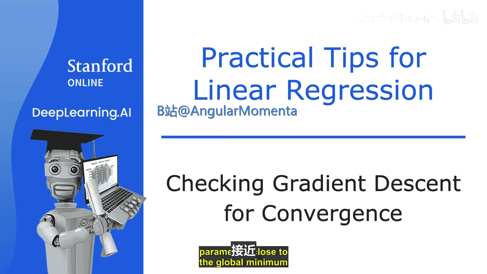
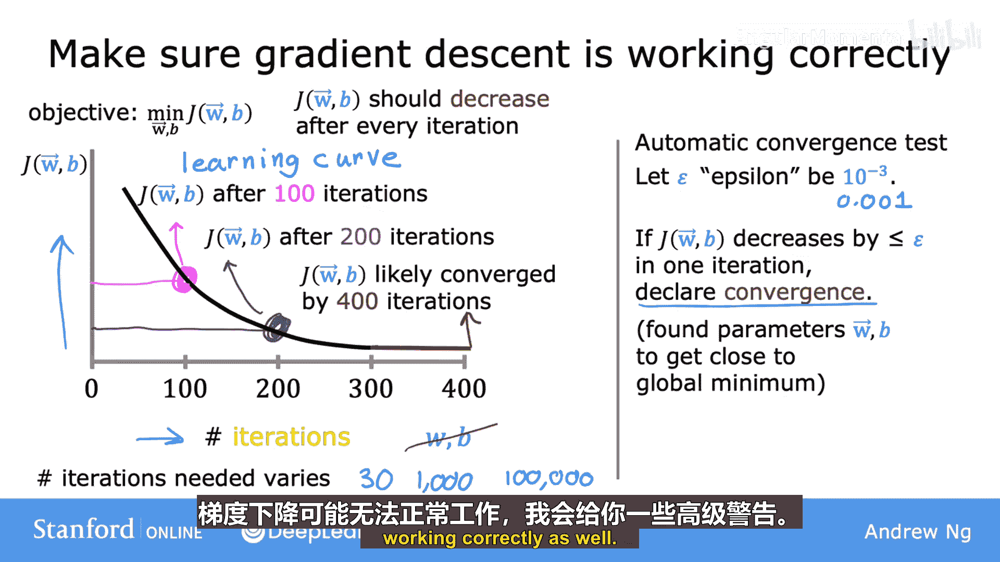
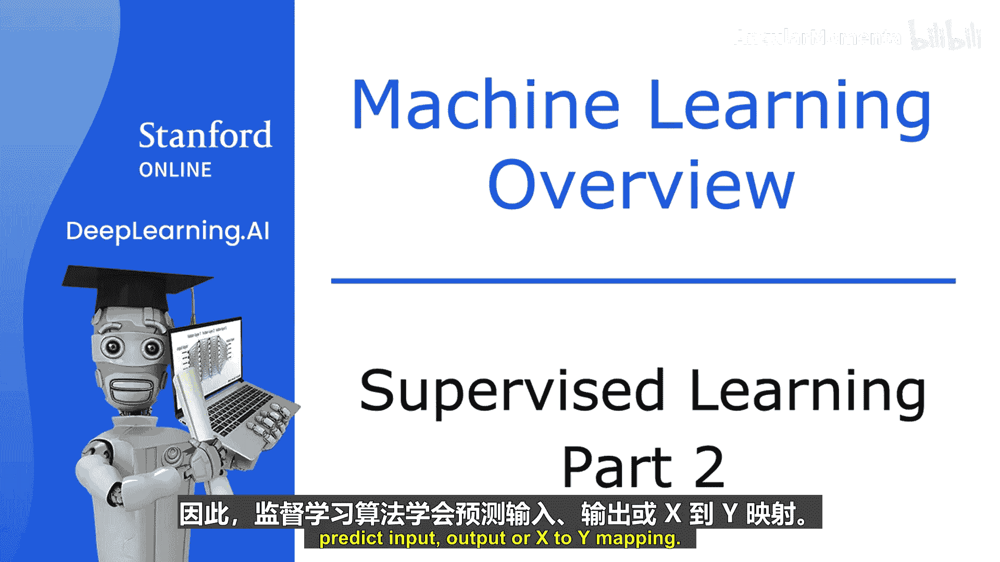
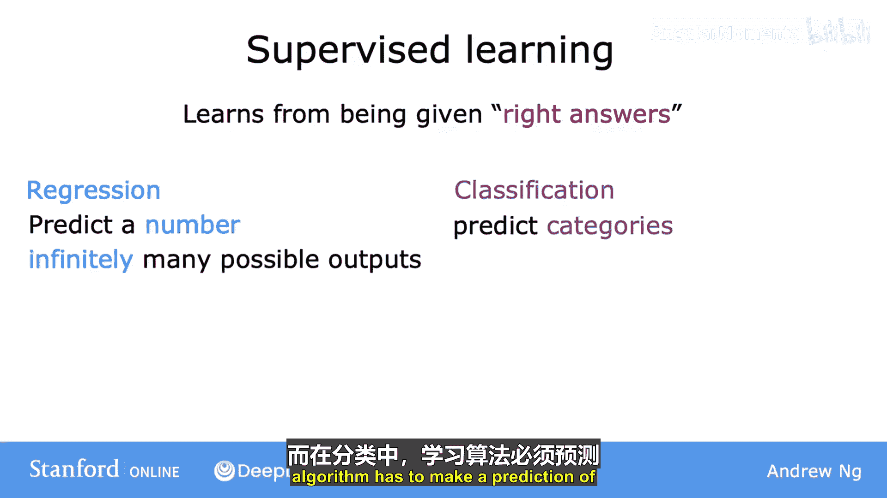

# 007：检查梯度下降收敛性 🎯

在本节课中，我们将学习如何判断梯度下降算法是否正在收敛，即它是否正在帮助我们找到接近成本函数全局最小值的参数。理解这一点对于确保模型训练有效至关重要。

## 梯度下降与学习曲线 📉

上一节我们介绍了梯度下降的基本原理，本节中我们来看看如何监控其运行过程。梯度下降的目标是找到参数 **W** 和 **B**，以最小化成本函数 **J**。

为了确保梯度下降正常工作，一个常见的做法是绘制成本函数 **J** 随迭代次数变化的曲线。这里的迭代次数指的是参数 **W** 和 **B** 每次同步更新后。

*   横轴：梯度下降的迭代次数。
*   纵轴：当前迭代后，使用参数 **W** 和 **B** 计算出的训练集成本 **J** 的值。

这种曲线也被称为**学习曲线**。通过观察这条曲线，你可以看到每次迭代后成本 **J** 的变化情况。

## 如何解读学习曲线 📊

以下是判断梯度下降是否收敛的关键观察点：

1.  **成本应持续下降**：如果梯度下降工作正常，成本 **J** 应该在每次迭代后都下降。如果 **J** 在某一迭代后反而增加，这通常意味着学习率 **α** 设置得太大，或者代码中存在错误。
2.  **识别收敛点**：随着迭代进行，成本 **J** 的下降速度会变慢。当曲线变得平缓，**J** 值不再显著下降时，就表明梯度下降已经基本收敛。

不同的应用场景，梯度下降达到收敛所需的迭代次数差异很大，可能从30次到10万次不等。因此，绘制学习曲线是判断何时停止训练的有效方法。

## 自动收敛测试 ⚙️

除了观察曲线，还可以使用自动收敛测试。其核心思想是设定一个很小的阈值 **ε**（例如 0.001）。

**公式**：如果某一次迭代中，成本 **J** 的减少量小于 **ε**，则可以认为已经到达曲线的平缓部分，并宣布收敛。

然而，在实践中，选择合适的 **ε** 值可能比较困难。因此，通常更推荐通过直接观察学习曲线来判断收敛情况。

## 从回归到分类 🔄

在上一节，我们了解了回归算法，它预测的是无限可能数字中的一个具体数值。现在，让我们来看看监督学习的第二种主要类型：**分类算法**。

分类算法预测的是**类别**。类别是一个有限的、离散的可能输出集合。

以乳腺癌检测为例：
*   **输入**：肿瘤大小（可能还包括患者年龄、细胞均匀度等更多特征）。
*   **输出**：预测肿瘤是**良性**（类别 0）还是**恶性**（类别 1）。

与回归预测任意数字（如房价 50.25 万）不同，分类只预测少数几个预定义的类别（如 0 或 1，猫或狗）。即使类别用数字表示（0, 1, 2），它们代表的也是不同的标签，而非连续数值。

当有多个输入特征（如肿瘤大小和患者年龄）时，学习算法会尝试在特征空间中找到一个**决策边界**，来区分不同的类别。

## 总结 🏁

本节课中我们一起学习了：
1.  **监控梯度下降**：通过绘制**学习曲线**（成本 **J** 随迭代次数的变化图）来判断算法是否收敛。正常情况曲线应持续下降并最终趋于平缓。
2.  **理解分类**：认识了监督学习的另一大分支——**分类**。它与回归的关键区别在于，分类预测的是有限的类别，而回归预测的是连续的数值。

你已经掌握了监督学习（包括回归与分类）的核心概念。接下来，我们将探索机器学习的第二种主要类型：**无监督学习**。