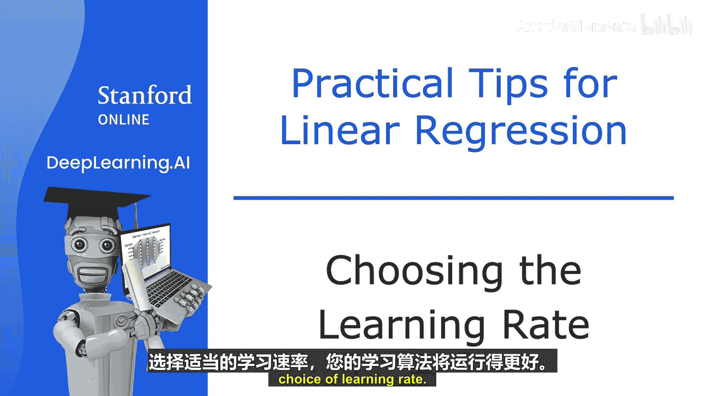
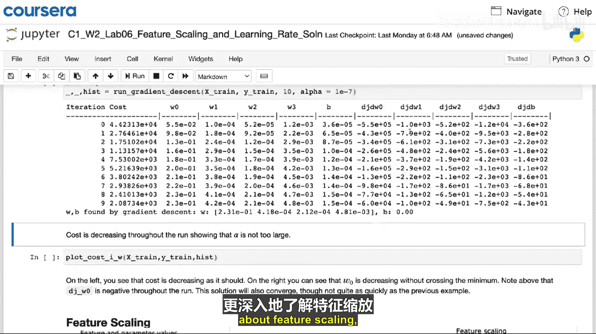
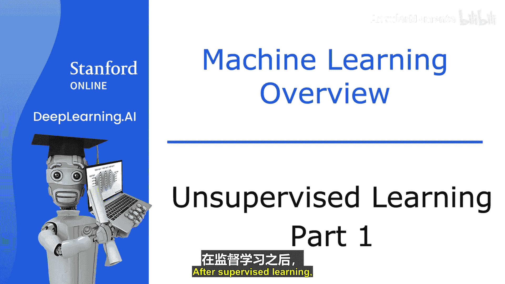
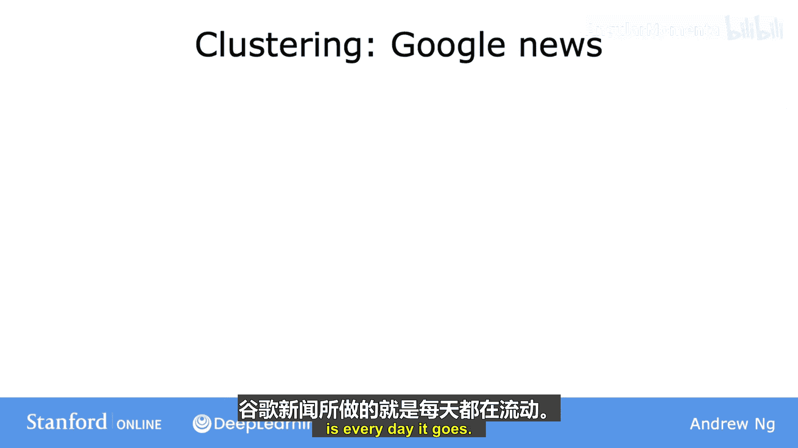
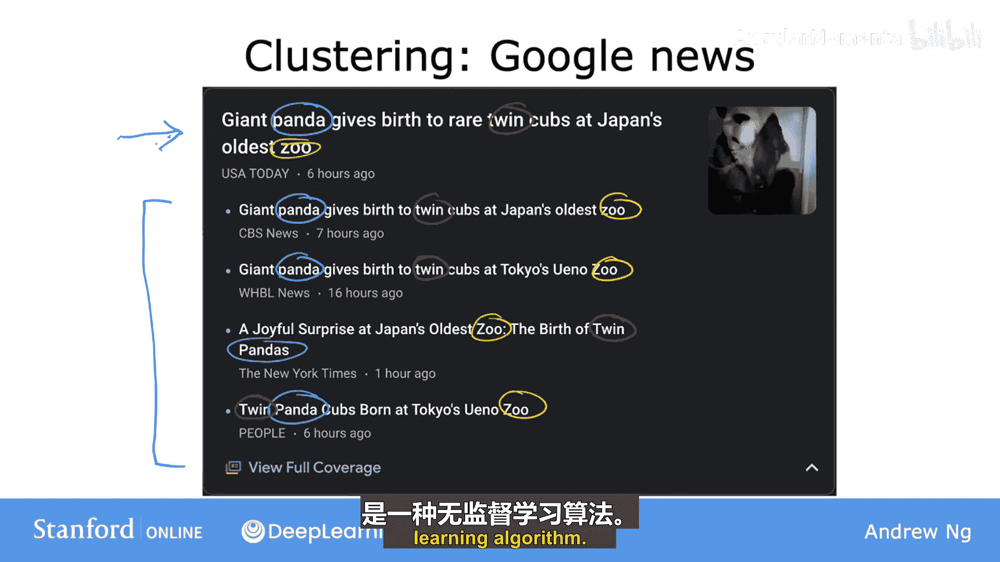
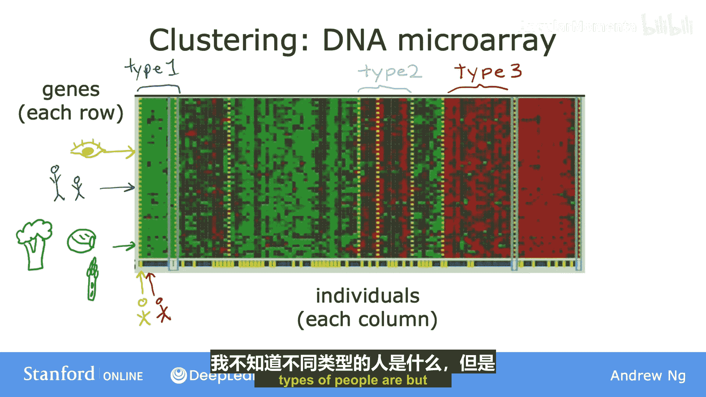
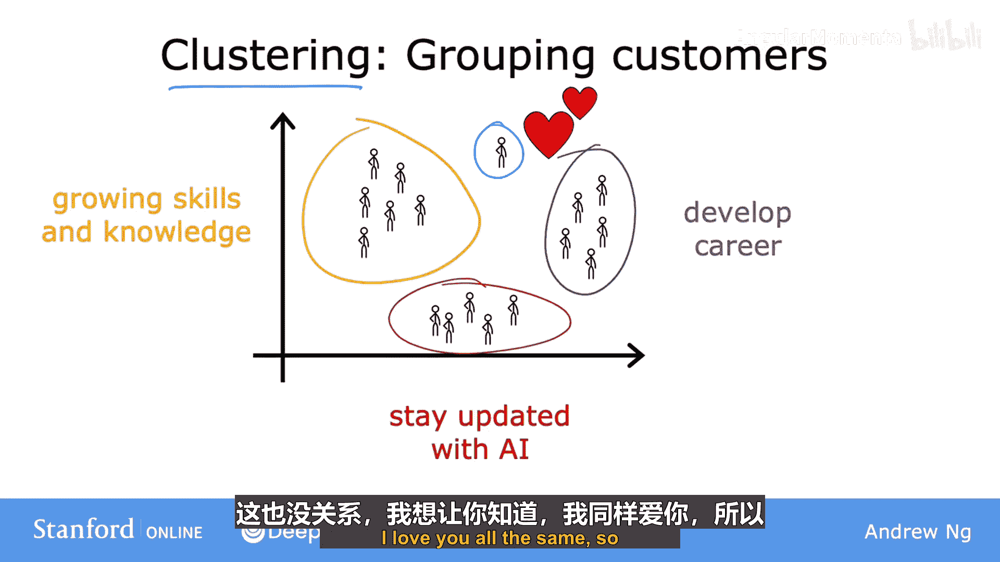

# 008：选择学习率 📈

在本节中，我们将学习如何为梯度下降算法选择一个合适的学习率。学习率是影响算法性能的关键参数，选择不当会导致训练缓慢甚至失败。



## 学习率的重要性

梯度下降算法的性能很大程度上取决于学习率的选择。如果学习率太小，算法收敛会非常缓慢。如果学习率太大，算法可能无法收敛，甚至导致成本函数值发散。

## 学习率过大的表现

以下是判断学习率是否过大的方法。如果你绘制成本函数随迭代次数的变化曲线，发现成本值有时上升有时下降，这通常表明梯度下降没有正常工作。这可能是代码中存在错误，或者更常见的是，学习率设置得过大。

下图展示了学习率过大时可能出现的情况：


纵轴代表成本函数 **J**，横轴代表一个参数，例如 **w1**。如果学习率过大，更新步骤可能会越过最小值点，导致成本值在最小值附近震荡，有时反而上升。要解决这个问题，需要使用更小的学习率，使更新步骤能稳定地朝向最小值点下降。

有时，你可能会看到成本函数在每次迭代后持续上升，如下面的曲线所示。这同样可能是由于学习率过大，可以通过选择更小的学习率来解决。但这也可能是代码中存在错误的一个迹象。例如，如果错误地将参数更新写成了加法形式：
```python
w1 = w1 + alpha * derivative_term
```
这会导致成本持续增加，因为加法使参数远离了最小值。正确的更新公式应使用减法：
```python
w1 = w1 - alpha * derivative_term
```

## 调试技巧：使用极小学习率

一个验证梯度下降实现是否正确的重要调试技巧是：使用一个足够小的学习率时，成本函数应该在每次迭代后都下降。

如果梯度下降不工作，一个常用的方法是先将学习率 **alpha** 设置为一个非常小的值，观察成本是否在每次迭代中都下降。如果即使使用极小的 **alpha**，成本 **J** 仍然不是每次迭代都下降（有时反而上升），那么通常意味着代码中存在错误。

请注意，将 **alpha** 设置得非常小仅用于调试目的。在实际训练模型时，极小的学习率并不是最高效的选择。

## 学习率过小的问题

一个重要的权衡是，如果学习率太小，梯度下降可能需要非常多的迭代次数才能收敛，导致训练时间过长。

## 如何选择合适的学习率

在实际运行梯度下降时，我通常会尝试一个范围的学习率值。例如，我可能从 0.001 开始尝试，然后尝试 10 倍于此的值，如 0.01 和 0.1。

对于每个 **alpha** 值，运行梯度下降少量迭代次数，并绘制成本函数 **J** 随迭代次数的变化曲线。在尝试了几个不同的值后，选择那个能使成本快速且持续下降的 **alpha** 值。



我个人的做法是尝试一个按比例递增的范围。例如，在尝试 0.001 后，将学习率增加到 0.003（大约是 3 倍），然后再尝试 0.01（再次大约是 0.003 的 3 倍）。通过这种方式，我尝试一系列值，直到找到一个过小的值和一个过大的值，然后选择略小于最大合理值的那个学习率。这通常能为我的模型提供一个良好的学习率。

## 实践与总结

在接下来的可选实验中，你可以查看特征缩放的代码实现，并观察不同学习率 **alpha** 的选择如何导致模型训练效果更好或更差。希望你通过调整 **alpha** 值并观察不同选择的结果，获得更多乐趣和直观理解。




选择合适的学习率是训练许多学习算法的重要环节。希望本视频能让你对不同选择有直观理解，并学会如何为 **alpha** 选取一个好值。

---

# 监督式机器学习：回归与分类：9：无监督学习介绍 🧩

上一节我们介绍了如何选择学习率来优化模型训练。现在，让我们转向机器学习的另一个重要领域。在监督学习之后，应用最广泛的机器学习形式是无监督学习。本节我们将探讨无监督学习的含义。


我们已经讨论过监督学习，本视频是关于无监督学习的。但不要被“无监督”这个名字误导，我认为无监督学习同样非常强大。

## 监督学习 vs. 无监督学习

回顾监督学习，在分类问题中，每个输入样本都关联着一个输出标签 **Y**，例如用圆圈和叉号表示的良性或恶性。而在无监督学习中，我们得到的数据没有关联任何输出标签 **Y**。



假设你获得了关于患者肿瘤大小和年龄的数据，但没有给出肿瘤是良性还是恶性的标签。因此，数据看起来像右边这样。我们没有被要求诊断肿瘤的性质，因为数据集中没有提供任何标签 **Y**。相反，我们的任务是在数据中发现一些结构、模式或有趣的东西。这就是无监督学习。

我们称之为“无监督”，因为我们并非试图监督算法为每个输入给出所谓的“正确答案”。相反，我们要求算法自行找出数据中有趣的内容或存在的模式与结构。

## 聚类算法示例

对于上述特定数据，一个无监督学习算法可能会决定数据可以分配到两个不同的组或集群中。因此，它可能认为这里有一个集群（一组数据点），那里有另一个集群。这是一种特定类型的无监督学习，称为**聚类算法**，因为它将未标记的数据放入不同的集群中。

聚类算法在许多应用中被使用。以下是几个例子：



### 1. 谷歌新闻

谷歌新闻每天会浏览互联网上的数十万篇新闻文章，并将相关的故事分组在一起。例如，下图是谷歌新闻的一个示例，顶部文章的标题是“日本动物园大熊猫产下双胞胎”。你可能会注意到，在这篇文章下方是其他相关的文章。


仅从头条新闻中，你或许就能猜到聚类算法在做什么。注意，“panda”（熊猫）这个词出现在这里、这里、这里和这里。“twin”（双胞胎）和“zoo”（动物园）也出现在所有这些文章中。因此，聚类算法正在从当天互联网上数十万篇新闻文章中，找出那些提及相似词汇的文章，并将它们分组到集群中。

这很酷的一点是，这个聚类算法能自行判断哪些词汇表明某些文章属于同一组。我的意思是，并没有谷歌新闻的员工告诉算法去寻找包含“panda”、“twin”和“zoo”这些词的文章并把它们放在同一个集群。新闻主题每天都在变化，有如此多的新闻报道，人工为所有新闻主题每天做这件事是不可行的。相反，算法必须在没有监督的情况下，自行找出今天新闻文章的集群。😊 因此，这种聚类算法是一种无监督学习算法。

### 2. DNA微阵列数据聚类

这个图像展示了DNA微阵列数据的图片。这些看起来像微小的电子表格网格，每一列代表一个人的基因或DNA活动。每一行代表一个特定的基因。研究人员可以运行聚类算法，将个体分组到不同的类别或不同类型的人群中，例如类型1、类型2、类型3。




这是无监督学习，因为我们没有预先告诉算法存在具有某些特征的“类型1”人或“类型2”人。相反，我们说：这里有一堆数据，我不知道不同类型的人在哪里，但你能自动在数据中找到结构，并自动找出主要的个体类型吗？由于我们没有预先为算法提供示例的正确答案，所以这是无监督学习。

### 3. 客户市场细分

许多公司拥有庞大的客户信息数据库。给定这些数据，你能自动将客户分组到不同的市场细分中，以便更有效地服务他们吗？

具体来说，DeepLearning.AI团队进行了一些研究，以更好地理解我们的社区，以及为什么不同的个体会参加这些课程、订阅每周简报或参加我们的活动。通过运行聚类（即市场细分），我们发现了几组不同的个体：
*   一组的主要动机是寻求知识以增长技能。
*   第二组的主要动机是寻找发展职业的途径。
*   还有一组希望了解AI如何影响他们的工作领域。



## 本节总结


本节课中，我们一起学习了无监督学习的基本概念。总结来说，**聚类算法**作为一种无监督学习算法，接收没有标签的数据，并尝试自动将它们分组到集群中。所以，也许下次你看到或想到熊猫时，也会联想到聚类。

除了聚类，还有其他类型的无监督学习算法。让我们在下一个视频中看看其他一些无监督学习算法。