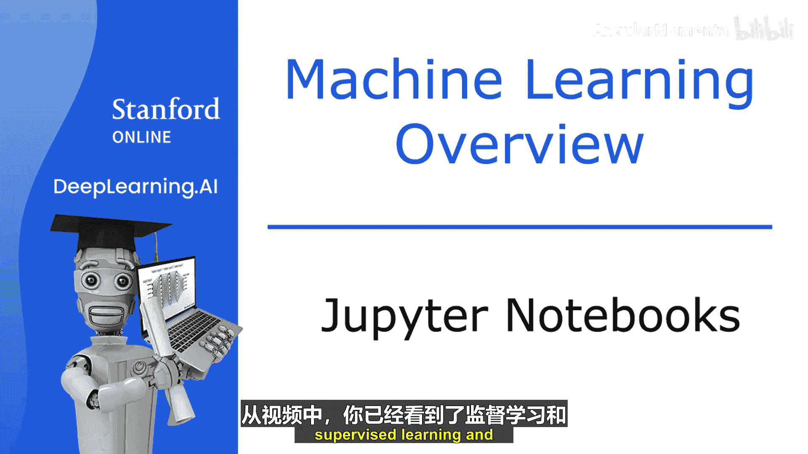
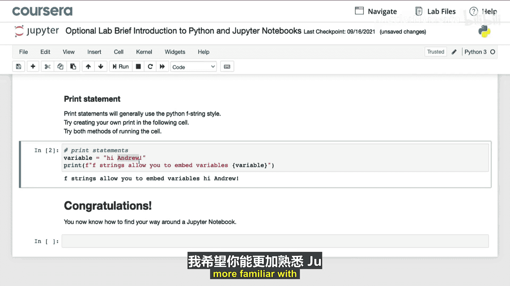
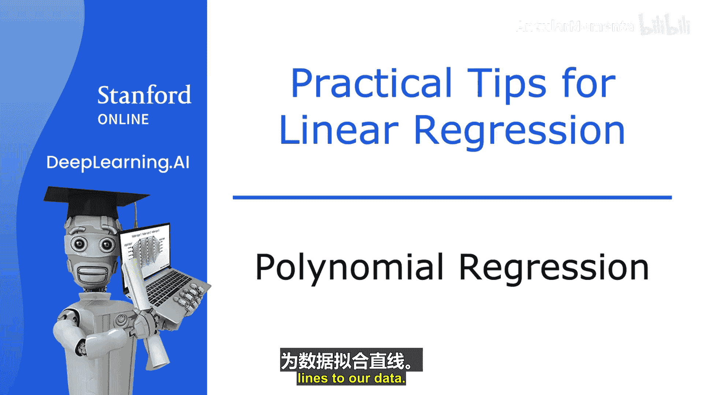
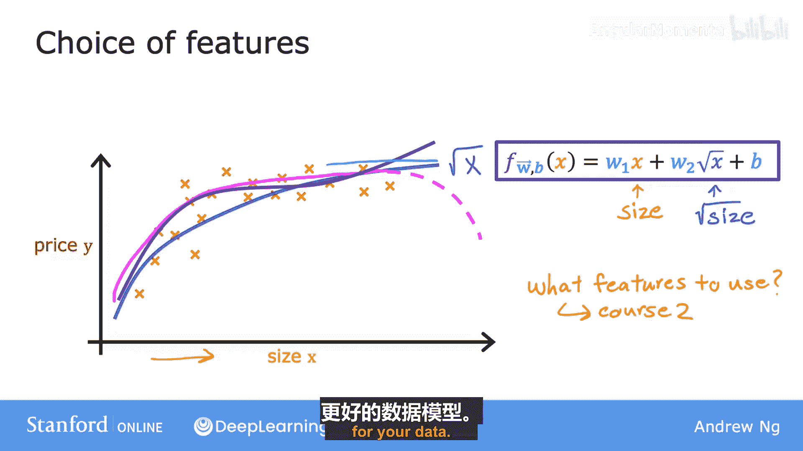
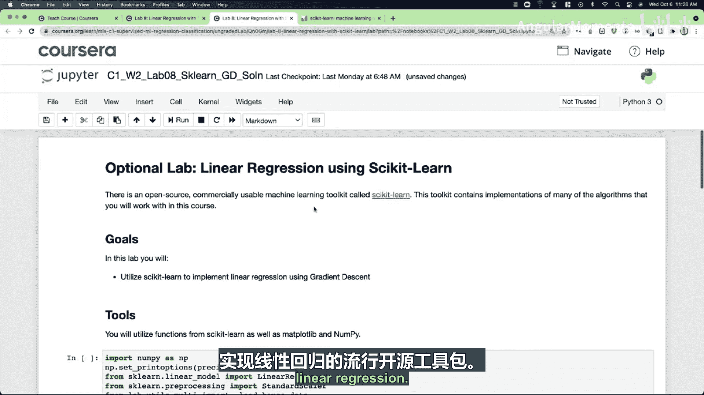
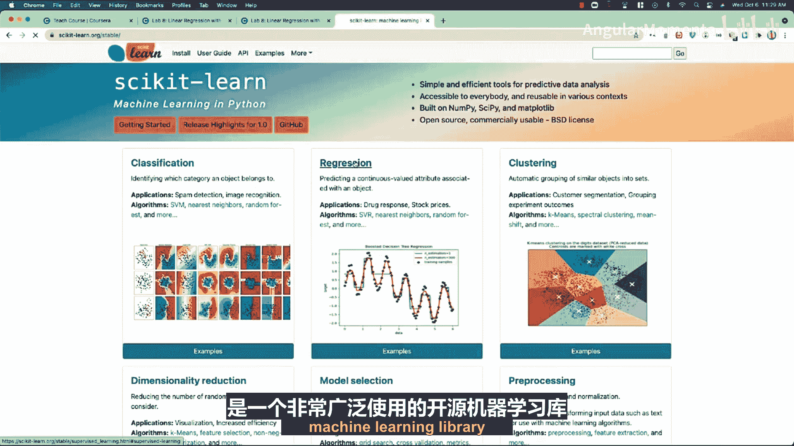
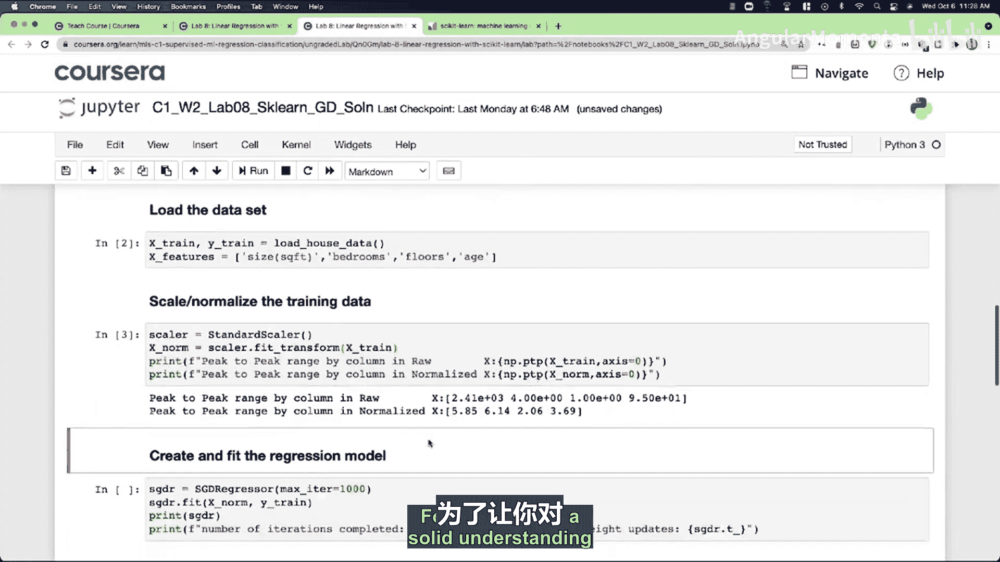

# 010：Jupyter笔记本与多项式回归 🚀

在本节课中，我们将学习两个重要工具：Jupyter笔记本和多项式回归。Jupyter笔记本是机器学习实践者广泛使用的编程环境，而多项式回归则是一种通过特征工程来拟合非线性数据的技术。

## Jupyter笔记本简介 💻

在之前的视频中，你已经了解了监督学习和无监督学习及其示例。为了让你更深入地理解这些概念，本节课邀请你亲自查看、运行，甚至稍后自己编写代码来实现这些概念。目前机器学习和数据科学从业者最广泛使用的工具是Jupyter笔记本。这是我们许多人用来编码、实验和尝试想法的默认环境。在本节课中，你将能够在网页浏览器中直接使用Jupyter笔记本环境来亲自测试这些想法。

这不是一个虚构的、简化的环境。这是与许多开发者目前在各大公司中使用的完全相同的工具和环境。

### 可选实验与实践实验

在本课程中，你会看到一种称为“可选实验”的实验类型。你可以打开并逐行运行这些实验，通常不需要自己编写任何代码。可选实验设计得非常简单，我可以保证你在每一个实验上都能获得满分，因为它们本身没有评分。你只需要打开并运行我们提供的代码。通过阅读和运行可选实验中的代码，你将看到机器学习代码是如何运行的。你应该能够相对快速地完成它们，只需从上到下逐行运行即可。

可选实验是完全可选的，如果你不想做，完全可以不做。但我希望你能看一看，因为运行它们会让你对机器学习算法和代码有更深的感受和更多经验。

从下周开始，还会出现一些“实践实验”，它们将给你机会自己编写一些代码。但我们下周再讨论这个，现在不用担心。我希望你能完成下一个可选实验，并学完本周的其余内容。

### 笔记本环境初探

让我们看一个笔记本的例子。当你打开第一个可选实验时，你会看到类似这样的界面。你可以自由地上下滚动、浏览、将鼠标悬停在不同的菜单上，并查看这里的各种选项。

你可能会注意到笔记本中有两种类型的块，也称为“单元格”。有两种类型的单元格。一种叫做“Markdown单元格”，基本上就是一堆文本。在这里，如果你不喜欢我们写的文本，你实际上可以编辑它。这是描述代码的文本。

然后是第二种类型的块或单元格，它看起来像这样，是一个“代码单元格”。这里我们已经提供了代码。如果你想运行这个代码单元格，按 `Shift + Enter` 键将运行此代码单元格中的代码。顺便说一下，如果你点击一个Markdown单元格（显示所有这些格式），也请按键盘上的 `Shift + Enter` 键，这也会将其转换回这种格式良好的文本。

这个可选实验展示了一些常见的Python代码，你之后可以在自己的Jupyter笔记本中运行它。当你自己进入这个笔记本时，我希望你做的是：选择单元格并按 `Shift + Enter` 键。阅读代码，看看它是否有意义，试着预测你认为这段代码会做什么，然后按 `Shift + Enter` 键。接着看看代码实际做了什么。如果你愿意，可以自由地进入并编辑代码，更改代码，然后运行它，看看会发生什么。

如果你以前没有在Jupyter笔记本环境中玩过，我希望你能更熟悉Python和Jupyter笔记本。我自己在Jupyter笔记本上花费了很多时间。所以我希望你也觉得它们有趣。之后，我期待在下一个视频中见到你，在那里我们将处理监督学习问题，并开始构建我们的第一个监督学习算法。我希望那也会很有趣，期待在那里见到你。

---

## 多项式回归 📈

到目前为止，我们一直在用直线拟合数据。现在让我们结合多元线性回归和特征工程的思想，提出一种称为多项式回归的新算法，它允许你用曲线（非线性函数）来拟合数据。

假设你有一个看起来像这样的住房数据集，其中特征 `x` 是面积（平方英尺）。看起来一条直线不太适合这个数据集。所以，也许你想拟合一条曲线，比如一个二次函数，像这样，它包含面积 `x` 和 `x` 的平方（即面积乘以自身）。也许这能给你一个更好的数据拟合。

但是，你可能会认为你的二次模型并不真正合理，因为二次函数最终会下降，而我们并不真的期望房价在面积增加时下降，因为房子通常应该更贵。

因此，你可能会选择一个三次函数，我们现在不仅有 `x` 的平方，还有 `x` 的立方。也许这个模型产生了这里的这条曲线，它对数据的拟合稍好一些，因为随着面积增加，价格最终确实会回升。

以上这些例子都是多项式回归，因为你取了原始特征 `X` 并将其提升到2次方或3次方或其他任何次方。在三次函数的情况下，第一个特征是面积，第二个特征是面积的平方，第三个特征是面积的立方。

### 特征缩放的重要性

我想再指出一点，如果你创建了像原始特征的平方这样的特征，那么特征缩放就变得越来越重要。例如，如果房屋面积范围从1到1000平方英尺，那么第二个特征（面积的平方）的范围将从1到一百万，而第三个特征（面积的立方）的范围将从1到十亿。因此，与原始特征 `X` 相比，这两个特征 `x²` 和 `x³` 的取值范围非常不同。如果你使用梯度下降法，应用特征缩放以使你的特征具有可比的值范围就很重要。

### 特征选择的多样性

最后，这里还有一个例子，说明你实际上有广泛的特征选择范围。除了取面积的平方和立方之外，另一个可行的替代方案是使用 `x` 的平方根。所以你的模型可能看起来像 `w₁ * x + w₂ * √x + b`。平方根函数看起来像这样，随着 `X` 增加，它变得不那么陡峭，但它永远不会完全变平，当然也永远不会下降。所以这可能是另一个可能对此数据集也有效的特征选择。

你可能会问自己，我如何决定使用什么特征？在专业课程的第二门课程中，你将看到如何选择不同的特征和模型（包括或不包括这些特征），并且你将有一个流程来衡量这些不同模型的性能，以帮助你决定包含或不包含哪些特征。

现在，我只想让你意识到，你在使用什么特征方面有选择权。通过使用特征工程和多项式函数，你有可能为你的数据获得一个更好的模型。

### 后续实验

在紧随本视频的可选实验中，你将看到一些使用像 `x²` 和 `x³` 这样的特征来实现多项式回归的代码，所以请看一看并运行代码，看看它是如何工作的。

在那之后，还有另一个可选实验，展示了如何使用一个流行的开源工具包来实现线性回归。

---

## Scikit-learn 简介 🛠️

Scikit-learn 是一个非常广泛使用的开源机器学习库，被世界上许多顶级AI、互联网和机器学习公司的众多从业者使用。

所以，无论是现在还是将来，如果你在工作中使用机器学习，你很可能会使用像 Scikit-learn 这样的工具来训练你的模型。

因此，完成那个可选实验不仅会让你有机会更好地理解线性回归，还能看到如何使用像 Scikit-learn 这样的库，仅用几行代码就能完成这项工作。

为了让你对这些算法有扎实的理解并能够应用它们，我确实认为重要的是，你要知道如何自己实现线性回归，而不仅仅是调用某个像黑盒子一样的 Scikit-learn 函数。但 Scikit-learn 在当今机器学习的实践方式中也扮演着重要角色。

---

## 本周总结 🎉

我们即将结束本周的学习。恭喜你完成了本周所有的视频内容。请务必看一看练习题和实践实验，我希望它们能让你尝试和实践我们在本周讨论过的想法。在实践实验中，你将实现线性回归。我希望你在让这个学习算法为自己工作的过程中获得很多乐趣。

祝你好运！我也期待在下周的视频中见到你，在那里我们将超越回归（即预测数字），讨论我们的第一个分类算法，它可以预测类别。下周见！