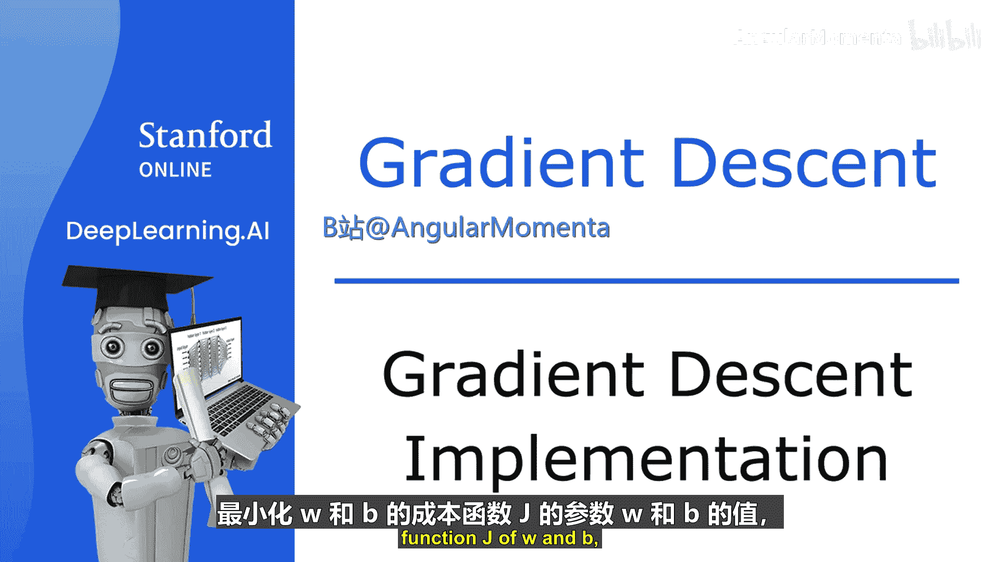
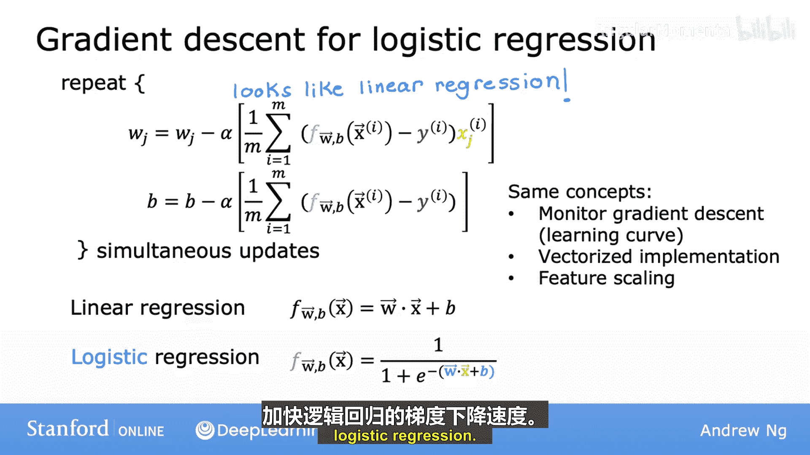
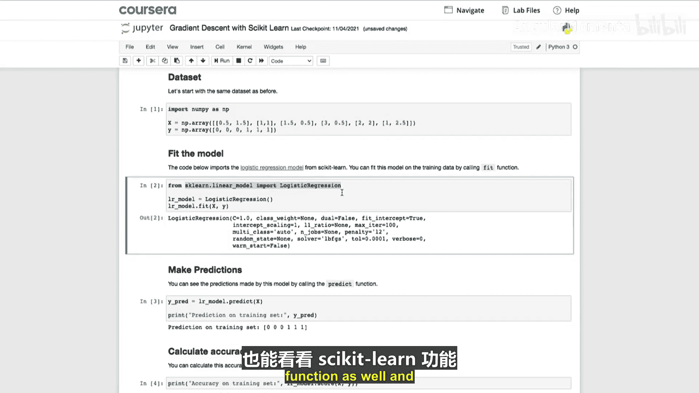
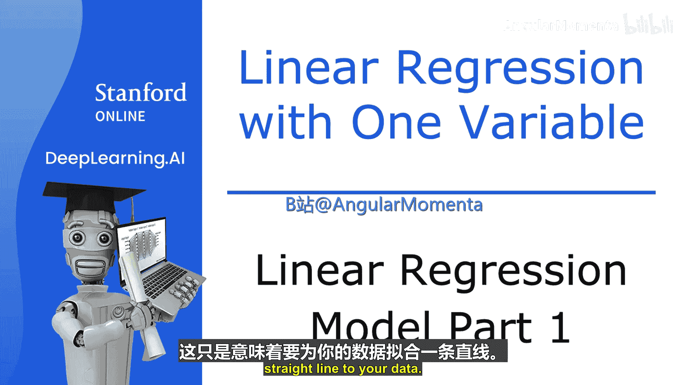
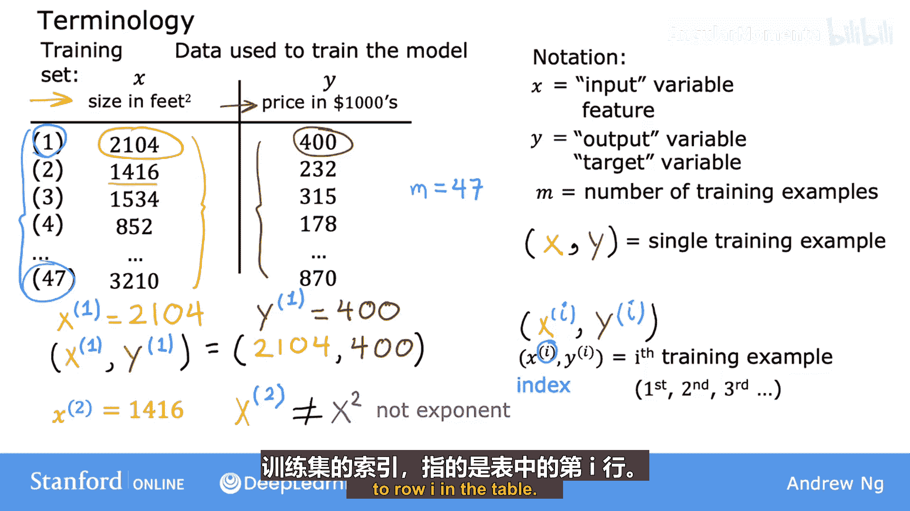

# 011：梯度下降算法实现 🚀

在本节课中，我们将学习如何实现逻辑回归模型的梯度下降算法。我们将找到能够最小化成本函数的参数 **W** 和 **B** 的值。通过本教程，你将理解梯度下降在逻辑回归中的应用，并了解其与线性回归的异同。

---

## 概述

为了拟合逻辑回归模型的参数，我们需要找到能够最小化成本函数 **J(W, B)** 的参数 **W** 和 **B**。我们将再次应用梯度下降算法来实现这一目标。本节将重点介绍如何找到合适的参数 **W** 和 **B**。完成参数优化后，模型可以对新的输入 **X**（例如，一位新患者的肿瘤大小和年龄）进行预测，估计标签 **Y** 为 1 的概率。

---

## 梯度下降算法

用于最小化成本函数的算法是梯度下降。以下是成本函数 **J(W, B)** 的表达式：

**J(W, B) = -1/m * Σ [y⁽ⁱ⁾ * log(f(x⁽ⁱ⁾)) + (1 - y⁽ⁱ⁾) * log(1 - f(x⁽ⁱ⁾))]**

梯度下降算法通过以下方式更新每个参数：

**Wⱼ := Wⱼ - α * (∂J/∂Wⱼ)**  
**B := B - α * (∂J/∂B)**

其中，**α** 是学习率。

---

## 参数更新公式

现在，让我们看看成本函数 **J** 关于参数 **Wⱼ** 和 **B** 的偏导数。

### 关于 **Wⱼ** 的偏导数

通过微积分规则，可以证明成本函数 **J** 关于 **Wⱼ** 的偏导数为：

**∂J/∂Wⱼ = 1/m * Σ (f(x⁽ⁱ⁾) - y⁽ⁱ⁾) * xⱼ⁽ⁱ⁾**

其中，**xⱼ⁽ⁱ⁾** 是第 **i** 个训练样本的第 **j** 个特征。

### 关于 **B** 的偏导数

成本函数 **J** 关于参数 **B** 的偏导数为：

**∂J/∂B = 1/m * Σ (f(x⁽ⁱ⁾) - y⁽ⁱ⁾)**

这个表达式与上面的类似，只是没有乘以 **xⱼ⁽ⁱ⁾**。

---

## 同时更新参数

与线性回归类似，执行这些更新的方式是同时更新。首先计算所有更新的右侧值，然后同时覆盖左侧的所有值。

将上述偏导数表达式代入梯度下降更新公式，得到逻辑回归的梯度下降算法：

**Wⱼ := Wⱼ - α * [1/m * Σ (f(x⁽ⁱ⁾) - y⁽ⁱ⁾) * xⱼ⁽ⁱ⁾]**  
**B := B - α * [1/m * Σ (f(x⁽ⁱ⁾) - y⁽ⁱ⁾)]**

---

## 逻辑回归与线性回归的区别

你可能会注意到，这些方程看起来与线性回归的方程完全相同。然而，逻辑回归与线性回归并不相同，因为函数 **f(x)** 的定义发生了变化：

- 在线性回归中：**f(x) = Wx + B**
- 在逻辑回归中：**f(x) = sigmoid(Wx + B)**

因此，尽管算法看起来相同，但由于 **f(x)** 的定义不同，线性回归和逻辑回归实际上是两种非常不同的算法。

---

## 监控梯度下降

在之前讨论线性回归时，我们提到了如何监控梯度下降以确保其收敛。你可以将相同的方法应用于逻辑回归，以确保梯度下降也能收敛。

---

## 向量化实现

与线性回归的向量化实现类似，你也可以使用向量化来加速逻辑回归的梯度下降。虽然本节不深入讨论向量化实现的细节，但你可以在可选实验中学到更多相关内容并查看代码。

---

## 特征缩放

在之前使用线性回归时，我们讨论了特征缩放，即将所有特征缩放到相似的值范围（例如 -1 到 +1），以帮助梯度下降更快收敛。特征缩放同样适用于逻辑回归，可以加速梯度下降的收敛过程。

---

## 实验与实践

在接下来的可选实验中，你将看到如何用代码计算逻辑回归的梯度。这对于本周的实践实验非常有用。运行梯度下降后，你将看到一系列动态图表，展示梯度下降的运行过程，包括 Sigmoid 函数、成本函数的等高线图、成本函数的三维曲面图以及学习曲线的演变。

此外，还有一个简短而实用的可选实验，展示如何使用流行的 Scikit-learn 库训练逻辑回归分类模型。许多机器学习从业者和公司经常使用 Scikit-learn，因此建议你查看相关函数并了解其使用方法。

---

## 总结

在本节课中，我们一起学习了如何实现逻辑回归的梯度下降算法。逻辑回归是一种非常强大且广泛使用的学习算法，你现在已经掌握了如何使其工作。恭喜你！🎉

---

## 监督式机器学习：回归与分类：2：监督学习流程概述 📊

在上一节中，我们介绍了梯度下降在逻辑回归中的实现。本节中，我们来看看监督学习的整体流程。具体来说，你将看到本课程的第一个模型——线性回归模型。线性回归模型可能是当今世界上使用最广泛的学习算法，通过熟悉线性回归，你在这里看到的许多概念也将适用于本专业后续课程中的其他机器学习模型。

---

## 概述

让我们从一个可以用线性回归解决的问题开始：根据房屋大小预测房屋价格。这是本周早些时候看到的一个例子。我们将使用美国波特兰市的房屋大小和价格数据。下图展示了房屋大小（平方英尺）与房屋价格（千美元）的关系。

图中的每个小叉代表一个房屋，包括其大小和最近出售的价格。

---

## 应用场景

假设你是一名波特兰的房地产经纪人，正在帮助客户出售房屋。客户问你：“你认为这栋房子能卖多少钱？”这个数据集可以帮助你估算房屋的价格。

你首先测量房屋的大小，发现她的房屋面积为 1250 平方英尺。你认为这栋房子能卖多少钱？一种方法是根据数据集构建一个线性回归模型。你的模型将拟合一条直线到数据，可能如下图所示。

基于这条拟合直线，你可以看到，如果房屋面积为 1250 平方英尺，它将与最佳拟合线在这里相交。如果你将其追踪到左侧的垂直轴，可以看到价格大约在这里，比如 22 万美元。

---

## 监督学习模型

这是一个监督学习模型的例子。之所以称为监督学习，是因为你首先通过提供包含正确答案的数据来训练模型。在这个例子中，模型获得了房屋大小以及每个房屋应该预测的价格作为示例。数据集中每个房屋的价格都是已知的正确答案。

---

## 回归与分类

线性回归模型是一种特定类型的监督学习模型，称为回归模型，因为它预测数字作为输出，如以美元计的价格。任何预测数字（如 22 万、1.5 或 -33.2）的监督学习模型都在解决回归问题。线性回归是回归模型的一个例子，但还有其他模型可以解决回归问题，我们将在本专业的第二门课程中看到一些。

相比之下，另一种最常见的监督学习模型称为分类模型。分类模型预测类别或离散类别，例如预测图片是猫还是狗，或者根据医疗记录预测患者是否患有特定疾病。你将在本课程后面了解更多关于分类模型的内容。

---

## 数据表示

除了将数据可视化为左侧的图表外，另一种有用的方式是右侧的数据表。数据包括一组输入（房屋大小）和输出（价格）。注意，水平轴和垂直轴对应于这两个列：大小和价格。

例如，如果数据表有 47 行，那么左侧图表上就有 47 个叉，每个叉对应表中的一行。例如，表的第一行是大小为 2104 平方英尺的房屋，售价为 40 万美元。因此，表的第一行绘制为图表上的这个数据点。

---

## 数据符号

以下是描述数据的一些符号，这些符号在你学习机器学习的过程中会非常有用：

- **训练集**：用于训练模型的数据称为训练集。注意，你客户的房屋不在此数据集中，因为它尚未出售，因此没有人知道其价格。
- **输入变量**：标准符号是小写 **x**，也称为特征或输入特征。例如，对于训练集中的第一个房屋，**x** 是房屋大小，所以 **x = 2104**。
- **输出变量**：标准符号是小写 **y**，也称为目标变量。例如，对于第一个训练示例，**y = 400**。
- **训练示例数量**：用小写 **m** 表示训练示例的总数。这里 **m = 47**。
- **单个训练示例**：用符号 **(x, y)** 表示。对于第一个训练示例，**(x, y) = (2104, 400)**。
- **第 i 个训练示例**：用 **x⁽ⁱ⁾, y⁽ⁱ⁾** 表示。上标 **i** 表示这是第 i 个训练示例，例如第一个、第二个或第 47 个训练示例。注意，上标 **i** 不是指数，它只是训练集中的索引，指的是表中的第 i 行。

---

## 总结

在本节课中，我们一起学习了监督学习的整体流程，包括训练集的概念以及描述训练集的标准符号。在下一节中，我们将探讨如何将这个训练集输入学习算法，以便算法可以从这些数据中学习。让我们在下一节中继续学习。