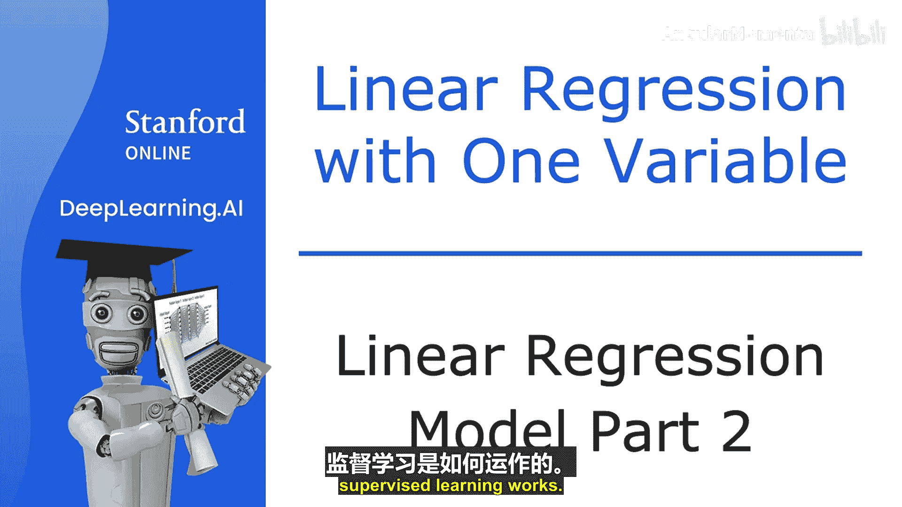
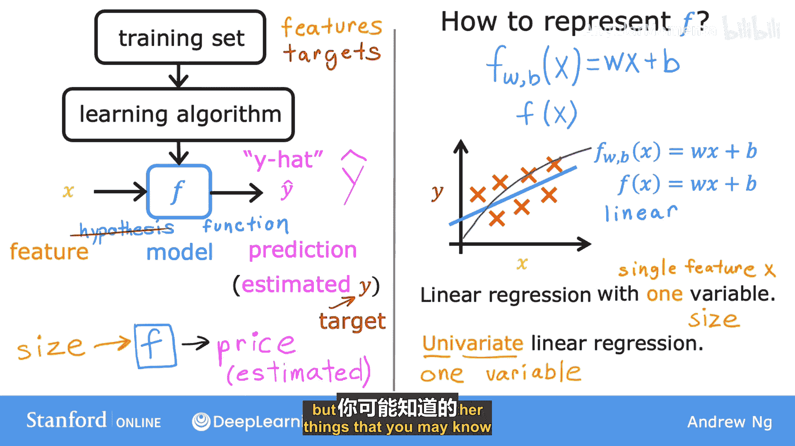
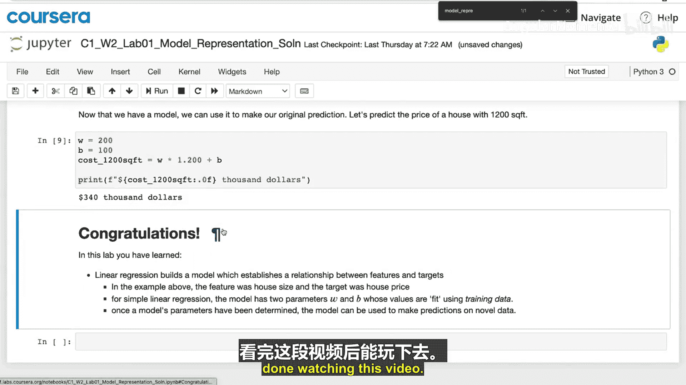

# 012：线性回归模型第二部分

在本节中，我们将深入探讨监督学习算法的工作流程，特别是线性回归模型如何从数据中学习并做出预测。我们将了解模型的数学表示，并初步接触一个核心概念——成本函数。

## 监督学习的工作流程

上一节我们介绍了训练集的概念。现在，我们来看看监督学习算法具体如何处理这些数据。

监督学习算法会接收一个数据集作为输入。这个训练集既包含输入特征（例如房屋面积），也包含输出目标（例如房屋价格）。输出目标是模型需要学习的正确答案。

为了训练模型，你需要将包含输入特征和输出目标的训练集提供给学习算法。然后，该算法会生成一个函数。

我们把这个函数记为小写的 **f**（f 代表函数）。在机器学习中，这个函数 **f** 被称为**模型**。它的作用是接收一个新的输入 **x**，并输出一个估计值或预测值，我们称之为 **ŷ**（读作 “y hat”）。

以下是关键术语的总结：
*   **模型**：函数 **f**。
*   **输入/特征**：变量 **x**。
*   **预测值**：模型的输出 **ŷ**，是对真实值 **y** 的估计。
*   **目标值**：符号 **y**，指训练集中的实际真实值。

**ŷ** 是一个估计值，它可能与真实值 **y** 相同，也可能不同。例如，在帮助客户卖房时，房屋的真实价格在售出前是未知的，因此模型 **f** 根据面积输出的价格 **ŷ**，是对未来真实价格的预测。

## 模型的数学表示

设计学习算法时，一个关键问题是：我们如何表示函数 **f**？换句话说，我们使用什么数学公式来计算 **f**？

目前，我们假设 **f** 是一条直线。因此，你的函数可以写成：
`f_{w,b}(x) = w * x + b`

这里，**w** 和 **b** 是数字，它们的具体数值决定了基于输入特征 **x** 的预测值 **ŷ**。有时为了简洁，我们也会直接写成 `f(x) = w * x + b`。

让我们将训练集绘制在图表上，其中横轴是输入特征 **x**，纵轴是输出目标 **y**。模型从这些数据中学习，并生成一条最佳拟合线，例如下图中的直线。

这条直线就是线性函数 `f(x) = w * x + b`。它的作用是利用 **x** 的直线函数来预测 **y** 的值。

你可能会问，为什么我们选择线性函数（直线的另一种说法），而不是像曲线或抛物线那样的非线性函数？原因在于，线性函数相对简单且易于处理。我们以直线为基础，这将最终帮助你理解更复杂的非线性模型。

## 线性回归与成本函数

这个特定的模型有一个名称，叫做**线性回归**。更具体地说，这是**单变量线性回归**。“单变量”意味着只有一个输入变量或特征 **x**（即房屋面积）。“单变量”是“一个变量”的另一种说法。

在后续课程中，你将看到回归的另一种形式，即预测不仅基于房屋面积，还基于你可能知道的其他信息（如卧室数量等特征）。

为了让线性回归模型有效工作，你必须做的最重要的事情之一就是构建一个**成本函数**。成本函数的思想是机器学习中最普遍和最重要的思想之一，它不仅用于线性回归，也用于训练世界上最先进的AI模型。

在下一节中，我们将详细探讨如何构建成本函数。

## 总结

本节课我们一起学习了监督学习算法的工作流程。我们了解到，算法通过训练集学习并生成一个模型函数 **f**。对于线性回归，该模型表示为 `f(x) = w * x + b`。模型输出的 **ŷ** 是对真实目标 **y** 的预测。最后，我们认识到构建成本函数是使模型学习的关键下一步。