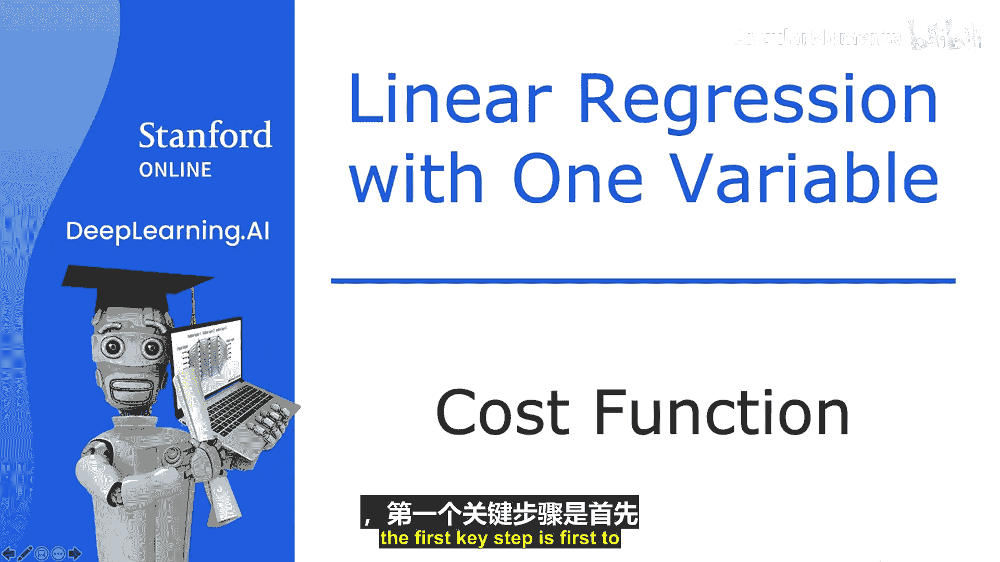
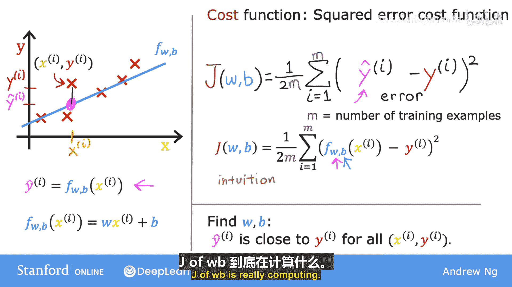

# 013：成本函数公式 📊

在本节课中，我们将学习线性回归中的一个核心概念：成本函数。成本函数用于衡量模型预测的准确程度，是我们后续优化模型参数的基础。

## 概述

为了实施线性回归，首要关键步骤是定义一个称为成本函数的东西。成本函数能告诉我们模型的表现如何，从而帮助我们改进模型。本节将构建成本函数，并解释其含义。

## 模型与参数

回忆一下，我们有一个包含输入特征 **X** 和输出目标 **Y** 的训练集。

用于拟合此训练集的模型是以下线性函数：

`f_wb(x) = w * x + b`

这里，**w** 和 **b** 被称为模型的参数。在机器学习中，模型的参数是可以在训练期间调整以改进模型的变量。有时，参数 **w** 和 **b** 也被称为系数或权重。

现在，让我们看看参数 **w** 和 **b** 的作用。根据为 **w** 和 **b** 选择的不同值，你会得到不同的函数 **f(x)**，从而在图上生成不同的直线。请记住，我们可以将 **f_wb(x)** 简写为 **f(x)**。

## 参数对模型的影响

我们将查看一些 **f(x)** 在图表上的示例。也许你已经熟悉在图表上绘制直线，但即使这对你来说是复习，也希望这能帮助你建立关于参数 **w** 和 **b** 如何决定 **f** 的直觉。

*   **示例 1**：当 **w = 0** 且 **b = 1.5** 时，**f** 看起来像一条水平线。在这种情况下，函数 `f(x) = 0 * x + 1.5`，所以 **f** 始终是一个常数值，它总是预测 **y** 的估计值为 1.5。这里，**b** 也被称为 **y 轴截距**，因为这是它与垂直轴（y 轴）相交的地方。

*   **示例 2**：如果 **w = 0.5** 且 **b = 0**，则 `f(x) = 0.5 * x`。当 **x** 为 0 时，预测值也为 0；当 **x** 为 2 时，预测值为 1。这样你得到一条斜率为 0.5 的直线。**w** 的值给出了直线的斜率。

*   **示例 3**：如果 **w = 0.5** 且 **b = 1**，则 `f(x) = 0.5 * x + 1`。当 **x** 为 0 时，`f(x) = b = 1`，所以直线在 **b** 处与 y 轴相交。同样，斜率由 **w** 的值 0.5 给出。

## 成本函数的引入

回顾一下，你有一个如上图所示的训练集。在线性回归中，我们希望选择参数 **w** 和 **b** 的值，使得函数 **f** 得到的直线能很好地拟合数据，例如图中所示的这条线。当我说直线在视觉上拟合数据时，你可以理解为，与其他可能不那么接近这些点的直线相比，由 **f** 定义的直线大致穿过或接近这些训练样本。

提醒一下符号表示：一个像图中这个点一样的训练样本，由 `(x^(i), y^(i))` 定义，其中 **y^(i)** 是给定输入 **x^(i)** 的目标值。函数 **f** 也会对 **y** 做出一个预测值，其预测值记为 **ŷ^(i)**。对于我们的模型，`ŷ^(i) = f_wb(x^(i)) = w * x^(i) + b`。

那么问题来了：如何找到 **w** 和 **b** 的值，使得对于许多（或所有）训练样本 `(x^(i), y^(i))`，预测值 **ŷ^(i)** 都接近真实目标值 **y^(i)** 呢？

为了回答这个问题，我们首先来看看如何衡量一条直线对训练数据的拟合程度。为此，我们将构建我们的成本函数。

## 构建成本函数

成本函数通过计算 **ŷ - y** 来比较预测值 **ŷ** 和目标值 **y**。这个差值称为**误差**，我们用它来衡量预测值与目标值之间的距离。

接下来，我们计算这个误差的平方。此外，我们希望为训练集中的不同训练样本 **i** 计算这个平方误差项。

最后，我们希望衡量整个训练集上的误差。具体来说，我们对所有平方误差求和，从 **i = 1** 到 **m**（**m** 是训练样本的数量，对于这个数据是 47）。注意，如果训练样本更多（**m** 更大），你的成本函数将计算出一个更大的数字，因为它是对更多样本求和。

按照惯例，为了构建一个不会随着训练集规模增大而自动变大的成本函数，我们将计算**平均平方误差**，而不是总平方误差，通过除以 **m** 来实现。

我们快完成了。按照惯例，机器学习人员使用的成本函数实际上除以 **2m**。额外除以 **2** 只是为了让我们后续的一些计算更整洁，但无论你是否包含这个除以 **2** 的操作，成本函数仍然有效。

因此，以下表达式就是成本函数，我们将其记为 **J(w, b)**：

`J(w, b) = (1 / (2m)) * Σ (ŷ^(i) - y^(i))^2`，其中求和从 i=1 到 m。

这被称为**平方误差成本函数**，之所以这样命名，是因为你对这些误差项取了平方。

在机器学习中，不同的人会为不同的应用使用不同的成本函数，但平方误差成本函数是线性回归乃至所有回归问题中最常用的一个，因为它似乎能为许多应用提供良好的结果。

提醒一下，预测值 `ŷ^(i) = f_wb(x^(i))`。所以我们可以将成本函数 **J(w, b)** 重写为：

`J(w, b) = (1 / (2m)) * Σ (f_wb(x^(i)) - y^(i))^2`，其中求和从 i=1 到 m。

最终，我们希望找到能使成本函数值变小的 **w** 和 **b** 的值。

## 总结

在本节课中，我们一起学习了线性回归成本函数的核心概念。我们了解到，成本函数 **J(w, b)** 通过计算预测值与真实值之间的平均平方误差，来量化模型对训练数据的拟合程度。参数 **w** 和 **b** 控制着模型的直线，而成本函数为我们提供了一个明确的目标：找到使 **J(w, b)** 最小化的参数值。在下一节中，我们将通过具体示例，更直观地理解成本函数值的含义。