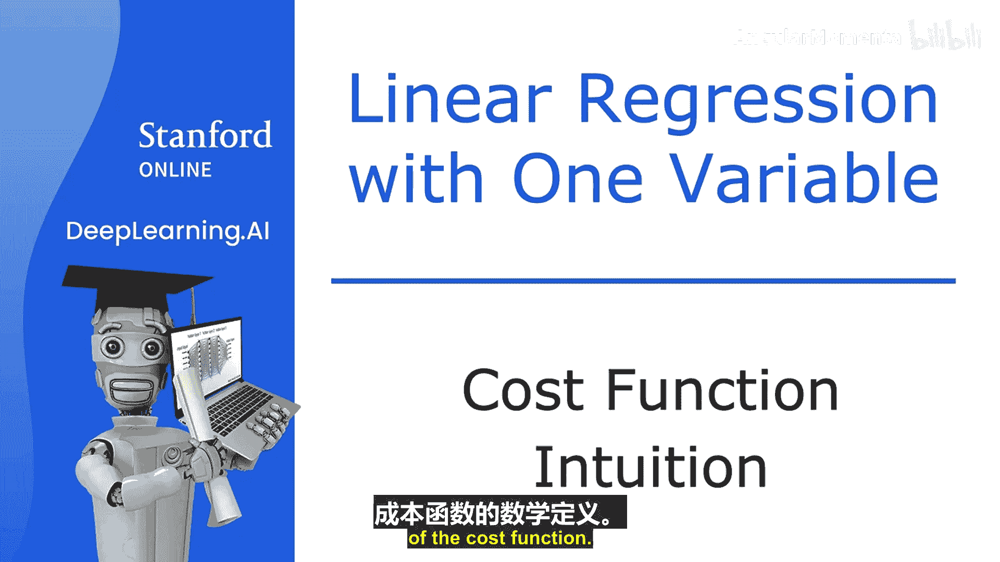
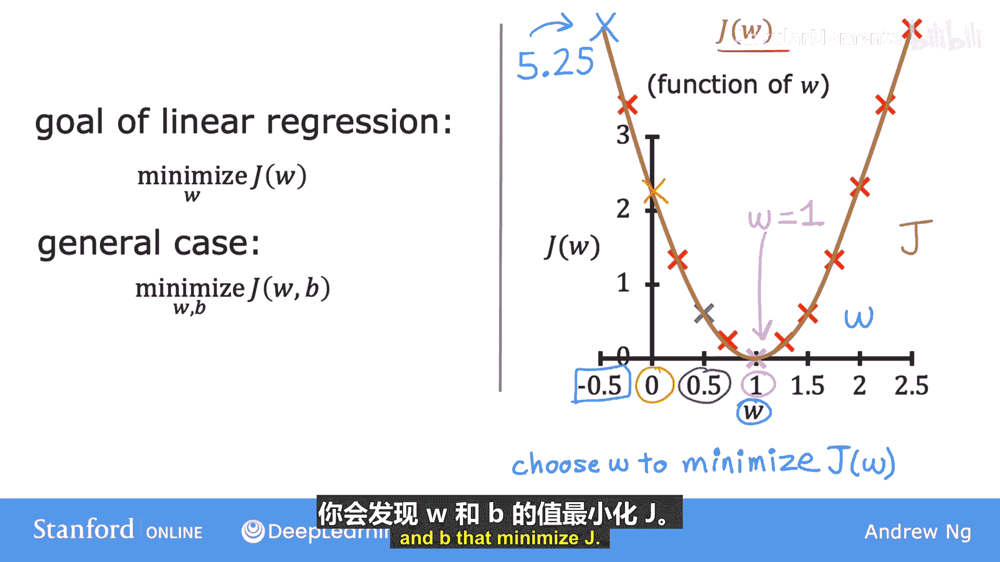

# 014：成本函数直观理解 🧠

在本节中，我们将深入理解成本函数的作用。我们已经了解了成本函数的数学定义，现在将通过一个具体例子，直观地展示成本函数如何帮助我们找到模型的最佳参数。

## 概述
我们将通过一个简化的线性回归模型，可视化参数选择如何影响模型预测的直线，以及如何对应地改变成本函数的值。目标是理解如何通过最小化成本函数来找到最佳拟合数据的参数。

## 简化模型
为了更清晰地可视化，我们首先使用一个简化模型。原始模型为 **f(x) = w * x + b**。现在，我们设参数 **b = 0**，得到简化模型：

**f(x) = w * x**

这样，我们只有一个参数 **w** 需要优化。对应的成本函数 **J** 也简化为仅关于 **w** 的函数：

**J(w) = (1 / 2m) * Σ (f(xⁱ) - yⁱ)²**，其中 **f(xⁱ) = w * xⁱ**

我们的目标变为：找到使 **J(w)** 最小的 **w** 值。

## 可视化参数 `w` 的影响
我们将模型 **f(x)** 和成本函数 **J(w)** 的图表并列展示，以观察它们之间的关系。

### 当 `w = 1` 时
*   **模型 f(x)**：得到的直线斜率为1，恰好穿过我们的三个训练数据点 **(1,1), (2,2), (3,3)**。
*   **成本 J(1)**：由于每个数据点的预测值 `f(x)` 都等于真实值 `y`，所有误差项 `(f(xⁱ) - yⁱ)` 都为0。因此，成本 **J(1) = 0**。

### 当 `w = 0.5` 时
*   **模型 f(x)**：得到的直线斜率为0.5。此时，预测值与真实值之间存在差距。
*   **成本 J(0.5)**：我们需要计算每个点的误差平方。
    *   对于点(1,1)：误差 = 0.5 - 1 = -0.5
    *   对于点(2,2)：误差 = 1 - 2 = -1
    *   对于点(3,3)：误差 = 1.5 - 3 = -1.5
    代入成本函数公式计算后，得到 **J(0.5) ≈ 0.58**。

### 当 `w = 0` 时
*   **模型 f(x)**：得到的是一条与x轴重合的水平线。
*   **成本 J(0)**：此时所有预测值均为0，与真实值差距较大。计算后得到 **J(0) ≈ 2.33**。

### 当 `w = -0.5` 时
*   **模型 f(x)**：得到一条向下倾斜的直线。
*   **成本 J(-0.5)**：预测值与真实值偏差更大，计算得到成本 **J(-0.5) ≈ 5.25**。

## 建立关键联系
通过计算更多 `w` 值对应的成本，我们可以在右侧绘制出成本函数 **J(w)** 的完整曲线。

以下是核心发现：
*   左侧图中，每个不同的 `w` 值对应一条不同的拟合直线 **f(x)**。
*   右侧图中，每个 `w` 值对应成本函数曲线上的一个点 **J(w)**。
*   当左侧的直线很好地拟合数据（如 `w=1` 时），右侧的成本值就很小（`J(1)=0`）。
*   当左侧的直线拟合不佳（如 `w=0.5`, `0`, `-0.5`），右侧的成本值就会变大。

因此，**线性回归的目标就是找到使成本函数 J(w) 值最小的参数 w**。在这个例子中，`w = 1` 就是最佳选择。

## 总结
本节课中，我们一起学习了成本函数的直观意义。我们通过一个简化模型，看到了参数 `w` 的变化如何影响模型拟合直线的形状，并直接决定了成本函数 `J(w)` 的值。成本函数就像一个“指南针”，指引我们选择能让预测误差最小的参数。在下一节，我们将把这个概念扩展到包含两个参数 `w` 和 `b` 的完整模型，并观察其三维成本函数图像。