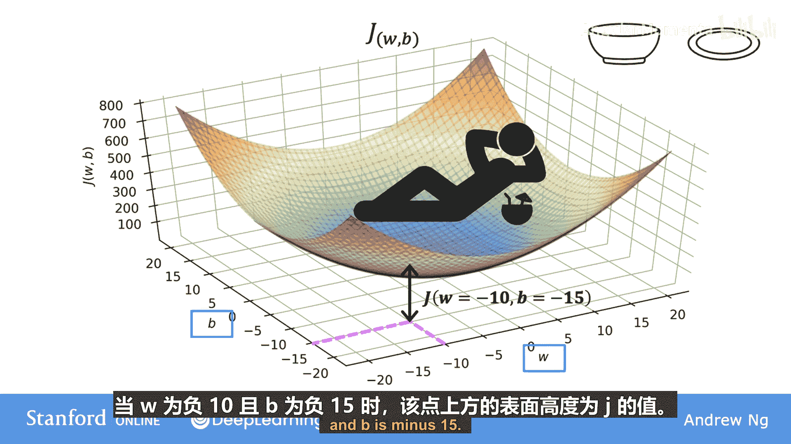
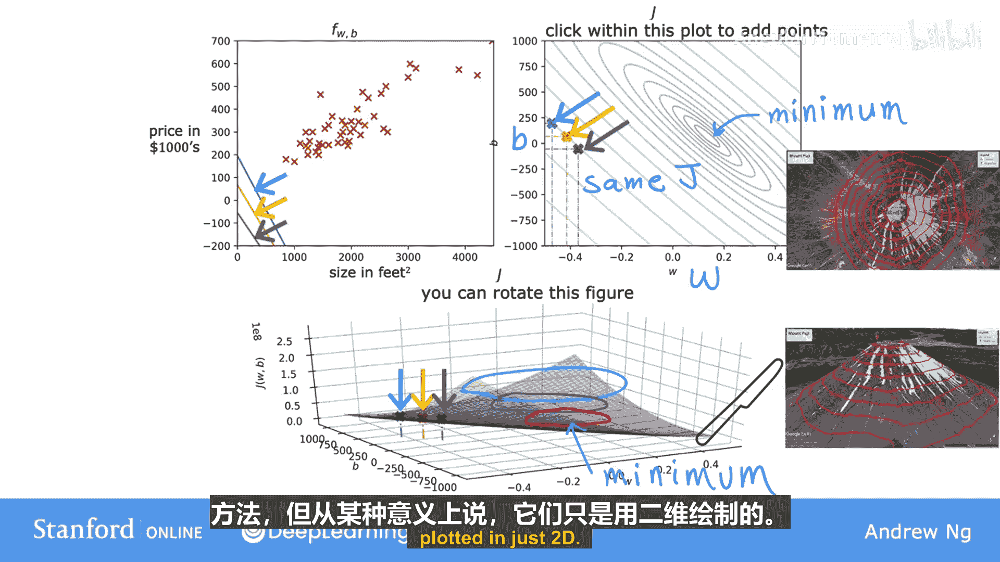

# 015：可视化成本函数 🎯

在本节课中，我们将学习如何可视化线性回归模型的成本函数。通过直观的图形，我们将更好地理解模型参数（权重 `w` 和偏置 `b`）如何影响成本函数 `J(w, b)` 的值，以及如何找到使成本最小化的参数组合。

## 概述

上一节我们介绍了当偏置 `b` 被暂时设为 0 时，成本函数 `J(w)` 的二维可视化图形。本节中，我们将回到包含两个参数 `w` 和 `b` 的完整模型，并探索成本函数 `J(w, b)` 的三维可视化及其二维等高线图表示。

## 模型与成本函数回顾

首先，我们回顾一下核心概念。线性回归模型定义为：
`f_{w,b}(x) = w * x + b`

我们的目标是找到参数 `w` 和 `b`，使得成本函数 `J(w, b)` 最小化。成本函数衡量了模型预测值与实际值之间的差异。

## 三维曲面图

当我们有两个参数 `w` 和 `b` 时，成本函数 `J(w, b)` 可以绘制成一个三维曲面。这个曲面通常呈碗状，类似于一个汤碗或吊床的形状。

在这个三维图中：
*   **水平轴** 代表参数 `w`。
*   **垂直轴** 代表参数 `b`。
*   **高度轴** 代表成本函数 `J(w, b)` 的值。

曲面上的每一个点都对应着一组特定的 `(w, b)` 值及其对应的成本 `J`。例如，当 `w = -0.10` 且 `b = 15` 时，曲面上对应点的高度就是 `J(-0.10, 15)` 的值。

## 等高线图

三维曲面图虽然直观，但有时在二维平面上观察更为方便。为此，我们引入**等高线图**。

想象一下地形图，它用一圈圈的闭合曲线（等高线）来表示相同海拔的区域。成本函数的等高线图与之类似：
*   图中的每一个椭圆（或闭合曲线）代表成本函数 `J(w, b)` 值相同的所有 `(w, b)` 点组合。
*   **中心点**（最小椭圆环的中心）对应于成本函数的最小值，即“碗底”。
*   离中心越远的椭圆环，代表的成本 `J` 值越高。

通过等高线图，我们可以一目了然地看出哪些参数组合会产生相似的成本，并快速定位成本最低的区域。

## 参数选择与模型表现

现在，让我们将参数选择与模型拟合的直线联系起来。以下是理解其关系的要点：

*   在等高线图上选取任意一点，就确定了一组 `(w, b)` 值。
*   这组值对应着模型函数 `f(x) = w*x + b` 在坐标平面上的一条特定直线。
*   如果该点位于等高线图的外围（成本 `J` 值较高），那么对应的直线对数据的拟合效果通常较差。
*   我们的目标是通过算法，找到位于等高线图中心区域（成本 `J` 值最低）的点，该点对应的直线能最好地拟合数据。

## 总结

本节课中，我们一起学习了成本函数 `J(w, b)` 的两种可视化方法：
1.  **三维曲面图**：直观展示了成本随两个参数变化而形成的碗状曲面。
2.  **二维等高线图**：通过水平切片展示了成本相同的参数区域，便于我们定位成本最小值。

理解这些可视化图形，有助于我们直观把握线性回归的目标——在参数空间中寻找那个使“碗”达到最低点的 `(w, b)` 组合。在下一节，我们将通过具体示例，观察不同的 `(w, b)` 选择如何直接影响拟合数据直线的形态。