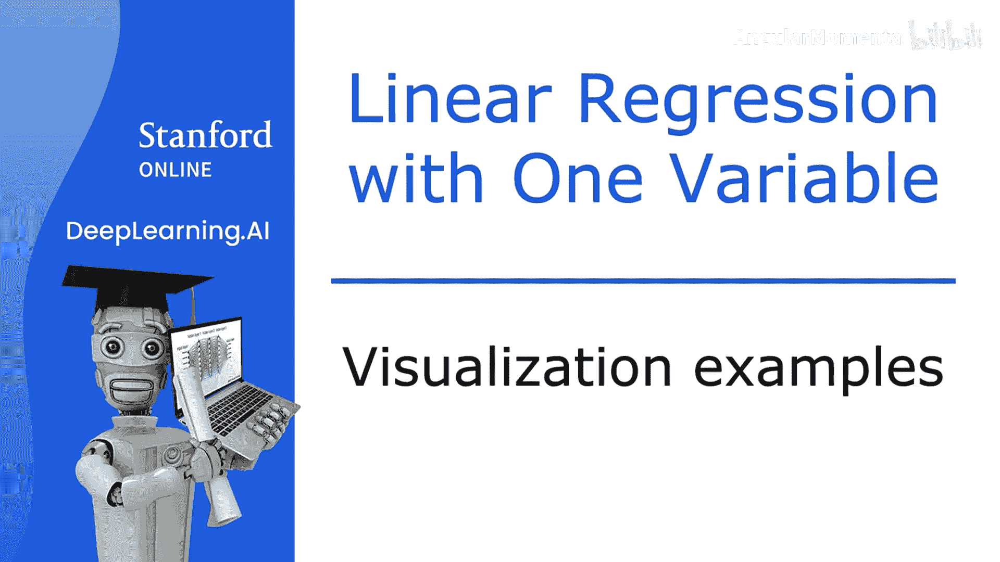
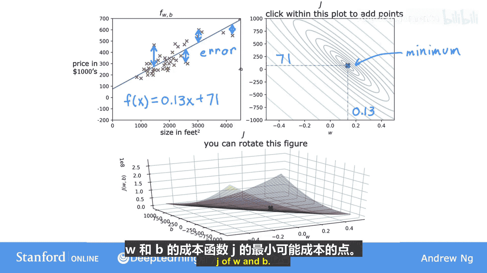
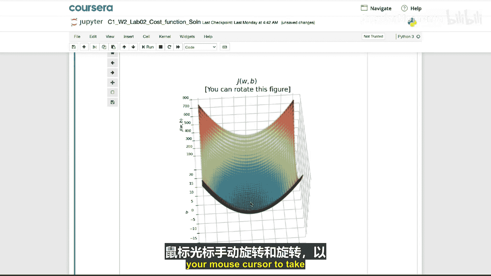

# 016：成本函数可视化示例 🎯

在本节课中，我们将通过几个具体的可视化示例，来理解参数 `w` 和 `b` 的不同取值如何影响线性回归模型 `f(x)` 的拟合效果，以及它们如何对应到成本函数 `J(w, b)` 上的不同点。通过观察这些对应关系，你将能更直观地理解“最小化成本函数”这一目标。

---

上一节我们介绍了成本函数的概念，本节中我们来看看几个具体的例子，将模型、参数和成本值联系起来。

以下是第一个示例。

在右侧的成本函数图中，我们选取了一个特定的点 `J`。对于这个点，`w` 约等于 -0.15，`b` 约等于 800。因此，这个点对应着一组特定的 `w` 和 `b` 值，并产生了一个特定的成本 `J`。

实际上，这组 `w` 和 `b` 的值对应着左侧的函数 `f(x)`，也就是你看到的这条直线。这条直线在纵轴上的截距是 800，因为 `b = 800`；直线的斜率是 -0.15，因为 `w = -0.15`。

现在，观察训练集中的数据点，你会发现这条直线对数据的拟合效果不佳。对于这个具有特定 `w` 和 `b` 值的函数 `f(x)`，许多 `y` 的预测值与训练数据中 `y` 的实际目标值相差甚远。

因为这条直线拟合得不好，所以如果你看 `J` 的图，这条直线的成本值位于此处，距离最小值相当远。这是一个相当高的成本，因为这对 `w` 和 `b` 的选择对训练集的拟合效果并不好。

---

现在让我们看另一个不同 `w` 和 `b` 选择的例子。

以下是另一个函数。它仍然不是对数据的完美拟合，但可能比上一个例子稍好一些。因此，右侧图上的这个点代表了产生那条直线的 `w` 和 `b` 组合所对应的成本。

此时 `w` 的值等于 0，`b` 的值约等于 360。这组参数对应着左侧的函数，这是一条水平线，因为 `f(x) = 0 * x + 360`。

---

让我们再看一个例子。

这是 `w` 和 `b` 的又一种选择。使用这些值，你得到了左侧的这条直线 `f(x)`。同样，它对数据的拟合效果不佳。实际上，与上一个例子相比，它的成本点距离最小值更远了。请记住，最小值位于最小椭圆的中心。

---

最后一个例子。

如果你看左侧的 `f(x)`，这看起来是对训练集的一个相当好的拟合。你可以在右侧看到，代表成本的点非常接近小椭圆的中心，虽然不是精确的最小值，但已经非常接近了。

对于这组 `w` 和 `b` 的值，你得到了这条直线 `f(x)`。你可以看到，如果测量数据点与直线上预测值之间的垂直距离，就得到了每个数据点的误差。所有这些数据点的误差平方和，在所有可能的直线拟合中，已经非常接近可能的最小平方误差和了。

---

我希望通过观察这些图表，你能更好地理解参数的不同选择如何影响直线 `f(x)`，以及这如何对应到成本函数 `J` 的不同值。并且，希望你能看到，拟合效果更好的直线对应着 `J(w, b)` 图上更接近可能的最小成本的点。

---

在本视频之后的可选实验里，你将有机会运行一些代码。请记住所有代码都已提供，你只需按 Shift+Enter 运行并查看即可。

以下是该实验将展示的内容：

1.  **成本函数的代码实现**：实验将展示成本函数是如何在代码中实现的。
2.  **参数与成本的关系**：给定一个小型训练集和不同的参数选择，你将能看到成本如何根据模型对数据的拟合程度而变化。
3.  **交互式等高线图**：你可以使用鼠标光标点击等高线图上的任意位置，然后看到由你选择的参数 `w` 和 `b` 的值所定义的直线。同时，一个代表成本的点也会出现在 3D 曲面图上。
4.  **3D 曲面图**：实验还提供了一个 3D 曲面图，你可以使用鼠标光标手动旋转和查看，以便更好地观察成本函数的样子。

---

我希望你能享受这个可选实验。现在，在线性回归中，我们并不需要手动尝试从等高线图中读取 `w` 和 `b` 的最佳值，这不仅不是一个好方法，而且一旦我们遇到更复杂的机器学习模型，这种方法将完全失效。

我们真正需要的是一种高效的算法，你可以将其编写成代码，来自动寻找参数 `w` 和 `b` 的值，从而得到能最小化成本函数 `J` 的最佳拟合直线。

存在一种用于实现此目的的算法，称为**梯度下降**。这个算法是机器学习中最重要的算法之一。梯度下降及其变体不仅用于训练线性回归，还用于训练人工智能中一些最大、最复杂的模型。

所以，让我们进入下一个视频，深入探讨这个非常重要的算法——梯度下降。

---

**本节课中我们一起学习了**：通过可视化示例，我们直观地看到了参数 `w` 和 `b` 如何决定回归直线 `f(x)` 的形状，以及不同的拟合效果如何直接反映在成本函数 `J(w, b)` 的数值和图形位置上。拟合越好的直线，其对应的成本值在图上越接近最小值点。我们还预告了将通过“梯度下降”算法来自动、高效地寻找这些最优参数。