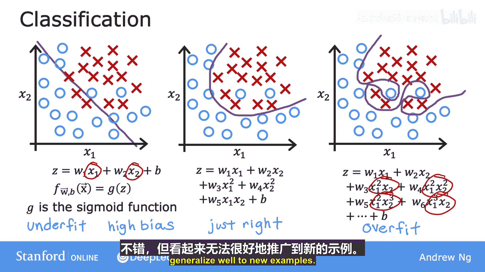
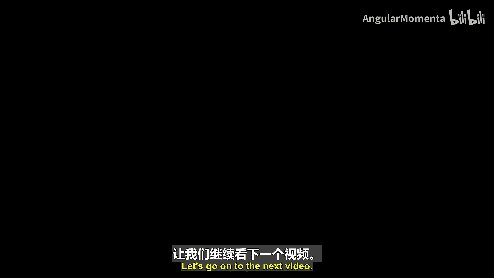

# 017：P17-04_01_梯度下降 🎯

在本节中，我们将学习梯度下降算法。这是一种用于最小化成本函数的系统化方法，是机器学习中最核心的算法之一。我们将了解其工作原理、直观理解以及它如何帮助模型找到最优参数。

## 概述

在上一节中，我们看到了成本函数 J 的可视化，以及如何尝试不同的参数 W 和 B 来观察对应的成本值。我们需要一种系统化的方法来找到能使成本函数 J(W, B) 值最小的 W 和 B。梯度下降算法正是为此而生。该算法在机器学习中应用广泛，不仅用于线性回归，也用于训练最先进的神经网络模型（深度学习模型）。掌握梯度下降是构建机器学习知识体系的重要基石。

## 梯度下降算法简介

梯度下降是一种可用于最小化任何函数的算法，而不仅仅是线性回归的成本函数。为了使讨论更具一般性，梯度下降适用于更广泛的函数，包括那些具有两个以上参数的模型所对应的成本函数。

例如，如果你有一个成本函数 J，它是参数 W1, W2, ..., WN 和 B 的函数，你的目标就是最小化 J。换句话说，你需要为 W1 到 WN 以及 B 选择一组值，使得 J 的值尽可能小。梯度下降正是你可以用来尝试最小化这个成本函数 J 的算法。

以下是算法的基本步骤：
1.  从对 W 和 B 的某个初始猜测开始。在线性回归中，初始值的选择影响不大，通常将它们都设为 0。
2.  使用梯度下降算法，你将不断微调参数 W 和 B，以试图降低成本 J(W, B)。
3.  重复此过程，直到 J 稳定在或接近一个最小值。

需要注意的是，对于某些函数 J，其形状可能不是“碗状”或“吊床状”，可能存在多个局部最小值。

## 梯度下降的直观理解

让我们通过一个更复杂的曲面图 J 的例子，来直观理解梯度下降在做什么。这个函数不是线性回归的平方误差成本函数（平方误差成本函数总是呈现碗状或吊床状），但它是训练神经网络模型时可能遇到的那种成本函数。

请注意坐标轴：底部是 W 和 B。对于不同的 W 和 B，你在曲面 J(W, B) 上得到不同的点，曲面上某点的高度就是成本函数的值。

现在，想象这个曲面图是一个略有起伏的户外公园或高尔夫球场的鸟瞰图，高点是小山，低点是山谷。

想象你正站在山上的这个点。你的目标是从这里出发，尽可能高效地到达其中一个山谷的底部。

梯度下降算法是这样工作的：你环顾四周 360 度，观察哪个方向能让你最快地下山。如果你想尽可能高效地下山，你会发现，从这个点出发，下山最快的方向大致是某个特定方向。在数学上，这个方向被称为**最陡下降方向**。这意味着，与朝任何其他方向迈出的一小步相比，朝这个方向迈出的一小步能让你更快地下山。

迈出第一步后，你到达了山上的一个新点。然后重复这个过程：站在新点上，再次环顾四周，决定下一步该朝哪个方向迈出一小步才能继续下山。如此反复，一步一步，直到你发现自己到达了这个山谷的底部，即此处的局部最小值。

你刚才所做的就是执行了梯度下降的多个步骤。

## 梯度下降的一个有趣特性

记住，你可以通过选择参数 W 和 B 的初始值来选择曲面上的起始点。刚才执行梯度下降时，你是从这个点开始的。现在，想象你再次尝试梯度下降，但这次你选择了不同的起始点，通过选择参数将起始点放在右边几步远的地方。

如果你重复梯度下降过程（环顾四周，朝最陡下降方向迈出一小步），你最终会到达这里，然后再次环顾四周，再迈出一步，依此类推。如果你第二次运行梯度下降，从我们第一次起始点右边几步远的地方开始，那么你最终会到达一个完全不同的山谷，即右边这个不同的最小值。

第一个和第二个山谷的底部都被称为**局部最小值**。因为如果你开始沿着第一个山谷下降，梯度下降不会引导你进入第二个山谷；同样，如果你开始沿着第二个山谷下降，你会停留在那个最小值，而不会找到通往第一个局部最小值的路。这是梯度下降算法的一个有趣特性。

## 总结

本节课中，我们一起学习了梯度下降算法。我们了解到，梯度下降是一种通过迭代调整参数来最小化成本函数的系统方法。我们从直观的山谷下坡比喻理解了其工作原理，即算法总是沿着当前点的最陡下降方向前进。我们还看到了梯度下降的一个关键特性：不同的起始点可能导致算法收敛到不同的局部最小值。在下一节中，我们将探讨实现梯度下降所需的数学表达式。