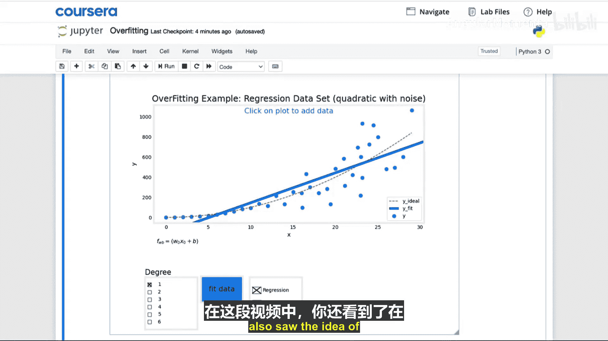
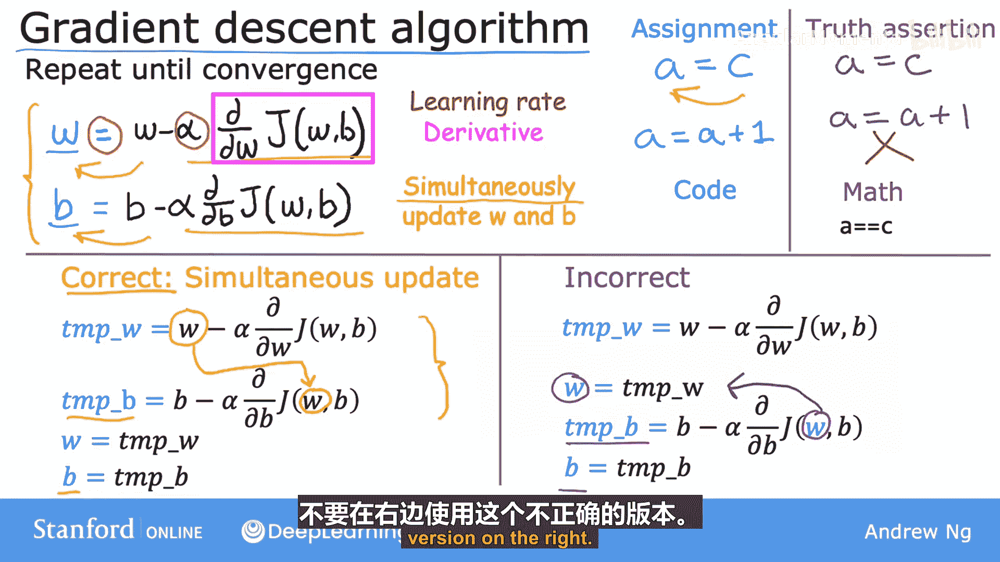

# 018：04_02 应对过拟合 🎯

在本节课中，我们将要学习机器学习中一个常见问题——过拟合，并探讨三种主要的应对策略。过拟合是指模型在训练数据上表现过于完美，以至于捕捉到了数据中的噪声和随机波动，导致在新数据上的泛化能力下降。

上一节我们介绍了过拟合的概念，本节中我们来看看如何解决这个问题。

## 识别与应对过拟合

假设你训练了一个模型，发现它具有高方差，即过拟合。例如，我们有一个过拟合的房价预测模型。

以下是应对过拟合的三种主要方法：

### 1. 获取更多训练数据 🗃️

第一种方法是收集更多的训练数据。如果你能获得更多关于房屋面积和价格的训练样本，那么更大的训练集可以帮助学习算法拟合出一个波动更小的函数。即使你使用高阶多项式或包含许多特征的复杂函数，只要有足够的训练数据，模型仍然可以表现良好。

**总结**：对抗过拟合的首要工具是获取更多训练数据。当数据可用时，这种方法效果显著。然而，获取更多数据并非总是可行的。

### 2. 减少特征数量 🔍

第二种方法是尝试使用更少的特征。在之前的例子中，我们的模型特征包括 `x`、`x²`、`x³`、`x⁴` 等许多多项式特征。减少过拟合的一个直接方法就是减少这些多项式特征的使用。

考虑另一个例子：如果你有大量房屋特征（如面积、卧室数量、楼层、房龄、社区平均收入、到最近咖啡店的距离等）来预测价格，但训练数据不足，模型也可能过拟合。

以下是特征选择的方法：
*   **手动选择**：根据直觉选择你认为最相关的特征，例如只使用面积、卧室数量和房龄。
*   **自动选择**：在后续课程中，你将学习一些算法来自动选择最合适的特征子集。

使用特征子集的一个缺点是，算法会丢弃关于房屋的部分信息。也许所有100个特征都对预测价格有用，你并不想丢弃它们。

### 3. 正则化 🛡️

第三种方法是正则化，这是我们下一节将深入探讨的技术。观察一个过拟合模型（例如使用多项式特征 `x`, `x²`, `x³`... 的模型），你常常会发现其参数值相对较大。

消除某些特征（例如 `x⁴`）相当于将其对应的参数 `w₄` 设置为0。正则化则是一种更温和的方法，它鼓励学习算法**缩小参数的值**，而不一定强制将其设为0。

即使拟合高阶多项式，只要能让算法使用较小的参数值 `w₁, w₂, w₃, w₄...`，你最终也能得到一条更贴合训练数据整体趋势的曲线。

**正则化的作用**是让你保留所有特征，但防止某些特征产生过大的影响（这有时会导致过拟合）。

**惯例**：我们通常只缩小参数 `wⱼ`（即 `w₁` 到 `wₙ`）的大小。是否同时正则化参数 `b` 影响不大，实践中通常只正则化 `w` 参数。

## 总结与回顾

本节课中我们一起学习了应对过拟合的三种方法：
1.  **收集更多数据**：如果可行，这是最有效的方法之一。
2.  **特征选择**：使用特征的一个子集。你将在课程2中了解更多。
3.  **正则化**：通过缩小参数值来减少过拟合。这将是下一节的重点。




正则化是一种非常实用的技术，在训练学习算法（包括后续将学的神经网络）时经常使用。

---

## 监督式机器学习：回归与分类：P18：梯度下降算法实现 ⚙️

在上一节我们讨论了应对过拟合的策略，本节中我们来看看如何实际实现梯度下降算法来训练模型。

在本节中，我们将要学习梯度下降算法的具体实现步骤，包括参数更新规则和“同步更新”这一关键细节。

### 梯度下降更新规则

梯度下降算法的目标是通过迭代，找到使成本函数 `J(w, b)` 最小化的参数 `w` 和 `b`。其核心是以下更新规则：

**对于参数 w**：
`w := w - α * (∂/∂w) J(w, b)`

**对于参数 b**：
`b := b - α * (∂/∂b) J(w, b)`

让我们来分解这个公式：
*   `:=` 是**赋值运算符**（在代码中常用 `=` 表示），意为“取右边的值计算出来，然后存入左边的变量”。这与数学中的等号（断言两边相等）含义不同。
*   `α` （阿尔法）是**学习率**，一个介于0和1之间的正数（例如0.01）。它控制着下山（最小化成本）的步长大小。
*   `(∂/∂w) J(w, b)` 是成本函数 `J` 关于 `w` 的**偏导数项**。这个项指明了下山的方向，并与学习率 `α` 共同决定了步长。

即使你不熟悉微积分，也不必担心，你可以在不了解其数学细节的情况下理解和实现这个算法。

### 关键：参数的同步更新 🔄

模型有两个参数 `w` 和 `b`，需要同时更新它们。**“同步更新”** 意味着在计算新的 `w` 和 `b` 值时，都使用它们**更新前的旧值**。

以下是正确的同步更新实现方式：

```python
# 1. 使用旧的 w 和 b 计算右侧的更新值
temp_w = w - alpha * (dJ_dw) # dJ_dw 代表 (∂/∂w) J(w,b)
temp_b = b - alpha * (dJ_db) # dJ_db 代表 (∂/∂b) J(w,b)

# 2. 同时将计算出的新值赋给 w 和 b
w = temp_w
b = temp_b
```

相反，**不正确**的非同步更新实现如下：

```python
# 先更新 w
temp_w = w - alpha * (dJ_dw)
w = temp_w  # w 已经变成了新值

# 再用已经更新的新 w 值去计算 b 的更新
temp_b = b - alpha * (dJ_db) # 注意：此处的 dJ_db 计算可能因 w 已改变而不准确
b = temp_b
```

在非同步更新中，计算 `b` 的更新时，导数项 `(∂/∂b) J(w, b)` 中的 `w` 已经是更新后的新值，这与梯度下降的定义不符。虽然它可能也能工作，但这不是标准的梯度下降算法。

**结论**：在实现梯度下降时，务必使用**同步更新**。

### 算法流程

梯度下降算法就是重复执行上述两个更新步骤，直到算法**收敛**。收敛意味着到达了一个局部最低点，参数 `w` 和 `b` 随着每次额外的更新变化非常小。



## 总结

本节课中我们一起学习了梯度下降算法的具体实现：
*   理解了参数 `w` 和 `b` 的更新公式：`参数 := 参数 - 学习率 * 导数`。
*   掌握了**同步更新**这一关键实现细节，即使用参数旧值计算所有更新，然后同时赋值。
*   明确了学习率 `α` 和导数项在控制优化步长和方向中的作用。

在下一节中，我们将更深入地探讨导数项的含义，即使没有微积分背景，你也将获得实现和应用梯度下降所需的直观理解。