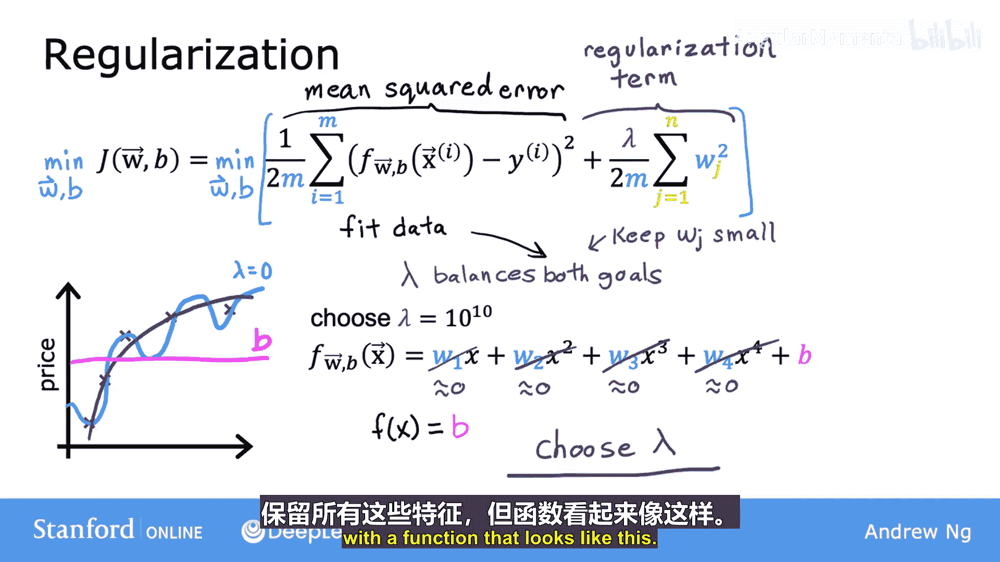
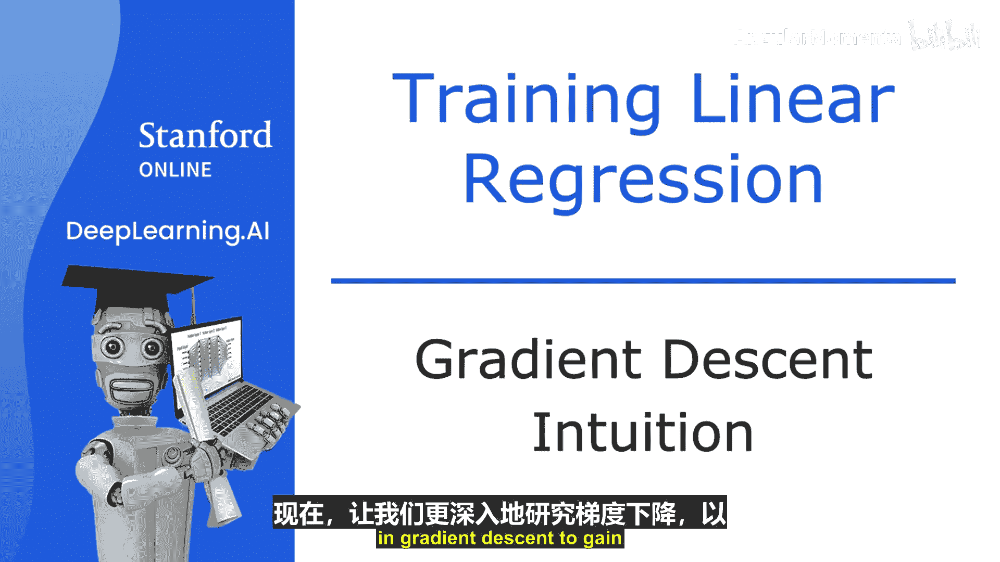
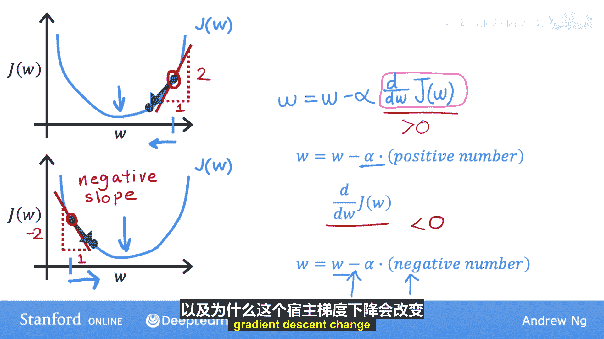

# 019：正则化代价函数 🧠

在本节课中，我们将学习如何通过修改代价函数来应用正则化，以防止模型过拟合。我们将看到，通过在代价函数中添加一个惩罚项，可以鼓励模型参数保持较小的值，从而得到一个更简单、泛化能力更强的模型。

---

在上一节中，我们了解到正则化试图使参数 W1 到 WN 的值变小，以减少过拟合。

本节中，我们将基于这一直觉，为学习算法开发一个修改后的代价函数，以便实际应用正则化。

让我们开始吧。回顾上一节的例子，我们看到，如果用一个二次函数拟合这些数据，会得到一个相当好的拟合结果。但如果用一个非常高阶的多项式，最终会得到一条过拟合数据的曲线。

现在考虑以下情况。假设有一种方法可以使参数 W3 和 W4 变得非常非常小，接近于零。具体来说，我们不是最小化线性回归的原始代价函数，而是修改它，加上 `1000 * w3² + 1000 * w4²`。这里选择1000是因为它是一个大数，但任何其他非常大的数都可以。

通过这个修改后的代价函数，如果 W3 和 W4 很大，模型实际上会受到惩罚。因为要最小化这个新函数，唯一的方法是让 W3 和 W4 都很小，否则这两项会变得非常大。因此，在最小化这个函数时，W3 和 W4 会趋近于0。这实际上几乎抵消了特征 x³ 和 x⁴ 的影响，去掉了这两个高阶项。

如果我们这样做，最终会得到一个更接近二次函数的拟合结果，可能只包含来自 x³ 和 x⁴ 的微小贡献。这比所有参数都很大时得到的那个“波浪形”高阶多项式要好得多，因为它对数据的拟合更好。

更普遍地说，正则化的核心思想是：如果参数值较小，就有点像拥有一个更简单的模型（可能包含更少的特征），因此更不容易过拟合。

在上面的例子中，我们只惩罚（或正则化）了 W3 和 W4。但更常见的实现方式是，如果你有很多特征（比如100个），你可能不知道哪些是最重要的、哪些该被惩罚。因此，正则化的典型实现方式是惩罚所有特征，或者更准确地说，惩罚所有 Wj 参数。可以证明，这通常会导致拟合出一个更平滑、更简单、波动更小的函数，从而减少过拟合。

对于这个例子，如果你有100个特征的房屋数据，可能很难预先决定包含或排除哪些特征。因此，让我们构建一个使用所有100个特征的模型。你有100个参数 w1 到 w100，以及第101个参数 b。因为我们不知道哪些参数是重要的，所以让我们稍微惩罚所有参数，通过添加这个新项来缩小它们：`λ * Σ (j=1 到 n) wj²`，其中 n=100 是特征数量。

这里的值 λ（希腊字母 lambda）被称为**正则化参数**。类似于选择学习率 α，你现在也需要为 λ 选择一个数值。

需要指出的几点：
*   按照惯例，我们使用 `(λ / 2m) * Σ wj²`，而不是 `λ * Σ wj²`。这样，第一项和第二项都按 `1/(2m)` 进行了缩放。事实证明，以相同的方式缩放两项，使得选择 λ 的好值变得更容易一些。特别是，即使你的训练集规模增长（即 m 变大），你之前选择的 λ 值现在也更可能继续有效。
*   另外，按照惯例，我们通常不惩罚参数 b 变大。在实践中，是否惩罚 b 影响很小。一些机器学习工程师和算法实现也会包含 `(λ / 2m) * b²` 项，但这在实践中影响甚微。本课程中更常见的惯例是只正则化参数 w，而不正则化参数 b。

总结一下，在这个修改后的代价函数中，我们希望最小化原始代价（即均方误差成本），再加上被称为**正则化项**的第二项。这个新的代价函数权衡了你可能有的两个目标：
1.  最小化第一项，鼓励算法通过最小化预测值与实际值的平方差来很好地拟合训练数据。
2.  最小化第二项，也试图保持参数 Wj 较小，这将有助于减少过拟合。

你选择的 λ 值指定了这两个目标之间的相对重要性或权衡平衡。

让我们看看 λ 的不同取值会导致你的学习算法做什么。以使用线性回归的房价预测为例，f(x) 是线性回归模型。

*   如果 λ 设为 0，那么你根本没有使用正则化项（因为正则化项乘以了0）。如果 λ 为 0，最终会拟合出那个过度复杂、波动剧烈的曲线，导致过拟合。这是 λ 为零的一个极端。
*   现在看看另一个极端，如果你将 λ 设为一个非常大的数，比如 10¹⁰。那么你给右边的正则项赋予了非常大的权重，最小化它的唯一方法是确保所有 W 的值都非常接近于0。因此，如果 λ 非常大，学习算法会选择 w1, w2, w3, w4 等极其接近于0，从而 f(x) 基本上等于 b。所以学习算法拟合出一条水平直线，导致欠拟合。

回顾一下，如果 λ 为零，模型会过拟合；如果 λ 极大（如 10¹⁰），模型会欠拟合。因此，你需要的是一个介于两者之间的 λ 值，它能更恰当地平衡最小化均方误差和保持参数较小这两个目标。

当 λ 的值不太小也不太大，而是“刚刚好”时，你就有希望拟合出一个四次多项式，保留所有这些特征，但函数看起来像这样：

这就是正则化的工作原理。在后续课程中讨论模型选择时，我们还将看到多种选择 λ 好值的方法。在接下来的两个视频中，我们将详细阐述如何将正则化应用于线性回归和逻辑回归，以及如何使用梯度下降训练这些模型。这样，你就能避免这两种算法的过拟合问题。

---

现在让我们更深入地研究梯度下降，以更好地理解它在做什么以及为什么它有意义。

这是你在上一个视频中看到的梯度下降算法。提醒一下，这个变量 α（希腊字母 alpha）是**学习率**。学习率控制着更新模型参数 W 和 B 时步长的大小。

这里的项 `d/dw` 是一个导数项。按照数学惯例，这个 d 用特殊的字体书写。如果有人是数学博士或多变量微积分专家，他们可能会想：这不是导数，是偏导数。是的，他们是对的。但为了实现机器学习算法，我将其称为导数，不必担心这些细微的区别。

我们现在要关注的是，更直观地理解学习率和这个导数在做什么，以及为什么像这样相乘后，会导致对参数 W 和 B 的更新变得合理。为了做到这一点，让我们使用一个稍微简单的例子，其中我们只最小化一个参数。

假设你有一个只关于一个参数 w 的代价函数 J(w)，其中 w 是一个数字。这意味着梯度下降现在看起来像这样：
`w := w - α * (d/dw) J(w)`
你试图通过调整参数 w 来最小化代价 J。这就像我们之前的例子，我们暂时将 b 设为零。

只有一个参数 w 而不是两个，你可以查看代价函数 J 的二维图，而不是三维图。让我们看看梯度下降在这个函数 J(w) 上做了什么。

横轴是参数 w，纵轴是代价 J(w)。现在让我们用某个起始值初始化梯度下降，比如在这个位置。想象一下，你从函数 J 上的这个点开始。

梯度下降将做的是：将 w 更新为 `w - α * (d/dw) J(w)`。让我们看看这里的导数项意味着什么。

思考该点导数的一种方法是画一条切线，即在该点接触曲线的一条直线。在数学上，这条线的斜率就是函数 J 在该点的导数。要得到斜率，你可以画一个小三角形，计算这个三角形的高度除以宽度，那就是斜率。例如，斜率可能是 2/1。

当切线向右上方倾斜时，斜率为正，这意味着导数是正数，大于0。因此，更新后的 w 将是 w 减去学习率乘以某个正数。学习率总是正数，所以用 w 减去一个正数，你得到的 w 新值会更小。在图上，你向左移动，减小了 w 的值。你可能会注意到，如果你想降低代价 J，这是正确的做法，因为当我们在这条曲线上向左移动时，代价 J 减小，你更接近 J 的最小值（最小值在这里）。所以到目前为止，梯度下降似乎在做正确的事情。

现在让我们看另一个例子。取上面相同的函数 J(w)，假设你在不同的位置初始化梯度下降，比如选择一个在左边的 w 起始值。这是函数 J 上的这个点。

现在，导数项 `(d/dw) J(w)` 是：当我们看这里点的切线时，这条线的斜率是 j 在该点的导数，但这条切线是向右下方倾斜的，因此具有负斜率。换句话说，j 在该点的导数是负数。例如，如果你画一个三角形，高度是 -2，宽度是 1，那么斜率是 -2/1 = -2，是一个负数。

所以当你更新 w 时，你得到 `w - α * (一个负数)`。这意味着你从 w 中减去一个负数。但减去一个负数等于加上一个正数，所以你最终增加了 w。因此，梯度下降的这一步导致 w 增加，这意味着你在图上向右移动，你的代价 J 已经减小到这里。

再次，看起来梯度下降在做合理的事情，它让你更接近最小值。

希望这个视频让你对梯度下降中导数项的作用有了一些直观理解。梯度下降算法中另一个关键量是学习率 α。你如何选择 α？如果它太小或太大会发生什么？在下一个视频中，让我们更深入地看看参数 α，以帮助建立关于它做什么的直觉，以及如何为你的梯度下降实现选择一个好的 α 值。

---

本节课中，我们一起学习了正则化代价函数的核心概念。我们了解到，通过在原始代价函数中添加一个与参数平方和成正比的惩罚项（正则化项），可以控制模型的复杂度。正则化参数 λ 决定了我们更看重拟合数据还是保持模型简单。我们还回顾了梯度下降中导数项的作用，它指引参数更新方向以最小化代价函数。在下一节，我们将探讨学习率 α 的选择及其影响。