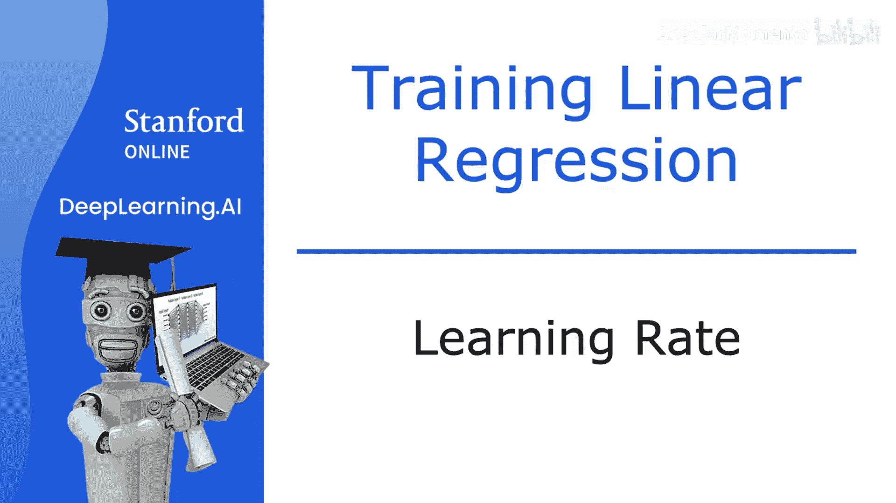
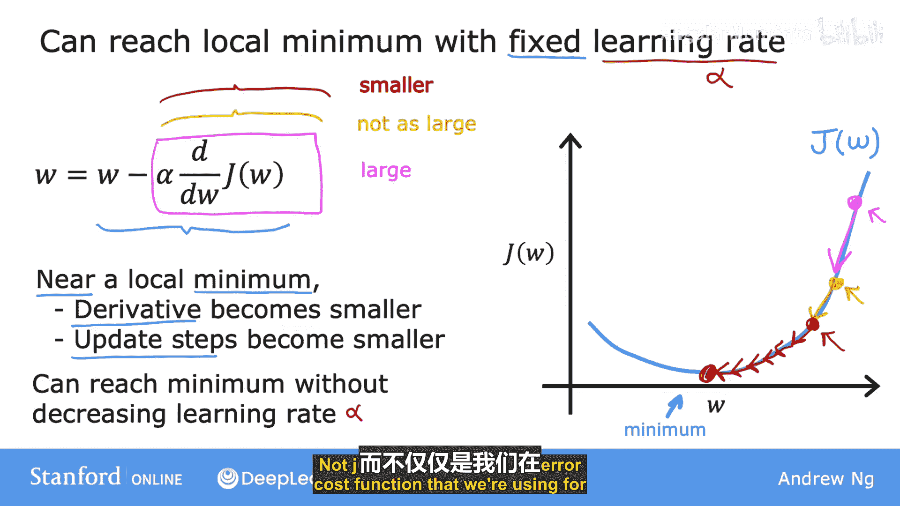
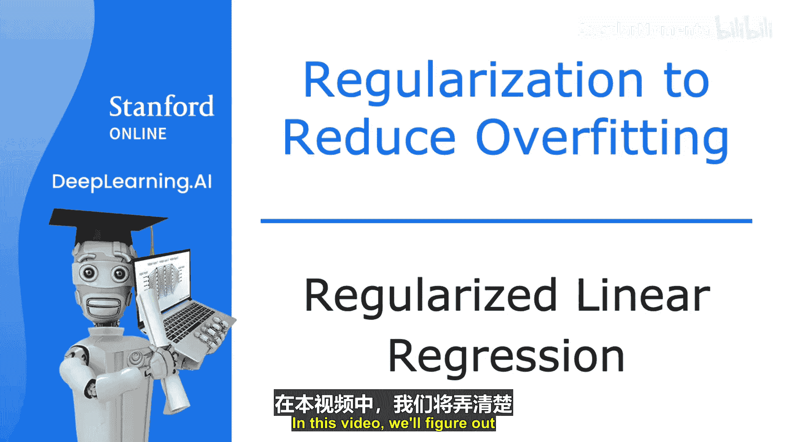
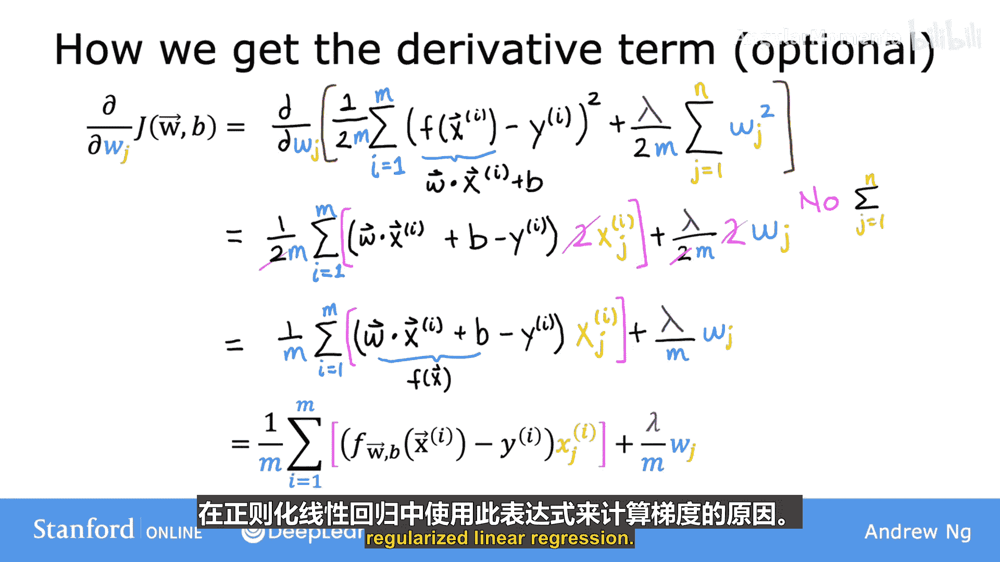

# 020：学习率 📈

在本节课中，我们将深入探讨学习率（α）的选择如何影响梯度下降算法的效率。学习率设置不当，梯度下降可能无法正常工作，甚至完全失效。我们将通过分析学习率过小和过大的情况，帮助你为梯度下降的实现选择更合适的学习率。

## 梯度下降规则回顾

梯度下降的核心更新规则如下：

**公式：**
`w := w - α * (dJ/dw)`

其中，`w` 是参数，`α` 是学习率，`dJ/dw` 是成本函数 `J` 关于 `w` 的导数。

上一节我们介绍了梯度下降的基本概念，本节中我们来看看学习率 `α` 的具体作用。

## 学习率过小的情况

假设我们有一个成本函数 `J(w)`，其图像如下所示。我们从某个初始点开始执行梯度下降。

如果学习率 `α` 设置得过小（例如 0.0000001），那么更新步长会非常微小。以下是学习率过小导致的问题：

*   **进展缓慢**：每次参数更新只能移动一小步。
*   **需要大量迭代**：虽然成本 `J` 最终会下降，但需要非常多的步骤才能接近最小值点。
*   **效率低下**：计算资源消耗大，收敛时间过长。

总结来说，学习率过小时，梯度下降仍然有效，但收敛速度会非常慢。

## 学习率过大的情况

现在，让我们考虑学习率 `α` 设置过大的情况。假设我们从接近最小值的一个点开始。

如果学习率太大，更新步长会非常巨大，可能导致以下问题：

*   **越过最小值**：参数更新会从最小值的一侧“跳”到另一侧。
*   **成本不降反增**：更新后，成本函数值 `J` 可能变得比之前更大。
*   **发散风险**：在后续迭代中，参数可能持续震荡甚至离最小值越来越远，导致梯度下降无法收敛。

因此，学习率过大时，梯度下降可能无法达到最小值，甚至可能发散。

## 已处于局部最小值的情况

一个有趣的问题是：如果参数 `w` 已经位于一个局部最小值点，梯度下降会怎么做？

假设成本函数 `J(w)` 在 `w=5` 处有一个局部最小值。此时，该点的切线斜率为 0，即导数 `dJ/dw = 0`。

根据更新规则：
`w := w - α * 0 = w`

这意味着，**当参数处于局部最小值时，梯度下降更新不会改变参数值**。这正是我们期望的结果，因为它能使解稳定在最小值点。

这个特性也解释了为什么即使使用固定的学习率 `α`，梯度下降也能收敛到局部最小值。随着我们接近最小值，导数会自动变小，从而更新步长也会自动减小。

## 总结与过渡

本节课中我们一起学习了学习率对梯度下降的关键影响。学习率过小会导致收敛缓慢，学习率过大则可能导致算法无法收敛甚至发散。我们还了解到，当到达局部最小值时，梯度下降会自动停止更新。

理解了基础梯度下降后，在接下来的内容中，我们将把梯度下降算法应用到具体的成本函数上。

---

# 监督式机器学习：回归与分类：21：正则化线性回归的梯度下降 🧮

在上一节我们探讨了学习率的基础上，本节中我们来看看如何将梯度下降应用于**正则化线性回归**模型，以解决过拟合问题。

## 正则化成本函数

首先，回顾一下我们为线性回归定义的正则化成本函数：

**公式：**
`J(w, b) = (1/(2m)) * Σ (f(x) - y)^2 + (λ/(2m)) * Σ w_j^2`

其中：
*   第一项是标准的均方误差成本。
*   第二项是正则化项，`λ` 是正则化参数。
*   我们的目标是找到最小化 `J(w, b)` 的参数 `w` 和 `b`。

## 梯度下降更新规则

对于原始的（非正则化）线性回归，梯度下降更新规则是：
`w_j := w_j - α * (∂J/∂w_j)`
`b := b - α * (∂J/∂b)`

对于正则化线性回归，成本函数 `J` 的定义发生了变化，因此导数也需要更新。以下是更新后的导数：

**对 w_j 的偏导数：**
`∂J/∂w_j = (1/m) * Σ (f(x) - y) * x_j + (λ/m) * w_j`

**对 b 的偏导数：**
`∂J/∂b = (1/m) * Σ (f(x) - y)` （注意：`b` 通常不被正则化）

将这两个导数代入梯度下降更新规则，我们就得到了正则化线性回归的完整算法。

以下是实现该算法时，代码需要执行的更新步骤：

*   **更新 w_j (对于 j = 1 到 n)：**
    `w_j := w_j - α * [ (1/m) * Σ (f(x) - y) * x_j + (λ/m) * w_j ]`
*   **更新 b：**
    `b := b - α * [ (1/m) * Σ (f(x) - y) ]`

请记住，所有这些参数的更新必须是**同步**进行的。

## 直观理解更新过程（可选）

为了更直观地理解正则化如何工作，我们可以重写 `w_j` 的更新规则：
`w_j := w_j * (1 - α*(λ/m)) - α * [ (1/m) * Σ (f(x) - y) * x_j ]`

*   第二项 `- α * [ ... ]` 是未正则化时的标准梯度下降更新。
*   第一项 `w_j * (1 - α*(λ/m))` 是新增的。由于 `α`、`λ` 很小，`m` 很大，所以 `(1 - α*(λ/m))` 是一个略小于 1 的数（例如 0.9998）。

**这意味着，在每次迭代中，正则化都会先将 `w_j` 乘以一个略小于 1 的数，使其稍微“缩小”一点，然后再进行标准更新。** 这种持续的轻微缩小效应，就是正则化能够防止权重 `w_j` 变得过大（即防止过拟合）的数学原理。

## 总结

本节课中我们一起学习了如何将梯度下降算法应用于正则化线性回归。关键点在于，只需在计算权重 `w_j` 的导数时加上一项 `(λ/m) * w_j`，即可在更新过程中自动实现对权重的收缩（Shrinkage），从而有效减轻过拟合。

在接下来的课程中，我们将把正则化的思想应用到逻辑回归中，使其也能避免过拟合问题。