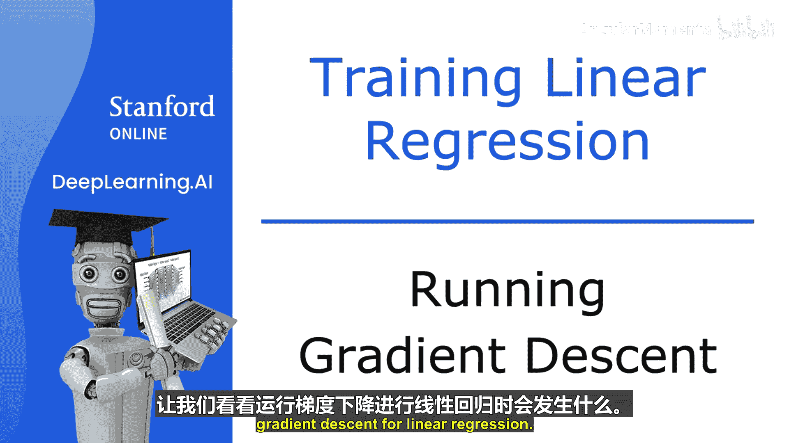
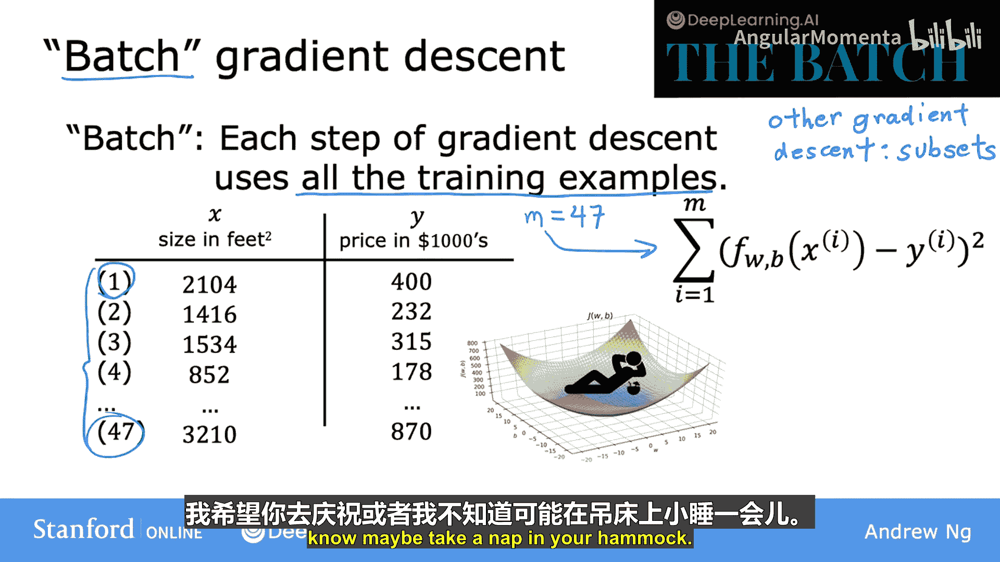
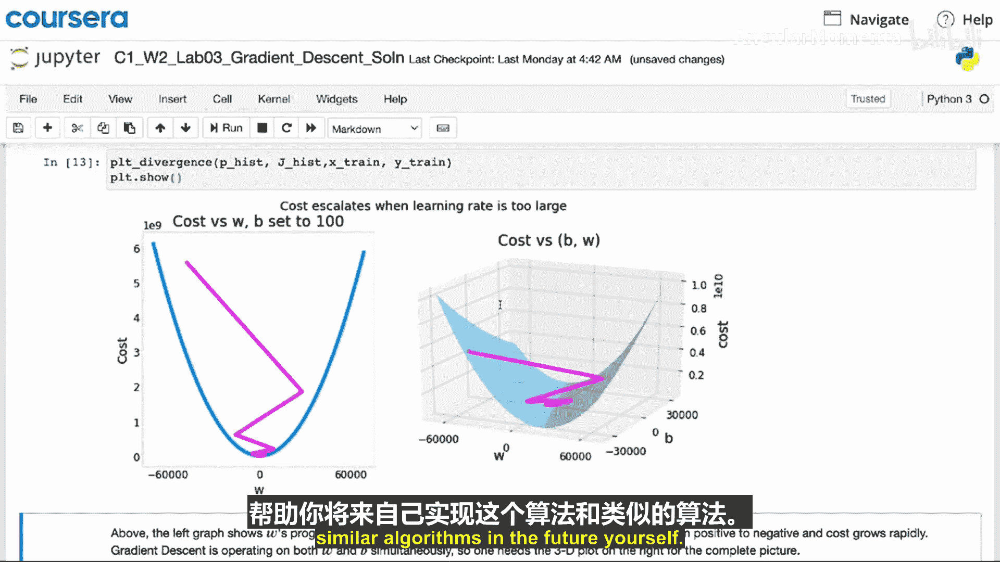

# 022：运行梯度下降

在本节中，我们将观察梯度下降算法在线性回归中的实际运行过程。我们将看到模型参数如何更新，以及成本函数如何逐步降低，最终得到一个拟合数据的模型。

## 梯度下降过程演示

上一节我们介绍了梯度下降算法的原理，本节中我们来看看它在实际中是如何运行的。

左上角是模型与数据的拟合图，右上角是成本函数的等高线图。底部则是同一成本函数的三维曲面图。

通常，参数 **w** 和 **b** 的初始值都设为0。但为了演示，我们将 **w** 初始化为 -0.1，**b** 初始化为 900。这对应于初始模型函数：
**f(x) = -0.1x + 900**

现在，如果我们使用梯度下降执行一步更新，成本函数的值会从初始点移动到另一个点，即向右下方移动。同时，拟合直线也会发生轻微变化。

再执行一步更新，成本函数移动到第三个点，函数 **f(x)** 再次发生变化。随着更新步骤的进行，每次更新后成本都在降低，参数 **w** 和 **b** 沿着一条轨迹移动。

观察左侧，对应的直线拟合效果越来越好，直到我们达到全局最小值。全局最小值对应的这条直线，是对数据相对较好的拟合。这个过程就是梯度下降，我们将用它来拟合房价数据。

现在，你可以使用这个 **f(x)** 模型来预测客户或任何人的房屋价格。例如，如果你朋友的房子面积为1250平方英尺，你可以根据模型预测其价格可能约为25万美元。

## 批量梯度下降

更准确地说，这个梯度下降过程被称为**批量梯度下降**。

术语“批量梯度下降”指的是，在梯度下降的每一步中，我们都会查看**全部**训练样本，而不是训练数据的一个子集。

在计算梯度下降的导数时，我们计算的是从 **i=1** 到 **m** 的总和。批量梯度下降在每次更新时都会查看整个批次的训练样本。

批量梯度下降可能不是最直观的名称，但这是机器学习社区的通用叫法。DeepLearning.AI 发布的新闻通讯《The Batch》也以此机器学习概念命名。

实际上，还有其他版本的梯度下降算法，它们不在每次更新时查看整个训练集，而是查看训练数据的较小子集。但对于线性回归，我们将使用批量梯度下降。

## 线性回归小结

以上就是线性回归的全部内容。恭喜你完成了第一个机器学习模型的学习。

在本视频随后的可选实验中，你将回顾梯度下降算法及其代码实现。你将看到成本随着训练迭代次数增加而降低的图表，以及通过等高线图观察成本如何随着梯度下降找到更好的参数 **w** 和 **b** 而接近全局最小值。

请记住，完成可选实验只需阅读并运行提供的代码，无需自己编写代码。建议你花些时间完成实验，并熟悉梯度下降的代码，因为这将有助于你未来自己实现此算法及类似算法。

## 本周总结与下周预告

感谢你坚持学完第一周的最后一个视频，恭喜你一路走到这里，你正在成为一名机器学习实践者的道路上。

除了可选实验，如果你还没有完成，建议你查看练习测验。这是检验你对概念理解程度的好方法。第一次未能全部答对也完全没关系，你可以多次参加测验，直到获得满意的分数。

现在，你已经知道如何实现单变量线性回归，这标志着本周内容的结束。

下周，我们将学习如何使线性回归更强大。我们将不再局限于像房屋面积这样的单一特征，而是学习如何处理多个特征。你还将学习如何拟合非线性曲线。这些改进将使算法更有用、更有价值。

最后，我们还将介绍一些实用技巧，这些技巧对于让线性回归在实际应用中有效工作至关重要。

很高兴你能一起参与这门课程的学习，期待下周与你再见。😊

---

**本节课中我们一起学习了：**
1.  梯度下降算法在线性回归中的实际运行过程。
2.  **批量梯度下降**的概念，即每次更新使用全部训练数据。
3.  如何用训练好的模型进行预测。
4.  本周课程的总结和下周关于多特征、非线性拟合及实用技巧的预告。