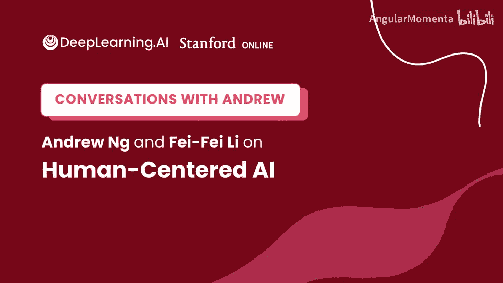
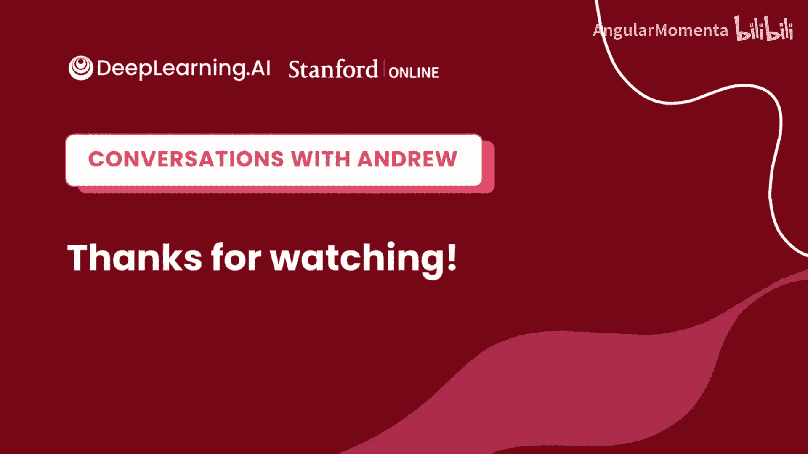

# 023：吴恩达与李飞飞关于以人为本的人工智能 🧠

在本节课中，我们将通过吴恩达与李飞飞教授的对话，了解人工智能领域的宏大愿景、个人成长故事以及该领域面临的机遇与挑战。本节内容将激励初学者思考AI的未来与自身在其中的角色。

## 概述

本节内容源自吴恩达与李飞飞教授的一次深度对话。李飞飞教授是斯坦福大学计算机科学教授，也是以人为本人工智能研究所（HAI）的联合主任。对话涵盖了从物理学背景转向AI的心路历程、ImageNet数据集创建的背后故事、AI在医疗等领域的应用、政策制定的参与，以及对AI教育普及的思考。我们将从中提炼出对初学者有启发的核心观点。

## 从物理学到人工智能的转变 🔄

上一节我们介绍了本次对话的背景，本节中我们来看看李飞飞教授独特的学术转型之路。

李飞飞教授最初在普林斯顿大学主修物理学。物理学培养了她提出宏大问题、追寻“北极星”式目标的热情。在阅读二十世纪伟大物理学家的著作时，她发现许多后期作品都在探讨生命、智能和人类意识等同样大胆的问题，这引发了她对智能这一主题的好奇。

在本科期间，她曾在几个神经科学实验室实习，特别是与视觉相关的领域。这使她意识到，探究智能的本质与探究宇宙起源或物质构成同样是意义深远的问题。因此，她决定从物理学转向人工智能领域的研究生学习，尽管当时正处于“AI寒冬”时期。

## ImageNet的起源与意义 🖼️

上一节我们了解了李飞飞教授进入AI领域的历程，本节中我们来看看她最具影响力的工作之一——ImageNet的创建故事。

李飞飞教授的博士研究专注于使用机器学习方法解决现实世界的物体识别问题。但她很快遇到了AI和机器学习领域持续至今的核心挑战：**模型泛化能力不足**。当时，计算机视觉模型容易过拟合，且缺乏足够的数据。

她和导师Pietro Perona意识到，如果相信物体识别这个“北极星”问题，就需要更多数据。他们首先创建了Caltech 101数据集，这为后来的工作奠定了基础。然而，从数学角度出发，Caltech 101的数据量仍不足以支撑更强大的算法。

于是，他们决定启动ImageNet项目——一个包含22000个类别、约1500万张图片的超大规模数据集。这个想法在当时遭到了不少质疑，但正是这个庞大的数据集最终释放了巨大价值，为全球无数研究者提供了关键资源，极大地推动了深度学习在计算机视觉领域的发展。

## 人工智能在医疗健康领域的应用 🏥

上一节我们探讨了基础研究中的关键突破，本节中我们来看看AI技术如何应用于解决现实世界的重要问题，例如医疗健康。

李飞飞教授的研究方向也跟随视觉智能在动物中的演化而发展。她关注两个主题：一是寻找能改善人类生活的 impactful 应用领域，因此投身医疗健康研究；二是探究视觉的本质，这引导她尝试闭环感知与机器人学习。

大约十年前，一个数字令她震惊：每年有约25万美国人死于医疗差错。其中，医院获得性感染导致的死亡人数超过9.5万，是交通事故死亡人数的2.5倍以上。许多这类问题源于临床操作规范（如手部卫生）在繁忙的医疗环境中难以被持续遵守和反馈。

当时正值自动驾驶技术兴起，李飞飞教授与斯坦福医学院的Arnold Milstein博士合作，意识到智能传感和机器学习算法同样可以应用于医疗环境。他们开启了“环境智能”研究议程，旨在利用智能传感器帮助临床医生和患者提升安全。

在将AI应用于真实人类环境时，除了机器学习问题，还会面临许多“人”的问题，例如隐私保护。他们的初期技术使用了不捕获RGB信息的深度摄像头来保护隐私。随着技术进步，设备端推理、联邦学习、差分隐私和加密技术等，都为隐私保护计算提供了新的工具集。

## 参与政策制定与生态建设 ⚖️

上一节我们看到了AI技术解决实际问题的潜力，本节中我们来看看确保技术向善发展所需的政策与生态建设。

李飞飞教授意识到，AI对人类生活的影响迅速而深远，有时是负面的。如果专家不参与政策讨论和制定，将不利于技术的发展。因此，她积极参与政策工作，推动AI向更有利于人类的方向发展。

斯坦福HAI研究所参与推动了一项名为《国家AI研究资源任务组法案》的政策。该法案旨在召集任务组，为美国公共部门（尤其是高等教育和研究机构）制定路线图，以增加其获取AI计算资源和数据的途径。其目标是 rejuvenate 美国AI创新与研究的生态系统。这是一项激励性政策，而非监管性政策。

## 给初学者的建议与AI4ALL计划 💡

上一节我们讨论了宏观的政策与生态，本节中我们回归个人视角，看看李飞飞教授对AI初学者有何建议，以及她为促进AI教育公平所做的努力。

对于刚开始接触机器学习的人，可能会因为领域发展迅速而感到不知所措。李飞飞教授认为，今天的AI为来自不同背景的人提供了多种入口。

*   **技术路径**：互联网上有极其丰富的学习资源，从Coursera、YouTube到GitHub，全球学生都能接触到比过去多得多的学习材料。
*   **非技术路径**：如果你对下游应用、创造力、政策、社会问题、伦理、历史或政治科学充满热情，AI领域同样有大量工作需要完成，有许多未知问题等待探索。例如，数字时代的经济如何定义？生成式AI对音乐、艺术等领域的创造力意味着什么？

她强调，这是一个非常激动人心的时代，任何背景的人，只要对此充满热情，都能找到自己的角色。

基于对AI领域缺乏多样性的关切，李飞飞教授在2015年与同事共同发起了“SAILORS”夏令营（后发展为“AI4ALL”非营利组织），旨在鼓励高中生，特别是年轻女性和传统上未被充分代表的社区的学生，学习并参与AI。该组织通过夏令营、在线课程和大学通路项目，持续支持学生们的职业发展。

## 总结

本节课中，我们一起学习了李飞飞教授分享的宝贵见解：
1.  **跨学科背景的价值**：物理学背景培养的宏大问题视角，可以成功迁移到AI研究。
2.  **坚持“北极星”目标**：从Caltech 101到ImageNet的成功，源于对一个核心问题（物体识别）的持续追求和大胆实践。
3.  **AI向善的应用**：将AI技术应用于医疗健康等关键领域，可以解决重大的现实问题，同时需重视隐私等伦理挑战。
4.  **参与塑造未来**：AI的发展需要技术专家积极参与政策讨论和生态建设，以确保其负责任地发展。
5.  **广泛的参与机会**：AI领域欢迎来自任何背景的参与者，无论是技术还是非技术路径，都有巨大的探索空间和贡献价值。
6.  **促进包容与公平**：通过“AI4ALL”等倡议，努力让更多样化的人群参与塑造AI的未来，至关重要。

李飞飞教授的经历和观点表明，人工智能仍是一个非常年轻的领域，充满未知和机遇，正等待着新一代的探索者和塑造者。