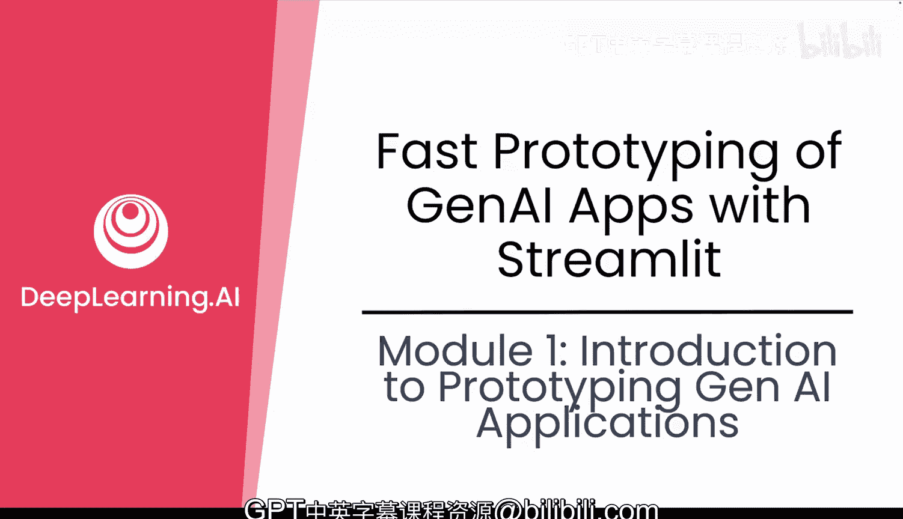
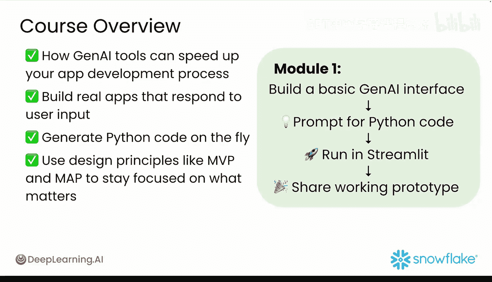
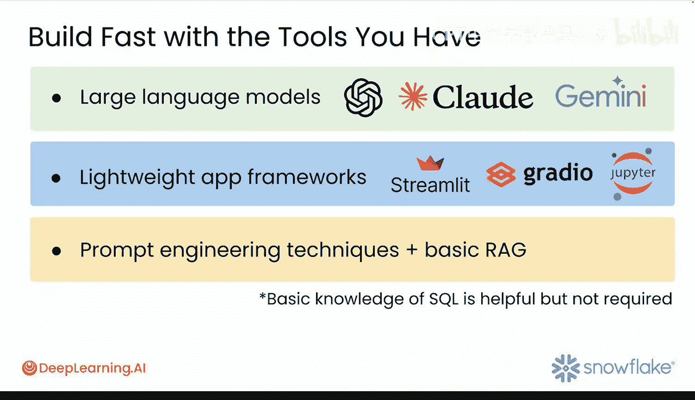

#  002：生成式AI应用原型设计入门 🚀

在本节课中，我们将要学习如何利用 Python 和 Streamlit 来快速构建生成式 AI 应用的原型。软件开发的方式已经改变，生成式 AI 可以成为你的编程伙伴，帮助你快速将想法转化为可运行的代码。

## 课程目标与结构 🎯

上一节我们介绍了课程背景，本节中我们来看看本课程的具体目标和结构安排。

本课程的目标不是单纯展示工具，而是帮助你快速构建真正可用的应用。你将从一个简单的命令行脚本开始，最终开发出功能完备的 Web 应用，这些应用将包含图表、数据分析和交互式聊天机器人等功能。

课程结构注重快速上手，通过实践项目来边做边学。在第一个模块结束时，你将拥有一个功能完整的原型，它可以接收用户输入、生成代码、在 Web 界面中实时运行代码并可视化数据。

## 你将学到什么 📚

以下是本课程的核心学习内容：

*   学习生成式 AI 工具如何加速你的应用开发流程。
*   构建能够响应用户输入并实时生成 Python 代码的真实世界应用。
*   应用诸如**最小可行产品**和**任务受众优先级**等设计原则，以专注于重要事项。

## 第一模块重点 🔧

接下来，我们聚焦于第一模块。该模块将帮助你构建一个基础的生成式 AI 界面来展示你的想法。

以下是第一模块的具体步骤：

1.  提示生成式 AI 模型以生成 Python 代码。
2.  在可共享的 Streamlit 应用中运行生成的代码。

最终，你将获得一个由生成式 AI 驱动、可部署至云端的工作原型，随时可以测试或分享。

## 所需工具与技能 🛠️

为了顺利完成本课程，你需要准备一些工具并具备相关技能。

以下是课程中可能用到的工具和技术：

*   **大型语言模型**：例如 ChatGPT、Claude 或 Gemini。
*   **轻量级应用框架**：例如 Streamlit、Gradio 或 Jupyter Notebooks。
*   **提示工程技巧**和基本的 Web 设置。

如果你熟悉 Python 编程，了解生成式 AI 和提示的基础知识，那么本课程非常适合你。具备基本的 SQL 知识会有所帮助，但不是必需的。

## 灵活性与结语 💡

虽然本课程的示例将使用 Streamlit，但你完全可以尝试任何你喜欢的 Web 应用框架和任何你熟悉的生成式 AI 模型。这里的目标不是精通每一个工具，而是学习如何在你熟悉的环境中快速实现功能。

我希望你能享受这门课程，并期待在下一个视频中与你相见。

---

**本节课中我们一起学习了**生成式 AI 应用原型设计的入门知识，包括课程目标、你将学到的技能、第一模块的重点内容以及所需的工具和预备知识。核心在于掌握快速将想法转化为可工作原型的流程和方法。