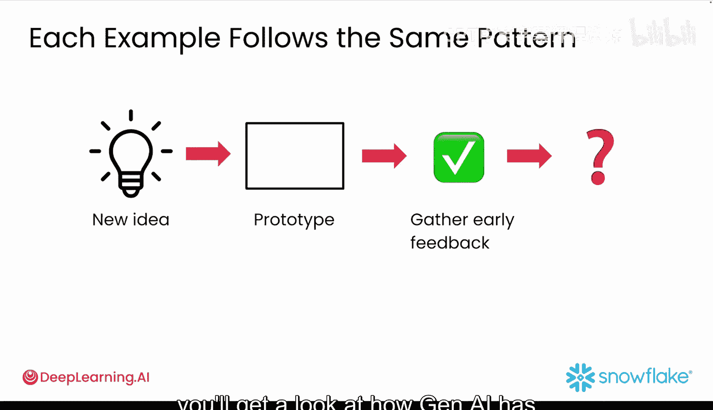
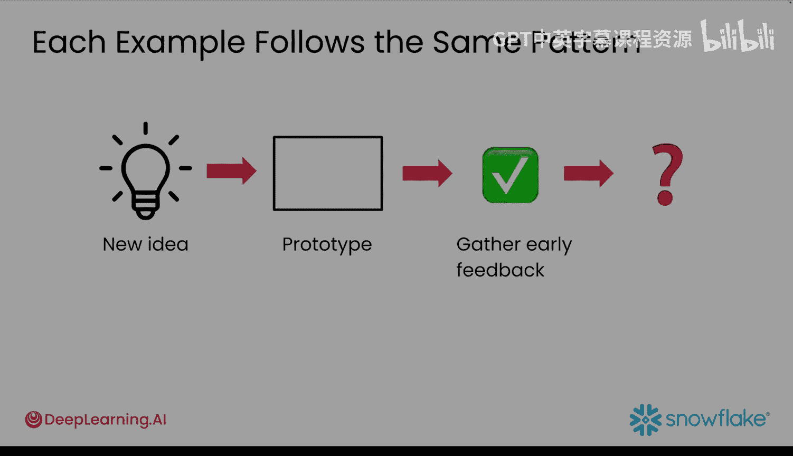

#  003：原型设计的优势 🚀

在本节课中，我们将要学习为什么原型设计对于生成式 AI 应用开发至关重要。我们将探讨原型如何帮助应对 AI 产品的不确定性，并通过真实案例了解其巨大价值。

---

当你向 ChatGPT 提出同一个问题两次时，请思考一下。你得到完全相同的答案了吗？通常不会。这就是构建 AI 产品很棘手的原因。在用户真正使用之前，你永远无法知道他们会对你的生成式 AI 应用作何反应。

你无法猜测他们会问什么问题。你也无法预测生成式 AI 何时会给出一个令人困惑的答案。这种不确定性意味着，与常规软件相比，你需要更早、更频繁地测试你的想法。这就是原型设计的关键所在。

## 什么是原型？🎯

上一节我们提到了不确定性带来的挑战，本节中我们来看看应对挑战的核心工具——原型。

一个原型是一个想法的快速、轻量级且可感知的版本。它并不完美，也无需完美。原型被快速构建出来，以便你能测试某些东西、从中学习并进行迭代。

以下是关于原型的关键点：
*   原型不是为了打磨完善或功能完整而设计的。
*   它们用于测试，而非用于生产环境。
*   原型通常会在后续过程中被丢弃或大幅修改。

在本课程中，你将专注于为生成式 AI 应用进行原型设计。在开发生成式 AI 应用时，用一个原型来展示你的愿景，每一次都胜过仅仅口头描述你的想法。

## 为什么需要原型？💡

了解了原型的定义后，我们来看看它具体能解决哪些问题。

当你希望在投入数周开发之前尽早获得反馈、在不构建完整产品的情况下测试有风险的想法，以及用真实数据和真实用户验证你的假设时，制作原型是必不可少的。原型非常适合早期阶段的实验。

与其创建容易被误解的详细规格说明，不如快速构建一个原型，它能精确展示你的应用如何工作。这让人们能够体验你的愿景，而不是凭空想象。

《福布斯》将“未能制作原型”列为软件项目失败的十大原因之一。

## 一个反面案例：Alex 的故事 ⚠️

理论可能有些抽象，让我们通过一个具体的失败案例来加深理解。

我的同事 Alex（为免尴尬，此为化名）就是一个很好的例子。他有一个绝妙的想法：开发一个能检测沮丧客户并自动将其转接给人工客服的 AI 聊天机器人。他非常兴奋，以至于做了许多开发者会做的事：跳过原型设计，直接开始编写规格说明。

Alex 认为他可以通过书面需求和粗略草图来解释他的愿景。毕竟，他已经在脑海中清晰地规划好了：一个对话式界面，AI 能在检测情感线索的同时给予共情回应。

然而，没有原型，Alex 无法清晰地传达他的愿景。当他说“对话式界面”时，他的开发人员构建了下拉菜单和表单。当他提到“情感分析”时，他们构建了一个关键词检测器，将“我需要帮助”这类信息标记为愤怒的客户。

在为期六周的开发周期中，这种脱节越来越严重。Alex 会说“让它更直观一些”，但没有具体的原型作为参考，每个团队成员都用自己的假设填补了空白。最终的产品将他伟大的想法埋没在一个笨拙的界面之下：客户在输入前必须浏览多个下拉菜单，而 AI 的回应感觉非常机械——这与 Alex 的初衷完全相反。

当他向领导层展示时，一位高管说：“这感觉像是从我们当前的支持系统退步了。”经过六周的开发，这个项目被悄悄搁置了。一个本可以改变他们客户体验的、极具创新性的想法就此夭折。如果 Alex 当初花哪怕一周时间构建一个简单的原型，他的团队或许就能建成他所设想的产品。

## 原型的成功范例 🌟

失败案例令人警醒，但成功的原型更能启发我们。构建原型不仅仅是理论，它是许多成功企业用来推出和增长产品的、经过验证的策略。

原型可以采取多种不同的形式，并且不应该复杂化。一个原型可以简单到只是一个用于收集电子邮件地址的登录页面、一个用于测试核心想法的基本应用，甚至是一个用于解释概念以评估兴趣的视频。

以下是几个著名的例子：
*   **Airbnb**：其创始人通过在一次设计会议期间出租自己的公寓来首次测试他们的想法。这个基本原型帮助完善了概念，并在扩展为我们今天所知的全球旅行平台之前，收集了关键的早期反馈。
*   **Uber**：始于一个简单的愿景——在旧金山将高端乘客与豪华车司机连接起来。他们的原型是一个基础应用，仅在一个城市连接一种类型的乘客与一种类型的汽车。这种有限的推出让他们能够测试核心功能并在扩展到其他城市和车辆类型之前收集用户反馈。
*   **Instagram**：其第一个原型只专注于带有基本滤镜的照片分享。随着平台发展，用户反馈和参与度推动了如今功能（如视频分享、直接消息和故事）的开发。
*   **Spotify**：其原型专注于通过庞大的音乐库提供流畅的流媒体服务。用户反馈和市场需求催生了社交分享和播放列表等新功能，这些现在已成为该平台的核心功能。
*   **GPTZero**：由一名普林斯顿学生构建，旨在检测文本是由 ChatGPT 还是人类撰写的。它使用 Streamlit 免费的社区云发布，在几天内就爆火了：700 万次浏览、大量媒体报道和全球关注——所有这些都由一个轻量级的 Streamlit 应用驱动，使得构建、部署和即时扩展变得非常容易。

请注意每个例子都遵循相同的模式：从一个想法开始，创建一个专注的原型，然后根据客户反馈进行迭代和改进。所有这些公司都不得不以艰难的方式做事，但你拥有使用生成式 AI 来使原型设计真正快速且简单的优势。

---

本节课中我们一起学习了原型设计在生成式 AI 应用开发中的核心优势。我们明确了原型的定义，理解了它如何应对 AI 的不确定性，并通过正反案例看到了尽早、快速构建原型对于验证想法、避免资源浪费和确保产品成功的关键作用。在下一个视频中，你将看到生成式 AI 如何彻底改变了原型设计的过程。