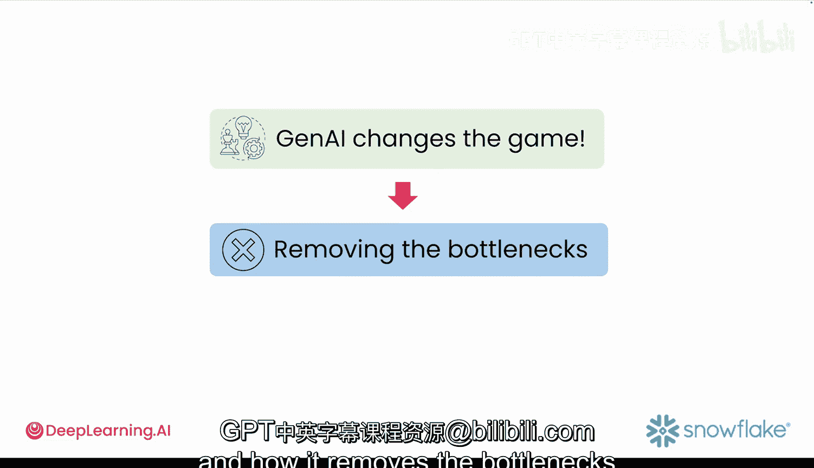

#  004：生成式AI如何革新原型设计 🚀

在本节课中，我们将要学习生成式AI（GenAI）如何从根本上改变和加速应用原型设计的过程，特别是数据应用和AI工具的开发。

## 概述

在生成式AI出现之前，构建应用原型，尤其是数据应用和AI工具，是一个非常耗时的过程。即使你有一个绝佳的想法，也需要花费数小时甚至数天来构建一个基础可用的版本。开发者需要反复编写相同的设置代码，例如加载库、创建输入表单、格式化页面布局。这些工作并非针对你的核心创意，但在测试任何想法之前，你都必须手动完成它们。

生成式AI移除了这个瓶颈。在测试之前，你不再需要编写每一个函数、连接每一个依赖项，甚至规划整个流程。

## 传统原型设计流程

上一节我们提到了传统方法的耗时问题，本节中我们来看看一个具体的例子。想象一下，你有一个想法：创建一个用于分析客户产品评论情感倾向的应用。

在没有生成式AI的情况下，你需要遵循以下步骤：

以下是构建该应用所需的主要步骤：

1.  **设计界面**：设计一个包含文本框（用于粘贴评论）、按钮（用于运行分析）和结果展示区的界面。
2.  **编写代码**：编写代码来实现上述界面。
3.  **连接后端逻辑**：将前端输入连接到后端处理逻辑。
4.  **导入分析库**：导入用于情感分析的库。
5.  **处理数据**：清理和加载你的数据。
6.  **构建逻辑**：逐步构建分析逻辑。
7.  **展示结果**：编写代码来展示结果，可能以图表或表格的形式。
8.  **测试与修复**：最终进行测试，修复错误，并重构不合理的部分。

即使是一个如此简单的应用，也可能需要数天时间来构建。如果效果不符合预期，你必须手动地、逐块地回去修改代码。

## 生成式AI驱动的原型设计

现在，让我们尝试用生成式AI来实现同样的想法。你只需在一个生成式AI应用中输入一段提示（Prompt），要求它“创建一个Streamlit应用，让用户可以粘贴评论、运行情感分析，并将结果以饼图展示”。

在几秒钟内，AI就会生成代码。它会导入必要的库、设置界面、运行分析并创建图表。你点击运行，就可以立即开始测试你的想法。

这正是生成式AI的强大之处：它移除了大部分重复的设置工作，让你能专注于测试真正重要的部分。

## 思维模式的转变

但生成式AI的意义不仅在于编写更少的代码，更在于它改变了你的思维方式。

在传统的软件开发中，你的思维模式是 **“先规划，后构建”**。你会从架构、数据模型和依赖关系的角度去思考，然后再编写代码。

**公式：传统思维 = 规划 -> 构建**

而生成式AI将这个过程翻转了。你不再从结构开始，而是从意图开始。你描述你希望发生什么，然后生成式AI模型会给你一个可以交互的成果。

**公式：GenAI思维 = 意图 -> 交互式成果**

因此，你的思考方式从 **“我该如何构建这个？”** 转变为 **“测试这个想法是否可行最快的方法是什么？”**。这是一种完全不同的心态，将你从“解决方案优先”推向“探索优先”。这种转变是革命性的。

生成式AI将软件开发变成了你与大型语言模型（LLM）之间、原型与用户之间、问题与可能性之间的一场对话。

## 降低开发门槛

生成式AI最令人兴奋的一点是，它向更多人敞开了软件开发的大门。

以前，如果你不会编程，你的想法通常只能停留在脑海中，或者躺在演示文稿里。现在，教师、医生、研究人员和组织者等人士，无需成为全职开发者，也能构建出解决实际问题的可用应用。

当然，如果你已经掌握编程技能，这些技能非但不会受到威胁，反而会成为你的超能力。你可以行动得更快，构建更灵活的工具，并引导AI精确地生成你所需的内容。你的技能依然至关重要，生成式AI只是帮助你跳过重复的部分，专注于最重要的环节。

## 总结

本节课中，我们一起学习了生成式AI如何革新原型设计。通过生成式AI，你可以在几秒钟内从想法过渡到可运行的代码，所需的设置更少，技术壁垒更低，从而有更多时间专注于构建和测试核心功能。在下一节视频中，你将看到生成式AI如何改变游戏规则，以及它如何移除了过去拖慢一切进度的瓶颈。