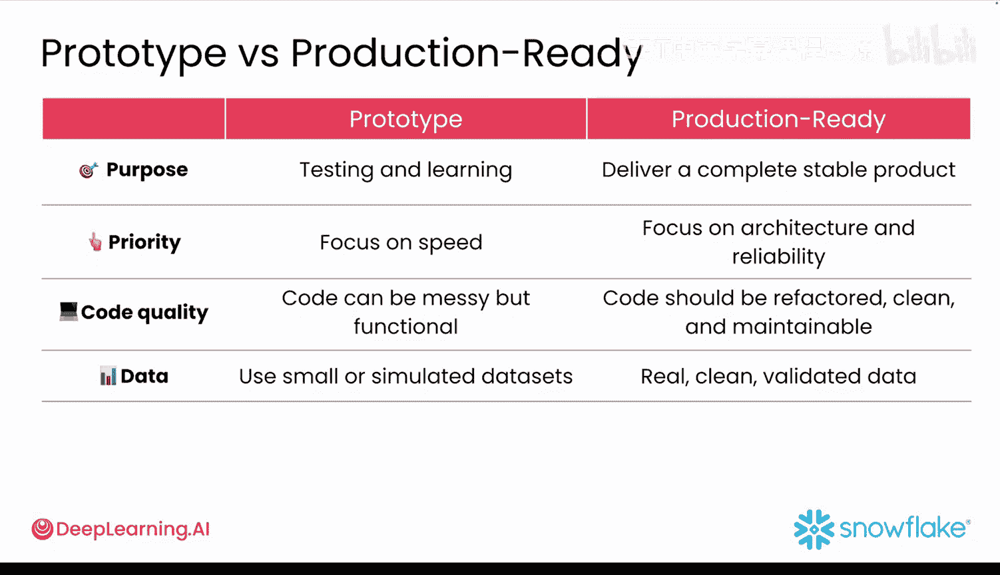

#  005：GenAI 原型开发周期 🚀

在本节课中，我们将要学习生成式 AI 应用的原型开发周期。我们将了解为何传统开发流程不适用于 GenAI 项目，并掌握快速构建、测试和迭代原型的关键步骤与核心组件。

## 概述

在开始构建之前，有必要从宏观视角了解原型开发在整个流程中的位置。

## 传统开发与 GenAI 开发的差异

上一节我们介绍了课程背景，本节中我们来看看开发流程的根本区别。

在传统开发周期中，你从一个详细的计划开始。设计完整的系统。编写代码，进行测试，最后部署。这对于需求明确、固定的项目效果很好。但对于 GenAI 应用实验来说，这种方式太慢了。

GenAI 的开发过程是不同的。你并不总是知道输出会是什么。GenAI 模型可能会让你感到意外。你的提示词可能会失效。导致意外的行为、错误或糟糕的结果。用户的行为方式也可能出乎你的预料。

因此，与其遵循严格的计划，你需要快速构建、频繁测试并迅速调整。这就是原型开发发挥作用的地方。

## 原型开发的核心地位

原型开发在你有了想法之后立即开始。并且在你投入全面开发之前进行。这是你用真实输入、真实输出和真实反馈快速测试想法的地方。尤其是在构建 GenAI 应用时，原型开发不仅仅是可有可无，它是必不可少的。

原型开发帮助你探索模型的行为方式，以及微小的改变如何产生巨大的差异。即使提示词方式的细微变化，也可能导致结果是“真金白银”还是“毫无意义的胡言乱语”。原型开发还让你能够用真实用户测试你的应用，观察他们如何思考、点击，有时甚至会完全忽略显而易见的东西。

你将在早期发现边缘情况，例如当你的模型自信地回答了一个你根本没问的问题时。你也能快速了解你的想法是坚实可靠、令人惊讶，还是需要在投入数周时间之前进行方向调整。

你会多次回到原型开发阶段，每次你都有新功能要测试或新问题要解决。在本课程中，你将把原型开发作为默认的开发模式。这意味着始终在构建一些东西，一些你可以测试、分享或迭代的东西。即使它只是一个非常粗糙的草稿。

## 生成式 AI 应用的核心组件

每个基础的 GenAI 应用都有四个关键部分。

以下是构成一个可工作原型的四个核心组件：

1.  **用户界面**：这是人们使用和与你的应用交互的方式。它可以是一个简单的 Streamlit 应用、一个聊天机器人，甚至只是在笔记本中运行的代码。
2.  **逻辑**：这是你应用的核心。它接收用户的输入、问题或数据，并将其发送给 AI 以获取响应。
3.  **数据**：从简单的东西开始你的原型，比如一个 CSV 文件或一份 PDF 文档。这为你在测试期间提供了真实的信息，但不需要在复杂的数据集上花费大量精力。
4.  **AI 服务连接**：需要连接到一个 AI 服务，如 GPT-4 或 Claude。AI 服务负责智能思考，而你的应用处理围绕它的一切其他事务。

可以这样理解：界面让人们与你的应用对话。逻辑负责决定要做什么。数据为你提供了可操作的内容。而 AI 则承担了繁重的计算工作。将这四部分组合在一起，你就有了一个可工作的原型。

## GenAI 开发周期示例

以下是你的 GenAI 开发周期将呈现的样子。

1.  **构思**：首先想出一个创意。
2.  **构建**：使用 Python 和 Streamlit 快速构建一个原型。
3.  **测试**：使用一小组真实数据测试原型。
4.  **分享**：分享原型以获取用户的反馈。
5.  **迭代**：根据你学到的东西改进提示词、代码或界面，并决定是否值得将其开发成功能完整的应用。

过去需要数周完成的事情，现在可以在几分钟内完成。这就是快速原型开发的力量。

## 原型与生产应用的对比

了解原型与完整生产应用之间的区别非常重要。这样，你才能设定正确的目标。

原型帮助你探索想法。它帮助你回答问题。而生产应用则需要可靠和安全。

以下是它们的对比：

*   **目的**：
    *   **原型**：用于测试和学习。
    *   **生产应用**：用于交付完整、稳定的产品。
*   **优先级**：
    *   **原型**：专注于速度。
    *   **生产应用**：专注于架构和可靠性。
*   **代码质量**：
    *   **原型**：代码可以有些混乱但功能正常。
    *   **生产应用**：代码应该经过重构、清晰且可维护。
*   **数据**：
    *   **原型**：可以使用小型或模拟数据集。
    *   **生产应用**：需要真实、干净且经过验证的数据。

## 总结

本节课中我们一起学习了 GenAI 应用的原型开发周期。我们认识到，对于 GenAI 项目，构建一个小型可运行的原型，将其置于真实数据或真实用户面前，并观察其表现，是至关重要的。因为对于 GenAI 来说，最快的学习方式就是尽早构建、频繁测试并实时调整。

在下一个视频中，你将了解更多关于开发者在匆忙进行 GenAI 原型开发时常犯的最大错误，以及可以为你节省数小时挫折感的简单技巧。让我们继续深入。