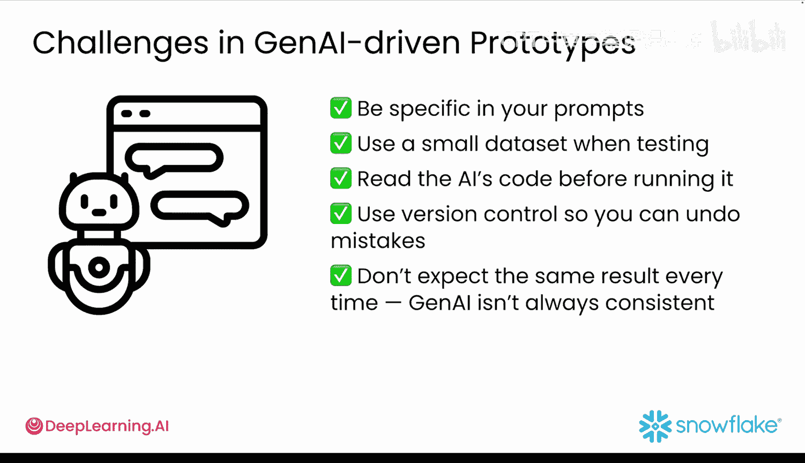

#  006：避免常见陷阱 🚧

在本节课中，我们将要学习在使用生成式AI进行快速原型开发时，如何识别并避免一些常见的陷阱。生成式AI虽然能加速开发，但也带来了新的挑战。

## 概述

生成式AI能加快开发速度，但它也带来了一些新的挑战。相同的提示词可能不会每次都产生相同的结果，措辞上的微小变化可能导致意想不到的结果。此外，当你并非亲自编写每一行代码时，调试会变得更加困难。如果不够谨慎，生成式AI在帮助你快速前进的同时，也可能让你陷入混乱。

## 陷阱一：过度设计原型

上一节我们介绍了生成式AI带来的挑战，本节中我们来看看第一个常见陷阱：过度设计原型。

我们都曾在构建AI应用时犯过这个错误，即过度设计我们的原型。人们很容易对生成式AI的能力感到兴奋，并要求它一次性构建所有东西：用户界面、后端、数据库和分析图表，全部塞进一个巨大的提示词中。这只会迫使模型生成过多的代码，而这些代码片段可能无法很好地协同工作。调试会变成一场噩梦，你将花费数小时来梳理结果，甚至忘记最初想要构建什么。

解决方案相当直接：保持简单，一次只尝试一个想法。与其要求一次性构建完整的应用程序，不如从一个小功能开始，比如一个单一的函数或一个简单的UI组件。这能让你拥有更多控制权，并更容易发现问题所在。当任务被明确定义时，生成式AI才能发挥最佳效果。

## 陷阱二：在获得反馈前追求完美

另一个常见陷阱是试图在获得任何反馈之前就完善所有细节。你很容易花费过多时间调整提示词、重新设计图表或争论按钮颜色，而实际上还没有人使用过这个应用。

可以尝试另一种方法：先完成80%，然后获取反馈。你的原型不需要很漂亮，它需要的是有用。这意味着要向真实用户展示它，了解哪些部分有效，然后再进行改进。

例如，假设你正在构建一个提供个性化建议的生成式AI应用。你可能会担心令牌限制或缓存问题。但在处理这些之前，首先应该问：人们是否喜欢这些推荐？问一个更简单的问题：用户觉得这个功能有帮助吗？他们是否真的采取了行动？先构建足够的功能来测试这个核心目标，美化工作可以稍后进行。

## 陷阱三：忽视代码可读性与团队协作

假设你的原型运行良好，现在你的团队很兴奋，准备在此基础上进行构建。这很棒，但这里有一个问题：从AI获得的代码可能不易于理解，尤其是当你并非代码的原作者时。这很正常，因为你当时追求的是速度，而这是正确的选择。现在到了分享工作成果的时候，以下方法可以让你的团队更轻松：

以下是几个让团队协作更顺畅的实践：
*   **添加注释**：用注释解释哪些部分是由AI生成的。
*   **保持结构简单**：坚持使用简单的文件名和文件夹结构。
*   **使用熟悉的技术栈**：使用你的团队已经了解的工具。
*   **利用AI编写测试**：使用生成式AI帮助你编写一些快速的测试用例。

现在花一点时间进行清理，将来会省去很多麻烦。

## 有效测试你的原型

不要只是点击运行然后祈祷一切顺利。通过以下步骤有效地测试你的提示词和原型：

以下是测试原型的关键步骤：
1.  **从简单开始**：从简单的提示词开始，仔细观察它的返回结果。
2.  **迭代提示词**：尝试重新措辞提示词，使其更简单，或给出更清晰的指令。微小的调整可以极大地改变结果。
3.  **检查输出**：运行一些边界情况测试，例如空输入或异常输入。检查AI的输出是否合理，而不是在“幻觉”（即生成无意义或错误内容）。
4.  **进行用户测试**：请其他人试用。观察他们在哪里感到困惑。
5.  **记录与调试**：锁定你的输入和输出，以便后续调试。修复发现的问题，然后再次测试。

你并不是在进行全面的质量保证测试，你只是在试图回答一个问题：这个想法值得构建吗？

## 让原型开发更顺畅的简单习惯

在利用AI进行构建时，养成以下简单习惯可以让原型开发过程更加顺畅：

以下是几个推荐的习惯：
*   **提示词要具体**：在你的提示词中尽可能具体。
*   **使用小数据集测试**：测试时使用小型数据集。
*   **运行前阅读代码**：在运行AI生成的代码之前先阅读它。
*   **使用版本控制**：使用版本控制系统，以便可以撤销错误。
*   **接受结果的不一致性**：不要期望每次结果都相同，生成式AI并不总是完全一致的。

## 总结与核心理念

本节课中我们一起学习了如何避免生成式AI原型开发中的常见陷阱。让我用最重要的一点来总结：**你的原型注定是一次性的**。

你构建它是为了学习：如果它能帮助人们，并且AI能很好地处理任务，那太好了，你可以在此基础上构建更多。如果不行，那也是个好消息，因为你为自己节省了大量时间。

下一节视频将向你介绍课程项目和数据集，以便你了解在本课程剩余部分将要构建的内容。让我们一起来看看吧。