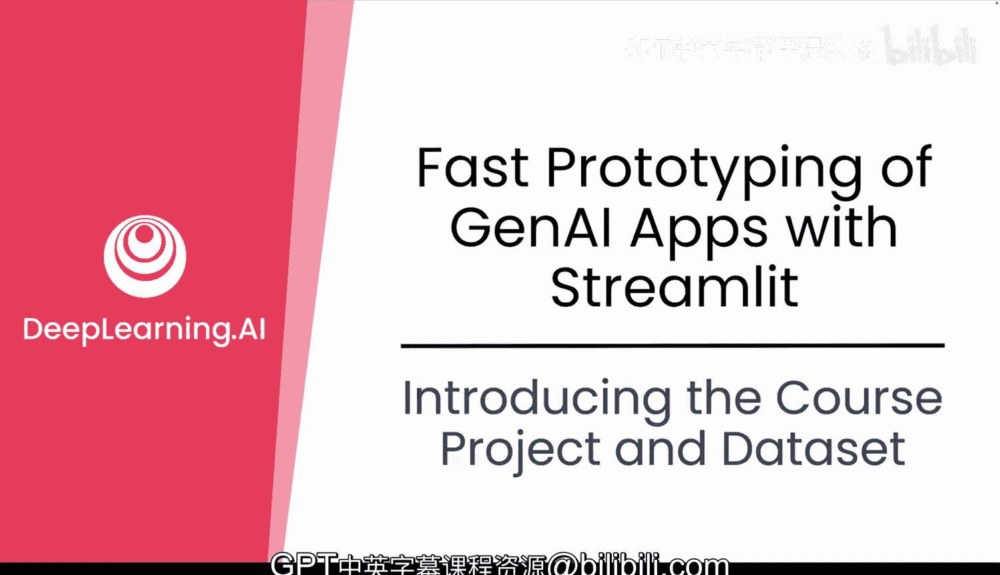
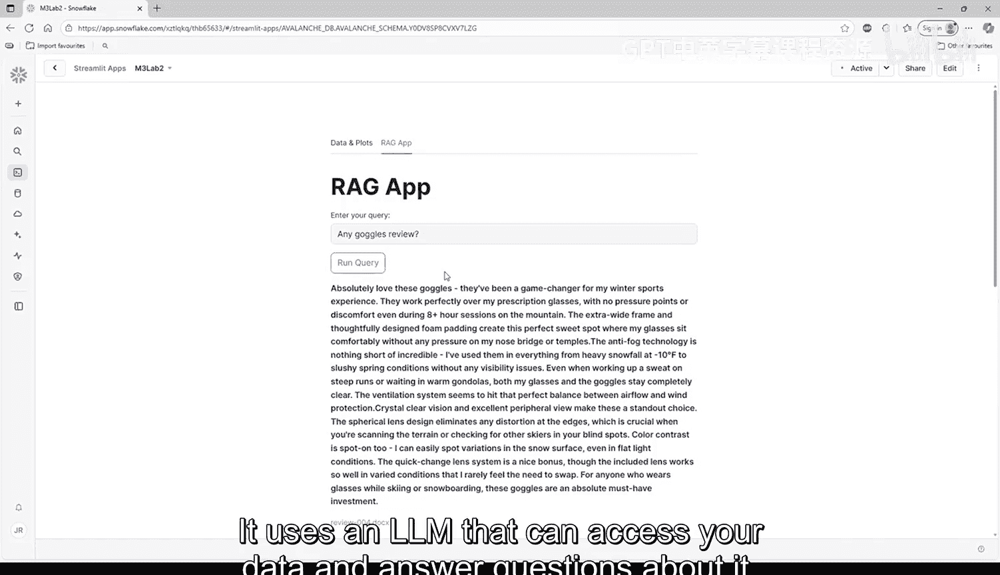

#  007：课程项目与数据集介绍 🎯

在本节课中，我们将介绍整个课程的核心实践项目。你将扮演一家名为“雪崩”的户外装备公司的数据科学家，使用生成式AI技术，构建一个能自动化分析客户评论情感的原型应用。

## 项目背景与目标

在接下来的课程中，你将扮演“雪崩”户外装备公司的数据科学家。你的老板交给你一项非常熟悉的任务：分析哪些冬季产品表现良好，哪些产品受到客户差评。你曾多次对同一份“雪崩”客户评论数据集进行情感分析，但这次，你将构建一个AI原型来自动化整个工作流程。

这类现实世界的任务非常适合生成式AI。它具有重复性、有明确的成功指标，并且老板要求快速得到答案。在整个课程中，你将构建一个由生成式AI驱动的真实应用，该应用能够按产品和交付状态计算平均情感得分、分析客户情感，并允许用户用自然语言提问。

你将从一个简单的Streamlit界面开始，逐步升级为一个完整的仪表板和AI助手。课程结束时，你将拥有一个能够回答“生成式AI能否帮助我们团队更快理解客户反馈？”的工作原型。

## 项目阶段概览

以下是整个课程项目的三个阶段规划：

**第一阶段**：你将使用Jupyter和OpenAI，配合Pandas加载和清理数据，构建一个简单的交互界面，用图表和过滤器可视化结果，并将你的第一个原型发布到网上。你将使用生成式AI来帮助你编写代码。

**第二阶段**：你将转移到Snowflake平台，上传原始文本文件，将其摄取并存储为结构化格式，使用Snowflake内置的AI工具进行分析，然后部署一个功能齐全、包含聊天机器人的应用。

**第三阶段**：你将把你的聊天机器人连接到数据，并通过提示工程和检索增强生成技术来改进其回答。你将学习快速获取反馈的技巧。

这是一个有指导的项目，但你将有充足的空间进行自定义和实验。如果你想尝试LangChain或其他生成式AI API，尽管去尝试。

## 数据集介绍

你将使用“雪崩”数据集，这是一个专为本课程构建的虚构数据集。

让我们探索一下客户评论文件，其格式为CSV。在这个文件中，每一行代表一条客户评论，包含以下字段：
*   **产品名称**
*   **评论日期**
*   **评论文本**
*   **情感得分**：范围在-1（非常负面）到+1（非常正面）之间

课程开始时，你将使用一个名为 `customer_reviews.csv` 的预清理CSV文件。在课程后期，你将学习如何自己一步步构建和清理“雪崩”客户评论数据。

如果你想更深入，我们还提供了原始评论文件的DOCX版本，以便你可以在第二模块中测试文件摄取功能。

## 最终应用预览

现在，你将预览最终的Streamlit应用。应用顶部将有两个标签页：

**第一个标签页**显示按产品划分的情感得分图表，然后是数据表的预览。你可以按产品筛选表格，并查看每个产品按交付状态划分的情感得分。

**第二个标签页**有一个文本输入框，允许你使用自然语言对数据提问。它使用一个能够访问你的数据并回答相关问题的语言模型。

## 课程总结

本节课中，我们一起了解了课程的核心项目——为“雪崩”公司构建一个生成式AI驱动的客户情感分析应用。我们明确了项目目标，概述了从简单原型到功能齐全的仪表板与聊天助手的三个阶段开发路径，并介绍了将要使用的数据集结构。

现在你已经了解了最终项目的样子，我们准备开始深入实践。在下一个视频中，你将学习如何应用一个简单的框架来构建原型，这将帮助你确定要构建什么以及哪些功能最重要。让我们开始构建一些智能的东西，让你的工作变得更轻松。