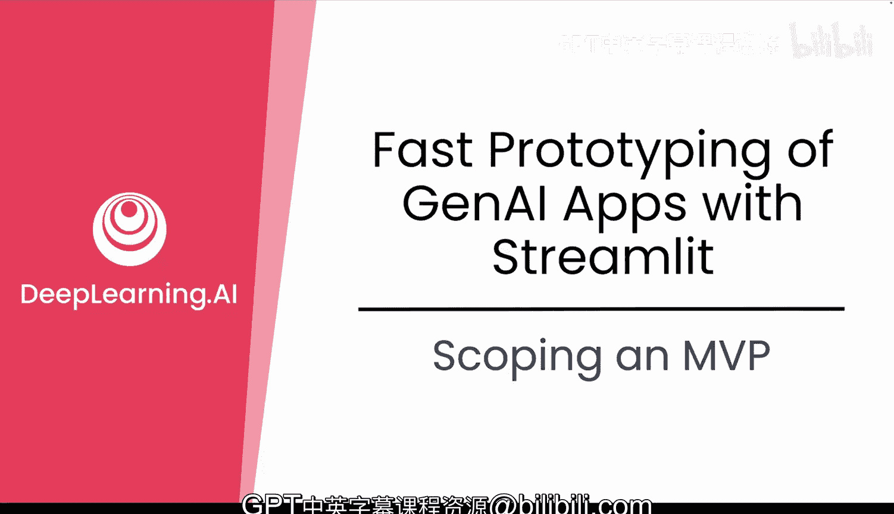
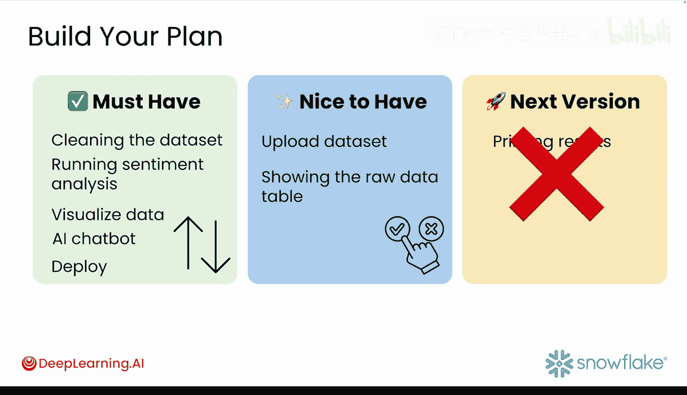

#  008：确定 MVP 范围 🎯

在本节课中，我们将要学习如何为你的生成式 AI 应用确定最小可行产品（MVP）的范围。这是启动任何项目前最关键的一步，能帮助你避免过度开发，专注于解决核心问题。

## 概述：什么是 MVP？

在开始构建之前，你需要决定构建什么。答案不是构建全部，而是构建**最小可行产品**。这是你的想法中，能够解决实际问题的最小版本。许多 AI 开发者在这里会偏离轨道，他们过于兴奋，过度构建，最终导致精力耗尽。我们不应这样做。

最小可行产品（MVP）是一个帮助你更聪明、而非更费力地构建的框架。Eric Ries 在其著作《精益创业》中推广了这一概念，它已被证明对开发团队极具价值，因为它专注于快速学习。我们使用这个框架来帮助你高效地规划和构建原型。

你越快构建出可测试的东西，就能越快获得反馈并进行改进。这就创造了一个“计划、构建、测试、学习、改进、重复”的实用循环。这样想：花一天时间构建一个东西，获得反馈，并重复这个循环10次，远比花10天构建一个东西，只获得一次反馈要有用得多。

## 如何定义你的 MVP

以下是你可以用来定义 MVP 的简单框架，它被称为 **MAP**：**使命**、**受众**和**优先级**。

*   **使命**：你的最终目标是什么？
*   **受众**：你为谁而构建？
*   **优先级**：你需要首先做什么？其他一切都可以等待。

### 明确你的使命 🧭

定义你的使命意味着从一个基本问题开始：**你试图解决什么问题？**

首先确定你的应用将解决的具体痛点或低效环节。要具体。不要说“我想构建一个 AI 聊天机器人”，而应该说“客服人员每次通话需要花 20 分钟查找产品信息，我想将其减少到 2 分钟”。你的最终目标应该是具体且可衡量的，它将成为你开发过程中每个决策的“北极星”。

你应该问的第二个问题是：**你如何知道你的应用解决了问题？**

要解决一个真正的问题，你需要一种方法来知道它何时被解决。这就是指标的作用。它们告诉你你的解决方案是否真的有效。例如，如果你的问题是数据科学家花费太多时间重复相同的工作流程，那么你的成功指标可能是将设置时间从 5 小时减少到 30 分钟。

### 了解你的受众 👥

了解你的受众塑造了一切，从界面的复杂性到你使用的编程语言。你无法为所有人构建，因此要确定你的主要用户群体。

以下是一些帮助你定义目标受众的关键问题：
*   他们是技术专家还是完全的新手？
*   他们对现有解决方案最大的不满是什么？
*   他们目前使用什么变通方法？
*   他们如何衡量自己角色的成功？

### 确定你的优先级 ⚡

这是你弄清楚原型中哪些功能绝对必要、哪些可以等待的地方。你试图快速构建出可用的东西，因此要将重点放在一个核心工作流程上。

问自己：**如果只能构建一个功能来展示这个应用的价值，那会是什么？**

## 应用到 Avalanche 项目

现在，让我们将所有内容带回 Avalanche 项目。

首先问最重要的问题：**你正在解决什么问题？以及你如何知道它被解决了？**

目前，你的团队不断重建相同的情感分析工作流程。他们还花费了太多时间手动挖掘客户评论来回答简单问题。所以，你的工作就是解决这个问题。

你的目标是**自动化设置流程**，这样就不必有人不断重做；并**使其易于直接从数据中获取快速答案**。

那么，你如何知道它是否有效呢？从小处着手。只需询问用户：“这为你节省时间了吗？”如果答案是肯定的，那你就走对了路。你以后总可以添加更复杂的指标，但现在，简单的反馈足以让你有信心继续前进。

你的 Avalanche 应用有两个主要用户：
1.  你的经理：只想快速获得答案，无需等待。
2.  你的队友：一遍又一遍运行情感分析的数据科学家。

他们目前都面临同样的痛点。每次他们做这项工作时，都必须从头开始重建流程。这意味着收集数据、清理数据、分析情感、构建图表，并一遍又一遍地回答相同的后续问题。如果你了解他们在哪里浪费时间，你就可以设计你的应用来精确修复这些点。这就是你构建人们真正会使用的东西的方法。

## 从功能到构建计划

这里有一个难题：**如果只能构建一个功能，哪个功能对于测试你的想法是否有效最为关键？**

这可能很难回答。因此，先从勾勒大图景开始。不需要很花哨，只需在 Google 幻灯片或纸上快速画个布局。

想象一下最终的仪表板有四个标签页：
*   一个名为“时间”的标签页，让用户查看特定时间段的情感。
*   一个名为“产品”的标签页，显示选定产品的平均情感得分。
*   一个名为“数据”的标签页，在交互式表格中显示原始数据集。
*   最后一个名为“聊天”的标签页，让用户向 AI 询问有关数据的问题。

现在，让我们把这个功能列表变成一个实际的构建计划。

1.  **划掉“下一版本”列中的所有内容**。你现在还不构建那些。
2.  **将你的“必须有”功能按构建顺序排列**。这就成了你的开发路线图。
3.  **挑选一两个“最好有”的功能**，将它们作为延伸目标放在一边。只有在你提前完成或它们很容易添加时才构建它们。

## 总结

本节课中，我们一起学习了如何设定清晰的目标、了解你的用户、定义成功标准以及确定构建的优先级。在使用生成式 AI 时，这一点尤其重要，因为很容易被那些并不真正解决核心问题的花哨功能分散注意力。通过保持简单并专注于真正重要的事情，你可以更快地构建一个可工作的原型，然后根据真实反馈进行测试和改进。

在下一个视频中，你将看到如何访问核心材料并开始处理课程 GitHub 仓库中的项目文件。