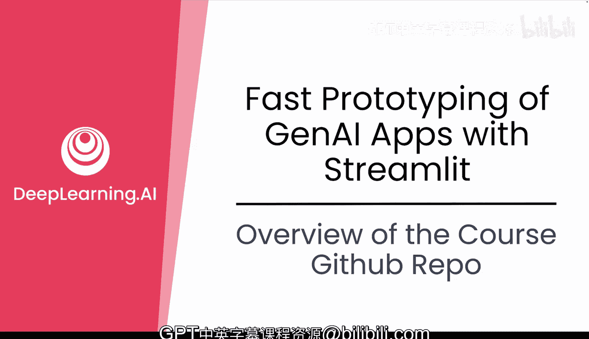
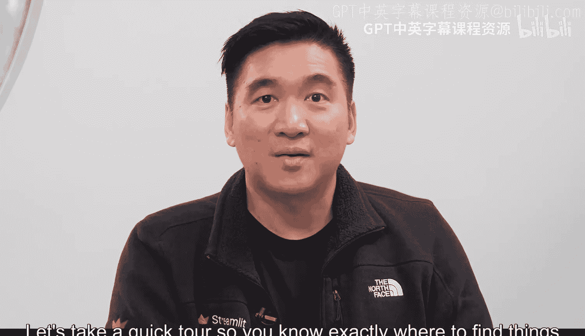
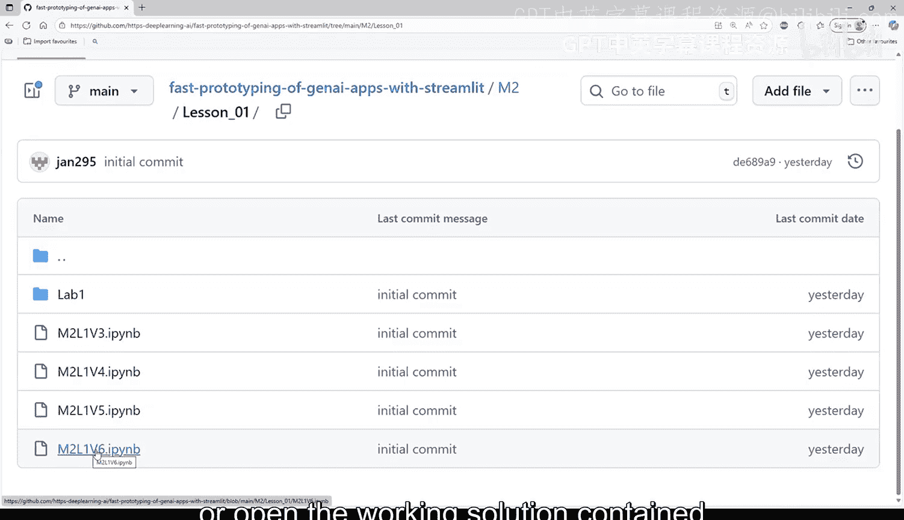
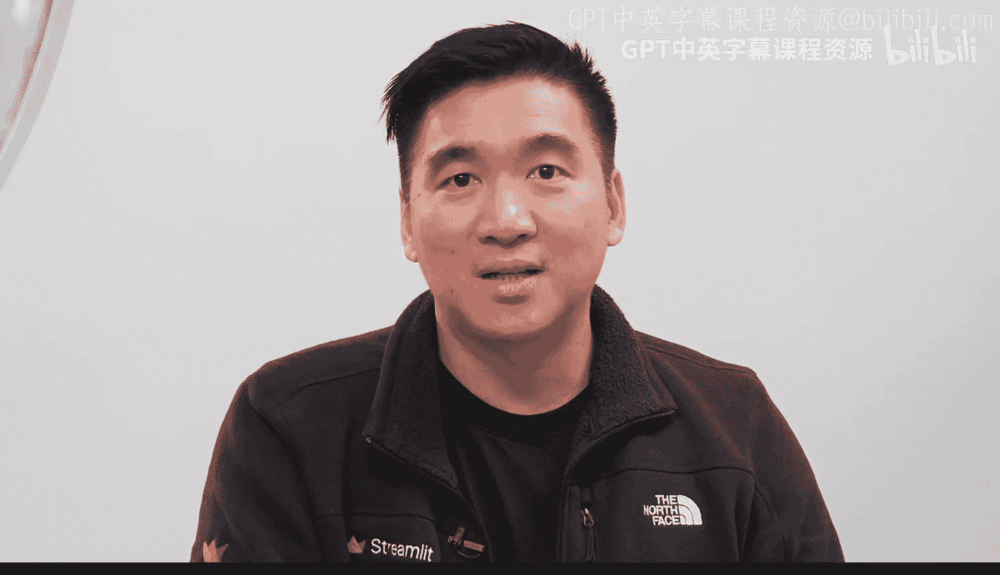

#  009：课程 GitHub 仓库概览 🗂️

在本节课中，我们将学习如何获取并理解本课程提供的所有代码与资源。我们将概览课程 GitHub 仓库的组织结构，并指导你如何将其克隆到本地，以便跟随视频进行实践。

## 概述

你已经制定了项目计划，现在准备开始构建。让我们快速浏览一下课程资源，以便你确切地知道在哪里找到所需文件以及它们是如何组织的。

## 仓库结构与内容

所有你需要的文件都位于课程的 GitHub 仓库中，你可以在屏幕底部显示的链接中找到它。

打开 GitHub 链接后，你会看到多个文件夹。

以下是仓库的主要组成部分：

*   **`data` 文件夹**：用于存储雪崩（avalanche）数据集。
*   **模块文件夹**：每个课程模块都有一个对应的文件夹（例如 `module1`）。在这些文件夹中，你可以找到跟随视频学习所需的所有代码。

模块文件夹内的代码进一步按课程划分。每个课程文件夹包含视频中使用的 Python 文件或 Notebook，以及一个 `lab` 文件夹（其中包含完成实验所需的所有必要文件）。在需要时，你还会看到一个 `requirements.txt` 文件。

这个文件将帮助你安装项目特定部分所需的所有依赖项。例如，在 `module1` 文件夹中有一个 `requirements.txt`，你可以使用它来安装模块一所需的一切。

此外，你还会发现一些其他文件：

*   **`.env.example`**：这是一个示例环境变量文件。你需要通过将其重命名为 `.env` 来复制它，并在其中添加你的 OpenAI API 密钥。
*   **`README.md`**：这是一个简短的指南，帮助你快速开始。如果你已经熟悉克隆仓库的操作，可以跳过本视频。

## 如何获取课程文件

获取所有课程文件最简单的方法是将仓库克隆到你自己的计算机上。这允许你在学习过程中修改代码。

要克隆仓库，请按照以下步骤操作：

1.  使用屏幕顶部的链接进入主仓库页面。
2.  在页面右上角附近找到绿色的 “Code” 按钮。
3.  复制显示的地址（通常以 `git@` 或 `https://` 开头）。
4.  如果你在计算机上安装了 Git，在命令行中输入 `git clone`，然后粘贴你刚刚复制的地址。
5.  如果你没有在命令行中安装 Git，可以使用 GitHub 桌面 UI：点击 “File”，然后选择 “Clone repository”。

克隆完成后，请确保你的仓库副本设置为公开（Public）。这将便于后续在 Snowflake 上进行部署。

## 文件命名与使用

课程 GitHub 仓库为你提供了一个清晰、简单的项目结构，预装了雪崩数据集和你的起始文件。

在仓库中，每个涉及代码操作的视频都对应一系列文件。为了便于定位，这些文件通常被命名为类似 `M1_L1_1` 的格式，代表模块 1、第 1 课、视频 1。

你可以使用仓库中的文件来跟随学习，也可以在观看视频时从头开始编写自己的代码。通常，视频内容是循序渐进的，因此你可以继续使用已创建的代码，或者打开每个相应仓库文件夹中包含的完整解决方案。

## 总结

本节课中，我们一起学习了课程 GitHub 仓库的组织结构。你现在已经获得了构建原型所需的代码、数据和工具。该仓库提供了一个清晰、简单的项目结构，预装了雪崩数据集和起始文件。

从这里开始，你将在每个模块文件夹中编辑 `streamlit_app.py` 文件，逐步为你的生成式 AI 应用构建功能。

在下一课中，你将通过与生成式 AI 共同创建 MVP（最小可行产品）计划，将规划更进一步。你将学习如何使用提示词来帮助你思考范围、逻辑和实施步骤，从而更快地推进并保持专注。让我们让生成式 AI 不仅用于编写代码，也帮助你更智能地进行设计。