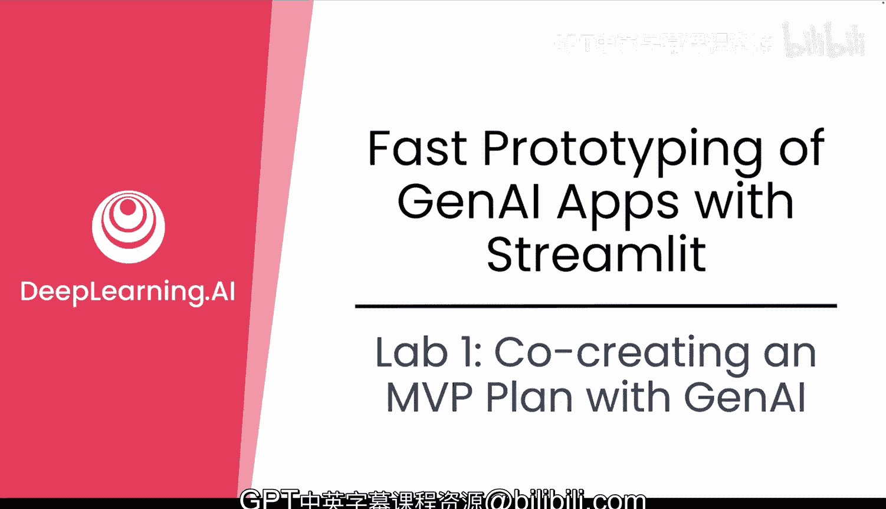
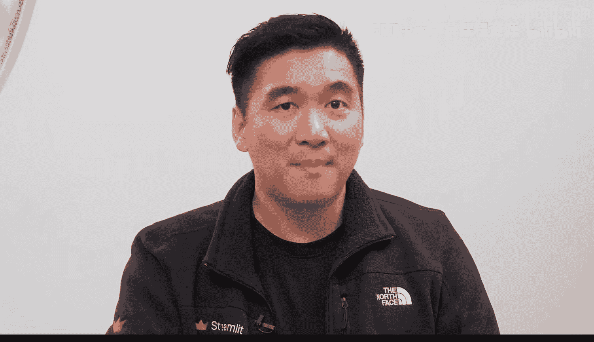
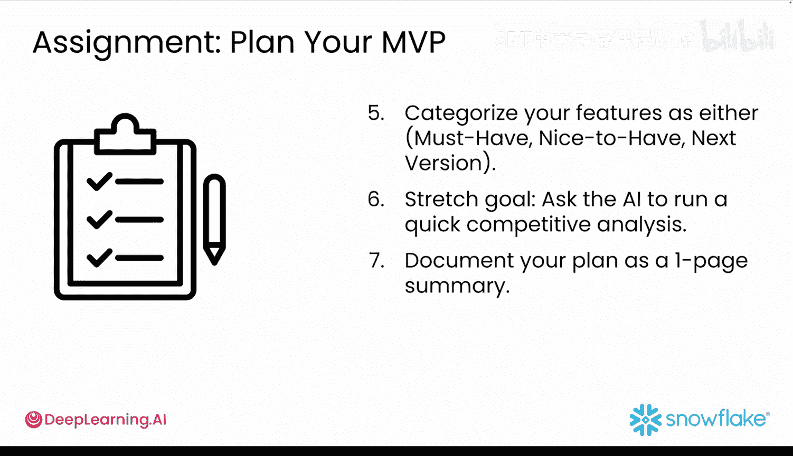
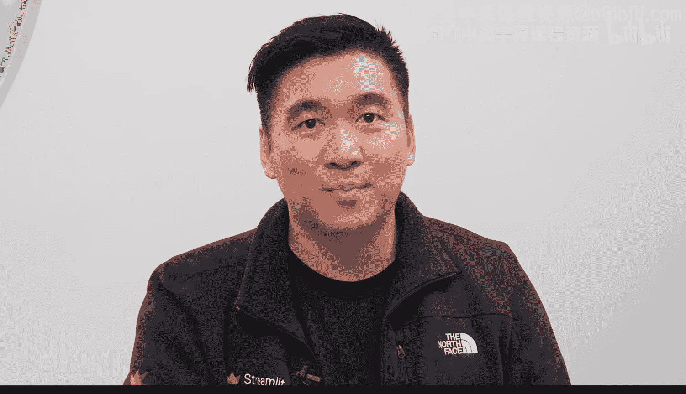

#  010：与GenAI共同制定MVP计划 🧠

在本节课中，我们将学习如何利用生成式AI（GenAI）作为产品策略伙伴，共同规划和定义你的最小可行产品（MVP）。我们将通过一个医疗健康领域开发者的真实案例，了解如何通过结构化提示词引导AI，帮助你从零开始快速制定一个清晰、可行的MVP计划。

## 概述

上一节我们介绍了使用地图流程来细化你的MVP想法。本节中，我们来看看如何引入GenAI来帮助你构建，而不是独自完成所有规划工作。

你可以请求GenAI模型帮助你进行头脑风暴、确定功能优先级并制定构建计划。当你时间紧迫或不确定下一步该构建什么时，这尤其有用。

## 案例研究：Priya的MVP规划

让我们看看一位开发者如何利用GenAI，不仅用于编码，还用于思考其MVP。Priya是一家医疗健康初创公司的ML工程师。她最近构建了一个概念验证，使用GenAI从临床试验PDF中提取结构化见解。它虽然能工作，但提示词很脆弱，结果不一致，而她的利益相关者希望快速看到一个精美的演示。

因此，她打开了GenAI应用并输入：“**扮演产品经理，帮我为一个从临床试验PDF中提取数据的应用定义一个MVP。**”

Priya没有直接跳入编码，而是让GenAI应用帮助她走完MVP规划流程。

*   **目标**：减少团队从杂乱的临床试验报告中手动提取数据所花费的时间。
*   **受众**：临床运营人员。这些非技术用户目前依赖工程师为他们运行查询。
*   **成功应用的样子**：最简单的成功衡量标准是“这为你节省时间了吗？”早期进行粗略估计即可，无需过度设计KPI。
*   **优先级功能**：在GenAI的帮助下，她确定了基本工作流程的范围：拖放上传PDF、用于提取和清理数据的LLM管道、可编辑的结果表格、导出到CSV。

这不是一个完整的产品，而是一个精简、清晰的原型，专注于学习和提供价值。

## 如何获得更好的规划建议

在深入编码之前，Priya从GenAI那里获得了更多提示，以构建更好的第一个原型提示词。

以下是获得更佳规划建议的关键点：

*   **具体化**：不要用“帮我构建一个从PDF提取数据的应用”，尝试使用“我正在构建一个GenAI助手，用于自动化从临床试验PDF中提取数据的过程，以从中获取见解。MVP应包含哪些核心功能？”
*   **提供上下文**：说明“我是一名正在构建内部工具的ML工程师”与“我是一名正在构建学校演示的学生”会得到非常不同的回应。
*   **明确输出格式**：要求GenAI生成特定类型的输出，例如：
    *   `summarize this as bullet points`
    *   `generate a step-by-step plan`
    *   `create a table of MVP versus stretch goals`
*   **设定角色**：与其说“帮我确定应用范围”，不如尝试“**扮演一个为ML团队构建GenAI原型的产品经理**”。

这些微小的改变将GenAI模型的语气和结构从通用建议转变为专注的协作。

## 你的实践：与GenAI共同创建MVP计划

现在轮到你来与GenAI共同创建你的MVP计划了。

你可以从这个提示词开始：
`I‘m new at using GenAI for prototyping. Help me plan an MVP for a Streamlit app that loads a CSV, performs sentiment analysis using OpenAI, shows a bar chart of the results, and lets users filter by product.`

根据你的想法调整它。

然后尝试这个更结构化的提示词：
`Act as a product manager. Help me define an MVP for a GenAI app. Use these principles: Define the end goal, identify the audience, choose success metrics, prioritize core features. Then walk me through each step. What problem are you solving? Who are you solving it for? What would success look like? What are the must-have features?`

GenAI可以像教练一样，帮助你澄清目标、精简功能，并专注于真正重要的事情。你甚至可以反过来，让GenAI向你提问，帮助你进行头脑风暴和规划。

一旦你定义了MVP，可以要求GenAI将功能组织为“必须有”、“最好有”和“下一版本”。

## GenAI的擅长与局限

在继续之前，请记住GenAI擅长帮助你处理以下事情：
*   创建繁琐的设置代码
*   头脑风暴功能
*   编写查询
*   推荐架构
*   规划和调试

但你仍然需要人类来：
*   选择正确的问题
*   做出UI/UX决策
*   应用业务逻辑
*   验证AI输出

## 实验任务

现在轮到你了，完成这个第一个非评分实验：

1.  用一两句话描述你的GenAI应用想法。
2.  使用你喜欢的GenAI工具（如ChatGPT、Claude或Gemini），复制粘贴上面展示的结构化提示词。
3.  请求帮助定义你的MVP。
4.  将你的功能分类为“必须有”、“最好有”或“下一版本/延伸目标”。
5.  要求AI进行快速的竞争分析。
6.  将你的计划记录为一个单页摘要。

## 总结

本节课中，我们一起学习了开发者如Priya如何利用GenAI不仅用于构建，还用于规划。你学会了如何通过给予GenAI清晰的上下文、结构和角色，将其视为产品策略教练。现在，你已经准备好能在几分钟内从一张白纸转变为坚实的MVP计划。

接下来，你将开始使用Avalanche数据，一步步构建你的原型。🚀