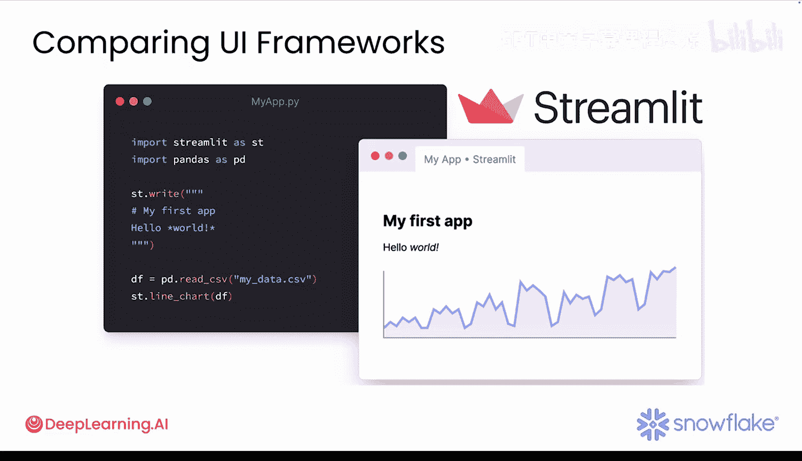
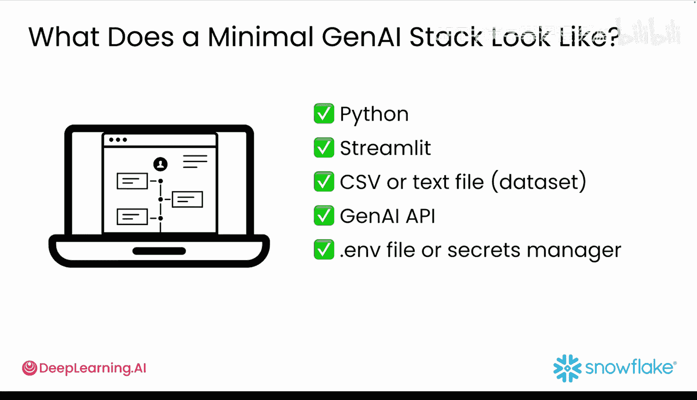

#  011：选择合适的工具 🛠️

在本节课中，我们将要学习如何为快速构建生成式AI应用原型选择合适的工具。核心在于理解，原型开发追求速度，而非构建一个功能完备的生产级应用。

## 概述

构建生成式AI原型时，速度至关重要。你不需要一个完整的生产团队，只需要必要的工具来快速测试想法并获得反馈。你可能习惯于在笔记本中工作，运行模型并分析结果，而不是构建前端界面或设置部署流程。但如果你希望用户能与你的模型交互，你仍然需要一个用户界面，并且这个界面必须能快速、轻松地构建。本节课程将介绍如何为快速构建生成式AI原型选择合适的工具。

## 思维模式的转变

生成式AI开发中一个最大的思维转变是：你不需要仅仅为了测试一个想法，就去启动后端、配置数据库或设置托管服务。

你可以仅用三种“原料”构建一个可工作的原型：**Python**、一个轻量级的UI库，以及对一个生成式AI模型的访问权限。当你处于“快速构建”模式时，应选择那些不会拖慢你速度的工具。

## 选择合适的UI工具

以下是几种UI工具的选择：

*   **Streamlit**：如果你是一名数据科学家或机器学习工程师，希望有一种简单的方法将Python脚本转换为交互式应用，而无需担心HTML、CSS或JavaScript，那么Streamlit是理想选择。
*   **其他工具**：像Gradio和Dash这样的工具也能工作，但它们通常需要更长的设置时间。

对于生成式AI原型开发，Streamlit在速度、灵活性和易用性方面达到了最佳平衡点。

## 选择合适的生成式AI模型

对于生成式AI，你无需训练自己的模型。可以直接通过API使用预训练模型：

*   **GPT-4**：适用于通用代码和文本生成。
*   **Claude**：擅长处理长文档或摘要。
*   **Google Gemini**：适用于谷歌生态系统内的项目。
*   **开源模型**：如果你想离线工作。

只需选择一个对你来说易于访问的模型，然后开始构建。

## 原型技术栈示例

让我们分解一个可工作的生成式AI原型技术栈可能的样子：

*   **Python**：用于处理应用逻辑和API调用。
*   **Streamlit**：用于构建用户界面。
*   **CSV或文本文件**：作为一个小型、可测试的数据集（例如，产品评论数据）。
*   **生成式AI API**：如OpenAI或Anthropic的API。
*   **API密钥管理**：使用`.env`文件或密钥管理器来安全地保存你的API密钥。

就这么简单。你不需要过度设计你的原型或技术栈。

## 总结

本节课中，我们一起学习了为快速构建生成式AI应用原型选择工具的核心原则。关键在于从简单开始：使用Python、一个生成式AI模型和一个像Streamlit这样的工具来创建交互式应用。这样你能更快地获得真实反馈，并且可以在后续阶段随时进行扩展。

在下一个视频中，你将设置你的开发环境，并准备开始构建。