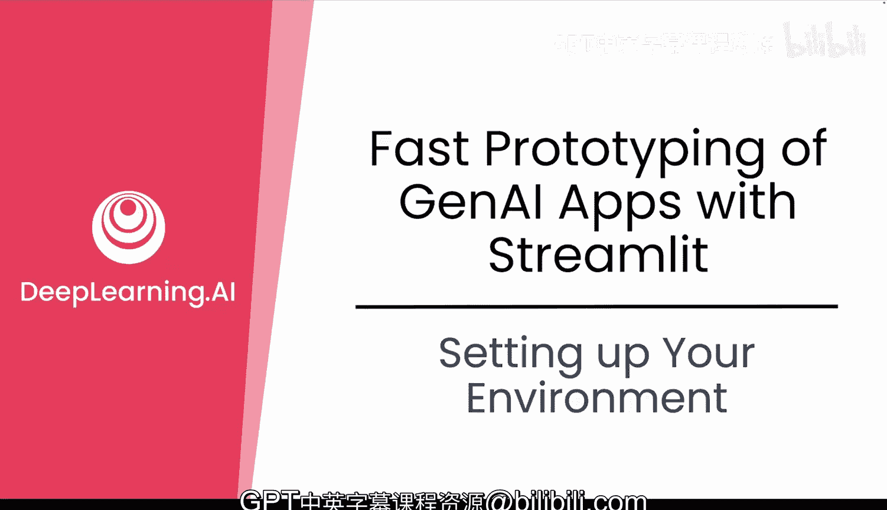
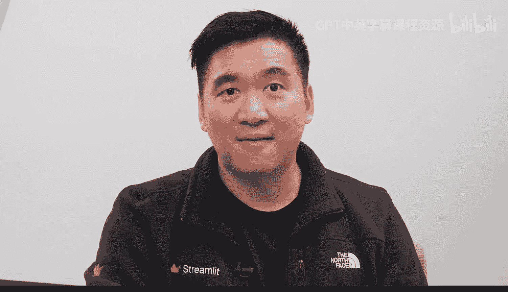
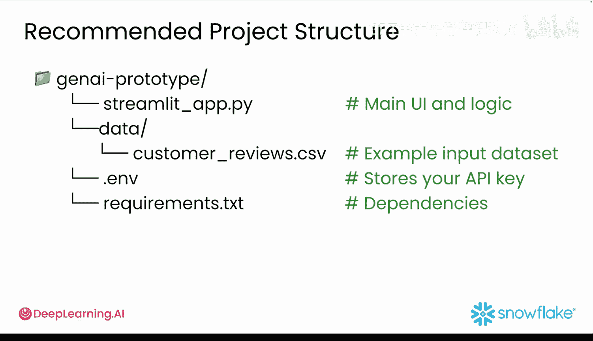
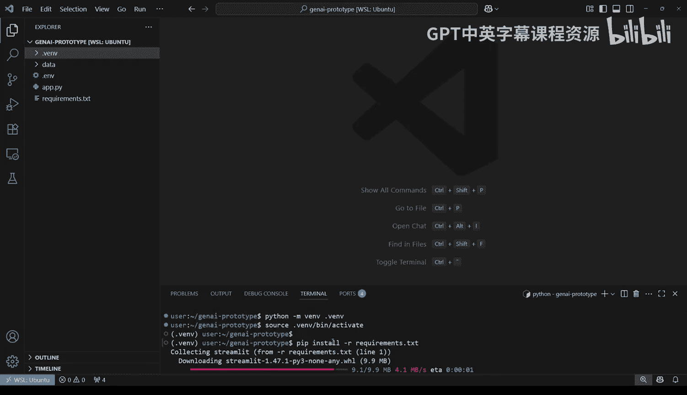
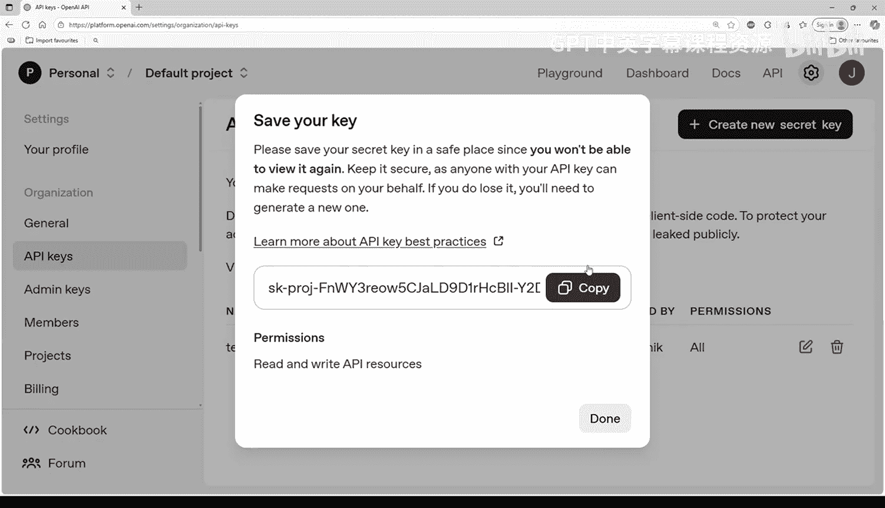
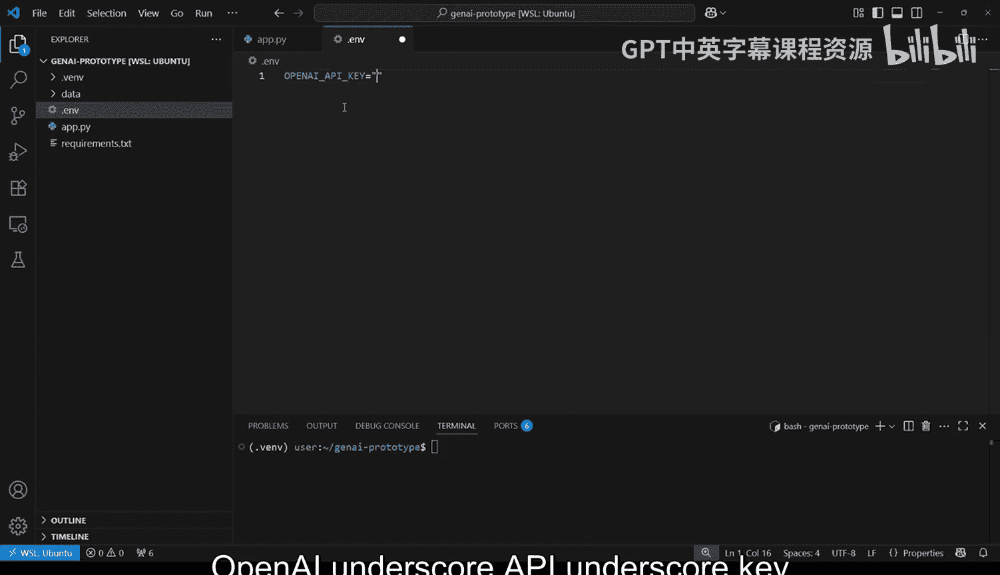
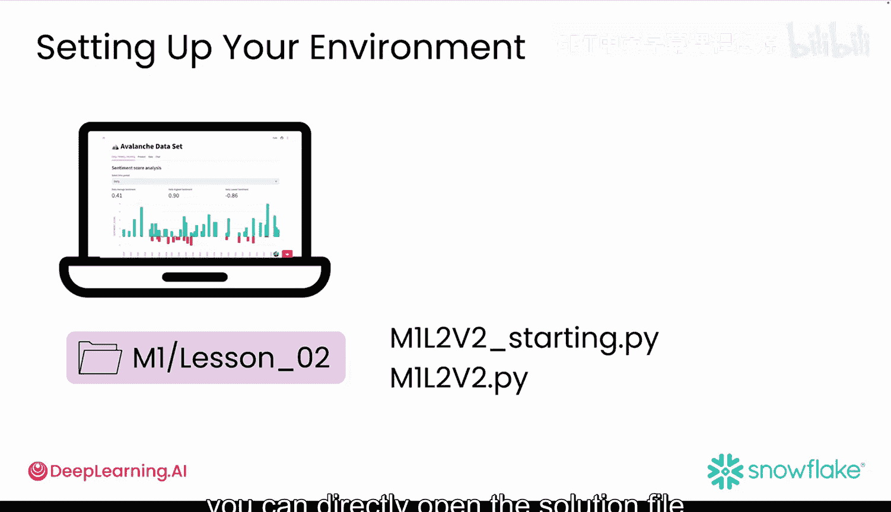
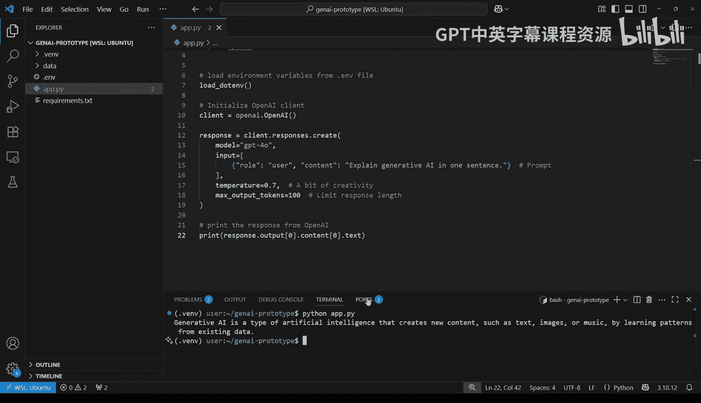
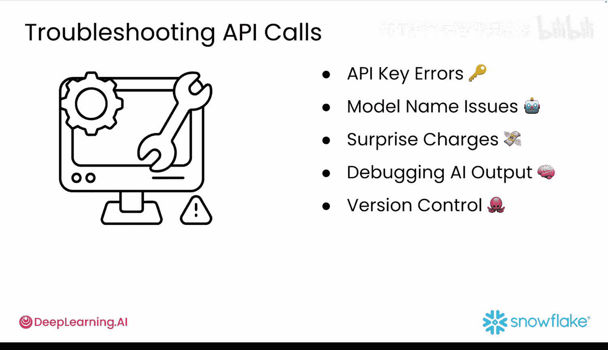

#  012：环境配置 🛠️

在本节课中，我们将学习如何为生成式AI应用搭建一个干净、稳定的开发环境。我们将从项目结构、虚拟环境配置，到安全地集成OpenAI API，一步步完成所有准备工作。

---

## 项目结构 📁

在开始构建之前，一个清晰的项目结构有助于保持代码的条理性，并方便后续更新。





以下是推荐的项目结构：



*   `GenAI-prototype/`：项目根目录。
*   `streamlit_app.py`：应用的核心界面与逻辑文件。
*   `data/`：用于存储数据文件的文件夹，例如 `customer_reviews.csv`。
*   `.env`：一个隐藏文件，用于安全地存储API密钥等敏感信息。
*   `requirements.txt`：列出应用所需的所有Python包。

---

## 虚拟环境 🐍

虚拟环境可以将项目所需的工具和依赖隔离在一个独立的空间中，避免不同项目间的依赖冲突。



首先，在项目文件夹中打开终端，运行以下命令创建虚拟环境：
```bash
python -m venv .venv
```
执行后，项目文件夹中会出现一个名为 `.venv` 的新文件夹，其中包含了虚拟环境的所有文件。

接下来，激活虚拟环境：
*   **macOS/Linux**：`source .venv/bin/activate`
*   **Windows**：`.venv\Scripts\activate`

激活成功后，终端每行开头会显示 `(.venv)`，表明当前环境已激活。

最后，安装项目依赖：
```bash
pip install -r requirements.txt
```

---



## 配置OpenAI API密钥 🔑

要在应用中使用AI功能，需要连接OpenAI的API服务，这需要一个API密钥。

首先，访问 [platform.openai.com](https://platform.openai.com) 创建账户并登录。在账户面板中找到API密钥部分，点击“Create new secret key”并复制生成的密钥。**请务必立即妥善保存此密钥，关闭窗口后将无法再次查看。**

为了安全地使用密钥，不应将其直接硬编码在代码中。正确做法是在项目根目录下创建一个名为 `.env` 的隐藏文件，并在其中添加以下内容：
```
OPENAI_API_KEY=你的实际API密钥
```





---

## 编写初始代码 💻

现在，我们可以开始编写代码来连接OpenAI服务了。你可以从GitHub仓库的 `ml_lesson_02` 文件夹中打开 `ml2_v2_start.py`（一个空文件）开始编写，或者直接参考解决方案文件 `ml2_v2.py`。

如果你选择从头开始，请在脚本中添加以下代码。这段代码使用 `load_dotenv` 函数从 `.env` 文件加载环境变量，并初始化OpenAI客户端。
```python
import os
from openai import OpenAI
from dotenv import load_dotenv

# 加载 .env 文件中的环境变量
load_dotenv()

# 初始化 OpenAI 客户端
client = OpenAI(api_key=os.getenv("OPENAI_API_KEY"))
```

---

## 调用AI模型并获取响应 🤖

上一节我们建立了与OpenAI的连接，本节中我们来看看如何发送提示并获取模型的响应。请注意，OpenAI SDK更新频繁，如果以下方法不适用，请查阅最新官方文档。

在脚本末尾添加以下代码。`client.chat.completions.create` 函数用于向OpenAI模型发送消息并获取其回复。
```python
response = client.chat.completions.create(
    model="gpt-4o",  # 指定使用的模型，通常使用 gpt-4o
    messages=[{"role": "user", "content": "用一句话解释生成式AI。"}],  # 对话历史
    temperature=0.7,  # 控制创造性，范围 0.0（保守）到 1.0（富有创意）
    max_tokens=150    # 限制回复的最大长度
)
```
参数说明：
*   `model`：指定要使用的AI模型。
*   `messages`：以列表形式记录对话历史。
*   `temperature`：控制回复的随机性。值越低，回复越确定和一致；值越高，回复越多样和富有创意，但也可能产生不准确的回答。
*   `max_tokens`：限制回复的长度，有助于控制成本。

最后，添加一行代码来提取并打印出模型的文本回复：
```python
print(response.choices[0].message.content)
```

---

## 测试与调试 🧪

保存文件后，我们可以测试API连接是否正常。在终端中，确保位于项目文件夹下，运行以下命令（如果你的主文件不是 `app.py`，请替换为对应的文件名）：
```bash
python streamlit_app.py
```
如果一切顺利，你将在终端看到AI模型返回的句子。



如果遇到问题，终端会显示错误信息。生成式AI本身也是调试的好帮手，你可以将错误信息粘贴给ChatGPT等模型，寻求解决方案。

以下是几个常见的排查方向：

*   **API密钥错误**：检查 `.env` 文件中是否有拼写错误或多余空格。
*   **模型名称问题**：确保使用的是最新、有效的模型ID。
*   **费用监控**：从小规模测试开始，并在OpenAI平台设置支出提醒。
*   **调试AI输出**：尝试边界情况，如长输入或空输入，测试模型的稳定性。
*   **版本控制**：使用GitHub跟踪代码变更，尤其是在尝试不同提示词或AI服务时。

---

## 总结 📝



本节课中，我们一起学习了如何为生成式AI应用搭建开发环境。我们创建了清晰的项目结构，使用虚拟环境隔离依赖，通过 `.env` 文件安全地管理API密钥，并编写了连接OpenAI API及获取模型响应的基础代码。最后，我们完成了早期测试，确保整个设置可以正常工作。


接下来，我们将利用这个环境，开始构建你的第一个真实可用的应用原型。