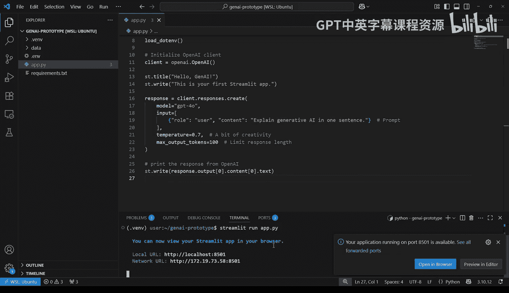
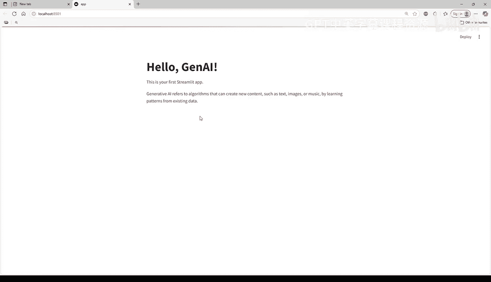
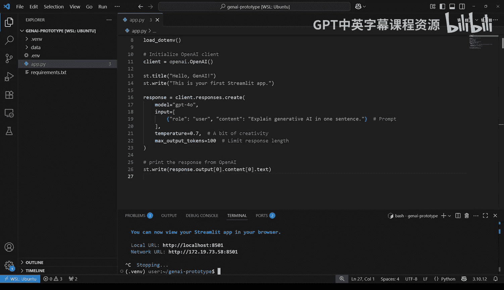

#  013：13_01_03_Streamlit入门 🚀

在本节课中，我们将学习如何将一个生成式AI脚本转化为一个在浏览器中运行的交互式Web应用。我们将使用Streamlit作为连接Python代码和完整Web界面的桥梁，无需编写任何前端代码。课程结束时，你将拥有一个可工作的原型，它能接收用户输入，将其发送给生成式AI模型，并在浏览器中显示响应。

## 概述

上一节我们完成了生成式AI脚本的编写。本节中，我们来看看如何利用Streamlit将其快速部署为一个Web应用。我们将从验证安装开始，逐步添加必要的代码，最终在浏览器中启动并运行你的第一个AI应用。

## 验证Streamlit安装

在之前的视频中，你已经在安装`requirements.txt`文件时安装了Streamlit。为了验证安装是否成功，请在终端中输入以下命令：

```bash
streamlit version
```

如果看到版本号，说明安装成功。如果没有，请检查你的虚拟环境是否已激活，并重试。


## 改造你的脚本

在本视频中，你可以继续使用上一节创建的文件，或者直接打开解决方案文件。

你的脚本已经能够连接到OpenAI。现在，是时候将其转变为一个完整的应用了。要将上一节的Python脚本变成一个简单的Web应用，你只需要添加几行代码。

首先，导入Streamlit库：

```python
import streamlit as st
```

这行代码导入了Streamlit包，并为其设置了简称`st`，以便在应用中轻松使用其功能。

在脚本顶部，添加应用标题：

```python
st.title(“Hello GenAI”)
```

这为你的应用创建了一个大标题。在标题下方，你可以添加一些描述应用功能的文本：

```python
st.write(“This is your first Streamlit app.”)
```

`st.write`是一个灵活的函数，可以显示文本、数字、数据框等多种内容。

接着，将原本使用`print`函数在终端打印模型响应的代码，替换为使用`st.write`在应用中显示模型输出：

```python
st.write(response)
```

就是这样，仅仅四行代码，你的命令行脚本就变成了一个Web应用。保存文件，准备启动。

## 启动你的应用

现在，进入激动人心的部分——在浏览器中查看你的应用。你需要在终端中运行应用，但这次使用Streamlit命令。

在终端中输入以下命令：



```bash
streamlit run app.py
```

这个命令会启动一个本地Web服务器，并在浏览器中打开你的应用。你会看到类似这样的消息：“You can now view your Streamlit app in your browser.” 如果浏览器没有自动打开，请访问 `http://localhost:8501`。

恭喜！你的应用已经上线了。是时候在浏览器中查看它了。你会看到应用标题，以及下方由生成式AI模型返回的响应（之前是在命令行中打印的）。调用生成式AI模型并非总是即时的，所以如果响应有延迟，请不要担心。

只要你的终端保持打开，你的应用就是活动的。任何访问该URL的人都可以与之交互。

当你准备停止应用时，只需回到终端，按下 `Ctrl+C` 即可关闭它。



## 快速迭代开发



你的应用现在看起来可能很简单，但这是后续所有功能的基础。Streamlit会在你保存脚本时自动刷新应用。只需点击保存，无需重启或重新加载。这种即时反馈循环使得迭代开发变得非常容易。

以下是快速迭代的步骤：
1.  修改代码。
2.  保存文件。
3.  立即在浏览器中查看更新。

## 总结

本节课中我们一起学习了如何利用Streamlit将生成式AI脚本快速部署为交互式Web应用。你成功创建了一个由生成式AI驱动的Web应用，无需使用Flask、JavaScript或任何复杂的前端框架。Streamlit为你启动了一个微型Web服务器，处理了布局并管理一切，这意味着你可以完全使用Python进行快速原型开发，而用户则能获得实时的结果。


在下一节视频中，我们将为你的应用添加更多交互性、输入框和更高级的功能。让我们继续构建！