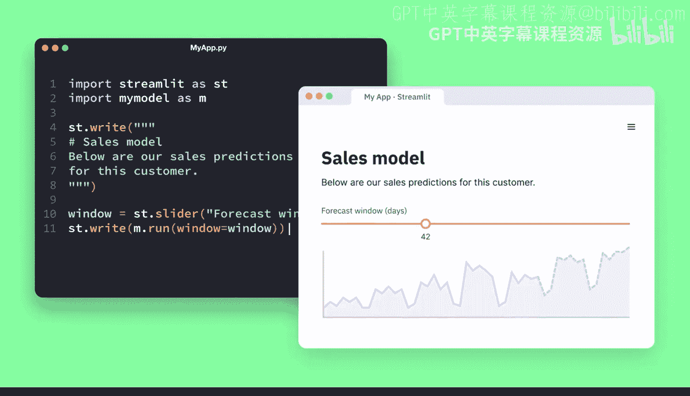
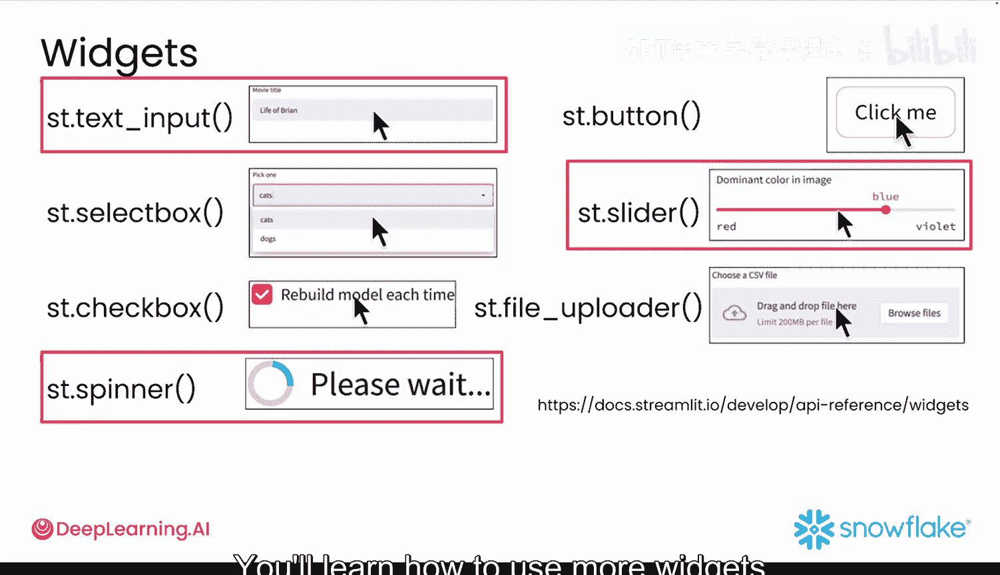
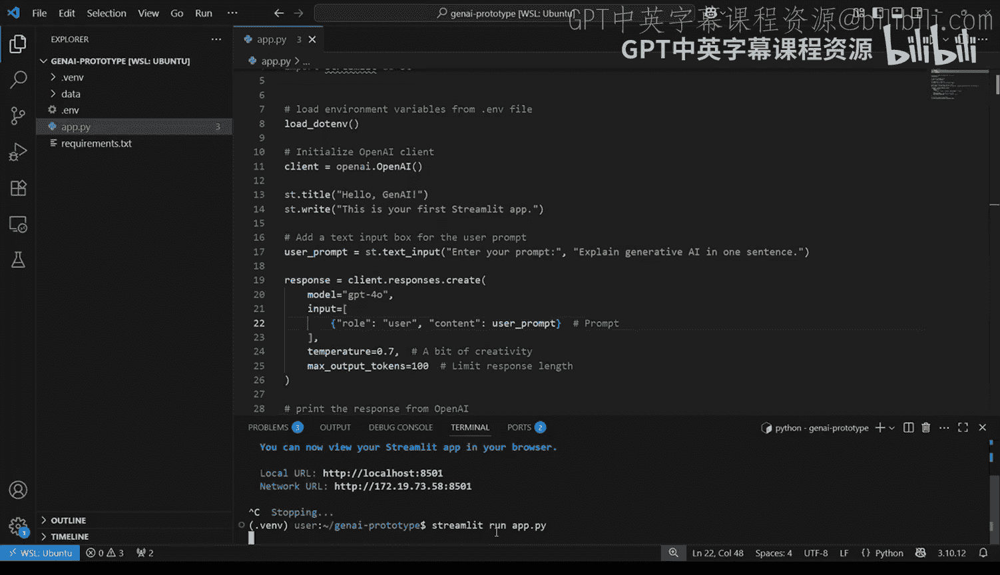
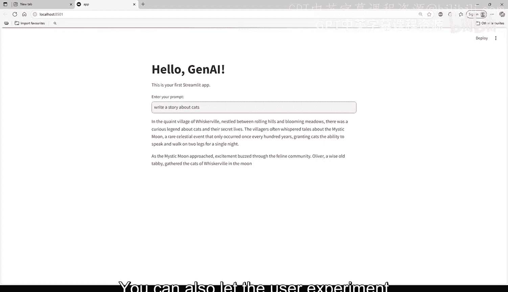
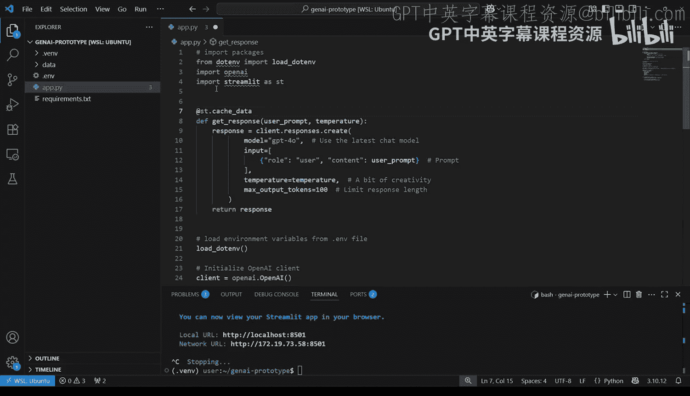

#  014：创建首个交互式Streamlit应用 🚀

在本节课中，我们将学习如何将一个静态的Streamlit应用升级为交互式应用。我们将通过添加文本输入框、滑块和加载动画等组件，让用户能够自定义提示词、调整模型参数并获得更好的使用体验。

## 概述

在上一个视频中，我们构建了第一个生成式AI驱动的Streamlit应用。它展示了一段文本并打印了模型输出。但该应用缺乏交互性。本节我们将使用Streamlit提供的一系列交互式Python元素——即“小组件”——来增强应用功能，无需接触HTML或JavaScript。




## 从静态到交互式

Streamlit小组件允许您为应用添加用户控件。以下是一些在生成式AI应用中非常实用的小组件：
*   `st.text_input`：用于输入提示词的文本框。
*   `st.button`：用于触发操作的按钮。
*   `st.selectbox`：用于模型选择的下拉框。
*   `st.slider`：用于调整数值（如温度参数）的滑块。
*   `st.checkbox`：用于创建开关的复选框。
*   `st.file_uploader`：用于上传CSV或文本文件的上传器。
*   `st.spinner`：在等待（例如等待模型回复）时显示加载动画。

在本视频中，我们将使用其中三个组件来升级您的应用：一个用于输入提示词的文本框、一个控制模型创造性的温度滑块，以及一个在模型生成文本时显示的加载动画。在本课程后续部分，您将学习使用更多小组件。

您可以继续编辑上一个视频中的文件，或者在代码仓库中找到解决方案文件来跟随操作。

## 添加提示词输入框



要为应用添加一个让用户输入自定义提示词的文本框，只需增加一行代码：
```python
user_prompt = st.text_input("Enter your prompt", "explain generative AI in one sentence")
```
`st.text_input`函数用于创建用户输入框。其第一个参数是提示用户如何与输入框交互的消息（例如“Enter your prompt”）。您还可以设置一个默认提示词，在应用启动时预填充输入框。



现在，只需在调用模型时，将硬编码的提示词替换为`user_prompt`变量即可。运行应用后，您将看到输入框。输入内容并按回车键后，模型就会运行。

## 引入温度滑块

您还可以通过添加滑块小组件，让用户尝试调整模型的创造性或确定性程度。在定义用户输入的代码附近添加以下代码：
```python
temperature = st.slider("Temperature", 0.0, 1.0, 0.7, 0.1)
```
这段代码创建了一个从0.0到1.0的滑块。0.0表示最确定性（输出最可预测），1.0表示最创造性（输出最多样）。`value`参数设置了默认值，`step`参数控制了用户移动滑块时数值的增减幅度。

接着，更新您的模型调用代码，以包含这个特定的温度值。这样，您的应用就变得动态了，用户可以调整AI的“风格”。

## 改善等待体验



大型语言模型可能需要几秒钟来响应，在此期间您的应用可能会显得卡顿。我们可以通过添加一个加载动画来修复这个问题，让用户知道模型正在运行。

您可以通过将API调用代码包裹在`with st.spinner()`代码块中来实现：
```python
with st.spinner("Generating response..."):
    # 这里是您的模型调用代码
    response = model.generate(prompt=user_prompt, temperature=temperature)
```
现在，用户无需猜测应用是否出问题，他们会在模型工作时看到一个有帮助的小动画。

## 使用缓存优化性能

如果您在开发过程中多次使用相同的输入调用模型，可以使用`@st.cache_data`装饰器来缓存结果。如果您之前没有接触过装饰器，不必担心，它本质上是一个包装器（类似于`with`语句），您可以将其放在函数周围，以在不修改原函数的情况下改变或增强其功能。

首先，您需要将模型调用逻辑移到一个独立的函数中，例如命名为`get_response`。应用功能应保持不变，只是将部分逻辑移入了独立函数。

然后，像这样将装饰器放在`get_response`函数上方：
```python
@st.cache_data
def get_response(prompt, temperature):
    # 模型调用逻辑
    return response
```
`@st.cache_data`是一个Streamlit装饰器，它通过缓存先前函数或计算的结果来提高应用速度。它告诉Streamlit：“我之前见过这个输入，直接返回缓存的结果，而不要重新运行代码。”这对于生成式AI应用尤其有用，因为AI调用既耗时又费钱。如果您需要让模型反复分析相同的数据集，可以使用`@st.cache_data`从缓存中即时获取结果，而无需反复调用API。在雪崩分析项目中，对于任何需要执行的数据转换或情感分析，您都可以考虑使用此功能。

## 总结

本节课中，我们一起学习了如何将静态的Streamlit演示应用升级为功能完善的交互式应用。我们通过添加**提示词输入框**、**温度滑块**和**加载动画**，显著提升了用户体验。此外，我们还介绍了如何使用`@st.cache_data`**装饰器**来缓存结果，优化应用性能和成本。仅仅几行代码，就让您的应用焕然一新。



现在，是时候引入数据了。在下一个视频中，您将学习如何将数据上传到您的应用中，并对其执行生成式AI驱动的操作，同时进一步提升您的Streamlit技能。我们下个视频见。