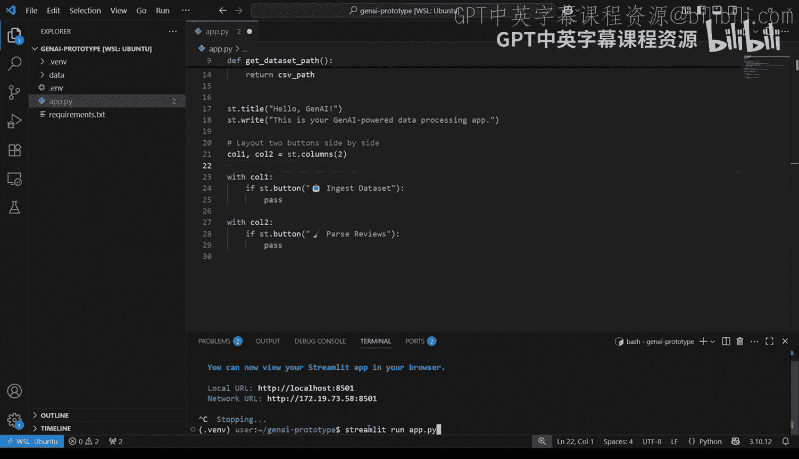
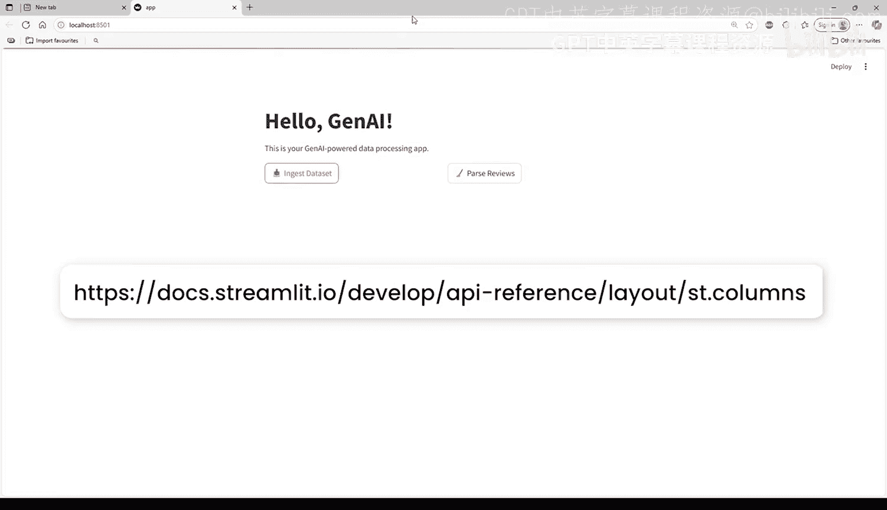
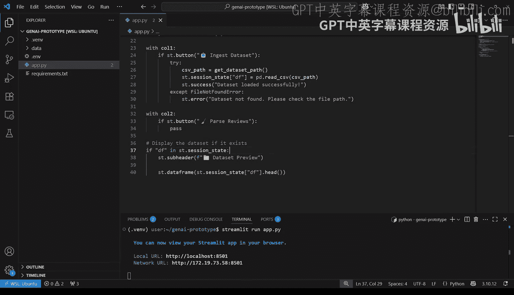
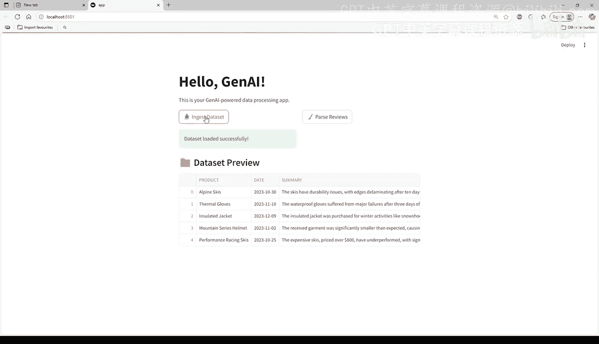
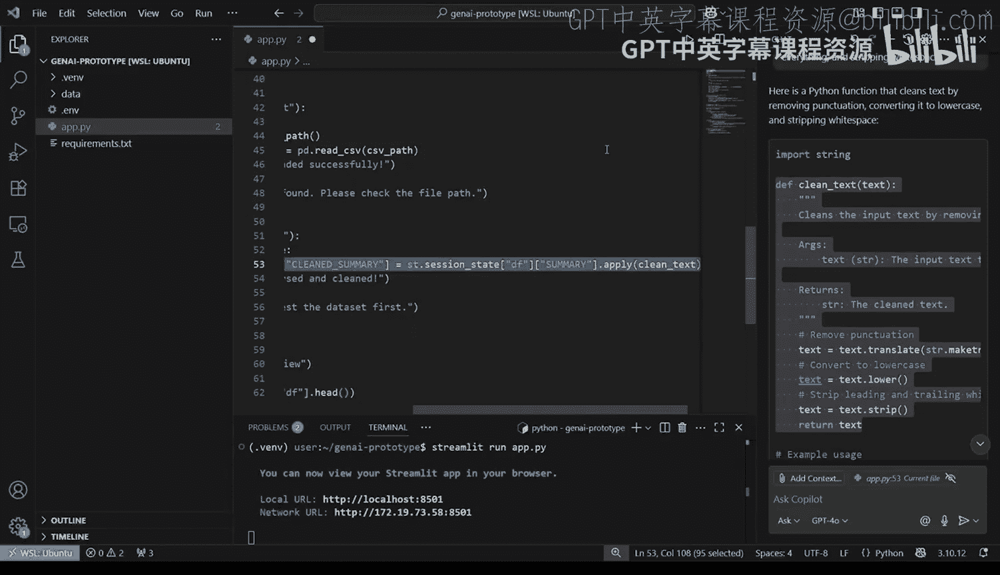
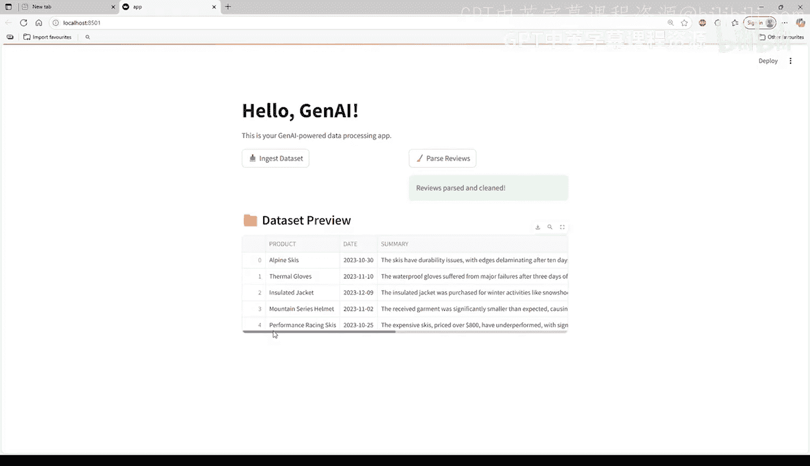
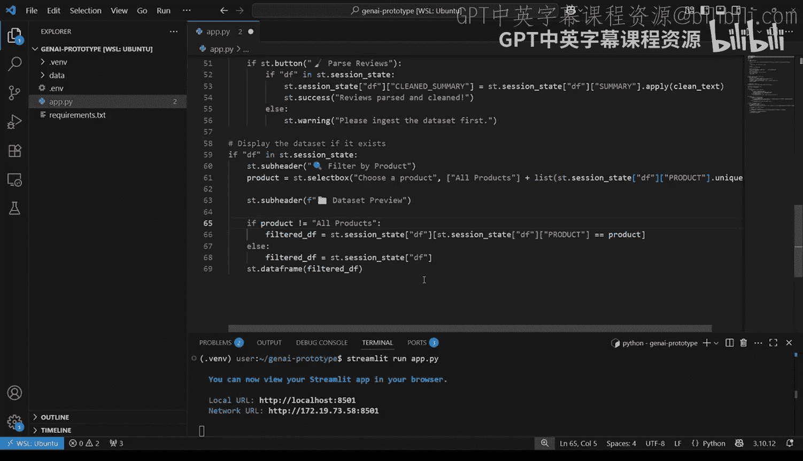
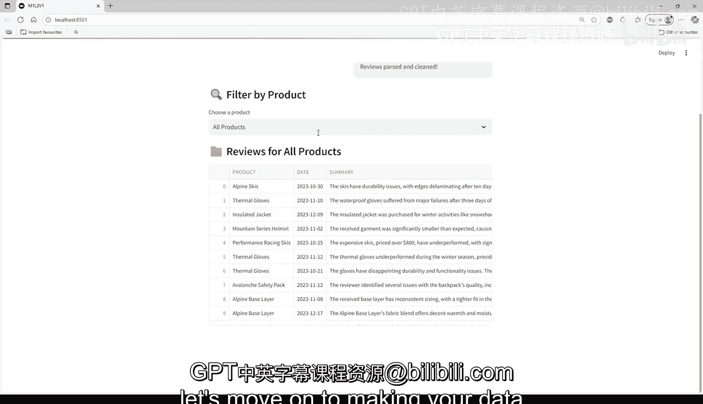

#  015：集成GenAI进行数据处理 🚀

在本节课中，我们将学习如何构建一个功能更丰富的生成式AI应用。我们将为应用添加数据加载和清理功能，并学习如何使用Streamlit的会话状态来保持数据在交互间的持久性。

## 组织应用布局

上一节我们构建了一个简单的提示词与响应应用。本节中，我们来看看如何组织一个包含多个功能的工作流。

你可以使用 `st.columns` 将按钮并排显示。


```python
import streamlit as st

col1, col2 = st.columns(2)
```

然后，在每个列中放置一个按钮。运行应用后，你将看到两个并排的按钮，但目前点击它们不会有任何反应。`st.columns` 还可以调整列间距等，更多信息请参考屏幕底部的链接。

## 实现第一个按钮的功能

现在，让我们实现第一个按钮的功能。你需要用以下代码替换第一个按钮中的 `pass` 语句。

```python
if col1.button(‘加载数据集’):
    df = pd.read_csv(‘your_dataset.csv’)
    st.session_state.df = df
```

这里需要注意一个重要细节：数据框没有被简单地保存到一个普通的 `df` 变量中，而是保存到了一个叫做 **会话状态（session state）** 的地方。原因是，每次用户与应用交互时，Streamlit 都会从头到尾重新运行整个脚本。这意味着，如果你点击一个按钮，所有变量都会丢失，除非你将它们存储在两次运行之间持久化的地方。

通过将数据框存储在 `st.session_state.df` 中，你的应用会记住它，即使脚本再次运行。这允许用户加载数据集，并在之后对其执行操作，而无需重新加载。





## 显示加载的数据集

接下来，在脚本底部使用以下代码来显示数据集。

```python
if ‘df’ in st.session_state:
    st.dataframe(st.session_state.df)
```

请注意这段代码的写法：它位于一个 `if` 代码块中。这个 `if` 语句用于检查数据是否已被加载并保存到会话状态中。记住，每次应用重新加载时，它都会运行整个脚本。如果没有数据被加载，就无法显示。

现在，重新打开应用并检查它是否正常工作。按下第一个按钮，数据集将被加载并显示在下方。

## 实现第二个按钮的功能

现在，你需要为另一个按钮添加功能。构建内容很多，我们可以将繁琐的工作委托出去。

假设你的应用需要清理输入的文本。你可以手动编写所有代码，或者提示生成式AI来生成一个草稿。以下是一个示例提示：



> “编写一个Python函数来清理文本，去除标点符号，将所有内容转换为小写，并去除空白字符。”



模型可能会返回类似这样的代码：

```python
import string

def clean_text(text):
    # 去除标点
    text = text.translate(str.maketrans(‘’, ‘’, string.punctuation))
    # 转换为小写
    text = text.lower()
    # 去除首尾空白
    text = text.strip()
    return text
```

这段代码并不复杂，但它清晰、可测试且易于集成到你的应用中。将代码复制并粘贴到应用的顶部。

## 将清理功能集成到按钮

然后，你需要将该功能添加到你的按钮中。你想要清理已加载的数据集，因此首先需要检查会话状态中是否存在数据集。

以下是实现此功能的代码：

```python
if col2.button(‘清理文本列’):
    if ‘df’ in st.session_state:
        df = st.session_state.df
        df[‘cleaned_review’] = df[‘review’].apply(clean_text)
        st.session_state.df = df
```

现在你需要做的就是将此操作应用于数据集中的某一列，并将其保存回会话状态。检查你的应用，现在你有了一个用于加载数据集的按钮和另一个用于清理它的按钮。





你可能已经注意到，点击清理按钮时似乎没有任何变化。别担心，这只是因为该数据集的列数超过了屏幕的显示范围。如果你使用滑块滚动，就可以看到新增的 `cleaned_review` 列。

## 为应用添加更多交互性

为了让应用更具交互性，你的用户可能只对特定产品的评论感兴趣。你可以添加一个下拉菜单来筛选显示的数据集，仅显示相关列。

为此，你可以在代码中添加 `st.selectbox`，并将产品列表作为参数传递给它。

```python
product_list = [‘All Products’, ‘Product A’, ‘Product B’, ‘Product C’]
selected_product = st.selectbox(‘选择产品进行筛选:’, product_list)
```

然后，你需要添加筛选数据的逻辑。你还可以添加一个“所有产品”选项，以防用户想要分析所有产品。

```python
if ‘df’ in st.session_state:
    display_df = st.session_state.df
    if selected_product != ‘All Products’:
        display_df = display_df[display_df[‘product’] == selected_product]
    st.dataframe(display_df)
```

通过更新筛选逻辑来实现：如果选择了某个产品，则筛选数据框；如果选择了“所有产品”，则使用原始数据框进行显示。保存并刷新你的应用以查看效果。



## 总结



本节课中，我们一起学习了如何升级你的生成式AI原型应用，赋予它两个核心功能：**加载数据**和**清理数据**。这是大多数生成式AI数据应用的支柱——获取数据、准备数据，并为其分析做好准备。你现在已经有了一个可以在此基础上构建的模板，接下来让我们继续学习，用生动的可视化让你的数据“活”起来。