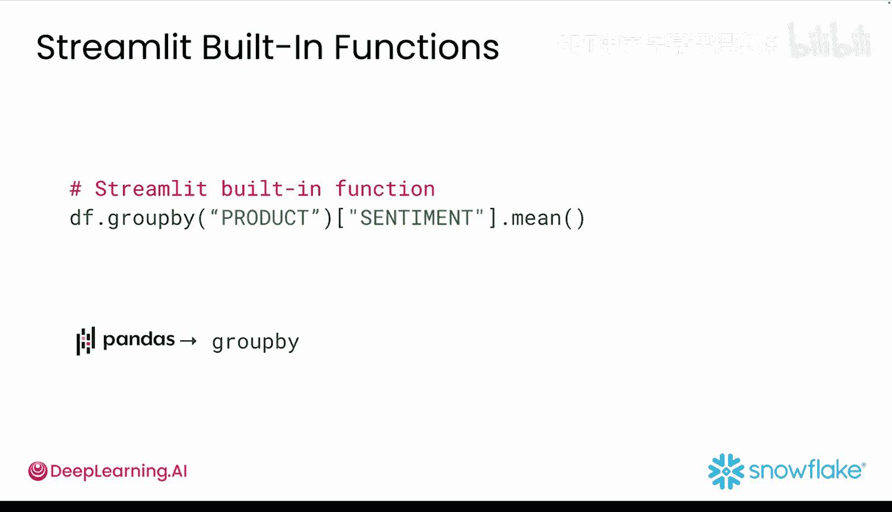
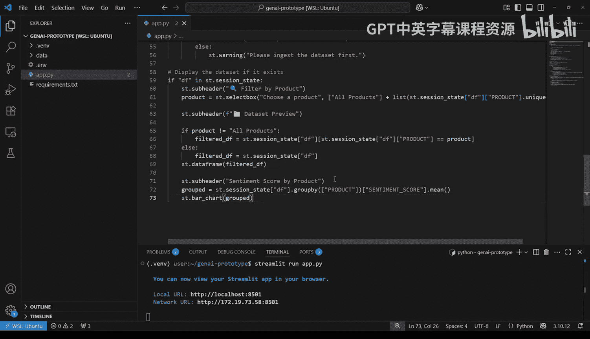
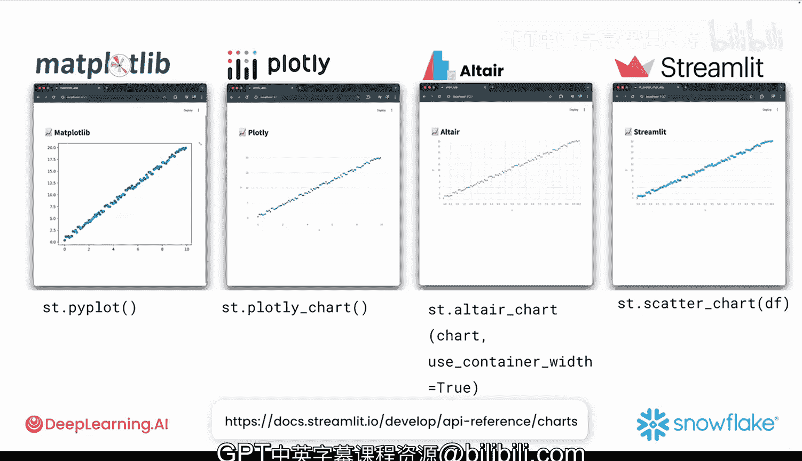

#  016：数据可视化

在本节课中，我们将要学习如何为你的应用添加图表，使用四种不同的可视化库。数据清理完成后，下一步是帮助人们理解数据。仅仅打印出一列数字或几行数据可能适用于快速测试，但这不是帮助利益相关者设想最终产品的最佳方式。这时就需要数据可视化。

上一节我们介绍了数据处理，本节中我们来看看如何将数据转化为直观的图表。

## 使用 Streamlit 内置图表 📊

最简单的方式是使用 Streamlit 的内置图表函数。例如，你可以使用 `st.bar_chart` 将一列情感得分转化为一个整洁的条形图。它可以直接与 pandas 的 DataFrame 或 Series 配合使用。

Streamlit 还提供了其他开箱即用的图表选项：
*   `st.line_chart`：折线图
*   `st.area_chart`：面积图
*   `st.scatter_chart`：散点图

这些图表非常适合快速探索数据，只需传入 DataFrame，Streamlit 会为你处理布局和渲染。

如果你想比较不同产品的情感得分，可以尝试以下方法：
```python
st.bar_chart(df.groupby(‘product’)[‘sentiment’].mean())
```
这行代码使用 pandas 的 `groupby` 按类别分解数据，从而构建显示每个产品（而非单条评论）平均情感得分的图表。

现在，让我们看看实际效果。你只需要将以下三行代码添加到上一视频构建的应用中，即可可视化每个产品的平均情感得分：
```python
st.subheader(‘Mean Sentiment by Product’)
mean_sentiment = df.groupby(‘product’)[‘sentiment’].mean()
st.bar_chart(mean_sentiment)
```
当你运行应用并点击按钮导入数据集后，可以立即看到生成的图表。

## 集成 Matplotlib 📈

如果你已经习惯使用 Matplotlib，完全可以在这里使用它。这对于直方图、散点图或任何不需要太多交互性的图表来说是完美的选择。

请注意，这里使用了 `filtered_df` 变量，因此当你在下拉菜单中选择其他选项时，图表会相应改变。
```python
import matplotlib.pyplot as plt
fig, ax = plt.subplots()
ax.hist(filtered_df[‘sentiment’], bins=20)
st.pyplot(fig)
```



## 使用 Plotly 实现交互 📉



如果你需要交互功能，如悬停提示或缩放，Plotly 是一个可靠的选择。Plotly 图表外观现代且流畅，用户可以悬停查看数据点、放大或点击获取更多详情，并且你无需编写任何额外的 UI 代码。

要写入 Plotly 图表，使用 `st.plotly_chart`。将 `use_container_width` 参数设为 `True`，可以确保图表拉伸以适应应用的整个宽度。
```python
import plotly.express as px
fig = px.scatter(filtered_df, x=‘review_length’, y=‘sentiment’)
st.plotly_chart(fig, use_container_width=True)
```

## 利用 Altair 进行高级可视化 🎨

另一个很好的选择是 Altair。它与 pandas 配合得很好，并且擅长处理分层绘图或任何带有选择、悬停提示或过滤器的图表。

你可以使用 `st.altair_chart` 来渲染它。
```python
import altair as alt
chart = alt.Chart(filtered_df).mark_circle().encode(
    x=‘review_length’,
    y=‘sentiment’,
    tooltip=[‘product’, ‘review_text’]
)
st.altair_chart(chart, use_container_width=True)
```

以下是每个工具适用场景的快速总结：
*   **Streamlit 内置图表**：超级快速，非常适合快速获取反馈。
*   **Matplotlib**：简单经典，适用于静态绘图。
*   **Plotly**：具有交互性，非常适合探索数据。
*   **Altair**：适用于更高级的可视化。

从你觉得最简单的工具开始，只在确实需要时才切换。

## 工具对比示例

让我们通过一些快速示例来看看它们的区别。假设我们想构建一个散点图。

以下是使用 Matplotlib 的实现：
```python
fig, ax = plt.subplots()
ax.scatter(filtered_df[‘review_length’], filtered_df[‘sentiment’])
st.pyplot(fig)
```

使用 Plotly 的实现：
```python
fig = px.scatter(filtered_df, x=‘review_length’, y=‘sentiment’)
st.plotly_chart(fig, use_container_width=True)
```

使用 Altair 的实现：
```python
chart = alt.Chart(filtered_df).mark_circle().encode(x=‘review_length’, y=‘sentiment’)
st.altair_chart(chart, use_container_width=True)
```

最后，使用 Streamlit 原生函数：
```python
st.scatter_chart(filtered_df[[‘review_length’, ‘sentiment’]])
```

这些工具中的每一个都允许你用几行代码创建清晰、有用的可视化图表。以上只是一些例子，你可以通过查看 Streamlit 文档中的“图表元素”部分了解更多可视化技术。

## 总结

本节课中我们一起学习了数据可视化。回顾一下，你从使用生成式 AI 生成 Python 函数，到使用 pandas 处理真实数据，再到创建多种可视化图表。你亲眼看到了生成式 AI 如何适应你所需的任何工具，以及一切如何与 Streamlit 无缝协作。



到目前为止，你一直在构建独立的模块。现在，是时候将它们全部整合到一个完整的仪表板应用中了，你将从头开始构建它，并使用生成式 AI 作为你的编码伙伴。