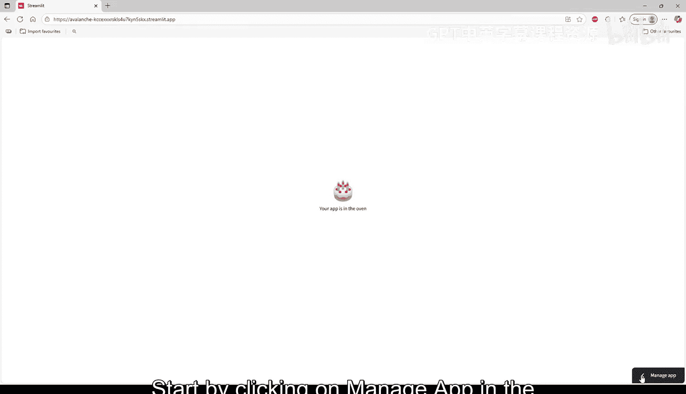
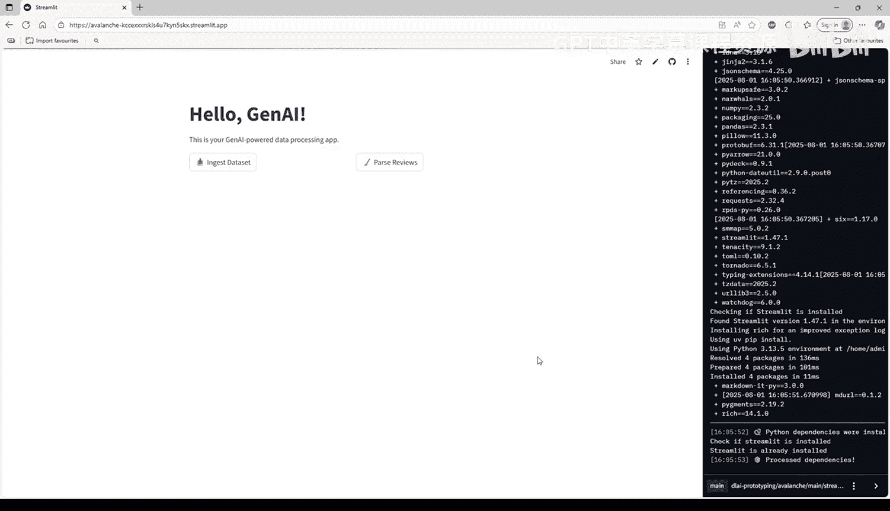
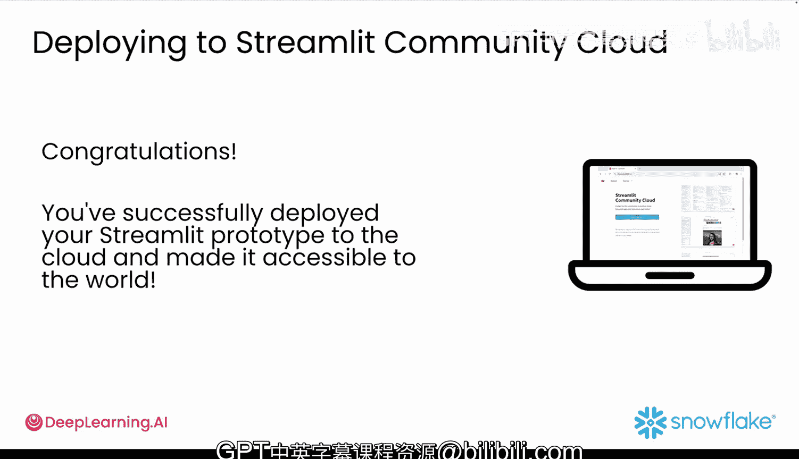

#  017：在线发布应用 🚀

在本节课中，我们将学习如何将你构建的 Streamlit 应用部署到线上，与世界分享。你将了解如何使用 Streamlit Community Cloud 这个免费平台来发布你的应用。

## 概述

你已经学会了如何构建交互式 Streamlit 应用，使用 GenAI 生成代码、加载数据集、处理数据并在同一个 Web 应用中创建可视化。现在，只剩下最后一步——与世界分享它。本节视频将指导你如何在 Streamlit Community Cloud 上部署你的应用。

Streamlit Community Cloud 是一个免费平台，可以让你轻松地在线上部署和分享应用。在该平台上，你可以获得有限的公开应用配额（代码也将公开），每个账户一个私有应用，集成了 GitHub 仓库以便于部署，当你向 GitHub 推送更改时会自动更新，并内置分析功能以追踪应用使用情况。这是一个快速、零成本地将你的原型展示给用户的方法。

## 部署步骤

以下是部署你的 Streamlit 应用到社区云的完整流程。

### 1. 登录 Streamlit Community Cloud

首先，打开浏览器并访问 `streamlit.io/cloud`。点击“Join Community Cloud”，然后点击“Continue to sign in”选择使用 GitHub 登录。

接下来，你将被重定向到 GitHub。当被询问是否允许 Streamlit 连接你的 GitHub 账户时，点击“Authorize”。如果是第一次操作，GitHub 会向你的邮箱发送一个验证码。请检查收件箱，复制发送的验证码并粘贴以完成登录过程。

随后，Streamlit 会要求填写基本信息，如你的姓名和邮箱地址。填写完毕后，你就可以开始使用了。

### 2. 准备应用代码

你可以继续使用上一节视频中的应用，或选择任何其他应用进行部署。如果你还没有准备好，请将课程代码仓库克隆到本地机器。

如果你想从一个经过测试的版本开始，可以使用课程 GitHub 仓库中 `M1_lesson3` 文件夹下的文件。

接下来，为你要部署的应用专门创建一个新的 GitHub 仓库。登录你的 GitHub 账户，点击屏幕右上角的加号按钮，选择“New repository”。

将仓库命名为 `avalanche` 或类似的名称。将仓库设置为公开以便于分享，然后点击“Create repository”。

这将在 GitHub 上为你创建一个新仓库。在新仓库中，点击“upload an existing file”，然后上传整个 `M1_lesson3_deploy` 文件夹。你的新仓库现在应包含以下文件：
*   `streamlit_app.py`
*   `requirements.txt`
*   `customer_reviews.csv`

上传完成后，点击“Commit changes”。至此，你的文件已准备就绪，可以部署了。

### 3. 部署应用到 Streamlit Cloud

要部署你的原型，请从 Snowflake 登录 `streamlit.io/cloud`。点击右上角的“Create app”或“New app”。

选择“Deploy a public app from GitHub”，然后选择你的 GitHub 用户名和 `avalanche` 仓库作为代码源。

将分支保留为 `main`，并确保它指向你的 Streamlit 应用文件 `streamlit_app.py`。

为你的原型选择一个唯一的自定义名称，或使用自动生成的网址，然后点击“Deploy”。Streamlit 将开始构建你的应用，这可能需要几分钟时间。

### 4. 监控应用性能

在应用部署期间，让我们看看监控应用性能的一些选项。首先，在加载屏幕的右下角点击“Manage app”，你会看到两个主要部分。

“View build logs”是你查找应用日志文件以进行故障排除的地方。

应用管理功能允许你在应用出现问题时重启它、下载日志文件、完全删除应用或更新访问设置，以及管理你的密钥文件。

### 5. 测试与访问

当你的应用启动并运行后，你会收到一条成功消息，其中提供了一个可用于访问的网站地址。该网址通常类似于 `https://你的应用名.streamlit.app`，并附带一些额外的随机字母和数字。

要进行测试，请浏览该 URL 并测试所有交互式开关。在所有标签页之间导航以确保它们正常工作，然后验证数据表和可视化是否显示正确。

恭喜！你的应用现已上线，任何拥有链接的人都可以访问。

### 6. 查看分析与日志

想了解有多少人在查看你的应用吗？方法如下：进入你的 Streamlit Community Cloud 仪表板，在你的应用旁边，你会看到三个点，点击它们。

选择“Analytics”。这将显示有多少人访问了你的应用以及他们何时访问。

如果你的应用出现问题，可以检查日志。在你已部署的应用页面上点击“Manage app”，然后查看日志面板。这有助于你找出导致应用出现任何问题的原因。

## 总结

恭喜你！你已成功将你的 Streamlit 原型部署到云端，并使其可供全世界访问。这是一个真正的成就。通过将一个想法转化为一个可实时分享的 Web 应用，你迈出了比大多数人更远的一步。

现在你的原型已经部署，你可以将链接分享给同事、将其添加到你的作品集或在社交媒体上发布。

本节课将以一个实验结束，在那里你将运用所有学到的知识。

