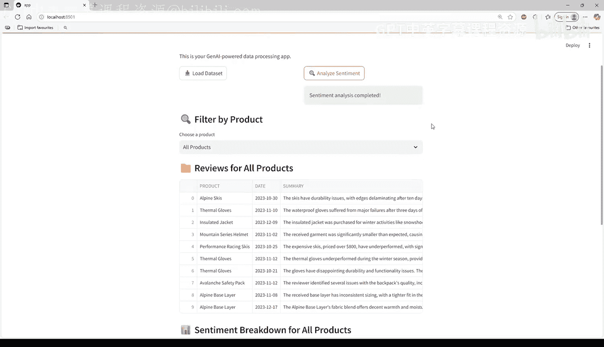
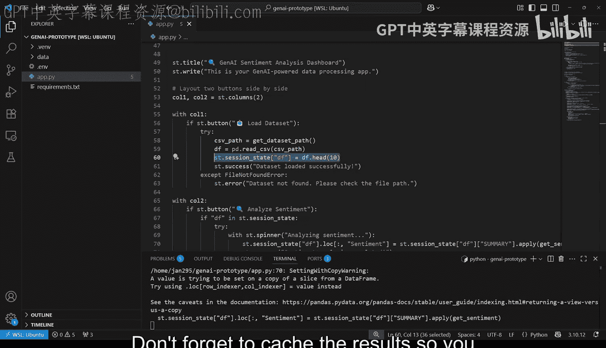
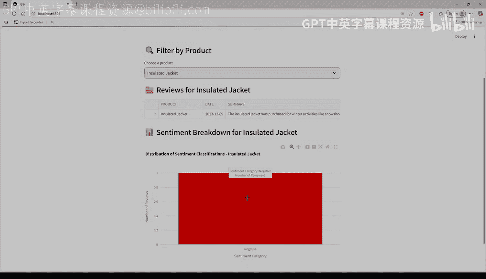

#  018：基于GenAI的雪崩舆情分析仪表板 📊

在本节课中，我们将综合运用所学知识，构建一个基于生成式AI的雪崩产品客户评论舆情分析仪表板。我们将学习如何加载数据、使用GenAI进行情感分析、展示结果并进行可视化。

## 概述

我们将构建一个Streamlit仪表板应用，用于分析雪崩数据集的客户评论。应用需要加载数据，使用生成式AI模型分析评论的情感倾向，并将结果以数据框和条形图的形式展示出来。

## 开始构建

你可以在课程Github仓库的“M1 lesson 3 lab to”文件夹中找到构建本实验所需的一切资源。那里有一个空文件供你编写代码，同时也有一个包含完整代码的解决方案文件供你参考。

以下是本实验将要构建的应用示例。视频中使用了Streamlit和本模块学到的功能，但你可以自由添加自己的想法并修改应用。

## 应用核心功能要求

你的应用应至少包含两个按钮和一个下拉筛选器。

以下是具体功能列表：

*   **加载数据按钮**：点击后应加载并展示数据集。
*   **分析情感按钮**：点击后应使用GenAI模型判断每条评论的情感是积极、中性还是消极。请注意，结果可能不完全一致，尤其是一些较旧的模型可能会给出意外或不一致的结果。
*   **下拉筛选器**：允许用户按产品进行筛选，并展示筛选后的数据，就像我们之前创建的那样。

## 开发建议与技巧

由于情感分析可能需要一些时间来处理，建议在测试时只加载少量数据行以加快进程。你可以使用Pandas的`head()`函数将前10或20行数据保存到会话状态中，正如在之前的视频中所见。



同时，不要忘记缓存结果，以避免不必要的重复计算。代码如下所示：



```python
@st.cache_data
def load_data():
    # 你的数据加载逻辑
    pass
```

## 数据可视化

接下来，绘制积极、中性和消极评论的分布图。你可以使用任何绘图库，并自由发挥创意设计颜色和样式。示例中使用了Plotly并自定义了颜色，但这一部分请充分发挥你的想象力。

## 总结

一旦你完成了这个实验，你就完成了模块一的学习，并拥有了一个功能完整的、由GenAI驱动的舆情分析仪表板。这个仪表板能够导入真实世界的数据集，使用OpenAI对情感进行分类，可视化结果，并支持交互式筛选。



现在你已经打下了坚实的基础，准备好进一步深化你的技能，将GenAI数据助手集成到你的Snowflake应用中。我们下次再见！😊