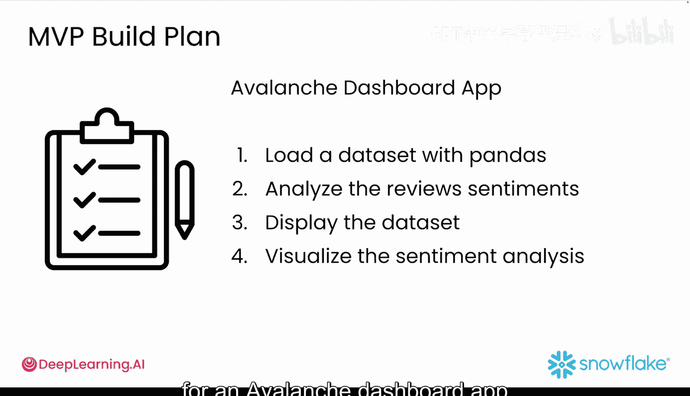
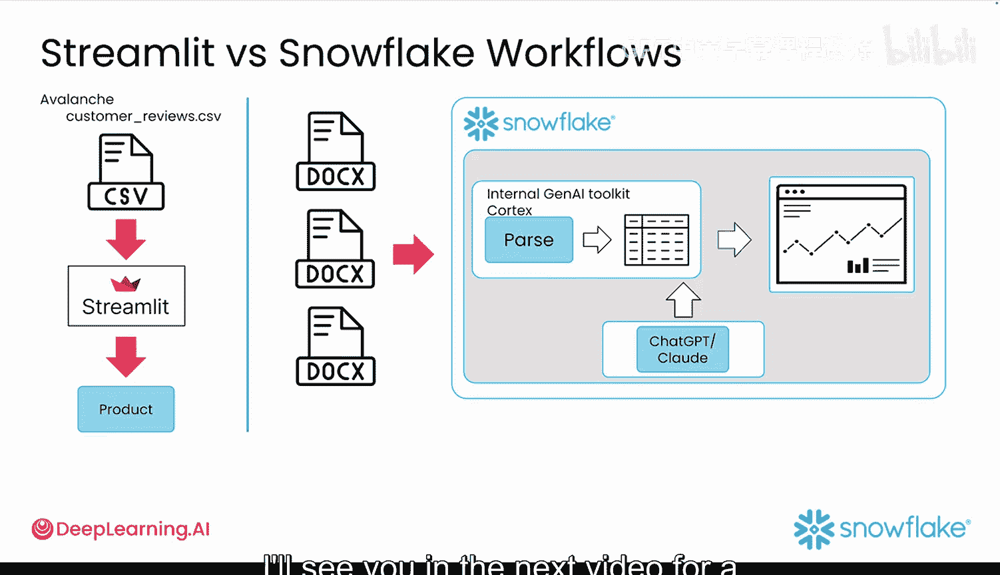

#  019：19_02_01_Snowflake平台原型构建 🏔️

在本节课中，我们将学习如何将之前构建的本地原型应用迁移到 Snowflake 平台上。我们将利用 Snowflake 作为主要开发平台，以便快速进行原型开发，而无需担心处理大量数据或搭建基础设施的问题。

在上一模块中，我们在本地环境中为“雪崩仪表板”应用创建了一个最小可行产品原型。该应用能够读取客户评论的 CSV 文件，对数据进行清理和情感分析，并通过 Streamlit 将结果可视化，最终生成一个可通过网页浏览器访问的快速用户界面。

然而，在现实世界中，我们很少能遇到像“雪崩客户评论”那样小而整洁的数据集。因此，本模块将把开发工作转移到 Snowflake 平台上。在这里，您将处理更大批量的文件并与数据库交互，以获得更贴近实际操作的体验。

## 本模块学习目标 🎯

在本模块中，您将完成以下任务：

1.  将一批非结构化的 Word 文档文件加载到 Snowflake 中。
2.  使用 Snowflake 内置的生成式 AI 工具包 **Cortex** 来解析这批文件，并将其转换为结构化的表格数据。
3.  在本课程的其余部分，您将使用像 ChatGPT 或 Claude 这样的生成式 AI 应用来帮助您快速编写代码和调试问题。

到本模块结束时，您将拥有一个在 Snowflake 上完整运行的生成式 AI Streamlit 应用。

接下来，我们将在下一个视频中一起浏览本课程将使用的 Snowflake 平台。