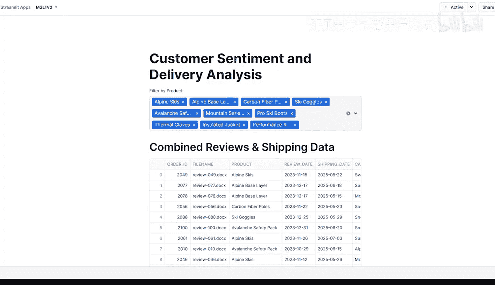
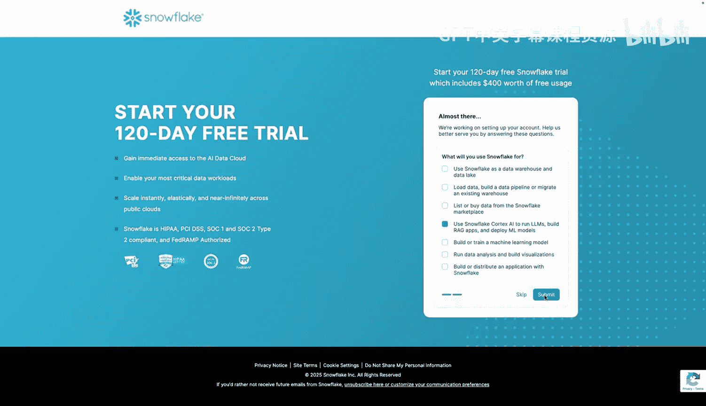
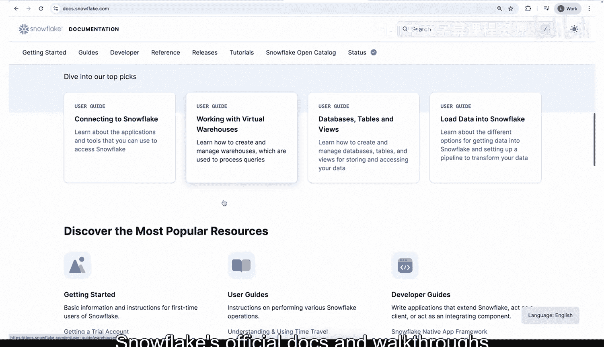
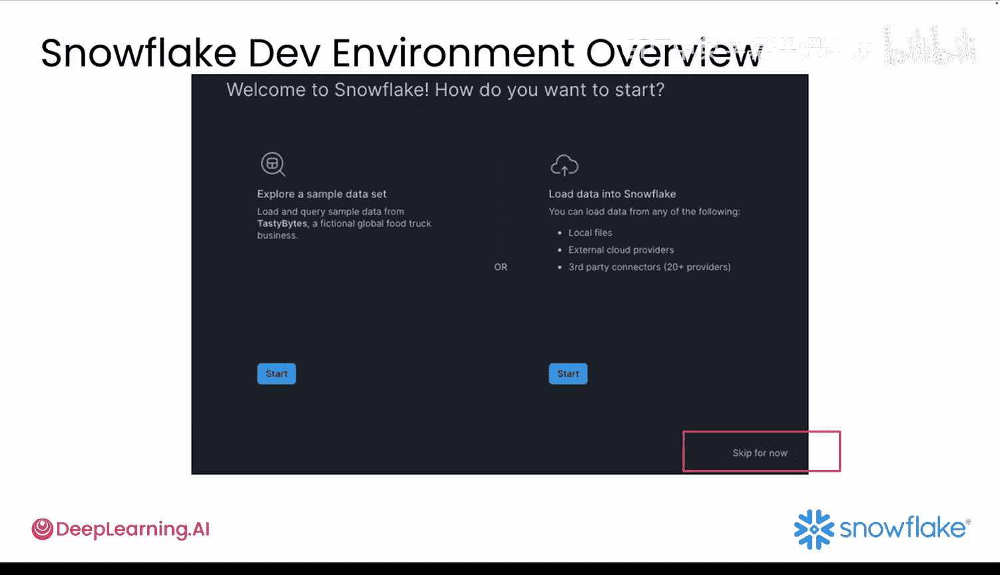
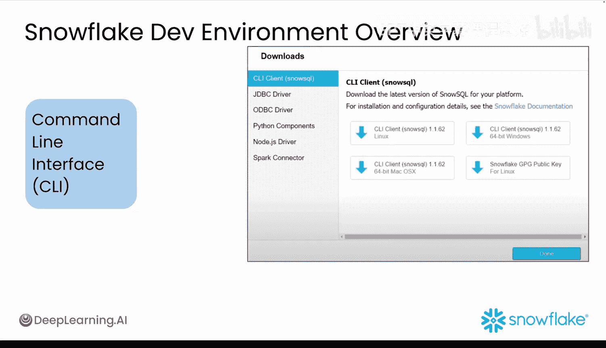
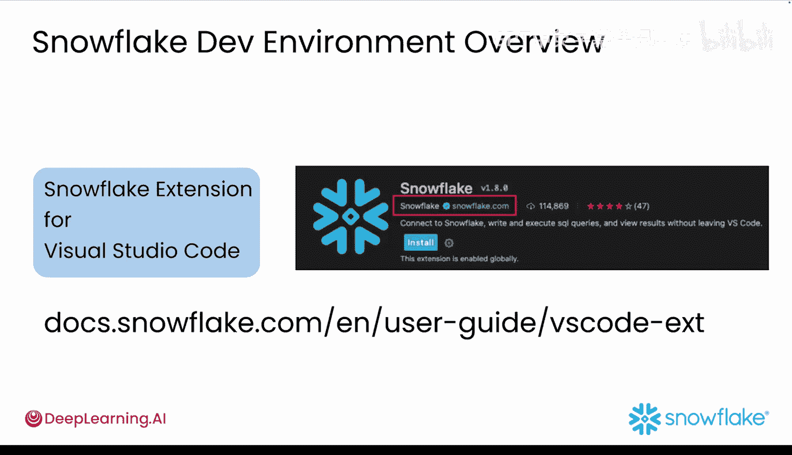
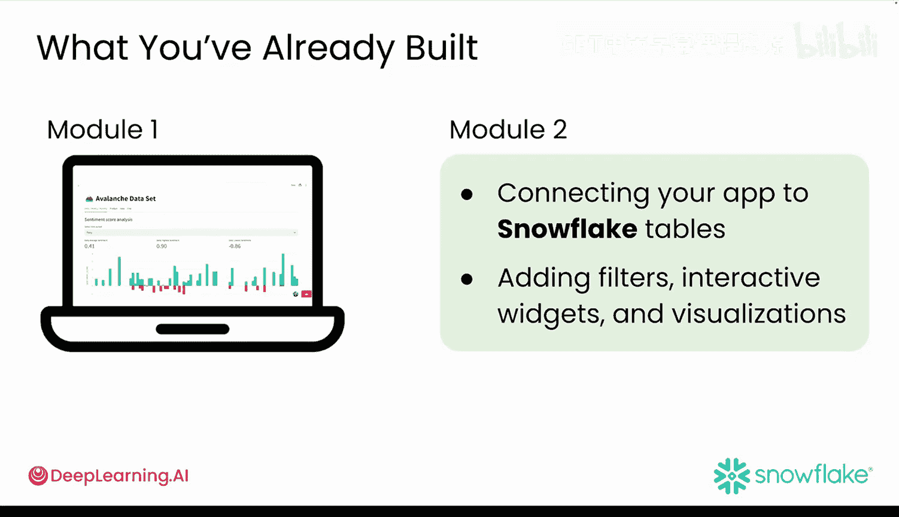

#  020：Snowflake 简介 🏔️

在本节课中，我们将要学习 Snowflake 平台如何与 Streamlit 结合，让你能够直接在数据仓库中快速构建和部署应用原型，而无需担心复杂的设置。

## 概述

Snowflake 允许你的 Streamlit 应用直接在其平台上运行，这带来了更快的原型开发速度。最关键的优势在于，你的应用可以直接连接到 Snowflake 中的数据，并且 Snowflake 支持 Pandas 等熟悉的 Python 工具，因此能无缝融入你的工作流。

## Snowflake 与 Streamlit 结合的优势

上一节我们介绍了 Snowflake 的基本概念，本节中我们来看看将 Streamlit 应用部署在 Snowflake 上的具体好处。

以下是使用 Streamlit in Snowflake 的主要优势：

*   **无需移动数据或切换工具**：应用直接与 Snowflake 中的数据交互，无需在外部工具间跳转或手动传输文件。
*   **性能与安全**：应用具备更好的速度、更低的延迟以及内置的安全保障。
*   **简化部署**：只需点击几下，你的应用就可以在 Snowflake 平台上实时发布。

## 开始使用 Snowflake

现在，让我们开始了解你的 Streamlit 应用如何在 Snowflake 中工作，并熟悉新的 Snowflake 工作环境。

作为本课程的学生，你可以获得 **120 天** 的 Snowflake 全平台免费访问权限，以便跟随后续视频进行操作。请在此处注册。

> 上图展示了一个你在模块一中构建的雪崩仪表板的更高级版本。你现在看到的这个原型被部署在 Snowflake 内部，因此可以安全地分享给任何有权访问底层数据表和应用链接的同事。

注册过程如下：

1.  访问 Snowflake 注册页面并填写注册表单。
2.  从下拉菜单中选择注册原因。此处选择任意选项均可，然后点击“继续”。
3.  在注册表单的第二页，输入公司名称和职位标题（可以自行编造），然后找到标有“选择您的 Snowflake 版本”的下拉菜单。保持默认的“企业版”即可，它提供了本课程所需的所有功能。
4.  选择离你最近的区域（例如，我在西海岸，因此选择“美国西部”）。
5.  阅读条款，如果同意，请点击底部的复选框，然后点击“开始使用”。

在后台设置账户时，你会看到一些用于优化账户偏好的可选复选框。至少请选择 **Python** 作为你的首选语言，其余部分可以填写或跳过。

接下来，检查你的电子邮箱收件箱，找到 Snowflake 发送的验证邮件。点击邮件中的验证链接，即可登录并访问平台。

## 探索 Snowflake 工作环境

现在你的账户已设置完成，欢迎来到你的新“游乐场”。

登录 Snowflake 后，你应该在屏幕顶部附近看到“首页”字样。这是你的主要工作区，称为 **Snowsight**，它就像是你的数据“任务控制中心”。

> **请注意**：Snowflake 在不断演进，因此你屏幕上的内容可能与此处展示的略有不同。不必担心，整体流程是清晰的，你完全可以跟上。如果遇到困难，Snowflake 的官方文档和教程非常详细且 helpful。

现在，你可能会看到一个弹出窗口，提供对示例数据集的快速导览。这完全取决于你：如果好奇可以参加导览；如果想直接开始，可以点击“跳过”。

在右下角，根据你的工作风格，有几种不同的方式与 Snowflake 交互：

*   **Snowsight** 是主要方式，也是你将主要使用的 Web 界面，它快速、简洁且可视化程度高。
*   如果你是终端爱好者，也有**命令行界面**。
*   如果你深度沉浸于编码，Snowflake 甚至提供了 **VS Code 扩展**，让你可以停留在编码区域。

由于本课程在浏览器中运行，**Snowsight** 将是你的主阵地。

## 在 Snowflake 中构建 Streamlit 应用

现在进入有趣的部分。你已经知道 Streamlit 非常适合制作 Web 应用，而 Snowflake 允许你直接在数据仓库中运行 Streamlit 应用。无需额外设置，无需处理 API 或移动文件，只需构建即可。

使用 **Streamlit in Snowflake**，你可以直接从 Snowflake 数据表创建仪表板，而无需每次都进行数据准备工作。实时探索和可视化你的数据，确保用户始终获得最准确和最新的结果。将你的整个工作流——代码、数据、逻辑和用户界面——都集中在一个平台。

主要有两种方式实现：

1.  **Snowflake Notebooks**：非常适合快速原型设计和与团队成员协作。
2.  **Streamlit in Snowflake Apps**：当你准备更广泛地分享应用时，这是完美选择。

大多数人从 Notebooks 开始，然后在原型稳固后转向 Streamlit in Snowflake Apps。在本课程中，你将同时使用这两种方式。

## 连接已有项目

让我们将此与你已经在模块一中构建的内容联系起来。你为分析雪崩数据中的产品评论创建了一个可工作的 Streamlit 原型。

现在，在模块二中，你将通过 Snowflake 来增强你的原型：在平台内将你的应用连接到 Snowflake 数据表，并添加过滤器、交互式开关和可视化功能。

接下来，是时候逐步了解 Snowflake 开发环境了，以便你熟悉周围的一切。

## 总结

本节课中我们一起学习了 Snowflake 数据云平台如何与 Streamlit 集成，从而极大地简化生成式 AI 应用的快速原型开发流程。我们了解了其核心优势：直接数据连接、无需复杂设置、提升的性能与安全性，以及一键式部署。我们还完成了 Snowflake 账户的注册，并初步探索了 Snowsight 工作环境。最后，我们明确了在本课程中将使用 Snowflake Notebooks 和 Streamlit in Snowflake Apps 这两种主要工具来构建和增强我们的应用。