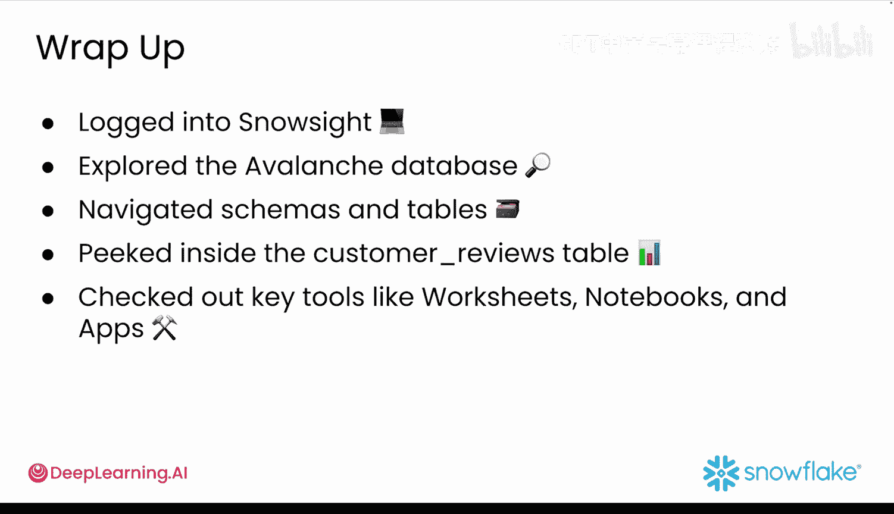

#  021：Snowsight 开发环境 🏔️

在本节课中，我们将学习如何将本地 Streamlit 应用开发体验迁移到 Snowflake 平台，并深入了解其核心的网页界面——Snowsight。我们将探索 Snowflake 的基本概念、Snowsight 的主要功能区域，并了解如何在此环境中组织数据、编写代码和构建应用。

## Snowflake 概述

上一节我们在本地机器上构建并启动了 Streamlit 应用。本节中，我们将把这一体验带入 Snowflake，将开发提升到新的水平。

Snowflake 是云端的一体化数据指挥中心。它存储数据、运行查询，并根据需求自动扩展或缩减计算资源，无需管理硬件或进行复杂设置。

在后台，Snowflake 使用**虚拟仓库**。这些是独立的计算引擎，可以并行处理您的工作，这意味着多个任务可以同时运行而不会相互拖慢。

数据本身存储在 AWS S3 或 Google Cloud Storage 等云存储中。但在 Snowflake 中，数据以优化、压缩的格式存储，以实现快速搜索和轻松扩展。

## Snowsight 工作区

在本课程中，您主要交互的部分是 **Snowsight**。这是一个基于网页的工作空间，将成为您探索数据、运行代码和构建生成式 AI 应用的主要枢纽。

在 Snowsight 中，您将主要在以下几个区域工作：
*   **数据库**：数据存储的位置。
*   **Notebook**：使用 SQL 或 Python 代码分析数据的地方。
*   **Streamlit**：在 Snowsight 内构建和预览应用界面的地方。

Snowsight 提供了强大的工具集供您选择：
*   **SQL**：查询数据的标准语言，用于探索和汇总数据。
*   **Snowpark**：一个开发者框架，用于直接在 Snowflake 内部使用 Python、Java 或 Scala。它类似于 Pandas，能在数据所在位置安全、大规模地运行代码。
*   **Cortex**：一套完全集成在 Snowflake 中的托管生成式 AI 工具。您可以使用内置的 SQL 或 Python 函数调用大语言模型、运行情感分析、生成文本和构建检索增强生成系统。
*   **Snowflake Copilot**：用于 SQL 查询的 AI 编码助手。

典型的工作流程是：首先在 Snowsight 中探索数据，然后在 Notebook 中使用 SQL 或 Python（通过 Snowpark）进行分析。当您准备好分享见解（例如通过交互式仪表板）时，您将使用 Streamlit 在 Snowflake 内部或 Streamlit 社区云上构建和部署原型。Cortex 将为您的应用提供情感分析和文本生成等生成式 AI 功能。

> 由于 Copilot 对 Python 的支持仍在开发中，我们建议在使用 Python 工作时，借助 Cursor 或 ChatGPT 等工具来获得帮助。

## 登录与导航

要登录 Snowsight，请在浏览器中打开步骤一所示的链接。输入您的账户标识符（格式如 `xy12345`，可在初始注册的确认邮件中找到），然后使用您的 Snowflake 凭据登录。

欢迎来到 Snowsight！这是您探索数据、构建 Notebook 和创建应用的一体化指挥中心。左侧边栏是您的主要导航工具。

以下是 Snowsight 中关键功能区域的导航方法：

*   **数据浏览**
    首先点击左侧边栏的 **Data**，查看所有数据库、表和模式的位置。在 Data 标签页中，您会看到已创建的数据库列表。每个数据库就像一个主项目文件夹，点击一个数据库可以查看其包含的所有模式。在模式内，您可以查看具体的表。

*   **编写与运行代码**
    接下来，点击左侧导航边栏中的 **Worksheets**。然后点击右上角的 **+ Worksheet** 创建一个新的工作表。Snowflake 工作表允许您直接在 Snowflake 环境中编写和运行 SQL 与 Python 代码，非常适合测试查询或进行快速分析。

*   **多步骤分析**
    要进行多步骤分析，请从左侧导航菜单进入 **Notebooks**。与工作表不同，Notebook 允许您在一个地方（类似于 Snowflake 原生的 Jupyter Notebook）结合文本、SQL 和 Python。要打开新的 Snowflake Notebook，请点击导航边栏中的 Notebooks，然后点击右上角的 **+ Notebook**。

*   **应用管理**
    最后，点击导航边栏中的 **Apps**。这是您在 Snowflake 内部部署的 Streamlit 应用的存放位置。当您从 Notebook 发布 Streamlit 应用后，可以在这里找到它。

## 数据组织方式

了解 Snowflake 如何组织数据至关重要。其层级结构如下：
1.  **数据库**：顶层的容器。
2.  **模式**：类似于子文件夹，用于对不同的数据类型进行分组。
3.  **表**：数据实际存储的位置。

当您点击一个表（例如 `customer_reviews`）打开它时，会看到几个标签页：
*   **Table Details**：包含表的管理设置和权限。
*   **Columns**：列出每个列的名称、数据类型和描述。
*   **Data Preview**：显示数据样本以及用于运行查询的计算仓库信息。

这为您理解数据结构提供了一切所需，无需编写代码。

## 总结

本节课中，我们一起学习了 Snowflake 云数据平台的核心概念，并深入探索了其网页界面 Snowsight。我们了解了如何登录和导航，熟悉了数据、工作表、Notebook 和应用等关键区域，也掌握了 Snowflake 中数据库、模式和表的三层数据组织结构。

现在您已经熟悉了 Snowflake 工作空间，这个基础将使学习本课程的其余部分变得更加轻松。接下来，您将开始加载数据并使用 Python 进行探索。让我们保持势头，继续前进。