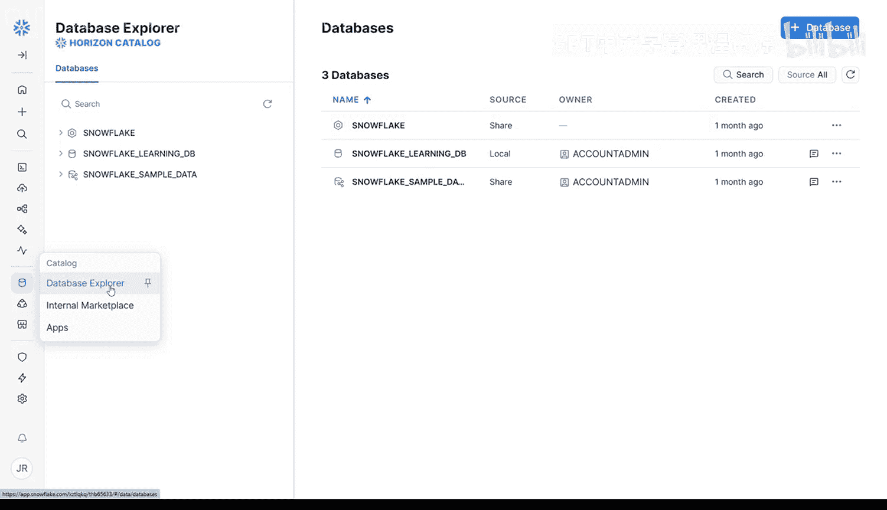
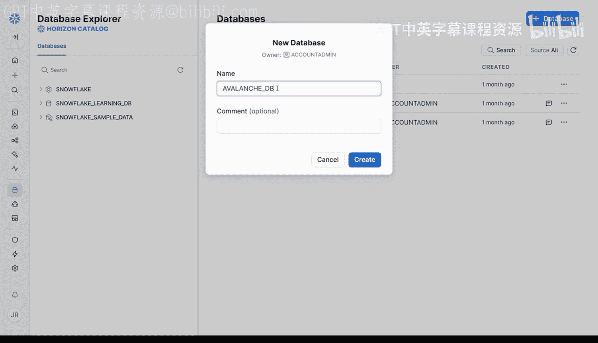
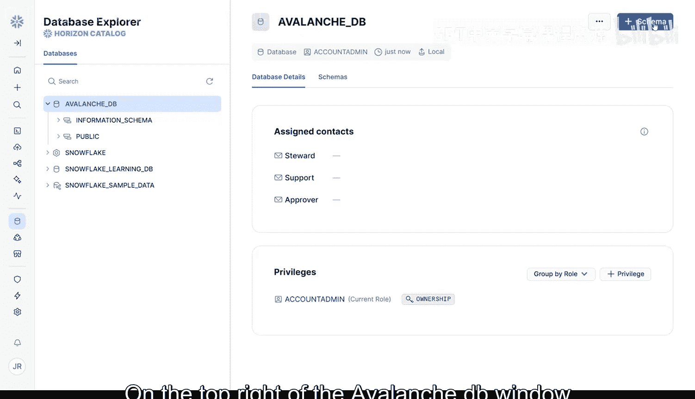
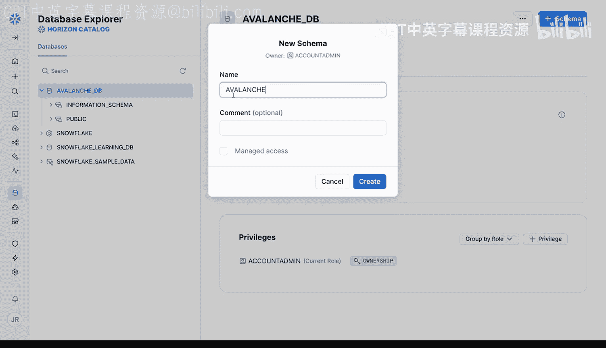
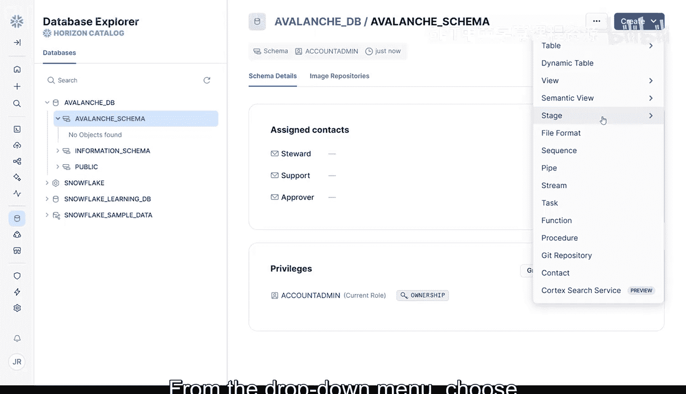
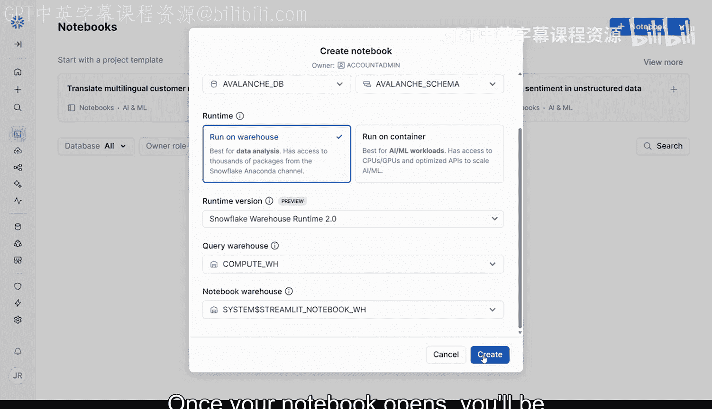
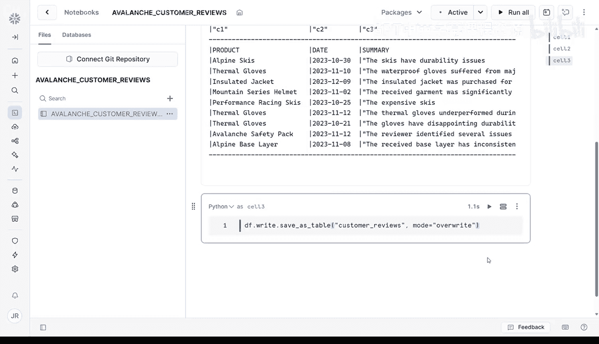

#  022：通过Notebook将CSV数据导入云端雪崩数据集 📊

在本节课中，我们将学习如何将本地的CSV数据文件上传到Snowflake云数据平台，并将其转换为一个可供查询的永久数据表。我们将从创建数据库、架构和存储阶段开始，最终在Snowflake Notebook中完成数据加载和建表操作。

---

## 课程概述

到目前为止，您一直在使用一个名为 `customer_reviews.csv` 的已清洗CSV文件。在本视频中，您将把同一个文件上传到Snowflake，并将其转换为一个正式的数据表。在下一节中，您将通过合并一堆杂乱的Word文档来重新创建相同的数据集。但现在，让我们从简单的开始，先加载已清洗的版本，以便您熟悉从开始到结束的完整流程。

首先，回顾一下模块1的MVP构建计划。您已经在模块1中完成了这个流程。但这次，我们将在Snowflake中从头开始，以便您了解在这个环境中完整的文件上传和建表过程是如何工作的。


现在，是时候处理第一步了：将数据导入Snowflake。

---

## 数据格式与Snowflake组织架构

如果您从事过数据科学或分析工作，很可能处理过许多表格数据，通常以CSV、Excel文件或其他电子表格格式出现。Snowflake支持所有最常见的格式，包括：
*   **结构化文件**：如CSV和TSV。这些是经典的电子表格格式，非常适合清洗和组织好的数据。
*   **半结构化数据**：如JSON、Avro、Parquet和XML。这些是更灵活的格式，通常用于日志、事件或嵌套信息。
*   **文本文档**：如PDF和Word文件。如果您来自传统的数据科学背景，这可能不太熟悉，但得益于生成式AI，现在分析和从这类数据中提取见解变得容易得多。

在上传任何内容之前，让我们快速回顾一下Snowflake如何组织您的数据。可以将其想象成一个办公室的文件柜：
*   **数据库** 就像柜子本身，是项目的顶级容器。
*   **架构** 是柜子内部的文件夹，用于保持条理。
*   **表、视图和阶段** 是您的实际数据和管理工具。**表**是结构化数据的行和列，**视图**是看起来像表的保存查询，**阶段**是在将文件加载到表之前的**上传区域**。

这种结构使您的数据保持整洁、模块化且易于导航。现在，您将为自己设置它。

---

## 设置数据环境：数据库、架构和阶段

根据上述组织方式，您需要创建三样东西：一个用于存储项目的数据库、一个用于组织文件的架构，以及一个用于上传雪崩客户评论CSV文件的阶段。这个设置反映了Snowflake中最典型的项目设置。

### 第一步：创建数据库

这是您雪崩应用相关所有内容的顶级容器。
1.  在左侧边栏中点击 **“数据”** 选项卡。这将打开数据库窗口。
2.  点击右上角的 **“+ 数据库”** 图标。
3.  在数据库窗口中，为您的数据库命名，例如 `avalanche_db`。
4.  点击 **“创建数据库”**。





第一步完成。现在，在左侧您有了一个新的 `avalanche_db` 数据库，您将用它作为顶级容器来存储所有雪崩相关的表和架构。



### 第二步：创建架构



现在让我们添加一个架构来保持条理。您将在这里存储原始文件和表。
1.  在左侧边栏中点击您新建的 `Avalanche_db`。
2.  在打开的 `Avalanche_db` 窗口右上角，点击 **“+ 架构”**。
3.  为您的架构命名，例如 `avalanche_schema`。
4.  然后点击 **“创建”**。

现在您有了一个地方，可以将原始文件与清洗过的文件或您以后添加的任何其他内容分开组织。

### 第三步：创建阶段



如果您计划在多个Notebook或同一工作空间的不同用户之间重用文件，这将特别有用。这是您的上传区域，是在将文件加载到表之前存放原始文件的地方。
1.  点击现在列在您的 `avalanche_db` 下的 `avalanche_schema`。
2.  在屏幕右上角，点击蓝色的 **“创建”** 按钮。
3.  从下拉菜单中选择 **“阶段”**，然后选择 **“Snowflake管理”**（除非您有理由选择外部管理的存储，否则这是最容易配置的选项）。
4.  在创建阶段窗口中，为您的阶段命名，例如 `avalanche_co_stage`。
5.  如果架构尚未指向 `avalanche_db.avalanche_schema`，请立即更新。
6.  选择服务器端加密，其他选项可以保留默认设置。
7.  然后点击右下角亮蓝色的 **“创建”** 按钮。

当您的阶段准备就绪后，就可以将 `customer_reviews.csv` 文件上传到您刚刚创建的阶段了。

---

## 上传文件到阶段

一旦雪崩阶段准备就绪，您将被带到设置窗口。
1.  在屏幕右上角，点击 **“+ 文件”** 按钮。
2.  拖放或浏览到您克隆课程仓库的位置，并选择 `customer_reviews.csv`。
3.  点击 **“上传”** 按钮。

您的文件现已安全存储在 `avalanche_stage` 中，并准备好在查询和脚本中被引用。

---

## 在Snowflake Notebook中操作数据

现在您的数据已经在Snowflake上，其余的工作可以在Snowflake Notebook中完成。Snowflake Notebook类似于Jupyter Notebook，但托管在Snowflake中。您可以编写和运行Python和SQL代码，可视化数据，并直接与您的Snowflake环境交互。

要打开一个新的Notebook：
1.  在左侧边栏中点击 **“项目”**，然后点击 **“Notebooks”**。
2.  在屏幕右上角，点击 **“+ Notebook”** 按钮。
3.  为您的Notebook命名，例如 `avalanche_customer_reviews`。
4.  选择您的 `avalanche` 数据库和架构。
5.  将运行时选项保留为 **“在仓库上运行”**。这是使用Python进行数据分析的最佳选择，因为它预装了大多数数据科学包。
6.  其他选项保留默认设置，然后点击 **“创建”**。

您的Notebook打开后，将进入主编辑器窗口，这是您编写代码的地方。您的Notebook将打开，其中包含几个Python和SQL的示例代码单元格。要运行一个单元格，请按键盘上的 `Shift + Enter` 或点击单元格右上角的运行按钮。您现在可以尝试一下，看看它是如何工作的。



第一个单元格是您连接到存储在Snowflake上的任何数据的方式。所以保留它以便获取客户评论数据。现在，您可以继续删除最后两个示例代码块，方法是点击每个块右上角的三点菜单并选择“删除”。

---

## 理解数据框：Pandas vs Snowpark

现在您已经设置了数据库、架构和阶段，准备将您的 `customer_reviews.csv` 文件加载到数据框中。

在Snowflake Notebook中，您主要会使用两种类型的数据框：**Pandas数据框** 和 **Snowpark数据框**。它们看起来相似并支持许多相同的操作，但在底层，它们的行为非常不同。

*   **Pandas数据框** 在您的本地机器上立即运行所有操作。这对于小型数据集的快速分析非常棒，但当数据量变大时，它们可能会变慢或崩溃。
*   **Snowpark数据框** 不会立即执行。相反，它们会构建一个**查询计划**——一种描述应该发生什么（如过滤、连接或转换数据）的蓝图，但直到您请求结果时才会真正运行任何操作。然后，当您准备好时，整个计划会被发送到Snowflake的云基础设施，并在数据所在的位置一次性执行。这意味着无需下载、没有内存过载，并且速度更快。

那么，您应该使用哪一个呢？下表为您提供了一个很好的概述：

| 特性 | Pandas 数据框 | Snowpark 数据框 |
| :--- | :--- | :--- |
| **执行位置** | 本地机器 | Snowflake 云端 |
| **最佳用例** | 快速本地测试和小文件 | 处理大型数据集或利用Snowflake计算引擎 |
| **内存使用** | 数据加载到本地内存 | 数据保留在云端 |
| **速度** | 小数据快，大数据慢 | 大数据集性能更佳 |

**使用Pandas进行快速的本地测试和小文件处理。当您处理较大的数据集或想要利用Snowflake计算引擎的全部功能时，请使用Snowpark数据框。**

---

## 实践：加载数据到Snowpark数据框

现在您了解了Snowflake如何处理数据框，让我们通过将您的 `customer_reviews.csv` 文件加载到Snowpark数据框中来实践一下。

### 第一步：连接到Snowflake环境

第一步是将您的Snowflake Notebook连接到您的项目环境。Snowflake使用称为**活动会话**的东西自动为您处理。每个Snowflake Notebook开始时都会自动填充这个代码块：

```python
import streamlit as st
import pandas as pd
from snowflake.snowpark.context import get_active_session

session = get_active_session()
```

让我们通过点击右上角的播放按钮来运行这个代码块。这段代码首先导入核心库 `streamlit` 和 `pandas`，就像您以前做的那样。然后，您可以从 `snowpark` 库调用 `get_active_session()`。这将创建到您的Snowflake项目的直接连接。一旦该会话处于活动状态，您就完全接入了Snowflake的后端。这意味着您现在可以查询现有表、从阶段加载文件、将数据写入新表，并在Snowflake的云中运行所有操作，而不是在您的本地机器上。

### 第二步：从阶段加载CSV文件

现在您已连接到Snowflake并准备好会话，是时候加载您的数据了。让我们将 `customer_reviews.csv` 文件放入一个Snowpark数据框中，以便您可以直接在Notebook中开始处理它。

使用这行代码：
```python
df = session.read.options(infer_schema=True).csv('@avalanche_stage/customer_reviews.csv')
df.show()
```

这行代码将您的CSV文件直接从Snowflake阶段加载到Snowpark数据框中，以便您可以在Python代码中预览和处理它。
*   `session.read` 告诉Snowpark您即将将数据读入一个新的数据框。
*   `.options(infer_schema=True)` 是一个有用的快捷方式，让Snowflake根据您的CSV内容自动检测列名及其数据类型。如果不使用此选项，所有内容都将作为纯文本加载。
*   `.csv('@avalanche_stage/customer_reviews.csv')` 直接指向您之前上传的文件。`@avalanche_stage` 是您命名的阶段（您创建的安全上传区域），`customer_reviews.csv` 是放在其中的文件。
*   `df.show()` 让您可以预览数据集的前几行，就像在Pandas中使用 `df.head()` 一样。

此时，您正在将Snowflake托管的数据读入Notebook，用Python分析它，并预览结果，所有这些都无需离开云端。让我们点击播放按钮运行它。

---

## 理解Snowflake中的文件路径

在继续之前，值得理解文件路径在Snowflake中是如何工作的，尤其是在使用阶段时。当您看到像 `@avalanche_stage/customer_reviews.csv` 这样的文件路径时，以下是每个部分的含义：
*   `@` 符号告诉Snowflake您正在引用一个**阶段**（您的文件存储区域）。
*   `avalanche_stage` 是您之前创建的阶段的名称，是您上传 `customer_reviews.csv` 文件的地方。
*   `customer_reviews.csv` 是您放在该阶段内的文件名。

如果您将文件上传到阶段内的子文件夹，路径可能看起来像这样：`@avalanche_stage/raw_files/customer_reviews.csv`。Snowflake将阶段视为类似云目录，您可以使用类似文件夹的路径在其中组织文件，即使底层存储是扁平的。在以后的课程中处理多个文件时，了解这些路径如何工作将帮助您保持条理并避免错误。

---

## 将数据保存为永久表

现在您已经预览了CSV文件并确认一切看起来都正确，是时候让您的数据永久化了。目前，您的数据只存在于Notebook的内存中，就像一个临时的便签本。要使其真正有用，您需要将其转换为Snowflake数据库中的一个表。

以下是执行此操作的代码：
```python
df.write.mode("overwrite").save_as_table("customer_reviews")
```

这行代码告诉Snowpark：
*   `"customer_reviews"` 是您要在Snowflake数据库中创建的表的名称。
*   `mode="overwrite"` 告诉Snowflake，如果已存在同名表，则用这个新表替换它。

一旦您运行此命令，您的数据框就不再是临时的。它成为一个真实的、永久的表，存储在您的项目数据库和架构中。这意味着您可以针对它编写SQL查询，可以将其连接到Streamlit应用，可以将其与其他数据连接，并且可以在您的Snowflake环境中与您的团队或其他工具共享它。这是将原始数据转换为结构化、Snowflake原生资源的关键步骤，准备好被查询、可视化和构建。别忘了运行这个单元格。



---

## 课程总结

干得漂亮！在本节课中，您：
1.  创建了一个新的**数据库**、**架构**和**阶段**来组织您的数据。
2.  使用Snowflake Notebook上传了您的 `customer_reviews.csv` 文件。
3.  直接从阶段将客户评论CSV文件加载到**Snowpark数据框**中。
4.  预览数据以验证其看起来良好。
5.  并将其保存为Snowflake内部一个可查询的**永久表**。


您已经正式完成了MVP构建计划的**第一步：将数据导入Snowflake**。在下一个视频中，您将通过使用Snowflake Cortex的GenAI强大工具，将一堆原始的DocX客户评论转换为干净的结构化数据，从而提升您的技能水平。