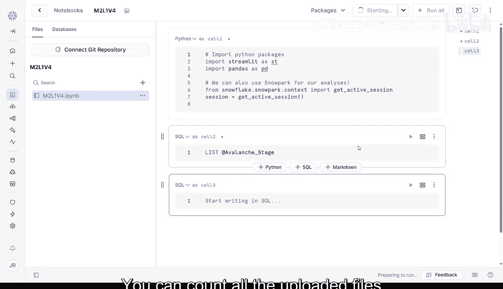
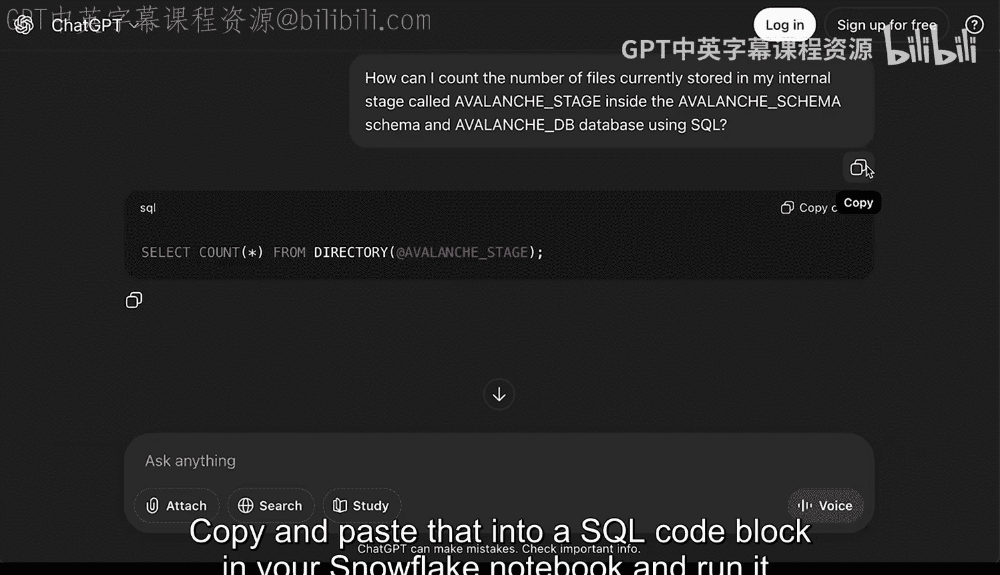
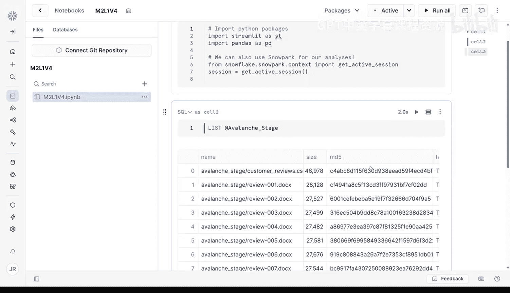

#  023：批量文件上传 📁

在本节课中，我们将学习如何在 Snowflake 中批量上传大量文件。你将从头开始重新创建客户评论表，但这次是通过合并超过 100 个 Word 文档来实现。我们将使用一个名为“阶段”的中间区域来安全地管理和验证文件，然后再将它们加载到最终的数据表中。

---

## 为什么需要“阶段”？

在开始加载文件之前，我们先回顾一下为什么“阶段”如此重要。Snowflake 不会直接将文件加载到表中。相反，你需要先将它们上传到一个称为“阶段”的地方。

**阶段**就像一个安全的文件暂存区。它帮助你在数据摄取前预览和验证文件，保持上传内容的有序性，并允许你在多个工作流中重复使用相同的文件。将文件加载到阶段而不是直接加载到表中也更安全。如果上传过程中出现问题，你的文件不会丢失。

好消息是，我们在上一节课程中已经创建了数据库、模式和阶段，现在我们将再次使用它们。

---

## 准备上传环境

上一节我们介绍了数据库和模式的概念，本节中我们来看看如何利用已创建的资源。你的数据库是 `avalanche_db`，模式是 `avalanche_schema`，阶段是 `avalanche_stage`。

现在，是时候上传那 100 个 Word 文档了。

以下是上传文件的步骤：

1.  从课程 GitHub 仓库下载 `data_customer_reviews_docs.zip` 文件。
2.  在本地解压该 ZIP 文件。解压后，你应该会看到一个包含 100 个 `.docx` 文件的文件夹。
3.  登录 Snowsight 主页，在左侧边栏点击 **Data**。
4.  导航到 **Databases** 并点击你的 `avalanche_db` 数据库。
5.  选择你的 `avalanche_schema` 模式。
6.  从侧边栏选择 **Stages**，然后点击 **Stages** 并选择你的 `avalanche_stage`。
7.  点击屏幕右上角的 **+ Files** 按钮。
8.  将存储那 100 个解压后 Word 文件的文件夹拖放进去，或通过浏览选择它们。
9.  选中所有 100 个文件，然后点击 **Open**。
10. 在弹出的窗口中，确认 `avalanche_db` 和 `avalanche_stage` 已正确选中，然后点击 **Upload**。

即使有 100 个文件，这个过程在 Snowflake 中也会很快完成。

---

## 验证上传结果

上一节我们完成了文件上传，本节中我们使用一个新的 Snowflake Notebook 来检查所有文件是否按预期上传成功。

以下是验证步骤：

1.  在 Snowsight 左侧导航栏，点击 **Projects**，然后点击 **Notebooks**。
2.  在 Notebooks 窗口，点击右上角亮蓝色的 **+ Notebook** 按钮。
3.  为你的 Notebook 命名，选择 `avalanche` 数据库和模式，其他选项保持默认，点击 **Create**。
4.  在新的 Notebook 中，删除底部默认的两个代码单元格。
5.  将鼠标悬停在第一个包含 `get_active_session()` 的代码块上，从弹出的选项中选择 **+ SQL**。
6.  在新的 SQL 单元格中，粘贴以下语句来列出阶段中的所有文件：
    ```sql
    LIST @avalanche_stage;
    ```
7.  按 `Shift + Enter` 运行。这将返回阶段中所有文件的列表。

你可以手动数一数上传的文件来确认有 100 个，但让我们用一个更简单的方法：使用生成式 AI 助手来编写一个 SQL 命令。

你可以使用类似这样的提示词：
> “如何使用 SQL 统计存储在 `avalanche_db` 数据库、`avalanche_schema` 模式中名为 `avalanche_stage` 的内部阶段里当前的文件数量？”

助手可能会返回类似这样的 SQL：
```sql
SELECT COUNT(*) FROM @avalanche_stage;
```
将其复制并粘贴到 Snowflake Notebook 的 SQL 代码块中并运行。如果你像我一样，在上一节上传了一个 CSV 文件但后来删除了它，你可能会得到 101 的计数。一旦你验证文件已成功上传，就可以继续下一步：解析并将它们合并到一个结构化的表中。



---





## 总结

本节课中我们一起学习了如何在 Snowflake 中进行批量文件上传。你复用了之前创建的数据库、模式和阶段，下载了 100 个 Word 文档的批次，将它们上传到指定的 Snowflake 阶段，并使用 SQL 验证了上传结果。现在，你已经掌握了 Snowflake 中的批量文件上传技能，可以完全勾选 MVP 构建计划中的第二步。你知道了如何向 Snowflake 上传单个文件以及大批量文件。