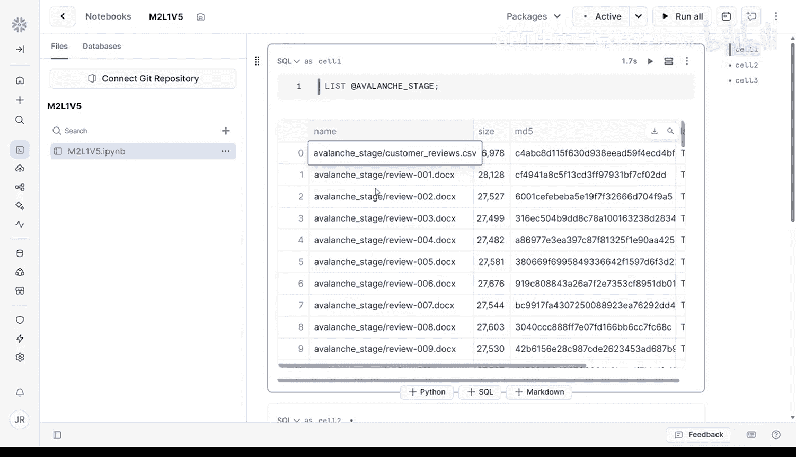
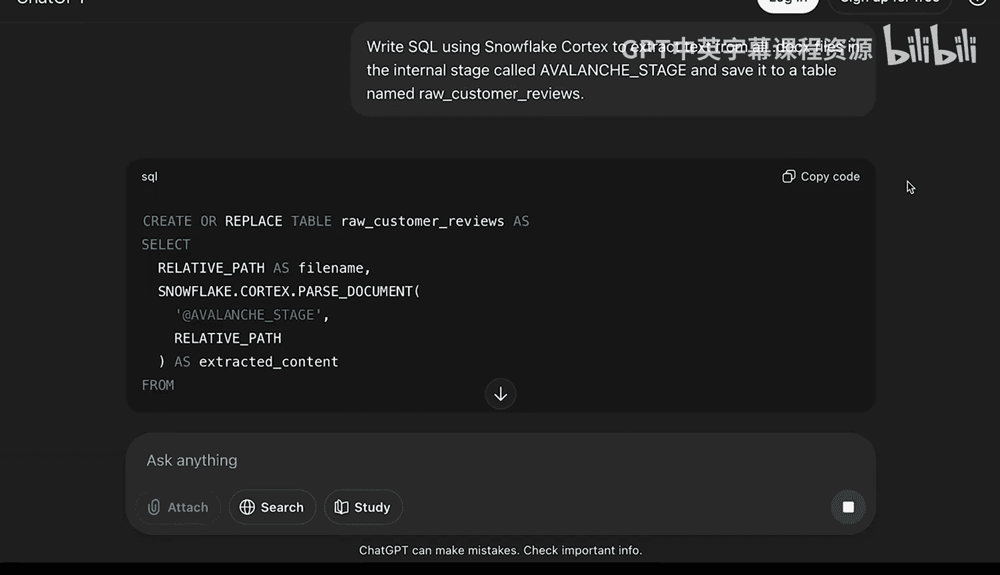
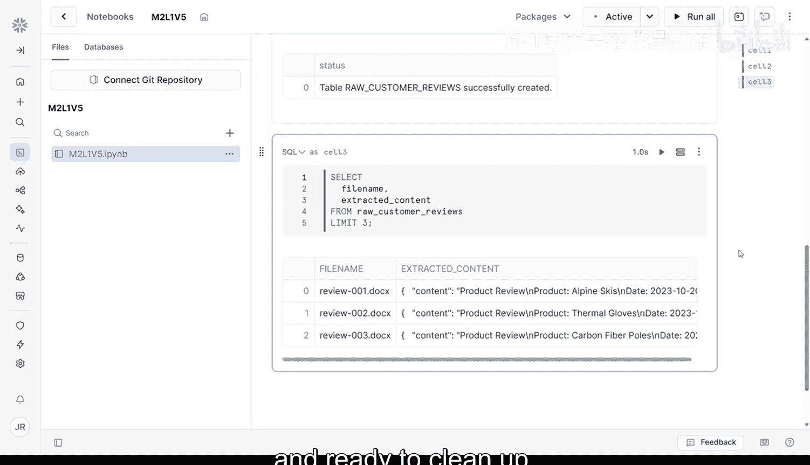

#  024：利用Cortex从暂存区到数据表转换

## 概述
在本节课中，我们将学习如何利用 Snowflake Cortex 的内置功能，将上传到 Snowflake 暂存区的大量 Word 文档，转换并解析成一个结构化的数据表。整个过程无需复杂的 Python 库，直接在 Snowflake Notebook 中使用 SQL 即可完成。


上一节我们介绍了如何将数据上传到 Snowflake 暂存区，本节中我们来看看如何解析和结构化这些数据。

## 为什么使用 Snowflake Cortex？
在开始之前，我们先快速回顾一下为何使用 Snowflake Cortex。Cortex 是 Snowflake 内置的一套 AI 工具集，它允许您使用简单的 SQL 来处理和分析数据，无需额外设置。它包含诸如 `parse_document` 这样的函数，可以直接从文档、PDF 和文本文件中提取内容。这意味着您无需使用 Python 或外部库来提取文本，Cortex 为您处理一切，并且快速、安全，完全在 Snowflake 内部运行。

## 第一步：验证暂存区文件
首先，我们需要确认文件已成功上传至暂存区。在您的 Snowflake Notebook 中新建一个 SQL 单元格，运行以下命令：
```sql
LIST @AVALANCHE_STAGE;
```
您应该会看到一个 `.docx` 文件列表，每个文件对应一份客户评价。如果您看到的是 101 个文件而不是 100 个，很可能是因为之前上传的 `customer_reviews.zip` 文件仍然存在。这没关系，我们稍后会将其过滤掉。

## 第二步：使用 Cortex 解析文档并创建表
接下来，我们将使用 Cortex 的 `parse_document` 函数来提取文本并创建结构化表。您可以向您喜欢的生成式 AI 应用寻求帮助来生成 SQL，例如：“请编写使用 Snowflake Cortex 从 AVALANCHE_STAGE 暂存区中的 .docx 文件提取文本，并保存到名为 `raw_customer_reviews` 的表的 SQL 语句。”

生成的 SQL 语句可能类似于以下代码：
```sql
CREATE OR REPLACE TABLE raw_customer_reviews AS
SELECT
    relative_path AS file_name,
    snowflake.cortex.parse_document(build_scoped_file_url(@avalanche_stage, relative_path)) AS extracted_content
FROM
    directory(@avalanche_stage)
WHERE
    relative_path LIKE '%.docx';
```





以下是这段代码的作用：
*   `directory(@avalanche_stage)`：获取您暂存区中每个文件的元数据。
*   `relative_path`：是文件名，例如 `review_43.docx`。
*   `parse_document` 函数：接收暂存区名称和文件名，然后从文档中提取文本。
*   结果将存储在一个包含两列的表中：`file_name` 和 `extracted_content`（一个半结构化的 JSON 对象）。

在 Snowflake Notebook 的 SQL 单元格中运行此代码。

## 第三步：预览结果以确认解析成功
代码运行完成后，运行以下查询以确保一切正常工作：
```sql
SELECT * FROM raw_customer_reviews LIMIT 5;
```
这将显示每个文档的前几行内容，方便您检查解析是否按预期进行。如果您在这里看到了结果，那就太好了！这意味着您的 100 个 Word 文档现在已经整齐地组织好，并准备进行下一步的清理工作。




## 总结
本节课中我们一起学习了一项相当高级的操作：直接在 Snowflake 内部处理超过 100 个 Word 文档，全程仅使用 SQL 和 Cortex。我们从一堆压缩的、非结构化的文件开始，现在得到了一个干净、可查询的名为 `raw_customer_reviews` 的数据表，为后续的分析工作做好了准备。干得漂亮！